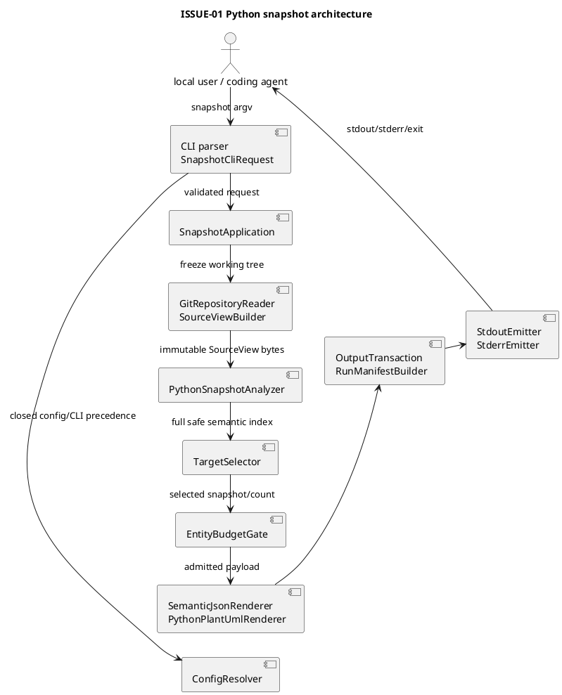
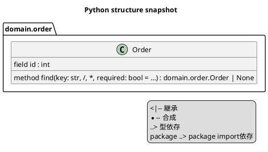
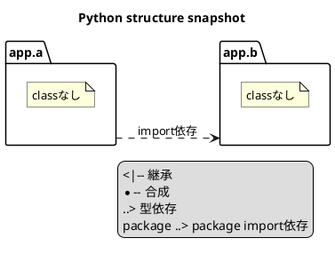

# iss-00004 Generate Python Structure Snapshots — 設計

詳細: [Design Guide](../../../../../../docs/authoring/design.md)

## 設計目標

- `python` domainの`working-tree snapshot`を、CLIからimmutable SourceView、AST semantic model、JSON/PlantUML、manifest、stream、exit、acceptanceまで一つのvertical pipelineとして成立させる。
- public contractをvalue object、schema、canonical encoder、golden testへ一対一に対応させ、実装者がfield、filename、sort、failure mappingを補完しなくてよい状態にする。
- common foundationを本sliceが実際に使うconfig、diagnostic、outcome、source freeze、canonical JSON、output transactionに限定する。
- target application、mutable Git operation、source body/literal/secret/absolute path、implicit truncation、overwrite、partial publicationを構造上不可能にする。
- 後続Issueが利用するのはversioned contractとportであり、本Issueのprivate class/module layoutをforkしない。

| Design ID | Requirement trace | 設計判断 |
| --- | --- | --- |
| I01-DES-001 | I01-REQ-001 | `SnapshotApplication`がone-run lifecycleを所有し、CLI、source、adapter、artifactを明示portで接続する。 |
| I01-DES-002 | I01-REQ-002 | duplicate-aware parserとclosed `ConfigV1` resolverをsource acquisition前に完了する。 |
| I01-DES-003 | I01-REQ-003 | read-only `HeadState`判定、non-UTF-8 fatal boundary、repository外stagingへfreezeした`SourceView`、typed `TargetSpec`/`TargetSelection`をimmutable valueにする。 |
| I01-DES-004 | I01-REQ-004 | Python adapterがmodule index、AST extraction、closed type grammar、annotation TypeReference extraction/resolution/exclusion、class/member/relation identity、exact sort、dedupe winnerを所有する。 |
| I01-DES-005 | I01-REQ-005 | schema-defined canonical JSON、code別cardinality/contextを持つdiagnostic、parameter/escape/visual-dedupeとclassless module package layoutを閉じたPython PlantUML、manifest、stream emitterをexact-byte contractとして分離する。 |
| I01-DES-006 | I01-REQ-006 | discriminated outcome、domain-local budget、redaction/invariant gate、atomic directory publicationでfail-closedにする。 |
| I01-DES-007 | I01-REQ-006 | Git allowlist、static execution trap、source drift check、deterministic sort/hashをsecurity boundaryにする。 |
| I01-DES-008 | I01-REQ-007 | stdlib-only runtime package、test/build-time-only JSON Schema validation、exact lock、schema/golden、offline wheel、minimum/latest CIをrepository-ownedにする。 |
| I01-DES-009 | I01-REQ-007 | fixture/test/path/symbolを固定し、diff/SQLAlchemy/Next/HTML symbolの混入をscope testで拒否する。 |

## Current / Target

### Current（verified canonical specification state）

- production package、entry point、schema implementation、Python analyzer、product fixture、product lockfileは存在しない。
- root `.github/workflows/ci.yml` は既存のSpecDock `validate` jobだけを持つ。
- issue metadataとcanonical R/D/P、accepted ADR、noncanonical explanation Artifactが存在する。
- `artifacts/20260824t054228z--explanation.html` はevidenceであり、actual Issue ID、Requirement数、entity overrun/incomplete分類、planned path authorityについて現行canonical contractではない記述を含む。本Designをその説明から導出してはならない。
- 下記path/symbolはすべてplanned implementation targetであり、実装済みと主張しない。

### Target architecture



### dependency direction

```text
cli -> application -> core ports
application -> source port, python adapter port, artifact port
source / artifacts / adapters.python -> core value objects
adapters.python -X-> cli, application, SQLAlchemy, Next, diff
core -X-> adapters.python
```

- `application`はconcrete AST nodeを知らない。
- `source`はPython entityを知らない。
- `artifacts`はASTを知らず、typed domain resultとbytesだけを扱う。
- Python adapterは`FileChangeSet`、comparison endpoint、SQLAlchemy/Next modelをimportしない。

## planned repository tree と authoritative symbols

実装時に同名pathが既に存在して責務が衝突する場合は、codeを先に足さずDesign/Planを更新する。

```text
.python-version
pyproject.toml
uv.lock
THIRD_PARTY_LICENSES.md
ci/
  latest-python.txt
  toolchains/
    git-2.39.5.Dockerfile
    git-2.39.5.sha256
schemas/
  diagnostic-v1.schema.json
  semantic-v1.schema.json
  run-manifest-v1.schema.json
  run-summary-v1.schema.json
  stdout-result-v1.schema.json
docs/contracts/
  cli-v1.md
  config-v1.md
  source-view-v1.md
  python-semantic-v1.md
  python-plantuml-v1.md
  run-manifest-v1.md
  stdout-v1.md
src/code_structure_viz/
  __init__.py
  __main__.py
  py.typed
  cli/
    __init__.py
    main.py
    parser.py
  application/
    __init__.py
    snapshot.py
  core/
    __init__.py
    budget.py
    config.py
    diagnostics.py
    outcomes.py
  source/
    __init__.py
    git_repository.py
    source_view.py
    targets.py
  semantic/
    __init__.py
    canonical_json.py
  artifacts/
    __init__.py
    manifest.py
    streams.py
    writer.py
  adapters/
    __init__.py
    python/
      __init__.py
      analyzer.py
      model.py
      module_index.py
      plantuml.py
      selection.py
      semantic_json.py
      type_expr.py
tests/
  conftest.py
  helpers/
    cli.py
    fixture_repo.py
    golden.py
  unit/
    cli/test_parser.py
    core/test_config.py
    core/test_diagnostics.py
    core/test_outcomes.py
    source/test_git_repository.py
    source/test_source_view.py
    source/test_targets.py
    python/test_model.py
    python/test_module_index.py
    python/test_type_expr.py
    python/test_analyzer.py
    python/test_selection.py
    python/test_semantic_json.py
    python/test_plantuml.py
    artifacts/test_manifest.py
    artifacts/test_writer.py
    artifacts/test_streams.py
  integration/source/test_git_repository.py
  integration/python/test_targeted_snapshot.py
  acceptance/python/test_snapshot_cli.py
  acceptance/python/test_snapshot_failures.py
  acceptance/python/test_snapshot_determinism.py
  acceptance/python/test_snapshot_budget.py
  acceptance/python/test_stdout_selector.py
  security/test_python_static_boundary.py
  packaging/test_distribution.py
  contracts/test_json_schemas.py
  contracts/test_scope_exclusions.py
  fixtures/python_snapshot/
  golden/python_snapshot/
```

### symbol contract

| path | symbol | responsibility |
| --- | --- | --- |
| `cli/main.py` | `main(argv: Sequence[str] | None = None) -> int` | exception/signal boundary、binary stdout access、exit mapping。`sys.exit`は`__main__`だけ。 |
| `cli/parser.py` | `parse_cli(argv) -> SnapshotCliRequest` | duplicate pre-scan、closed grammar、meta operation、diff-only option rejection。 |
| `application/snapshot.py` | `SnapshotApplication.run(request) -> RunOutcome` | lifecycle順序、cleanup、publication前drift check、stream result。 |
| `core/config.py` | `resolve_config(request, repo) -> ResolvedConfig` | TOML v1 validation、precedence、value source、config digest。 |
| `core/diagnostics.py` | `Diagnostic`, `DiagnosticCode`, `DiagnosticContext`, `encode_diagnostic_jsonl` | closed code catalog、code別cardinality/context、safe nullable fields、deterministic dedupe/order。 |
| `core/outcomes.py` | `DomainOutcome`, `RunOutcome`, status unions | impossible stateをconstructorで拒否する。 |
| `core/budget.py` | `EntityBudgetGate.admit(snapshot, resolved_limit)` | class entity countだけをrender前に検査する。 |
| `source/git_repository.py` | `GitRepositoryReader`, `HeadState`, `resolve_head_state` | Git version/root/path enumerationのread-only allowlist、commit/unborn/invalid HEADの一意判定、raw path decode fatal。 |
| `source/source_view.py` | `SourceViewBuilder.build(...)`, `SourceView`, `SourceFile` | staging freeze、content hash、fingerprint、drift probe。 |
| `source/targets.py` | `TargetSpec`, `parse_target` | path/module/class syntaxだけを扱い、semantic resolutionはadapterへ渡す。 |
| `semantic/canonical_json.py` | `encode_canonical_json(value, field_order) -> bytes` | UTF-8/no-space/final-LFとschema orderを一箇所で保証する。 |
| `artifacts/writer.py` | `OutputTransaction` | same-parent private staging、typed serializer invariant/redaction/integrity、fsync、atomic rename、cleanup。runtime JSON Schema validationは所有しない。 |
| `artifacts/manifest.py` | `RunManifestBuilder` | exact manifest fields、artifact descriptor、run fingerprint。 |
| `artifacts/streams.py` | `StdoutEmitter`, `StderrEmitter` | exact bytes / summary / unavailable result / JSONL separation。 |
| `adapters/python/module_index.py` | `PythonModuleIndex.build(SourceView, ResolvedConfig)` | source root mapping、module collision、import alias index。 |
| `adapters/python/analyzer.py` | `PythonSnapshotAnalyzer.analyze(...) -> PythonAnalysisResult` | Python 3.12 AST、entity/member/relation extraction、file-local failure isolation。 |
| `adapters/python/type_expr.py` | `SafeTypeExpressionRenderer` | literal-free canonical type stringとreference extraction。 |
| `adapters/python/selection.py` | `PythonTargetSelector.select(...) -> PythonSnapshot` | target resolution、union traversal、frontier、status preconditions。 |
| `adapters/python/model.py` | immutable Python domain records | identity、enum rank、exact sort tuple、occurrence key、dedupe winner、invariant。 |
| `adapters/python/semantic_json.py` | `PythonSemanticJsonRenderer.render(snapshot) -> bytes` | semantic schema v1だけを生成する。 |
| `adapters/python/plantuml.py` | `PythonPlantUmlRenderer.render(snapshot) -> bytes` | Python visual vocabulary v1だけを生成する。 |

## CLI/application design

### parser phases

1. raw `argv` をtoken単位でpre-scanし、single-value option重複、`--stdout`値省略、diff-only optionを検出する。
2. meta operation `--help|--version` を解決する。snapshot optionと混在したmeta operationはusage errorにする。
3. commandとtyped scalarをparseする。integerはASCII decimalのclosed parserを使い、Pythonの`int()`が受ける`+1`、whitespace、underscore等を暗黙受理しない。
4. domain、format、target syntax、stdout grammarを検証する。
5. format/domain resolution後、stdout selector compatibilityを検証する。
6. `SnapshotCliRequest`を構築する。source/output filesystemへ触れる前に1〜5を完了する。

### request values

```text
SnapshotCliRequest
  repo: Path
  output_dir: Path
  domain: Literal["python"]
  config_path: Path | None
  targets: tuple[TargetSpec, ...]
  upstream_depth_override: int | None
  downstream_depth_override: int | None
  formats: tuple[Literal["semantic-json", "plantuml"], ...]
  max_entities_override: int | None
  stdout_selector: StdoutSelector | None
```

- `formats`はcanonical order、`targets`は`kind order path,module,class`とNFC valueのUTF-8 byte order。
- relative `--repo` / `--output-dir` / `--config`はinvocation current working directoryを基準に一度だけabsolute化する。`--repo`はGit root exact match、`--output-dir`はoutside-repository/nonexistent、`--config`はordinary non-symlink fileであることをpreflightする。raw absolute repo/output/config pathはrequest内部だけに存在し、serializerへ渡すDTOに含めない。
- `StdoutSelector`は`ManifestSelector`または`DomainFormatSelector(domain="python", format=...)`のsum typeにする。free-form stringのままapplicationへ渡さない。

### lifecycle order

```text
parse/usage
-> Python/Git/repo/output/config preflight
-> resolve HeadState (commit | proven unborn; otherwise fatal)
-> enumerate Git path bytes (non-UTF-8ならfatal、SourceViewなし)
-> create private staging root
-> build SourceView
-> build module/AST index
-> if target 0 and candidate source 0: not_applicable
-> otherwise resolve whole/explicit targets (explicit failureはpayload_unavailable)
-> entity budget
-> render requested payloads
-> validate schema/redaction/digests
-> build/validate manifest
-> re-probe SourceView/HEAD
-> fsync + atomic publish directory
-> emit stdout/stderr
-> return exit
```

- usage/configではGit/source/output stagingへ触れない。
- HEAD classification failureとnon-UTF-8 Git pathはdomain outcomeを作らないrun fatalで、staging/output/final manifestは0件。
- `not_applicable`判定は`request.targets == () and candidate_files == 0`のexact predicateだけで行う。明示targetがあればsource 0件でもtarget resolverを通し`payload_unavailable`にする。
- valid core runでdomain outcomeが`not_applicable`または`payload_unavailable`でもmanifest transactionを行う。
- run-level fatalではmanifestを作成・公開しない。

## ConfigV1 design

### immutable value

```text
ResolvedConfig
  schema = "code-structure-viz.config/v1"
  python.source_roots: tuple[PurePosixPath, ...]
  python.include: tuple[GlobPattern, ...]
  python.exclude: tuple[GlobPattern, ...]
  traversal.upstream_depth: int
  traversal.downstream_depth: int
  limits.max_entities: int
  value_sources: ConfigValueSources
  source: builtin | repository | explicit
  sha256: lowercase hex
```

### validation rules

- `tomllib.load()`の結果をclosed dataclass decoderへ渡し、set differenceでunknown keyを先に拒否する。
- TOML integerは`bool`を含めず`type(value) is int`で確認する。
- source root/globはNFCへ正規化し、POSIX separatorだけを受理する。
- source rootsはduplicateを拒否する。include/exclude duplicateも拒否し、silent dedupeしない。
- built-in `src`の非存在は許す。repository/explicit configで指定されたrootはfreeze開始時に存在するdirectoryでなければならない。
- glob matcherは独自のsmall grammarをsegmentへcompileする。filesystem libraryごとの`**`差異をpublic behaviorへ漏らさない。
- resolved config digest preimageは次のfield orderのcanonical JSONで、`source`と`value_sources`を含めない。意味が同じconfigは同じdigestになる。

```json
{"schema":"code-structure-viz.config/v1","python":{"source_roots":["src","."],"include":["**/*.py"],"exclude":[]},"traversal":{"upstream_depth":1,"downstream_depth":1},"limits":{"max_entities":500}}
```

## GitRepositoryReader / SourceView design

### Git subprocess allowlist

product codeから起動できるGit commandは次に閉じる。`<head-ref>`は`symbolic-ref`のraw stdout bytesから末尾LFを一つだけ除き、strict UTF-8 decodeと`os.fsencode(decoded) == raw`のround-tripを確認し、Unicode normalizationを一切行わない。exact `refs/heads/` prefixを持つ場合だけ`check-ref-format`と`show-ref`へ同じdecoded valueを渡す。

```text
git --version
git -C <repo> -c core.fsmonitor=false rev-parse --show-toplevel
git -C <repo> -c core.fsmonitor=false rev-parse --verify HEAD^{commit}
git -C <repo> -c core.fsmonitor=false symbolic-ref -q HEAD
git -C <repo> -c core.fsmonitor=false check-ref-format <head-ref>
git -C <repo> -c core.fsmonitor=false show-ref --verify --quiet <head-ref>
git -C <repo> -c core.fsmonitor=false ls-files -z --cached --others --exclude-standard
```

- subprocess envは`LC_ALL=C`、`LANG=C`、`GIT_OPTIONAL_LOCKS=0`、`GIT_CONFIG_NOSYSTEM=1`、`GIT_CONFIG_GLOBAL=/dev/null`、`GIT_TERMINAL_PROMPT=0`、`GIT_PAGER=cat`、`PAGER=cat`、`NO_COLOR=1`を固定する。
- target Git stderrをそのまま利用者へ転送せず、stable diagnosticへ変換する。stderr文字列はHEAD classificationの入力に使わない。
- shell、alias、pager、hook、external diff、textconvを呼ばない。`shell=False`とargument vectorを必須とする。

### `HeadState` の一意判定

```text
HeadState = Commit(object_id: str) | Unborn(branch_ref: str)
```

`resolve_head_state()`は次の順序以外を取らない。

1. `rev-parse --verify HEAD^{commit}`を実行する。
2. return code 0なら、stdoutがASCII hex **40桁または64桁**のfull object ID一件とLFだけであることを検証し、`Commit(object_id.lower())`を返す。empty、別length、複数line、non-hexは`CSV-REPO-002` fatal。
3. return code非0なら`symbolic-ref -q HEAD`を実行する。
4. `symbolic-ref` return code 0なら、stdoutがexactly one non-empty ref + LFでNUL/追加LFを含まないこと、ref bytesがstrict UTF-8 decodeとfilesystem encodingでexact round-tripすること、decoded valueがexact `refs/heads/` prefixを持つことを検証する。decode/round-trip/prefix failureはfatalで、NFC/NFKC/case normalizationをしない。
5. 同じdecoded refを`check-ref-format`へ渡す。return code 0だけをvalid refnameとし、nonzeroまたはprotocol failureはfatalにする。これにより`show-ref`の「invalid ref」と「missing valid ref」を混同しない。
6. valid refを`show-ref --verify --quiet`へ渡す。return code 1はref自体が存在しないため**唯一のunborn判定**とし、`Unborn(branch_ref)`を返す。
7. `show-ref` return code 0はrefが存在するのにstep 1でcommitへpeelできなかった状態なのでmissing/corrupt/non-commit objectとしてfatalにする。
8. `symbolic-ref` return code 1（detached）またはそれ以外、`show-ref` return code 0/1以外、subprocess起動/protocol failureはすべて`CSV-REPO-002` fatalにする。

`head_commit = null`は`HeadState.Unborn`からだけ作る。return codeまたはstderrだけを見てunbornへ丸めない。このprocedureはref/fileを変更せず、追加Git commandも上記`symbolic-ref`、`check-ref-format`、`show-ref`に限る。

### SourceFile

```text
SourceFile
  path: normalized repository-relative PurePosixPath
  kind: regular | symlink
  resolved_target: PurePosixPath | None
  size_bytes: int
  sha256: lowercase 64 hex
  content: bytes  # private, repr=False, serializer portなし
```

- `content`を持つ型は`source` packageから外へserializer DTOとしてexportしない。
- Python decodingはanalyzerで`tokenize.detect_encoding`を使う。SourceViewはraw bytesを正本にする。

### SourceView

```text
SourceView
  schema = "code-structure-viz.source-view/v1"
  kind = "working-tree"
  head_commit: full Git object id | None
  files: tuple[SourceFile, ...]
  failures: tuple[SourceAcquisitionFailure, ...]
  fingerprint: lowercase 64 hex

SourceAcquisitionFailure
  path: normalized repository-relative PurePosixPath
  stage: read | path_safety
  diagnostic_code: CSV-PY-001 | CSV-SOURCE-002 | CSV-SOURCE-004
```

Git SHA-1/SHA-256 repository差を許すため`head_commit`はhex lengthを固定しない。artifactへalgorithm推測fieldを追加せず、Gitが返すfull object IDをlowercaseで保持する。

fingerprint preimageは次の形から`fingerprint`を除いたcanonical JSON bytesである。

```json
{"schema":"code-structure-viz.source-view/v1","kind":"working-tree","head_commit":"1111111111111111111111111111111111111111","files":[{"path":"src/domain/order.py","kind":"regular","resolved_target":null,"size_bytes":123,"sha256":"aaaaaaaaaaaaaaaaaaaaaaaaaaaaaaaaaaaaaaaaaaaaaaaaaaaaaaaaaaaaaaaa"}],"failures":[]}
```

- filesはnormalized path UTF-8 byte order。failuresはpath、stage、diagnostic_code順。representable read/path-safety failureをfingerprintから落とさない。
- non-UTF-8 Git pathは`SourceAcquisitionFailure`へ変換しない。path fieldを満たせないためSourceView constructor前に`UnrepresentableGitPathFatal`へし、`CSV-SOURCE-003`一件・Artifact 0件で停止する。
- NFC collision groupは同じcanonical pathへ収束するため、groupごとにそのcanonical pathを持つ`CSV-SOURCE-004` failure descriptor一件を置く。case/inode collisionでcanonical pathが複数なら各actual canonical pathをdescriptorへ置く。一方をsuccessful fileへ選ばない。
- symlinkの場合、logical pathとresolved repository-relative targetをpreimageへ含める。
- file copyは`lstat -> open no-follow/verified target -> read -> fstat -> hash -> private write -> fsync`を行い、途中mutationを検出する。
- private staging rootはoutput parent内にmode `0700`で作り、`source/`と`artifacts/`を分ける。source treeはfinal outputへrenameしない。
- initial fingerprint probeとpre-publication probeは同じenumeration/config/HeadState algorithmを再利用する。probeはcontentを再freezeせずdigestだけを計算する。

### path safety

- `ls-files -z`のstdoutをNULでsplitし、terminal empty elementだけを捨てる。各non-empty raw entryをstrict UTF-8 decodeする。一件でもdecode failureなら、entry count/ordinal/raw bytes/hash/replacement textをpublic modelへ渡さずrun fatalにする。
- decode成功後、separatorは`/`だけ、component `.`、`..`、empty、NULを拒否しNFCへ正規化する。
- NFC normalization collision、case-insensitive filesystemで同一inodeへ異なるcanonical logical pathが対応するcollisionは`CSV-SOURCE-004`のpayload_unavailable。collision groupはcanonical path tupleでsortする。
- symlink resolved targetは`realpath`がrepo root配下かつordinary fileであること。outside/cycle/special fileは`CSV-SOURCE-002`。
- raw filesystem path、surrogateescape string、`U+FFFD`置換、`bytes.hex()`、SHA、synthetic ordinalをrepository-relative pathの代替にしてはならない。

## Python module index / AST design

### module mapping

1. candidate pathを含むsource rootを列挙する。
2. segment数が最大のrootを選ぶ。同じ長さが複数ならconfig orderを使う。
3. relative file pathから`.py`を除く。末尾`__init__`は除き、空になった場合だけ`__init__`とする。
4. 各segmentに`str.isidentifier()`と`not keyword.iskeyword()`を適用する。
5. `/`を`.`へ変換しNFC normalized moduleを得る。
6. duplicate moduleはcollision groupとして全fileをsafe indexから除く。

`src/domain/order.py`はdefault rootで`domain.order`、`domain/order.py`は`.` rootで`domain.order`となるため両方があればcollisionであり、root orderで一方を黙って勝たせない。

### parser

- `tokenize.detect_encoding`でdecodeし、BOM/PEP 263を扱う。decoded text自体をmodel/diagnosticへ格納しない。
- `ast.parse(text, filename=<repository-relative-path>, mode="exec", type_comments=False, feature_version=(3, 12))`を使う。filenameにabsolute pathを渡さない。これは`PyCF_ONLY_AST`相当のAST-only parseとして許可され、product codeは`py_compile`、`compileall`、code objectを返す直接`compile`を呼ばない。
- `type_comments=False`を固定し、`# type:` commentをentity/member/signature/relationへ反映しない。annotation sourceは`AnnAssign`、`arg.annotation`、`returns`等のsyntax nodeだけである。
- `SyntaxError`からline/columnだけをsafe diagnosticへ移し、`text` fieldを破棄する。
- fileごとにparse/read/encoding/module failureを`FailedSourceFile`へ隔離する。
- importsはmodule全ASTから収集するが、target codeを実行しない。ClassDef extractionは`Module.body`とdirect `ClassDef.body`のstatement listだけを走査し、module/class level control-flow blockやFunctionDef等のbody内ClassDefをentity化しない。method field collectorだけはcontrol-flow statement bodyへ再帰するが、nested function/lambda/class/comprehension scopeへは降りない。

### alias resolution

| syntax | import dependency target | bound symbol mapping | binding kind |
| --- | --- | --- | --- |
| `import a.b` | `a.b` | `a -> a`、qualified source spelling `a.b`を保持 | module |
| `import a.b as x` | `a.b` | `x -> a.b` | module |
| `from a.b import C` | `a.b` | `C -> a.b.C` | symbol |
| `from a.b import C as X` | `a.b` | `X -> a.b.C` | symbol |
| relative import | resolved local/external module | same rule | source syntaxに従う |
| star import | resolved module | symbol mappingは作らない | none |

`ImportBinding(local_name, canonical_name, kind)`はmoduleごとのimmutable mapで、同一local nameへ異なるcanonical bindingがある場合はambiguousとしてそのnameをmapから除外する。source orderでwinnerを選ばない。TypeReference resolverはこのexact mapだけをimport evidenceとして使う。

- importがconditional/function-localでもmodule dependencyとして`conditional: true`をinternal evidenceに持てるが、v1 relation JSONへ新fieldを出さない。
- dynamic import callは推測しない。

## Python domain model

全recordは`@dataclass(frozen=True, slots=True)`相当のimmutable valueとし、constructorでNFC、positive line、enum、sorted tuple、ID invariantを検証する。文字列比較はNFC UTF-8 bytesのunsigned lexicographic order、integer比較はnumeric orderである。

### enum rank

| enum | ascending rank |
| --- | --- |
| member kind | `field=0`, `property=1`, `method=2` |
| scope | `null=0`, `class=1`, `instance=2` |
| property role | `null=0`, `getter=1`, `setter=2`, `deleter=3` |
| method kind | `null=0`, `instance=1`, `class=2`, `static=3` |
| relation kind | `inheritance=0`, `composition=1`, `typed_dependency=2`, `import_dependency=3` |
| target resolution | `internal=0`, `external=1`, `unknown=2` |
| target kind | `class=0`, `module=1`, `symbol=2` |

nullable textual componentはidentity preimageではempty bytes、sort tupleでは上表のnull rankとempty UTF-8 bytesを使う。digest preimageは各textをNFC UTF-8、integerをunsigned base-10 ASCIIにし、component間をsingle NUL byteで連結する。

### Entity

```text
PythonClassEntity
  id: "python:class:<module>:<qualified_name>"
  kind: "class"
  module: str
  qualified_name: str
  name: str
  path: PurePosixPath
  range: SourceRange
  decorators: tuple[DecoratorRef, ...]
```

- lexical ClassDef chainだけをqualified nameに使う。
- 同じ`module + qualified_name`へ複数ClassDefが対応する場合は`CSV-PY-012`をcollision group一件として出し、collision entityをsafe indexから除外する。source orderで一方を選ばない。
- decorator occurrence identity/orderは`(normalized name UTF-8, called false-before-true, path UTF-8, start_line, start_col, end_line, end_col)`。同一tupleのcollector duplicateは一件へ畳み、異なるsource locationの同一decoratorはarrayへ重複して残る。public decoratorは`name, called`だけを持つ。
- entity sort tupleは`(module UTF-8, qualified_name UTF-8, path UTF-8, start_line, end_line, id UTF-8)`。

### Member occurrence / identity / merge

```text
PythonMember
  id: "python:member:<sha256(canonical identity tuple)>"
  owner_id: class id
  kind: field | property | method
  name: str
  scope: class | instance | null
  property_role: getter | setter | deleter | null
  method_kind: instance | class | static | null
  annotation: safe type string | null
  signature: MethodSignature | null
  decorators: tuple[DecoratorRef, ...]
  range: SourceRange
  declaration_ordinal: int  # internal canonical component; semantic JSONには出さない
```

base identity tupleは`owner_id, kind, name, scope-or-empty, property_role-or-empty, method_kind-or-empty`。declaration occurrenceのcanonical location keyは次である。

```text
(path UTF-8, start_line, start_col, end_line, end_col,
 syntactic_origin_rank)
```

`syntactic_origin_rank`は`class_field=0`, `instance_field=1`, `class_receiver_field=2`, `property=3`, `method=4`。columnとorigin rankはwinner/ordinal決定専用でpublic JSONへ出さない。異なるcollectorが同じoccurrence identityに異なるannotation/signature/decorator payloadを付与した場合はwinnerを選ばず`CSV-INTERNAL-001`へする。

- class-body `Assign`/`AnnAssign`はsimple nameおよびtuple/list destructuring内simple nameだけ、method fieldは`Assign`/`AnnAssign`/`AugAssign`のliteral `self.<name>`/`cls.<name>` targetだけを抽出する。`Delete`とnested lexical scope内assignmentはfield declarationにしない。
- 全member candidateはまず`(base identity tuple, canonical location key)`をexact occurrence identityとしてgroup化し、同一AST occurrenceを複数collectorが返した場合は一件へ畳む。group内winnerはcanonical location key最小（exact duplicateでは同値）であり、collector orderを使わない。
- fieldはdedupe後のoccurrenceを`owner_id, name, scope`でmergeする。全occurrenceをcanonical location keyでsortし、最小occurrenceのline rangeをpublic rangeにする。fieldの`declaration_ordinal`は常に0、field identity tupleは`base identity tuple + 0`とする。
- merged fieldのnon-null annotation string集合が0件ならnull、distinct一件ならその値、二件以上なら`?`にし、merged field一件につき`CSV-PY-013`一件を出す。source/collector orderでannotation winnerを選ばない。
- property/methodはexact occurrence dedupe後も異なるsource declarationをmergeしない。同じbase identity tuple内でcanonical location key順に0起点`declaration_ordinal`を割り当て、identity tupleを`base identity tuple + declaration_ordinal`とする。
- member IDはfield/property/methodとも上記identity tupleのNUL-separated preimageのSHA-256。
- member sort tupleは`(owner_id UTF-8, member_kind_rank, name UTF-8, scope_rank, property_role_rank, method_kind_rank, declaration_ordinal, range.start_line, range.end_line, id UTF-8)`。
- `@property`、`.setter`、`.deleter`はproperty memberとして別accessor recordにする。
- `@staticmethod`/`@classmethod`をmethod_kindへ反映し、decorator metadataにも残す。
- field memberは`annotation`をsafe annotationまたはnull、`signature=null`、`property_role=null`、`method_kind=null`とする。
- property accessorはmethod recordを重複生成せずkind `property`一件とし、`scope=null`、`property_role`を必須、`method_kind=null`、`signature`にaccessor signatureを保持する。`annotation`はgetterのreturn、setterの最初のnon-receiver parameter、deleterはnull。
- ordinary methodは`scope=null`、`property_role=null`、`method_kind`と`signature`を必須、`annotation=null`とする。

### signature

```text
MethodSignature
  async: bool
  parameters: tuple[Parameter, ...]
  returns: safe type string | null

Parameter
  name: str
  kind: positional_only | positional_or_keyword | var_positional | keyword_only | var_keyword
  annotation: safe type string | null
  has_default: bool
```

parameter arrayはPython signature lexical orderを保つ。`self`/`cls`もsemantic JSONには保持する。PlantUML表示時だけclosed receiver ruleで高々一件を省略する。

### SafeTypeExpressionRenderer

public type text grammarは次だけである。`Identifier`はalias resolution後のPython identifier segmentで、NFCかつ`.`を含まない。

```text
TypeText      ::= UnionText
UnionText     ::= PrimaryText (" | " PrimaryText)*
PrimaryText   ::= Symbol | "None" | "..." | "?" | TupleText | SubscriptText
Symbol        ::= Identifier ("." Identifier)*
SubscriptText ::= Symbol "[" TypeText (", " TypeText)* "]"
TupleText     ::= "()" | "(" TypeText ",)" | "(" TypeText (", " TypeText)+ ")"
```

closed renderer rule:

| AST / semantic special case | canonical result |
| --- | --- |
| `Name`, dotted `Attribute` | alias-resolved `Symbol` |
| `Subscript` with symbolic base | base + bracketed arguments。slice `Tuple`はargument list containerでありtuple parenthesesを出さない。single argumentは`Base[T]` |
| standalone `Tuple` 0/1/2+ elements | `()` / `(T,)` / `(T1, T2)` |
| nested `A | B` |全`BitOr`をleft-to-right leaf列へflattenし、operandをdedupeせず`A | B | C`。outer parenthesesなし |
| `None` / Ellipsis | `None` / `...` |
| string forward annotation | `mode="eval"`, Python 3.12 grammarでexactly one expressionへparseできれば同rule。失敗は`?` |
| literal constant | `?`（None/Ellipsis除く）。literal bytes/textを保持しない |
| alias-resolved `Literal[...]` | arityを保ち全argumentを`?`にする。例`typing.Literal[?, ?]`。redaction自体はwarningなし |
| alias-resolved `Annotated[T, metadata...]` | metadata数にかかわらず`typing.Annotated[T, ?]`へcanonicalize。Tをrenderし、metadataはreferenceにしない。argument不足はunsupported |
| Call/Lambda/list/set/dict/comprehension/arithmetic/Starred/unknown node、non-symbolic Subscript base | 該当annotation site全体を`?`、`CSV-PY-011`一件 |

- redundant source parenthesesは保持しない。unionがsubscript argumentまたはtuple elementでも追加parenthesesを付けず、周囲の`[]`/`()`で境界を表す。
- rendererはsafe stringと`TypeReferenceOccurrence` tupleを同時に返す。distinct syntax occurrenceをearly dedupeしない。unsupported site全体を`?`へした場合はそのunsupported subtreeからreferenceを推測しない。
- `Literal`/`Annotated` metadata redactionはexpected behaviorで`CSV-PY-011`を生成しない。invalid forward annotationまたはunsupported ASTだけがannotation-site diagnosticを一件生成する。

### TypeReference extraction / resolution

```text
TypeReferenceOccurrence
  spelling: tuple[str, ...]       # pre-alias safe symbol segments
  role: head | argument
  site_kind: inheritance_base | field_annotation | parameter_annotation | return_annotation
  owner_class_id: str
  member_id: str | null
  site_index: int                 # base/parameter index; field/returnは0
  path: PurePosixPath
  range: SourceRangeWithColumns   # internal only
  preorder_ordinal: int           # annotation subtree left-to-right, 0-based
```

site invariant:

| site_kind | `member_id` | `site_index` |
| --- | --- | --- |
| `inheritance_base` | null | `ClassDef.bases`の0-based index |
| `field_annotation` | field member ID | 0 |
| `parameter_annotation` | method/property member ID | semantic signature parameter arrayの0-based index |
| `return_annotation` | method/property member ID | 0 |

site kind rankは上表順に0〜3、role rankは`head=0`, `argument=1`。occurrence identityは`(site_kind_rank, owner_class_id UTF-8, member_id-or-empty UTF-8, site_index, role_rank, path UTF-8, start_line, start_col, end_line, end_col, preorder_ordinal, dotted spelling UTF-8)`。same identityへ異なるspelling/role/site payloadをcollectorが付けた場合は`CSV-INTERNAL-001`であり、winnerを選ばない。public JSONへrole/site index/ordinal/column/source spellingを追加しない。

#### extraction table

| AST / context | emitted occurrences |
| --- | --- |
| `Name` / fully dotted `Attribute` | symbol一件をcurrent roleでemit。annotation rootのdefault roleは`head`、Subscript slice配下は`argument` |
| symbolic-base `Subscript` | base symbolを`head`、sliceを`argument`として再帰。slice `Tuple`はargument containerで、自身をsymbolにしない |
| standalone `Tuple` | elementをleft-to-rightに現在のroleで再帰 |
| `BitOr` union | flattened leafをleft-to-rightに現在のroleで再帰 |
| forward string | eval modeでsupported expressionへparse後、同じtable。parse failureはsite全体unsupported、occurrence 0 |
| alias-resolved `Literal[...]` | helper/argumentともoccurrence 0。arityはsafe type textだけへ反映 |
| alias-resolved `Annotated[T, ...]` | helper/metadataはoccurrence 0、first argument `T`だけを現在のroleで再帰 |
| `None` / Ellipsis / other literal | occurrence 0 |
| unsupported node / non-symbolic subscript base | site全体`?`、occurrence 0、`CSV-PY-011`一件 |

`Literal`/`Annotated` special form判定はgeneric Subscript ruleより先に行う。base first segmentにexact `ImportBinding`があれば一度だけ展開し、なければoriginal dotted baseをそのままcanonical baseとする。canonical baseがexact `typing.Literal`, `typing_extensions.Literal`, `typing.Annotated`, `typing_extensions.Annotated`のいずれかである場合だけspecial formとする。未importのunqualified spellingをspecial formへ推測しない。

#### site adoption table

| site_kind | `head` adoption | `argument` adoption | relation kind |
| --- | --- | --- | --- |
| `inheritance_base` | ClassDef base expressionのouter symbolic head一件だけ | v1では採用しない。type textには残る | `inheritance` |
| `field_annotation` | retained occurrence全部 | retained occurrence全部 | `composition` |
| `parameter_annotation` | retained occurrence全部 | retained occurrence全部 | `typed_dependency` |
| `return_annotation` | retained occurrence全部 | retained occurrence全部 | `typed_dependency` |

property annotationはgetter returnを`return_annotation`、setter valueを`parameter_annotation`として同じtableを使う。採用しないinheritance generic argumentはrelation、frontier、diagnosticを生成しない。

#### exclusion registry

resolution前にactive lexical type parameter registryを作る。

1. PEP 695 `type_params`のnameをclass/function lexical scopeごとに登録する。
2. module/class direct statementのsimple `Name = Call(...)`でcalleeがImportBindingによりexact `typing.TypeVar|ParamSpec|TypeVarTuple`または`typing_extensions`の同名へ解決する場合、left-hand nameをlegacy type parameterとして登録する。call argument、keyword、literalを読まない。tuple target、conditional/nested assignmentは登録しない。
3. innermost lexical registryからouter/module registryの順にshadowingし、matchしたreferenceは除外する。

explicit local class/import bindingへ解決しなかったunqualified symbolが次のexact setに一致する場合はbuiltin helperとして除外する。

```text
BaseException, Exception, bool, bytearray, bytes, complex, dict, float,
frozenset, int, list, memoryview, object, range, set, slice, str, tuple, type
```

alias-expandedまたはoriginal canonical symbolのprefixがexact `builtins.`、`typing.`、`typing_extensions.`ならsymbol自体を除外する。subscript argumentはextraction tableに従い独立処理する。除外occurrenceはRelation candidate、frontier、`CSV-PY-008`を作らない。

#### candidate construction / classification / target mapping

各retained occurrenceはcandidate constructionとclassificationを別stepとして処理する。

candidate construction:

| priority | algorithm | candidate |
| --- | --- | --- |
| 0 | owner class chain `Outer.Inner`からprefix `Outer.Inner`, `Outer`, emptyの順に、`<current-module>.<prefix>.<spelling>`のexact class IDを探す | exact internal class candidate。成立時は後続候補を見ない |
| 1 | first segmentがexact `ImportBinding`ならcanonical binding + remaining segmentsへ一度だけ展開する | normalized candidate, `explicit_import=true`, binding kindを保持 |
| 2 | original dotted spellingをlongest exact module prefix + qualified class remainderに分割する | original absolute candidate |
| 3 | 上記なし | original normalized dotted spelling candidate |

candidate construction前に、original spellingがsingle segmentでactive lexical type parameter registryにmatchした場合は即時excludedとし、candidateを構築しない。その他のcandidateを次でclassificationする。

| order | predicate | result |
| --- | --- | --- |
| A | candidateがexact SourceView class | internal class |
| B | candidateがmodule bindingそのものでexact SourceView module | internal module |
| C | A/Bではなく、unqualified exact builtin set、またはcanonical prefix `builtins.` / `typing.` / `typing_extensions.`にmatch | excluded。relation/frontier/diagnosticなし |
| D | `explicit_import=true` | external |
| E | その他 | unknown symbol |

- priority 0のempty prefixがsame-module top-level class resolutionであり、nested classを常にlongest lexical prefixから探す。local class resolutionはimport aliasより優先する。
- internal class: `resolution=internal`, `kind=class`, `id=<class-id>`, `name=<module>.<qualified_name>`。
- internal module: `resolution=internal`, `kind=module`, `id=python:module:<module>`, `name=<module>`。
- external: module bindingそのものなら`kind=module`、suffixまたはsymbol bindingなら`kind=symbol`、`id=null`、`name=<alias-expanded absolute dotted name>`。
- unknown: `resolution=unknown`, `kind=symbol`, `id=null`, `name=<original normalized dotted spelling>`。current module prefixを補わない。
- unknownだけが`CSV-PY-008`と`unresolved_reference` frontierを生成する。externalはwarningを生成しない。
- public safe type textのSymbolも同じcandidate constructionを使う。classification Cのhelper/type parameterはrelationから除外するが、type textではcanonical helper spellingまたはtype parameter spellingを残せる。

closed vectors:

| source | expected relation references |
| --- | --- |
| `field: Missing` | unknown `Missing`一件、`CSV-PY-008`一件 |
| same-module `class Foo`; `field: list[Foo]` | builtin `list` 0件、internal `<module>.Foo`一件 |
| `T = TypeVar("T")`; `class Box(Generic[T])` with typing imports | `typing.Generic`と`T`はいずれも0件 |
| `from ext.models import Foo as F`; `field: F` | external `ext.models.Foo`一件、warning 0件 |
| `class Outer: class Inner: ...; field: Inner` | internal `<module>.Outer.Inner`一件 |

### Relation occurrence / identity / dedupe

```text
PythonRelation
  id: "python:relation:<sha256(canonical relation tuple)>"
  kind: inheritance | composition | typed_dependency | import_dependency
  source_id: class id | "python:module:<module>"
  target: RelationTarget
  via_member_id: member id | null
  annotation: safe type string | null
  range: SourceRange

RelationTarget
  resolution: internal | external | unknown
  kind: class | module | symbol
  id: class/module id | null
  name: safe normalized symbolic name
```

- relation identity tupleは`kind, source_id, target.resolution, target.kind, target.id-or-empty, target.name, via_member_id-or-empty, annotation-or-empty`。IDはこのtupleのNUL-separated preimageのSHA-256。range/path/columnはidentityへ含めない。
- relation occurrence keyは`(source_path UTF-8, start_line, start_col, end_line, end_col, origin_rank)`。origin rankは`inheritance_base=0`, `field_annotation=1`, `parameter_annotation=2`, `return_annotation=3`, `import_statement=4`。同じidentityとoccurrence keyに複数collector candidateがありtarget/annotation等がidentity上同値でなければinternal invariant failureとする。
- identity tupleが同じoccurrenceをgroup化し、occurrence key最小をwinnerにする。public rangeはwinnerのline range。異なるlineの同一import/relationでもearliest canonical occurrenceが必ず残る。discardしたexact semantic duplicateにdiagnosticを出さない。
- 同一memberから同一targetへ異なるsafe annotationで到達したrelation、または異なるmember経由のrelationはidentityが異なるため保持する。
- relation sort tupleは`(relation_kind_rank, source_id UTF-8, target_resolution_rank, target_kind_rank, target.id-or-empty UTF-8, target.name UTF-8, via_member_id-or-empty UTF-8, annotation-or-empty UTF-8, range.start_line, range.end_line, id UTF-8)`。
- source -> targetはdependent -> dependency。inheritanceはbase expression、compositionはfield annotation、typed dependencyはmethod/property parameter/return、import dependencyはmodule importから作る。

## target selection / traversal design

### TargetSpec

```text
PathTarget(value: PurePosixPath)
ModuleTarget(value: str)
ClassTarget(raw: str)
```

ClassTargetはparse時に任意分割しない。module index構築後、raw dotted valueのprefixを長い順に試し、exact module一件を得た最長prefixをmoduleとする。remainderをqualified class nameとする。

### mode/outcome precedence

```text
if request.targets is empty:
    if source_view.files and source_failures are both empty:
        NotApplicable
    else:
        whole-mode analysis/selection
else:
    explicit-target resolution
    if any target unresolved, ambiguous, or bound only to failed/colliding source:
        IncompletePayloadUnavailable
    else:
        targeted traversal
```

- `NotApplicable` constructorは`targets == ()`, `candidate_files == 0`, `failed_files == ()`を同時に要求する。targeted requestから呼べない型/APIにする。
- explicit target source 0件では全targetをunresolvedとして`CSV-PY-006`一target一件とfailure frontier一target一件へ変換する。representable path identity collisionに対応するpath targetは`CSV-SOURCE-004` group diagnosticに加え`CSV-PY-007`一件、module/class identity collisionに対応するtargetも各group diagnosticに加え`CSV-PY-007`一件とする。
- zero-class sourceでもmissing class targetはpayload unavailable。whole modeだけがzero-class completeを作れる。
- multiple targetの一件でも失敗したらsafe seedだけのpartial resultを公開しない。

### graph

- module node ID: `python:module:<module>`。
- class node ID: entity ID。
- class <-> declaring moduleはzero-cost membership edge。
- semantic relationはdirected cost-1 edge。
- external/unknown targetはterminalでgraph nodeにしない。

### algorithm

1. all parsed modules/classes/deduped relationsからimmutable graphを作る。
2. target 0件ならall classをselectedにし、depth traversalを行わない。candidate source 0件のnot_applicableはこのstep前に確定済み。
3. explicit targetをexact seed node setへ解決する。unresolved/ambiguous/failed seedが一つでもあればpayload unavailable。
4. target failure frontierは`direction=failure`, `reason=unresolved_reference`。path targetは`kind=file/reference=<path>`、module targetは`kind=module/reference=python:module:<module>`、class targetは`kind=symbol/reference=class:<normalized raw dotted value>`とする。
5. downstreamはseedからforward BFS、upstreamはseedからreverse BFSを独立実行する。
6. membership closureを各BFS level内で行いdepthを消費しない。
7. selected node unionを取り、selected moduleのclassを含める。
8. internal relationはsourceとtargetの両方がselectedの場合だけpayloadへ含める。sourceがselectedなexternal/unknown relationはpayloadへ含める。selected sourceからdepth外のinternal targetへ向かうrelationはpayloadから除外しfrontierへ記録する。
9. depth境界のnext hop、failed file、unresolved ref、unsupported local class/star import、identity collisionをcoverage frontierへcanonical sortで記録する。

frontier identityは`(direction, kind, reference, reason)`で、一つへdedupeしてsortする。同じnodeがupstream/downstream両方で到達した場合は方向別entryを保持できる。`reason=depth_limit`はrequested traversalの正常境界なのでdiagnosticを生成しない。`CSV-PY-008`は実際のstatic unresolved reference occurrenceだけに限定する。

## outcome model

```text
DomainOutcome =
  Complete(payload_available=True, snapshot)
  | NotApplicable(payload_available=False)
  | IncompletePartialSafe(payload_available=True, snapshot, diagnostics)
  | IncompletePayloadUnavailable(payload_available=False, diagnostics)

RunOutcome =
  CompleteOrNotApplicable(exit=0, manifest)
  | Incomplete(exit=3, manifest)
  | Fatal(exit=1, no manifest)
  | Usage(exit=2, no manifest)
  | Interrupted(exit=130, no manifest)
```

constructor invariants:

- completeはpayload availableでrequested renderer bytesが全てある。
- not_applicableはentity/payload/`incomplete_kind`を持たない。
- partial_safeは`incomplete_kind=partial_safe`、payload available、failed fileまたはidentity-collision frontierがnon-empty、budget pass、全requested renderer pass。単なるwarningだけでstatusをincompleteにしない。
- payload_unavailableは`incomplete_kind=payload_unavailable`、artifact descriptor 0件。
- entity overrunは必ずpayload_unavailable。
- run fatal/usage/interruptはfinal manifestを持たない。
- manifest builderはinvalid combinationを`CSV-INTERNAL-001`へ変換しpublication前に停止する。

### failure classification

| condition | classification |
| --- | --- |
| whole mode、candidate Python source 0件、failure 0件 | not_applicable |
| targeted mode、candidate Python source 0件 | payload_unavailable + `CSV-PY-006` per target |
| whole mode、sourceあり、全parse成功、class 0件 | complete zero-class payload |
| targeted mode、missing path/module/class、failed seed、ambiguous target | payload_unavailable |
| one or more non-seed file read/encoding/parse/module identity failure + safe requested subset | partial_safe |
| non-seed class identity collision + safe requested subset | partial_safe |
| requested class identity collision、またはcollisionしかなくsafe entity 0件 | payload_unavailable |
| whole modeで一部safe classあり、failed fileあり | partial_safe |
| all candidate files failed | payload_unavailable |
| outside-repo symlink、representable NFC/case path identity collision | payload_unavailable |
| non-UTF-8 Git path bytes | run fatal exit1、SourceView/manifestなし |
| proven unborn branch | valid source state、`head_commit=null` |
| detached/malformed/missing/corrupt/non-commit HEADまたはHEAD Git protocol failure | run fatal exit1 |
| unresolved external/static type | completeまたはpartial_safeを悪化させないwarning/coverage |
| class entity > resolved limit | payload_unavailable |
| config/usage invalid | usage exit2 |
| Git/repo/output/source drift/internal invariant | run fatal exit1 |

## canonical JSON contract

### common encoding

`encode_canonical_json`は次を強制する。

- UTF-8、`ensure_ascii=False`、BOMなし。
- objectはschemaごとのfield order。`sort_keys=True`を使わない。
- separatorは`,`と`:`、indentなし。
- integerだけ。NaN/Infinity/floatをschemaで拒否する。
- stringはNFC。
- 末尾にLFちょうど1つ。
- unknown fieldを出力しない。

各checked-in JSON Schemaは`additionalProperties: false`を使う。Schemaはrepository contract artifactでありruntime inputではない。`tests/contracts/test_json_schemas.py`だけがdev dependency `jsonschema`を使い、Schema self-check、constructor vector、全checked-in golden、acceptance subprocessがcaptureしたJSON/JSONL、field追加/型/nullability違反のnegative mutationをtest/build-timeにvalidateする。production packageはSchema fileをopen/load/parseせずvalidator portを持たず、runtime serializerはtyped constructorとclosed field/type/nullability/order invariantだけを実行する。

### diagnostic/v1

field order:

```text
type, schema, code, severity, domain, path, symbol, line, recoverable, message
```

example:

```json
{"type":"diagnostic","schema":"code-structure-viz.diagnostic/v1","code":"CSV-PY-003","severity":"error","domain":"python","path":"src/broken.py","symbol":null,"line":7,"recoverable":true,"message":"Python source could not be parsed with the v1 Python 3.12 grammar."}
```

- nullable fieldも省略せず`null`。
- stderrは一diagnostic一line。manifest/payload内では同じobjectをarray elementとして使い、各elementにLFはない。
- ordering keyは`domain null-first, path null-first UTF-8, line null-first, code UTF-8, symbol null-first UTF-8, message UTF-8`。
- diagnosticは全field tupleでdeduplicateしてからordering keyでsortする。stderr、manifest domain/root、partial semantic payloadへ渡す同一diagnostic集合のvalueが一致しなければならない。

### generation cardinality / context

usage/config/preflightはphase fail-fastで、一runに最初のapplicable diagnostic一件だけを出す。usageの選択優先順位は`generic grammar -> duplicate single-value -> diff-only option -> stdout syntax -> stdout compatibility`、同phase内はraw argvで最も左のoffending token。configは`read -> TOML parse -> unknown key -> invalid value`、複数unknown/invalid keyはprocess内のNFC dotted key UTF-8最小を選ぶが、そのraw/normalized keyをdiagnosticへ渡さない。environment/repository/outputはlifecycle順の最初のfailureで停止する。

| code group | exact emission unit / maximum | domain | path | symbol | line |
| --- | --- | --- | --- | --- | --- |
| `CSV-USAGE-*`, `CSV-CONFIG-*`, `CSV-ENV-*`, `CSV-REPO-*`, `CSV-OUTPUT-*`, `CSV-SOURCE-001`, `CSV-SOURCE-003`, `CSV-INTERNAL-001`, `CSV-INTERRUPT-001` | fail-fast run diagnostic exactly 1 | `null` | `null` | `null` | `null` |
| `CSV-SOURCE-002` | unsafe symlink logical pathごとに1 | `python` | canonical logical path | `null` | `null` |
| `CSV-SOURCE-004` | NFC collision groupごとに1、case/inode collision groupごとに1 | `python` | groupのcanonical path UTF-8最小 | `null` | `null` |
| `CSV-PY-001`, `CSV-PY-002`, `CSV-PY-004` | code/fileごとに1 | `python` | failed file | `null` | `null` |
| `CSV-PY-003` | fileごとに1 | `python` | failed file | `null` | positive `SyntaxError.lineno`、なければ`null` |
| `CSV-PY-005` | collided module identity groupごとに1 | `python` | `null` | `python:module:<module>` | `null` |
| `CSV-PY-006`, `CSV-PY-007` | unresolved/ambiguous requested targetごとに1 | `python` | path targetならnormalized path、それ以外`null` | module targetなら`module:<value>`、class targetなら`class:<value>`、path targetなら`null` | `null` |
| `CSV-PY-008` | unknown TypeReference occurrence key `(path,line,target.name)`ごとに1。builtin/typing/type-parameter/externalは対象外 | `python` | source path | exact unknown `target.name` | occurrence start line |
| `CSV-PY-009` | skipped ClassDef occurrence keyごとに1 | `python` | source path | `class:<lexical-qualified-name>` | declaration start line |
| `CSV-PY-010` | domain budget failure exactly 1 | `python` | `null` | `null` | `null` |
| `CSV-PY-011` | unsupported annotation siteごとに1 | `python` | declaration path | site token | annotation/declaration start line |
| `CSV-PY-012` | collided class identity groupごとに1 | `python` | `null` | canonical class entity ID | `null` |
| `CSV-PY-013` | merged conflicting fieldごとに1 | `python` | owner class path | merged field member ID | winner range start line |

annotation site tokenは次だけである。

- field/property annotation: `<member-id>#annotation`
- method/property parameter: `<member-id>#parameter:<parameter-name>`
- method/property return: `<member-id>#return`
- inheritance base: `<entity-id>#base:<zero-based-base-ordinal>`

file/source diagnosticとtarget diagnosticは独立である。たとえばrequested fileがparse failureなら`CSV-PY-003`一件と、そのrequested targetの`CSV-PY-006`一件を両方出す。requested pathがrepresentable path identity collisionに対応する場合は`CSV-SOURCE-004`に加えてtarget `CSV-PY-007`、requested module/class collisionならgroup diagnostic `CSV-PY-005`/`CSV-PY-012`に加えてtarget `CSV-PY-007`を出す。

`depth_limit` frontierはdiagnostic emission unitではない。depthだけで除外されたtargeted completeのstderrはempty bytesである。

### closed diagnostic catalog

| code | default severity | recoverable | exact message / outcome |
| --- | --- | --- | --- |
| `CSV-USAGE-001` | error | false | `Command line does not match the snapshot v1 grammar.` / exit2 |
| `CSV-USAGE-002` | error | false | `Single-value option '<option>' was specified more than once.` / exit2 |
| `CSV-USAGE-003` | error | false | `Snapshot does not accept diff-only option '<option>'.` / exit2 |
| `CSV-USAGE-004` | error | false | `Stdout selector is not valid for snapshot v1.` / exit2 |
| `CSV-USAGE-005` | error | false | `Stdout selector does not name a selected domain and requested format.` / exit2 |
| `CSV-CONFIG-001` | error | false | `Configuration file could not be read.` / exit2 |
| `CSV-CONFIG-002` | error | false | `Configuration is not valid TOML.` / exit2 |
| `CSV-CONFIG-003` | error | false | `Configuration contains an unknown key.` / exit2。unknown key valueを全channelへ出さない |
| `CSV-CONFIG-004` | error | false | `Configuration value '<key>' is invalid for config v1.` / exit2 |
| `CSV-ENV-001` | error | false | `Python 3.12 or newer is required.` / exit1 |
| `CSV-ENV-002` | error | false | `Git 2.39 or newer is required.` / exit1 |
| `CSV-REPO-001` | error | false | `Repository path must be an exact Git working-tree root.` / exit1 |
| `CSV-REPO-002` | error | false | `Repository HEAD is neither a resolvable commit nor a valid unborn branch.` / exit1 |
| `CSV-OUTPUT-001` | error | false | `Output destination already exists or cannot be published atomically.` / exit1 |
| `CSV-OUTPUT-002` | error | false | `Output destination must be outside the target repository.` / exit1 |
| `CSV-SOURCE-001` | error | false | `Source view changed before publication.` / exit1 |
| `CSV-SOURCE-002` | error | false | `Python source symlink is unsafe.` / payload unavailable |
| `CSV-SOURCE-003` | error | false | `Repository contains a path that is not valid UTF-8.` / run fatal exit1, no SourceView/manifest |
| `CSV-SOURCE-004` | error | false | `Repository paths are not unique after safe path normalization.` / payload unavailable |
| `CSV-PY-001` | error | true | `Python source could not be read.` / file-local failure |
| `CSV-PY-002` | error | true | `Python source encoding could not be decoded safely.` / file-local failure |
| `CSV-PY-003` | error | true | `Python source could not be parsed with the v1 Python 3.12 grammar.` / file-local failure |
| `CSV-PY-004` | error | true | `Python source path does not map to a valid module identity.` / file-local failure |
| `CSV-PY-005` | error | true | `More than one source file maps to the same Python module identity.` / collision group |
| `CSV-PY-006` | error | false | `Requested Python target was not found in the safe source view.` / payload unavailable |
| `CSV-PY-007` | error | false | `Requested Python target is ambiguous.` / payload unavailable |
| `CSV-PY-008` | warning | true | `Python reference could not be resolved statically.` / coverage only |
| `CSV-PY-009` | info | true | `Class declaration outside a direct module or class body is outside Python semantic v1.` / coverage only |
| `CSV-PY-010` | error | false | `Python entity count exceeds the resolved max-entities limit.` / payload unavailable |
| `CSV-PY-011` | warning | true | `Python type expression was reduced to an unknown marker.` / coverage only |
| `CSV-PY-012` | error | true | `More than one class declaration maps to the same Python class identity.` / class collision |
| `CSV-PY-013` | warning | true | `Conflicting field annotations were reduced to an unknown marker.` / safe member warning |
| `CSV-INTERNAL-001` | error | false | `Internal snapshot contract invariant failed before publication.` / exit1 |
| `CSV-INTERRUPT-001` | warning | false | `Snapshot was interrupted before publication.` / exit130 |

`<option>`はclosed CLI option token、`CSV-CONFIG-004`の`<key>`はschemaで宣言済みのclosed safe config key tokenだけを代入する。`CSV-CONFIG-003`へunknown keyを代入しない。新code/meaning/context/cardinalityはimplementation convenienceで追加せず、Design/schema/goldenを先に更新する。

## semantic JSON v1

### top-level field order

```text
type, schema, domain, document_kind, status,
[incomplete_kind], source, request, coverage,
entities, members, relations, diagnostics
```

- `type = "semantic_snapshot"`
- `schema = "code-structure-viz.semantic/v1"`
- `domain = "python"`
- `document_kind = "snapshot"`
- `status = "complete" | "incomplete"`。not_applicable/payload_unavailableではfile自体を作らない。
- `incomplete_kind`はpartial_safe payloadだけに存在し`"partial_safe"`。

### nested field order

| object | field order |
| --- | --- |
| source descriptor | `schema, kind, head_commit, fingerprint, file_count` |
| request | `targets, upstream_depth, downstream_depth` |
| target | `kind, value` |
| coverage | `candidate_files, parsed_files, failed_files, selected_modules, selected_entities, frontier` |
| failed file | `path, stage, diagnostic_code` |
| frontier | `direction, kind, reference, reason` |
| entity | `id, kind, module, qualified_name, name, path, range, decorators` |
| range | `start_line, end_line` |
| decorator | `name, called` |
| member | `id, owner_id, kind, name, scope, property_role, method_kind, annotation, signature, decorators, range` |
| signature | `async, parameters, returns` |
| parameter | `name, kind, annotation, has_default` |
| relation | `id, kind, source_id, target, via_member_id, annotation, range` |
| relation target | `resolution, kind, id, name` |

- targetは`{"kind":"path|module|class","value":"<normalized value>"}`。prefixをvalueへ重複させない。relation target `name`はTypeReference resolution tableのinternal/external/unknown mappingにexact一致し、unknownへcurrent moduleを補わない。
- failed file `stage` enumは`read|path_safety|encoding|parse|module_identity|module_collision`。`diagnostic_code`はそのfile/groupに対応するclosed codeで、non-UTF-8 fatal `CSV-SOURCE-003`はpathを持てないためfailed_filesへ入らない。
- frontier `direction` enumは`upstream|downstream|failure`、`kind` enumは`module|class|symbol|file`、`reason` enumは`depth_limit|unresolved_reference|failed_source|unsupported_scope|star_import|identity_collision`。
- `SourceRange.end_line`はASTのpositive `end_lineno`、存在しない場合は`start_line`。columnはpublic contractへ出さない。
- `candidate_files`はconfig scopeに入った全`.py` logical path数、`parsed_files`はencoding decodeとAST parseが成功したfile数、`selected_entities`はpublished entity array長と一致する。`selected_modules`はclass 0件でもtarget/membership/traversalでselectedになったmoduleを保持する。module/class identity failureはparsed_filesへ数えてもfailed_files/frontierへ必ず残す。
- frontier `reference`はkind `module|class`ならcanonical node ID、kind `file`ならrepository-relative path、kind `symbol`ならsafe normalized symbolic name。target failureではpath=`file/path`、module=`python:module:<module>`、class=`symbol/class:<raw-dotted-value>`のclosed mappingを使う。raw expression/source textを入れない。

### arrays/sort

- targets: `(target_kind_rank path=0,module=1,class=2, value UTF-8)`。
- failed_files: `(path UTF-8, stage UTF-8, diagnostic_code UTF-8)`。
- selected_modules: module UTF-8。
- frontier: `(direction_rank upstream=0,downstream=1,failure=2, kind UTF-8, reference UTF-8, reason UTF-8)`。identityも同tupleでdedupeする。
- entities: `(module UTF-8, qualified_name UTF-8, path UTF-8, start_line, end_line, id UTF-8)`。
- members: `(owner_id UTF-8, member_kind_rank, name UTF-8, scope_rank, property_role_rank, method_kind_rank, declaration_ordinal, start_line, end_line, id UTF-8)`。
- relations: `(relation_kind_rank, source_id UTF-8, target_resolution_rank, target_kind_rank, target.id-or-empty UTF-8, target.name UTF-8, via_member_id-or-empty UTF-8, annotation-or-empty UTF-8, start_line, end_line, id UTF-8)`。
- diagnostics: diagnostic ordering key。

### complete example

```json
{"type":"semantic_snapshot","schema":"code-structure-viz.semantic/v1","domain":"python","document_kind":"snapshot","status":"complete","source":{"schema":"code-structure-viz.source-view/v1","kind":"working-tree","head_commit":"1111111111111111111111111111111111111111","fingerprint":"bbbbbbbbbbbbbbbbbbbbbbbbbbbbbbbbbbbbbbbbbbbbbbbbbbbbbbbbbbbbbbbb","file_count":1},"request":{"targets":[],"upstream_depth":1,"downstream_depth":1},"coverage":{"candidate_files":1,"parsed_files":1,"failed_files":[],"selected_modules":["domain.order"],"selected_entities":1,"frontier":[]},"entities":[{"id":"python:class:domain.order:Order","kind":"class","module":"domain.order","qualified_name":"Order","name":"Order","path":"src/domain/order.py","range":{"start_line":3,"end_line":8},"decorators":[{"name":"dataclasses.dataclass","called":false}]}],"members":[{"id":"python:member:cccccccccccccccccccccccccccccccccccccccccccccccccccccccccccccccc","owner_id":"python:class:domain.order:Order","kind":"field","name":"id","scope":"class","property_role":null,"method_kind":null,"annotation":"int","signature":null,"decorators":[],"range":{"start_line":5,"end_line":5}}],"relations":[],"diagnostics":[]}
```

### partial_safe difference

- `status`の直後に`"incomplete_kind":"partial_safe"`を置く。
- coverage.failed_files/frontierとdiagnosticsはnon-empty。
- entities/members/relationsはsafe subsetだけ。

## run manifest v1

### top-level field order

```text
type, schema, tool, contracts, adapters, command, request,
source, config, run, domains, artifacts, diagnostics
```

### object definitions

| object | exact fields |
| --- | --- |
| tool | `name, version` |
| contracts | `config, diagnostic, source_view, semantic, manifest, run_summary, stdout_result, plantuml` |
| adapter | `domain, name, version` |
| command | `name, domain, formats, stdout_selector` |
| request | `targets, upstream_depth, downstream_depth` |
| target | `kind, value` |
| source | `schema, kind, head_commit, fingerprint, file_count` |
| config | `schema, source, sha256, resolved, value_sources` |
| resolved python | `source_roots, include, exclude` |
| resolved traversal | `upstream_depth, downstream_depth` |
| resolved limits | `max_entities` |
| value_sources | `python_source_roots, python_include, python_exclude, upstream_depth, downstream_depth, max_entities` |
| run | `status, exit_code, fingerprint` |
| domain complete/not_applicable | `domain, status, payload_available, entity_count, coverage, budget, artifact_paths, diagnostics` |
| domain incomplete | `domain, status, incomplete_kind, payload_available, entity_count, coverage, budget, artifact_paths, diagnostics` |
| budget | `name, requested, resolved, actual, source` |
| artifact descriptor | `path, domain, format, media_type, size_bytes, sha256` |

- run statusは`complete|not_applicable|incomplete`。fatal/interrupt/usageではmanifestなし。
- `adapters`と`domains`は本Issueではexactly one elementで、domain `python`だけを持つ。domain省略/all-domain envelopeを先行実装しない。
- domain `coverage`はsemantic JSONのcoverage objectとexactly同じfield/order/enumを再利用する。
- not_applicableはwhole mode `targets=[]`かつcandidate/file failure 0件だけで、entity_count 0、budget.actual 0、artifact_paths empty。targeted modeでは使用しない。
- payload_unavailable entity_countは解析後countを安全に得られる場合そのcount、得られない場合`null`。budget.actualも同様にnullable。
- `request.targets`はsemantic JSONと同じ`kind, value` target object。
- `artifact_paths`とroot `artifacts`はformat order `semantic-json`, `plantuml`、同format内path UTF-8でsortする。
- media typeはsemantic JSONが`application/json`、PlantUMLが`text/vnd.plantuml; charset=utf-8`。
- `artifacts`はsemantic/PlantUMLだけ。`run-manifest.json`自身を含めない。
- root diagnosticsはrun-levelだけ。domain diagnosticはdomain objectだけに置く。semantic partial payload内diagnosticとは同じvalueを再利用する。
- `not_applicable`とzero-class completeのdiagnosticsはempty arrayで、stderrもempty bytes。

### run fingerprint

次のcanonical objectのSHA-256。wall clock、PID、temp path、output pathを含めない。

```json
{"schema":"code-structure-viz.run-fingerprint/v1","tool_version":"0.1.0.dev0","adapter_version":"python-ast/1","source_fingerprint":"bbbbbbbbbbbbbbbbbbbbbbbbbbbbbbbbbbbbbbbbbbbbbbbbbbbbbbbbbbbbbbbb","config_sha256":"dddddddddddddddddddddddddddddddddddddddddddddddddddddddddddddddd","command":{"name":"snapshot","domain":"python","formats":["semantic-json","plantuml"],"stdout_selector":null},"request":{"targets":[],"upstream_depth":1,"downstream_depth":1}}
```

### complete example

```json
{"type":"run_manifest","schema":"code-structure-viz.run-manifest/v1","tool":{"name":"code-structure-viz","version":"0.1.0.dev0"},"contracts":{"config":"code-structure-viz.config/v1","diagnostic":"code-structure-viz.diagnostic/v1","source_view":"code-structure-viz.source-view/v1","semantic":"code-structure-viz.semantic/v1","manifest":"code-structure-viz.run-manifest/v1","run_summary":"code-structure-viz.run-summary/v1","stdout_result":"code-structure-viz.stdout-result/v1","plantuml":"code-structure-viz.plantuml/python/v1"},"adapters":[{"domain":"python","name":"python-ast","version":"1"}],"command":{"name":"snapshot","domain":"python","formats":["semantic-json"],"stdout_selector":null},"request":{"targets":[],"upstream_depth":1,"downstream_depth":1},"source":{"schema":"code-structure-viz.source-view/v1","kind":"working-tree","head_commit":null,"fingerprint":"bbbbbbbbbbbbbbbbbbbbbbbbbbbbbbbbbbbbbbbbbbbbbbbbbbbbbbbbbbbbbbbb","file_count":1},"config":{"schema":"code-structure-viz.config/v1","source":"builtin","sha256":"dddddddddddddddddddddddddddddddddddddddddddddddddddddddddddddddd","resolved":{"python":{"source_roots":["src","."],"include":["**/*.py"],"exclude":[]},"traversal":{"upstream_depth":1,"downstream_depth":1},"limits":{"max_entities":500}},"value_sources":{"python_source_roots":"builtin","python_include":"builtin","python_exclude":"builtin","upstream_depth":"builtin","downstream_depth":"builtin","max_entities":"builtin"}},"run":{"status":"complete","exit_code":0,"fingerprint":"eeeeeeeeeeeeeeeeeeeeeeeeeeeeeeeeeeeeeeeeeeeeeeeeeeeeeeeeeeeeeeee"},"domains":[{"domain":"python","status":"complete","payload_available":true,"entity_count":1,"coverage":{"candidate_files":1,"parsed_files":1,"failed_files":[],"selected_modules":["domain.order"],"selected_entities":1,"frontier":[]},"budget":{"name":"max_entities","requested":null,"resolved":500,"actual":1,"source":"builtin"},"artifact_paths":["python.snapshot.semantic.json"],"diagnostics":[]}],"artifacts":[{"path":"python.snapshot.semantic.json","domain":"python","format":"semantic-json","media_type":"application/json","size_bytes":1024,"sha256":"ffffffffffffffffffffffffffffffffffffffffffffffffffffffffffffffff"}],"diagnostics":[]}
```

## stdout JSON contracts

### run-summary/v1

field order: `type, schema, run_status, exit_code, domains, manifest`。

domain summary field order: `domain, status`。incompleteの場合は`domain, status, incomplete_kind`。

```json
{"type":"run_summary","schema":"code-structure-viz.run-summary/v1","run_status":"complete","exit_code":0,"domains":[{"domain":"python","status":"complete"}],"manifest":"run-manifest.json"}
```

fatal example:

```json
{"type":"run_summary","schema":"code-structure-viz.run-summary/v1","run_status":"fatal","exit_code":1,"domains":[],"manifest":null}
```

### stdout-result/v1

field orderはRequirementどおり、domain variantとrun variantを分ける。

```json
{"type":"stdout_result","schema":"code-structure-viz.stdout-result/v1","selector":"python:semantic-json","availability":false,"domain_status":"not_applicable","stable_reason":"domain_not_applicable","artifact":null}
```

```json
{"type":"stdout_result","schema":"code-structure-viz.stdout-result/v1","selector":"manifest","availability":false,"run_status":"fatal","stable_reason":"final_manifest_unavailable","artifact":null}
```

closed stable reason:

- `domain_not_applicable`
- `domain_payload_unavailable`
- `run_fatal`
- `final_manifest_unavailable`
- `run_interrupted`

exact mapping:

| selector/outcome | variant | stable_reason |
| --- | --- | --- |
| domain selector + `not_applicable` | domain (`domain_status`) | `domain_not_applicable` |
| domain selector + `payload_unavailable` | domain (`domain_status`) | `domain_payload_unavailable` |
| domain selector + run fatal | run (`run_status`) | `run_fatal` |
| manifest selector + run fatal | run (`run_status`) | `final_manifest_unavailable` |
| any selector + handled pre-rename interrupt | run (`run_status`) | `run_interrupted` |

`artifact`はv1 unavailable resultでは常にnull。available時はこのschemaを使わずexact file bytesを出す。

## Python PlantUML v1

### bytes/layout

exact line order:

1. `@startuml`
2. `title Python structure snapshot`
3. `left to right direction`
4. `skinparam classAttributeIconSize 0`
5. `hide empty members`
6. incomplete note（partial_safeだけ）
7. `coverage.selected_modules`の全module package blocks
8. deduped internal visual relation lines
9. Japanese legend
10. `@enduml`

- module aliasは`M_` + `sha256("python:module:" + module)`の64 lowercase hex。
- class aliasは`C_` + `sha256(entity.id)`の64 lowercase hex。
- classless module note aliasは`N_EMPTY_` + `sha256("python:module-empty:" + module)`の64 lowercase hex。
- alias full digestを使いcollision fallbackを不要にする。
- package orderは`selected_modules` UTF-8。class/member orderはsemantic model order。visual relation line orderはrepresentative relation sort key。
- class labelはqualified name。package labelはmodule。
- selected moduleごとにpackage aliasをexactly one回宣言する。selected classが一件以上ならclass blocksだけを入れ、0件ならexactly one empty-module noteだけを入れる。

classless package exact shape:

```text
package "<escaped-module>" as M_<module-digest> {
  note "classなし" as N_EMPTY_<empty-module-digest>
}
```

package blockを全てemitした後だけrelation phaseへ進む。これによりclassless module A/Bのinternal import relationもundeclared aliasを作らず、両方のdeclared `M_...` aliasを使う。classless moduleをglobal noteへ置換したり、relationを黙って落としたりしない。

### member / parameter line grammar

```text
field-line    ::= "    field " Name " : " TypeOrUnknown
property-line ::= "    property " Name "(" Role ") : " TypeOrUnknown
method-line   ::= "    method " Name "(" ParameterList ") : " TypeOrUnknown
ParameterList ::= "" | DisplayToken (", " DisplayToken)*
DisplayToken  ::= "/" | "*" | Parameter
Parameter     ::= Name ": " TypeOrUnknown [" = …"]
               | "*" Name ": " TypeOrUnknown
               | "**" Name ": " TypeOrUnknown
```

- `TypeOrUnknown`はsemantic type string、nullなら`?`。default expression/literalは出さず、`has_default=true`のnon-variadic parameterにexact suffix ` = …`を付ける。var positional/keywordの`has_default`はmodel invariantでfalse。
- implicit receiver除外は高々一件。instance methodはfirst positional-only/positional-or-keyword parameterがexact name `self`、class methodはexact `cls`なら除く。static methodは除かない。propertyはfirst positional parameterが`self`または`cls`なら除く。期待名がなければ何も除かずdiagnosticも出さない。
- receiver除外後のvisible parameter順を保持する。positional-only parameterを通常Parameterとして出し、visible positional-onlyが一件以上なら最後の直後にstandalone `/`を入れる。
- positional-or-keywordは通常Parameter。var-positionalは`*name: T`。keyword-onlyがあり、その前にvisible var-positionalがなければ最初のkeyword-only直前にstandalone `*`を入れる。keyword-only自体は通常Parameter。var-keywordは`**name: T`。
- token separatorはexact `, `。空parameterは括弧内empty bytes。

examples:

```text
    method f(a: A, /, b: B = …, *args: C, d: D, **kwargs: E) : R
    method g(*, flag: bool = …) : None
```

### user-derived text escape

`escape_plantuml_text`はNFC stringのoriginal code pointを左から一回だけ走査し、次のexact ASCII sequenceへ変換する。生成したbackslashを再escapeしない。

| input code point/category | output bytes |
| --- | --- |
| `U+005C` backslash | `\\` |
| `U+0022` double quote | `\"` |
| `U+000A` LF | `\n` |
| `U+000D` CR | `\r` |
| `U+0009` TAB | `\t` |
| other Unicode category `Cc`/`Cf`/`Cs`, `Zl`, `Zp` at `<= U+FFFF` | literal `\u` + uppercase 4-hex |
| same categories at `> U+FFFF` | literal `\U` + uppercase 8-hex |
| other code point | unchanged UTF-8 |

- quoted package/class labelsへこのfunctionを適用する。
- member/parameter/type lineはraw sourceを連結せず、Python identifier、closed type grammar、上記fixed punctuationだけから構築する。各Identifier segmentにも同escapeを適用する。
- fixed note/legend/titleはconstant bytesで、escape inputにしない。
- structural validatorはembedded LF、unescaped quote/backslash、`@`/`!` directive line、unknown line shapeを拒否する。

### arrows / visual dedupe

| relation | line |
| --- | --- |
| inheritance | `<target> <|-- <source> : 継承` |
| composition | `<source> *-- <target> : 合成` |
| typed dependency | `<source> ..> <target> : 型依存` |
| import dependency | `<source module> ..> <target module> : import依存` |

internal targetだけを描く。external/unknownはdiagram nodeを捏造しない。

visual keyは`(relation_kind_rank, rendered_source_alias, rendered_target_alias, fixed_label UTF-8)`。同じvisual keyへ複数semantic relationが対応する場合、relation sort key最小をrepresentativeとしてexact line一件だけをemitする。異なるkind/labelは同じendpointでも別line。semantic JSON relation arrayとmanifest countをvisual dedupeで変更しない。

### example



partial_safeではpackage前に次だけを追加する。

```text
note "不完全なsnapshot: 除外fileとcoverageはrun-manifest.jsonを参照" as N_INCOMPLETE
```

zero-class completeでもpackageを置換しない。各selected moduleが上記classless package shapeを持つ。classless module importのclosed exampleは次である（digestはalias formulaの64 lowercase hex）。



## OutputTransaction / publication design

### directory transaction

- output parentに`.code-structure-viz-staging-<cryptographic-random>`をmode0700で作る。
- `source/`と`artifacts/`を作り、final payloadは`artifacts/`直下のexact three filenamesだけ。
- payload render -> typed/result invariant -> closed JSON field/type/nullability/order invariant -> structural redaction invariant -> bytes hash -> manifest render ->同じruntime invariant -> final path allowlist scanの順。runtimeでchecked-in JSON Schemaまたは第三者validatorをload/callしない。
- all fileをflush/fsyncし、`artifacts/` directoryもfsyncする。
- frozen `source/` subtreeはfinal cancellation checkpoint前にunlink/fsync/rmdirする。cleanupが完了しなければpublicationしない。これによりrename後にsource bytesを含むstaging remainderを残さない。
- destination nonexistenceを再確認し、same parentの`os.rename(artifacts_dir, output_dir)`でcommitする。`os.replace`を使わない。
- rename後のparent directory fsyncはplatformが許す場合にbest-effortで行い、atomic visibility contractをcrash-durability contractへ拡張しない。rename後に残るprivate run rootはemptyであり、best-effortで削除する。これらcommit-tail cleanupの失敗はpublished status/bytesを変更せず、security testではsource byteが残っていないことをassertする。
- SIGINT handlerはapplicationへcancellation flagを渡し、final rename前のsafe checkpointで`Interrupted`へ変換する。rename開始からstream/exit確定まではnon-cancellable commit tailとし、signal受信でpublished outcomeを130へ巻き戻さない。

### structural redaction

serializer input型にraw source、AST node、absolute Path、exception traceback fieldを持たせない。さらにpublication前に次を検査する。

- serializer固有のclosed JSON key/type/nullability/order allowlist。JSON Schema validationはtest/build-timeだけでありruntime gateにしない。
- path fieldがrepository-relative POSIXであること。
- output bytesにknown private staging prefix、repo absolute path、fixture secret sentinelがないこと。
- PlantUML lineがallowed preamble/package/class/member/relation/legend/note/endだけであること。

regex secret detectionだけを安全境界にせず、source literalをmodelへ入れないことを一次制御にする。

## package/bootstrap design

### pyproject

- project name: `code-structure-viz`
- initial internal version: `0.1.0.dev0`
- `requires-python = ">=3.12"`
- runtime `dependencies = []`
- entry point: `code-structure-viz = "code_structure_viz.cli.main:main"`
- build backend: `hatchling`
- source layout: `src/`
- typed package marker: `py.typed`
- dev dependency group: `pytest`, `pytest-cov`, `ruff`, `mypy`, `jsonschema`。`jsonschema`は`tests/contracts`とCIのtest/build-time gateだけで使用し、production import graph、wheel metadata、runtime subprocessには現れない。root `schemas/`はrepository contract fileで、source checkout/CIとsdistには含めてよいがwheel package dataには含めず、installed codeからresource lookupしない。exact transitive resolutionは`uv.lock`。
- Ruff target `py312`、format/checkを両方gate。MyPyは`strict = true`。test helperの必要箇所だけnarrow overrideを許す。
- no optional Node、SQLAlchemy、PlantUML executable/runtime dependency。

### supported toolchain files

- `.python-version`は`3.12`。
- `ci/latest-python.txt`は本Issue adoption時点で`3.14`。
- minimum Git laneはSHA-256 pinned official `git-2.39.5.tar.xz`からCI-only containerをbuildし、`git --version`が2.39.5であることをassertする。containerはdistributionへ含めない。
- latest Git laneはrunner Gitを使用するが2.39以上をpreflight assertする。
- `THIRD_PARTY_LICENSES.md`はbuild/dev direct/transitive dependencyのname/version/license/sourceをlockから列挙する。runtime dependency 0件を別行で明示する。
- repositoryのproduct licenseを本Issueで選ばない。release/publication workflowは追加しない。

## CI design

existing `.github/workflows/ci.yml` の`validate` jobを保持し、同fileへ次のjobをadditiveに追加する。

| job | environment | commands/purpose |
| --- | --- | --- |
| `product-test-minimum` | Ubuntu, Python 3.12, Git 2.39.5 container | frozen sync、quality、full tests、build |
| `product-test-latest` | Ubuntu, Python 3.14, runner Git >=2.39 | latest supported compatibility、full tests |
| `product-test-macos` | macOS, Python 3.12, system Git >=2.39 | path/symlink/Unicode/atomic rename behavior |
| `product-package-offline` | Ubuntu, Python 3.12 | wheel build、fresh venv、`pip --no-index` install、fixture CLI、socket/network trap |
| `product-contract-scope` | Ubuntu, Python 3.12 | test/build-time Schema self-check + golden/captured-output/negative-vector validation、runtime schema-loader absence、forbidden scope/dependency/HTML scan、SpecDock validateとの共存 |

- `uv sync --frozen --all-groups`を使いlock driftをfailさせる。
- action/dependency versionはfull commit SHAまたはlockでpinする。既存action pin policyを無関係に全面変更しない。
- CI artifact upload/release publishは本Issueで追加しない。

## fixture / golden design

### fixture root rule

各fixtureは`tests/fixtures/python_snapshot/<case>/repo/`をGit repositoryとしてtest helperが初期化する。fixture sourceをtest processへimportしない。Git commitが必要なcaseだけhelperがlocal author configでcommitし、network/remoteを使わない。

| case | required contents / purpose |
| --- | --- |
| `whole` | `src/domain/base.py`, `order.py`, `service.py`; nested class、class/instance field、sync/async method、property、decorator、inheritance/composition/typed/import relation、explicit external ref。unresolved warningは含めずstderr empty |
| `canonical_model` | duplicate field/property/method collector occurrence、conflicting annotation、same identity relation on different lines、same visual arrow via multiple members、tuple singleton/multi、nested union、Literal/Annotated/unsupported type、all parameter kinds/defaults、NFC Unicode identifier。quote/backslash/control/format/surrogate escapeはpure renderer unit vectorで別途固定 |
| `annotation_references` | same-module top-level/nested class、explicit external alias、unknown `Missing`、`list[Foo]`、typing `Generic[T]`、PEP 695/legacy TypeVar。TypeReference extraction/adoption/resolution/exclusionとtarget.name/diagnosticをgolden化 |
| `module_only` | class 0件の`app.a`がclass 0件の`app.b`をimport。module target + downstream depth 1でselected_modules二件、entity/member 0、internal import relation一件、declared package aliases/note/relation layoutをgolden化 |
| `targeted` | upstream/downstream chain、module-only node、unrelated class、depth frontier、multiple target union。depth limit以外のwarningを含めずstderr empty |
| `not_applicable` | tracked READMEだけ、`.py` 0件。target 0件whole mode専用 |
| `target_absence` | subcase `no_python`と`zero_class`; path/module/class explicit targetが未解決でpayload_unavailableになる |
| `zero_class` | valid `.py` with function/constants only。whole modeはcomplete、missing class targetは`target_absence`で検証 |
| `partial_safe` | valid class file + syntax broken file + safe seed outside broken file |
| `failed_seed` | requested path/module/classがparse failureまたはmissing。file diagnostic + target diagnostic cardinalityを検証 |
| `module_collision` | `src/pkg/item.py` と `pkg/item.py` が同じ`pkg.item`。collision group diagnostic一件、requested targetなら追加target diagnostic |
| `class_collision` | 同じmodule/qualified nameのClassDef二件 + unrelated safe class。wholeはpartial_safe、colliding class targetはpayload_unavailable |
| `diagnostics` | unresolved reference occurrence、unsupported class scope、unsupported annotation site、conflicting fieldを固定し、code/cardinality/context/sortをgolden化 |
| `security` | top-level marker write、raise、secret literal、build/plugin-like filename。importされればtestがfailする |
| `unicode_paths` | NFC valid path、test-generated normalization collision（`CSV-SOURCE-004`） |
| `unborn_many_changes` | true unborn branch、valid classを持つ一つのPython file、1,001 non-Python untracked files。snapshotはchanged-path logicへ触れずcomplete/exit0、`head_commit=null` |

runtime-generated repository cases:

- `invalid_head_existing_ref`: symbolic branch refは存在するがobjectがmissing/non-commitで`HEAD^{commit}`が失敗。`CSV-REPO-002` run fatal。
- `invalid_head_refname`: `symbolic-ref`が`refs/heads/*`形でも`check-ref-format`に失敗するrefを返すtest double。`show-ref`へ進まず`CSV-REPO-002` run fatal。
- `invalid_head_detached`: detached HEADがcommitへ解決不能。`CSV-REPO-002` run fatal。
- `non_utf8_path`: POSIX bytes path `b"bad-\\xff.py"`をLinuxでactual Git enumerationし`CSV-SOURCE-003` fatalを確認する。filesystemが作成を拒否するlaneでも`GitRepositoryReader` integration fakeが同じNUL-delimited bytesを返し、skipなしでclassificationを検証する。
- outside symlinkはtemporary outside fileへ作る。
- malicious unknown config key caseはruntime-generated TOML `["/tmp/secret"]`またはquoted key equivalentを使い、`CSV-CONFIG-003` constant bytesとsentinel非出力を検証する。raw keyをgolden filenameへ含めない。
- 500/501/600 classは`tests/helpers/fixture_repo.py::write_generated_classes(count)`でdeterministically生成し、巨大source fixtureをcommitしない。
- unreadable fileはplatform capabilityをprobeし、root権限等で再現不能なら`SourceFileReader` fault-injection integration caseで同じclassificationを必ず検証する。acceptanceはparse/unsafe pathでpublication matrixを担保する。

### golden paths

```text
tests/golden/python_snapshot/
  whole/
    python.snapshot.semantic.json
    python.snapshot.puml
    run-manifest.json
    stdout.run-summary.jsonl
    stderr.jsonl
    published-files.txt
    exit-code.txt
  canonical_model/
    python.snapshot.semantic.json
    python.snapshot.puml
    run-manifest.json
    stderr.jsonl
    ...
  annotation_references/
    python.snapshot.semantic.json
    python.snapshot.puml
    run-manifest.json
    stderr.jsonl
    ...
  module_only/
    python.snapshot.semantic.json
    python.snapshot.puml
    run-manifest.json
    stdout.run-summary.jsonl
    stderr.jsonl
    published-files.txt
    exit-code.txt
  targeted/
    python.snapshot.semantic.json
    python.snapshot.puml
    run-manifest.json
    stdout.run-summary.jsonl
    stderr.jsonl            # exact empty file: depth frontierだけ
    ...
  target_absence-no-python/
    run-manifest.json
    stdout.domain-result.jsonl
    stderr.jsonl
    published-files.txt
    exit-code.txt
  target_absence-zero-class/
    ...
  partial_safe/
    ...
  not_applicable/
    run-manifest.json
    stdout.run-summary.jsonl
    stderr.jsonl
    published-files.txt
    exit-code.txt
  payload_unavailable/
    run-manifest.json
    stdout.domain-result.jsonl
    stderr.jsonl
    published-files.txt
    exit-code.txt
  invalid_head/
    stdout.run-summary.jsonl
    stderr.jsonl
    published-files.txt     # empty
    exit-code.txt
  non_utf8_path/
    stdout.run-summary.jsonl
    stderr.jsonl            # path/domain/symbol/line are null
    published-files.txt     # empty
    exit-code.txt
  diagnostics/
    stderr.jsonl
    diagnostics.manifest-array.json
    diagnostics.semantic-array.json
  unknown_config_key/
    stderr.jsonl            # exact constant CSV-CONFIG-003, all context null
    published-files.txt     # empty
    exit-code.txt
```

- goldenはtool version、fake valid HEAD/fingerprint/hashをfixture helperでdeterministicに固定する。unbornは`head_commit=null`を固定する。
- fatal goldenはoutput directoryが存在しないこともassertし、`published-files.txt`をzero-byte fileとして保持する。
- production serializerからgoldenを生成するupdate modeをtest pass中に自動実行しない。
- `tests/helpers/golden.py`のexplicit `--update-golden <case>`はdeveloper commandとして許すが、変更後にnormal test、schema validation、human diff reviewを必須とする。

## tests と trace

| Test ID | file | principal assertion |
| --- | --- | --- |
| I01-AT-001 | `tests/acceptance/python/test_snapshot_cli.py` + `tests/unit/python/test_{model,type_expr,semantic_json,plantuml}.py` | whole/zero-class/canonical-model/annotation-reference exact files、member/relation sort+dedupe winner、TypeReference table、type grammar、PlantUML parameter/escape/visual dedupe、test-time schema/hash、exit0 |
| I01-AT-002 | `tests/integration/python/test_targeted_snapshot.py` | target grammar/resolution/union/depth/direction/frontier、whole-only not_applicable、explicit target absence payload_unavailable、classless module target/import relation package aliases、depth-only stderr empty |
| I01-AT-003 | `tests/acceptance/python/test_snapshot_failures.py` + `tests/integration/source/test_git_repository.py` | not_applicable/partial_safe/payload_unavailable/symlink/collision/drift、valid/unborn/invalid HEAD、non-UTF-8 fatal matrix |
| I01-AT-004 | `tests/security/test_python_static_boundary.py` | execution/Git mutation/redaction/path/traceback/raw-byte/synthetic-path/malicious unknown config key/PlantUML injection negative scan |
| I01-AT-005 | `tests/acceptance/python/test_snapshot_determinism.py` | two-run exact bytes、collector/filesystem order permutation、winner/cardinality/visual dedupe、cross-lane fixtures |
| I01-AT-006 | `tests/acceptance/python/test_snapshot_budget.py` | 500/501/override/invalid and no diff gate |
| I01-AT-007 | `tests/acceptance/python/test_stdout_selector.py` + `tests/unit/core/test_diagnostics.py` | closed selector/exact bytes/result/summary、diagnostic code/cardinality/context/sort、depth frontier no diagnostic |
| I01-AT-008 | `tests/packaging/test_distribution.py` + CI jobs | build/offline install/runtime deps/toolchains、wheel import graphにschema validator/loader 0件 |
| I01-AT-009 | `tests/contracts/test_json_schemas.py`, `test_scope_exclusions.py` | test/build-time schema self-check + golden/captured runtime JSON/negative vector、production schema-loader absence、scope/dependency exclusions |

unit testはpure rule、integrationはtemporary repository/ports、acceptanceはinstalled/`uv run` CLI subprocessを観測する。private methodだけをassertしてacceptanceの代替にしない。

## 変更しない領域

- parent/other Issue R/D/P、accepted ADR、`.meta.json`、existing explanation Artifact。
- `spec-dock/` runtime/tooling except canonical three replacements adopted separately。
- diff/endpoint/FileChangeSet/matching source modules。
- `adapters/sqlalchemy/`、`adapters/next/`、Node workspace。
- product HTML、frontend、server、DB。

## migration / compatibility / rollback

- baseline production/data migration: N/A。product code/persistent dataがないため。
- CLI/schemaはfirst v1。legacy compatibility layerは作らない。
- `0.1.0.dev0`はpublic releaseではない。ISSUE-02 preview前にv1を変更する場合もcanonical R/D/P、schemas、goldensを同changeで更新する。
- v1 reader公開後はfield meaning削除/変更をしない。additive changeでも`additionalProperties:false` readerとの互換を評価し、必要ならschema versionを上げる。
- rollback unitは本Issueのpackage/source/schema/docs/tests/CI additions一式。parent contracts、accepted ADR、SpecDock metadata、evidence Artifactをrollbackしない。
- forward recoveryはunsafe成功を維持せず、narrower incomplete/payload_unavailableへ変更する。既存Artifactを自動rewriteしない。

## security / privacy / operability

- security impact: untrusted source parse。controlはno execution、Git allowlist、path/symlink containment、raw-source type boundary、publication allowlist、negative fixture。
- privacy impact: relative path/symbol/type/signature/relation/line rangeだけを公開。literal/comment/body/secret/absolute/temp pathはmodelに入れない。
- operability: deterministic JSONL diagnostic、manifest coverage/budget/hash、closed exitでagentがretry/override/stopを判断できる。
- observabilityにtimestamp、host、username、cwd、absolute pathを入れない。再現性を壊すtelemetryを追加しない。
- criticalへのescalation trigger: source execution、secret/PII exposure、target mutation、irreversible publication、incident responseが必要なfailure。

## risks

| risk | control |
| --- | --- |
| ISSUE-01がframework構築へ膨張 | listed path/symbolのうちPython snapshot acceptanceが使う最小methodだけ。future method/registry/diff portを先行実装しない。 |
| Python type表現がliteralを漏らす | structural SafeTypeExpressionRenderer、Literal/Annotated redaction、secret fixture。`ast.unparse`を直接public outputへ使わない。 |
| targeted upstreamがparse failureで欠落 | 全candidate parse index、failed coverage、partial_safe/payload_unavailable distinction。 |
| module root ambiguity | longest root + collision fail-closed。silent precedenceなし。 |
| explicit targetがabsenceへ隠れる | NotApplicable constructorをwhole-only predicateへ限定し、target_absence goldensで固定。 |
| unbornとinvalid/corrupt HEADを混同 | rev-parse/symbolic-ref/check-ref-format/show-refのread-only return matrix。invalid refnameとmissing valid refを分離し、stderr文字列判定なし。 |
| non-UTF-8 pathの架空identity | SourceView前run fatal、context path null、raw/hash/surrogateを公開しない。 |
| semantic/visual canonicalization drift | enum rank、occurrence winner、type grammar、diagnostic cardinality、PlantUML visual keyをunit/goldenで固定。 |
| JSON self-hash recursion | manifestは自身をartifact descriptorへ含めない。 |
| atomic publicationがfile単位でpartial | destination absent + same-parent directory rename。 |
| minimum/latest AST差 | v1 grammarを3.12 feature_versionへ固定し、3.14 runtime laneでsame goldenを通す。 |
| old explanationをauthorityと誤認 | canonical authority section、scope contract test、Artifactは変更せずevidence扱い。 |

## Design stop condition

次の設計変更が必要ならimplementationを止める。

- exact schema/filename/status/diagnostic/PlantUML meaningを変更する必要がある。
- runtime dependency、external parser、PlantUML binary、Node、DB、HTML rendererを導入する必要がある。
- snapshot successにcomparison endpoint、merge-base、changed-path count、diff modelが必要になる。
- safe target resolutionのためにsource execution/importが必要になる。
- existing path/symbolとplanned treeが衝突し、責務を二重化する。

変更を採る場合はRequirementのobservable contract、Design、Plan、schema/golden/traceを先に同時更新する。
