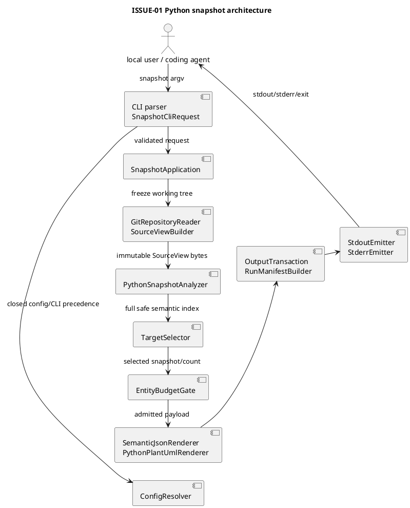
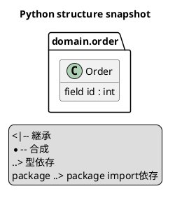

# iss-00004 Generate Python Structure Snapshots — 設計

詳細: [Design Guide](../../../../../../docs/authoring/design.md)

## 設計目標

- `python` domainの`working-tree snapshot`を、CLIからimmutable SourceView、AST semantic model、JSON/PlantUML、manifest、stream、exit、acceptanceまで一つのvertical pipelineとして成立させる。
- public contractをvalue object、schema、canonical encoder、golden testへ一対一に対応させ、実装者がfield、filename、sort、failure mappingを補完しなくてよい状態にする。
- common foundationを本sliceが実際に使うconfig、diagnostic、outcome、source freeze、canonical JSON、output transactionに限定する。
- target application、mutable Git operation、source body/literal/secret/absolute path、implicit truncation、overwrite、partial publicationを構造上不可能にする。
- 後続Issueが利用するのはversioned contractとportであり、本Issueのprivate class/module layoutをforkしない。

| Design ID | Requirement trace | 設計判断 |
| --- | --- | --- |
| I01-DES-001 | I01-REQ-001 | `SnapshotApplication`がone-run lifecycleを所有し、CLI、source、adapter、artifactを明示portで接続する。 |
| I01-DES-002 | I01-REQ-002 | duplicate-aware parserとclosed `ConfigV1` resolverをsource acquisition前に完了する。 |
| I01-DES-003 | I01-REQ-003 | repository外stagingへfreezeした`SourceView`とtyped `TargetSpec`/`TargetSelection`をimmutable valueにする。 |
| I01-DES-004 | I01-REQ-004 | Python adapterがmodule index、AST extraction、safe type expression、class/member/relation identityを所有する。 |
| I01-DES-005 | I01-REQ-005 | schema-defined canonical JSON、Python PlantUML vocabulary、manifest、stream emitterをexact-byte contractとして分離する。 |
| I01-DES-006 | I01-REQ-006 | discriminated outcome、domain-local budget、redaction/invariant gate、atomic directory publicationでfail-closedにする。 |
| I01-DES-007 | I01-REQ-006 | Git allowlist、static execution trap、source drift check、deterministic sort/hashをsecurity boundaryにする。 |
| I01-DES-008 | I01-REQ-007 | stdlib-only runtime package、exact lock、schema/golden、offline wheel、minimum/latest CIをrepository-ownedにする。 |
| I01-DES-009 | I01-REQ-007 | fixture/test/path/symbolを固定し、diff/SQLAlchemy/Next/HTML symbolの混入をscope testで拒否する。 |

## Current / Target

### Current（verified canonical specification state）

- production package、entry point、schema implementation、Python analyzer、product fixture、product lockfileは存在しない。
- root `.github/workflows/ci.yml` は既存のSpecDock `validate` jobだけを持つ。
- issue metadataとcanonical R/D/P、accepted ADR、noncanonical explanation Artifactが存在する。
- `artifacts/20260824t054228z--explanation.html` はevidenceであり、actual Issue ID、Requirement数、entity overrun/incomplete分類、planned path authorityについて現行canonical contractではない記述を含む。本Designをその説明から導出してはならない。
- 下記path/symbolはすべてplanned implementation targetであり、実装済みと主張しない。

### Target architecture



### dependency direction

```text
cli -> application -> core ports
application -> source port, python adapter port, artifact port
source / artifacts / adapters.python -> core value objects
adapters.python -X-> cli, application, SQLAlchemy, Next, diff
core -X-> adapters.python
```

- `application`はconcrete AST nodeを知らない。
- `source`はPython entityを知らない。
- `artifacts`はASTを知らず、typed domain resultとbytesだけを扱う。
- Python adapterは`FileChangeSet`、comparison endpoint、SQLAlchemy/Next modelをimportしない。

## planned repository tree と authoritative symbols

実装時に同名pathが既に存在して責務が衝突する場合は、codeを先に足さずDesign/Planを更新する。

```text
.python-version
pyproject.toml
uv.lock
THIRD_PARTY_LICENSES.md
ci/
  latest-python.txt
  toolchains/
    git-2.39.5.Dockerfile
    git-2.39.5.sha256
schemas/
  diagnostic-v1.schema.json
  semantic-v1.schema.json
  run-manifest-v1.schema.json
  run-summary-v1.schema.json
  stdout-result-v1.schema.json
docs/contracts/
  cli-v1.md
  config-v1.md
  source-view-v1.md
  python-semantic-v1.md
  python-plantuml-v1.md
  run-manifest-v1.md
  stdout-v1.md
src/code_structure_viz/
  __init__.py
  __main__.py
  py.typed
  cli/
    __init__.py
    main.py
    parser.py
  application/
    __init__.py
    snapshot.py
  core/
    __init__.py
    budget.py
    config.py
    diagnostics.py
    outcomes.py
  source/
    __init__.py
    git_repository.py
    source_view.py
    targets.py
  semantic/
    __init__.py
    canonical_json.py
  artifacts/
    __init__.py
    manifest.py
    streams.py
    writer.py
  adapters/
    __init__.py
    python/
      __init__.py
      analyzer.py
      model.py
      module_index.py
      plantuml.py
      selection.py
      semantic_json.py
      type_expr.py
tests/
  conftest.py
  helpers/
    cli.py
    fixture_repo.py
    golden.py
  unit/
    cli/test_parser.py
    core/test_config.py
    core/test_outcomes.py
    source/test_source_view.py
    source/test_targets.py
    python/test_module_index.py
    python/test_type_expr.py
    python/test_analyzer.py
    python/test_selection.py
    python/test_semantic_json.py
    python/test_plantuml.py
    artifacts/test_manifest.py
    artifacts/test_writer.py
    artifacts/test_streams.py
  integration/python/test_targeted_snapshot.py
  acceptance/python/test_snapshot_cli.py
  acceptance/python/test_snapshot_failures.py
  acceptance/python/test_snapshot_determinism.py
  acceptance/python/test_snapshot_budget.py
  acceptance/python/test_stdout_selector.py
  security/test_python_static_boundary.py
  packaging/test_distribution.py
  contracts/test_json_schemas.py
  contracts/test_scope_exclusions.py
  fixtures/python_snapshot/
  golden/python_snapshot/
```

### symbol contract

| path | symbol | responsibility |
| --- | --- | --- |
| `cli/main.py` | `main(argv: Sequence[str] | None = None) -> int` | exception/signal boundary、binary stdout access、exit mapping。`sys.exit`は`__main__`だけ。 |
| `cli/parser.py` | `parse_cli(argv) -> SnapshotCliRequest` | duplicate pre-scan、closed grammar、meta operation、diff-only option rejection。 |
| `application/snapshot.py` | `SnapshotApplication.run(request) -> RunOutcome` | lifecycle順序、cleanup、publication前drift check、stream result。 |
| `core/config.py` | `resolve_config(request, repo) -> ResolvedConfig` | TOML v1 validation、precedence、value source、config digest。 |
| `core/diagnostics.py` | `Diagnostic`, `DiagnosticCode`, `encode_diagnostic_jsonl` | closed code catalog、safe nullable fields、deterministic order。 |
| `core/outcomes.py` | `DomainOutcome`, `RunOutcome`, status unions | impossible stateをconstructorで拒否する。 |
| `core/budget.py` | `EntityBudgetGate.admit(snapshot, resolved_limit)` | class entity countだけをrender前に検査する。 |
| `source/git_repository.py` | `GitRepositoryReader` | Git version/root/HEAD/path enumerationのread-only allowlist。 |
| `source/source_view.py` | `SourceViewBuilder.build(...)`, `SourceView`, `SourceFile` | staging freeze、content hash、fingerprint、drift probe。 |
| `source/targets.py` | `TargetSpec`, `parse_target` | path/module/class syntaxだけを扱い、semantic resolutionはadapterへ渡す。 |
| `semantic/canonical_json.py` | `encode_canonical_json(value, field_order) -> bytes` | UTF-8/no-space/final-LFとschema orderを一箇所で保証する。 |
| `artifacts/writer.py` | `OutputTransaction` | same-parent private staging、schema/redaction/integrity、fsync、atomic rename、cleanup。 |
| `artifacts/manifest.py` | `RunManifestBuilder` | exact manifest fields、artifact descriptor、run fingerprint。 |
| `artifacts/streams.py` | `StdoutEmitter`, `StderrEmitter` | exact bytes / summary / unavailable result / JSONL separation。 |
| `adapters/python/module_index.py` | `PythonModuleIndex.build(SourceView, ResolvedConfig)` | source root mapping、module collision、import alias index。 |
| `adapters/python/analyzer.py` | `PythonSnapshotAnalyzer.analyze(...) -> PythonAnalysisResult` | Python 3.12 AST、entity/member/relation extraction、file-local failure isolation。 |
| `adapters/python/type_expr.py` | `SafeTypeExpressionRenderer` | literal-free canonical type stringとreference extraction。 |
| `adapters/python/selection.py` | `PythonTargetSelector.select(...) -> PythonSnapshot` | target resolution、union traversal、frontier、status preconditions。 |
| `adapters/python/model.py` | immutable Python domain records | identity、sort key、invariant。 |
| `adapters/python/semantic_json.py` | `PythonSemanticJsonRenderer.render(snapshot) -> bytes` | semantic schema v1だけを生成する。 |
| `adapters/python/plantuml.py` | `PythonPlantUmlRenderer.render(snapshot) -> bytes` | Python visual vocabulary v1だけを生成する。 |

## CLI/application design

### parser phases

1. raw `argv` をtoken単位でpre-scanし、single-value option重複、`--stdout`値省略、diff-only optionを検出する。
2. meta operation `--help|--version` を解決する。snapshot optionと混在したmeta operationはusage errorにする。
3. commandとtyped scalarをparseする。integerはASCII decimalのclosed parserを使い、Pythonの`int()`が受ける`+1`、whitespace、underscore等を暗黙受理しない。
4. domain、format、target syntax、stdout grammarを検証する。
5. format/domain resolution後、stdout selector compatibilityを検証する。
6. `SnapshotCliRequest`を構築する。source/output filesystemへ触れる前に1〜5を完了する。

### request values

```text
SnapshotCliRequest
  repo: Path
  output_dir: Path
  domain: Literal["python"]
  config_path: Path | None
  targets: tuple[TargetSpec, ...]
  upstream_depth_override: int | None
  downstream_depth_override: int | None
  formats: tuple[Literal["semantic-json", "plantuml"], ...]
  max_entities_override: int | None
  stdout_selector: StdoutSelector | None
```

- `formats`はcanonical order、`targets`は`kind order path,module,class`とNFC valueのUTF-8 byte order。
- relative `--repo` / `--output-dir` / `--config`はinvocation current working directoryを基準に一度だけabsolute化する。`--repo`はGit root exact match、`--output-dir`はoutside-repository/nonexistent、`--config`はordinary non-symlink fileであることをpreflightする。raw absolute repo/output/config pathはrequest内部だけに存在し、serializerへ渡すDTOに含めない。
- `StdoutSelector`は`ManifestSelector`または`DomainFormatSelector(domain="python", format=...)`のsum typeにする。free-form stringのままapplicationへ渡さない。

### lifecycle order

```text
parse/usage
-> Python/Git/repo/output/config preflight
-> create private staging root
-> build SourceView
-> build module/AST index
-> resolve whole/targets and domain outcome
-> entity budget
-> render requested payloads
-> validate schema/redaction/digests
-> build/validate manifest
-> re-probe SourceView/HEAD
-> fsync + atomic publish directory
-> emit stdout/stderr
-> return exit
```

- usage/configではstaging rootを作らない。
- valid core runでdomain outcomeが`not_applicable`または`payload_unavailable`でもmanifest transactionを行う。
- run-level fatalではmanifestを作成・公開しない。

## ConfigV1 design

### immutable value

```text
ResolvedConfig
  schema = "code-structure-viz.config/v1"
  python.source_roots: tuple[PurePosixPath, ...]
  python.include: tuple[GlobPattern, ...]
  python.exclude: tuple[GlobPattern, ...]
  traversal.upstream_depth: int
  traversal.downstream_depth: int
  limits.max_entities: int
  value_sources: ConfigValueSources
  source: builtin | repository | explicit
  sha256: lowercase hex
```

### validation rules

- `tomllib.load()`の結果をclosed dataclass decoderへ渡し、set differenceでunknown keyを先に拒否する。
- TOML integerは`bool`を含めず`type(value) is int`で確認する。
- source root/globはNFCへ正規化し、POSIX separatorだけを受理する。
- source rootsはduplicateを拒否する。include/exclude duplicateも拒否し、silent dedupeしない。
- built-in `src`の非存在は許す。repository/explicit configで指定されたrootはfreeze開始時に存在するdirectoryでなければならない。
- glob matcherは独自のsmall grammarをsegmentへcompileする。filesystem libraryごとの`**`差異をpublic behaviorへ漏らさない。
- resolved config digest preimageは次のfield orderのcanonical JSONで、`source`と`value_sources`を含めない。意味が同じconfigは同じdigestになる。

```json
{"schema":"code-structure-viz.config/v1","python":{"source_roots":["src","."],"include":["**/*.py"],"exclude":[]},"traversal":{"upstream_depth":1,"downstream_depth":1},"limits":{"max_entities":500}}
```

## GitRepositoryReader / SourceView design

### Git subprocess allowlist

product codeから起動できるGit commandは次に閉じる。

```text
git --version
git -C <repo> -c core.fsmonitor=false rev-parse --show-toplevel
git -C <repo> -c core.fsmonitor=false rev-parse --verify HEAD^{commit}
git -C <repo> -c core.fsmonitor=false ls-files -z --cached --others --exclude-standard
```

- `rev-parse --verify HEAD^{commit}`のunborn return codeだけを`head_commit = null`へ変換する。他のstderr/return codeはfatal。
- subprocess envは`LC_ALL=C`、`LANG=C`、`GIT_OPTIONAL_LOCKS=0`、`GIT_CONFIG_NOSYSTEM=1`、`GIT_CONFIG_GLOBAL=/dev/null`、`GIT_TERMINAL_PROMPT=0`、`GIT_PAGER=cat`、`PAGER=cat`、`NO_COLOR=1`を固定する。
- target Git stderrをそのまま利用者へ転送せず、stable diagnosticへ変換する。
- shell、alias、pager、hook、external diff、textconvを呼ばない。`shell=False`とargument vectorを必須とする。

### SourceFile

```text
SourceFile
  path: normalized repository-relative PurePosixPath
  kind: regular | symlink
  resolved_target: PurePosixPath | None
  size_bytes: int
  sha256: lowercase 64 hex
  content: bytes  # private, repr=False, serializer portなし
```

- `content`を持つ型は`source` packageから外へserializer DTOとしてexportしない。
- Python decodingはanalyzerで`tokenize.detect_encoding`を使う。SourceViewはraw bytesを正本にする。

### SourceView

```text
SourceView
  schema = "code-structure-viz.source-view/v1"
  kind = "working-tree"
  head_commit: 40/64-hex object id | None
  files: tuple[SourceFile, ...]
  failures: tuple[SourceAcquisitionFailure, ...]
  fingerprint: lowercase 64 hex

SourceAcquisitionFailure
  path: normalized repository-relative PurePosixPath
  stage: read | path_safety
  diagnostic_code: CSV-PY-001 | CSV-SOURCE-002 | CSV-SOURCE-003
```

Git SHA-1/SHA-256 repository差を許すため`head_commit`はhex lengthを固定しない。artifactへalgorithm推測fieldを追加せず、Gitが返すfull object IDを保持する。

fingerprint preimageは次の形から`fingerprint`を除いたcanonical JSON bytesである。

```json
{"schema":"code-structure-viz.source-view/v1","kind":"working-tree","head_commit":"1111111111111111111111111111111111111111","files":[{"path":"src/domain/order.py","kind":"regular","resolved_target":null,"size_bytes":123,"sha256":"aaaaaaaaaaaaaaaaaaaaaaaaaaaaaaaaaaaaaaaaaaaaaaaaaaaaaaaaaaaaaaaa"}],"failures":[]}
```

- filesはnormalized path UTF-8 byte order。failuresはpath、stage、diagnostic_code順。read/path-safety failureをfingerprintから落とさない。
- symlinkの場合、logical pathとresolved repository-relative targetをpreimageへ含める。
- file copyは`lstat -> open no-follow/verified target -> read -> fstat -> hash -> private write -> fsync`を行い、途中mutationを検出する。
- private staging rootはoutput parent内にmode `0700`で作り、`source/`と`artifacts/`を分ける。source treeはfinal outputへrenameしない。
- initial fingerprint probeとpre-publication probeは同じenumeration/config algorithmを再利用する。probeはcontentを再freezeせずdigestだけを計算する。

### path safety

- GitのNUL-delimited bytesをstrict UTF-8 decodeする。decode failureはdomain source acquisitionを安全に継続できないため`payload_unavailable`。
- NFC normalization後のpath collision、case-insensitive filesystemで同一inodeへ異なるlogical pathが対応するcollisionは`payload_unavailable`。
- path component `.`、`..`、empty、NULを拒否する。
- symlink resolved targetは`realpath`がrepo root配下かつordinary fileであること。outside/cycle/special fileは`CSV-SOURCE-002`。

## Python module index / AST design

### module mapping

1. candidate pathを含むsource rootを列挙する。
2. segment数が最大のrootを選ぶ。同じ長さが複数ならconfig orderを使う。
3. relative file pathから`.py`を除く。末尾`__init__`は除き、空になった場合だけ`__init__`とする。
4. 各segmentに`str.isidentifier()`と`not keyword.iskeyword()`を適用する。
5. `/`を`.`へ変換しNFC normalized moduleを得る。
6. duplicate moduleはcollision groupとして全fileをsafe indexから除く。

`src/domain/order.py`はdefault rootで`domain.order`、`domain/order.py`は`.` rootで`domain.order`となるため両方があればcollisionであり、root orderで一方を黙って勝たせない。

### parser

- `tokenize.detect_encoding`でdecodeし、BOM/PEP 263を扱う。decoded text自体をmodel/diagnosticへ格納しない。
- `ast.parse(text, filename=<repository-relative-path>, mode="exec", type_comments=False, feature_version=(3, 12))`を使う。filenameにabsolute pathを渡さない。これは`PyCF_ONLY_AST`相当のAST-only parseとして許可され、product codeは`py_compile`、`compileall`、code objectを返す直接`compile`を呼ばない。
- `type_comments=False`を固定し、`# type:` commentをentity/member/signature/relationへ反映しない。annotation sourceは`AnnAssign`、`arg.annotation`、`returns`等のsyntax nodeだけである。
- `SyntaxError`からline/columnだけをsafe diagnosticへ移し、`text` fieldを破棄する。
- fileごとにparse/read/encoding/module failureを`FailedSourceFile`へ隔離する。
- importsはmodule全ASTから収集するが、target codeを実行しない。ClassDef extractionは`Module.body`とdirect `ClassDef.body`のstatement listだけを走査し、module/class level control-flow blockやFunctionDef等のbody内ClassDefをentity化しない。method field collectorだけはcontrol-flow statement bodyへ再帰するが、nested function/lambda/class/comprehension scopeへは降りない。

### alias resolution

| syntax | import dependency target | bound symbol mapping |
| --- | --- | --- |
| `import a.b` | `a.b` | `a -> a`, qualified `a.b`を保持 |
| `import a.b as x` | `a.b` | `x -> a.b` |
| `from a.b import C` | `a.b` | `C -> a.b.C` |
| `from a.b import C as X` | `a.b` | `X -> a.b.C` |
| relative import | resolved local/external module | same rule |
| star import | resolved module | symbol mappingはunknown、warning |

- importがconditional/function-localでもmodule dependencyとして`conditional: true`をinternal evidenceに持てるが、v1 relation JSONへ新fieldを出さない。
- dynamic import callは推測しない。

## Python domain model

全recordは`@dataclass(frozen=True, slots=True)`相当のimmutable valueとし、constructorでNFC、positive line、sorted tuple、ID invariantを検証する。

### Entity

```text
PythonClassEntity
  id: "python:class:<module>:<qualified_name>"
  kind: "class"
  module: str
  qualified_name: str
  name: str
  path: PurePosixPath
  range: SourceRange
  decorators: tuple[DecoratorRef, ...]
```

- lexical ClassDef chainだけをqualified nameに使う。
- 同じ`module + qualified_name`へ複数ClassDefが対応する場合は`CSV-PY-012`を出し、collision entityをsafe indexから除外する。source orderで一方を選ばない。
- decorator orderはnormalized name、called、source line。raw argumentは保持しない。
- entity sortは`module UTF-8 bytes, qualified_name UTF-8 bytes, path UTF-8 bytes, start_line`。

### Member

```text
PythonMember
  id: "python:member:<sha256(canonical identity tuple)>"
  owner_id: class id
  kind: field | property | method
  name: str
  scope: class | instance | null
  property_role: getter | setter | deleter | null
  method_kind: instance | class | static | null
  annotation: safe type string | null
  signature: MethodSignature | null
  decorators: tuple[DecoratorRef, ...]
  range: SourceRange
```

identity tupleは`owner_id, kind, name, scope-or-empty, property_role-or-empty, method_kind-or-empty, declaration ordinal among same tuple`。UTF-8 NUL-separated bytesのSHA-256を使う。class-body `Assign`/`AnnAssign`はsimple nameおよびtuple/list destructuring内simple nameだけ、method fieldは`Assign`/`AnnAssign`/`AugAssign`のliteral `self.<name>`/`cls.<name>` targetだけを抽出する。`Delete`とnested lexical scope内assignmentはfield declarationにしない。

- class body fieldと`self.x`/`cls.x` assignmentはowner/name/scopeでmergeする。merged fieldのdeclaration ordinalは0、最初のrangeをpublic rangeとし、internal occurrence countは出力しない。method/propertyだけが同一identity tuple内の0起点declaration ordinalで複数recordを保持する。
- distinct non-null annotationが複数あればannotationを`?`にし`CSV-PY-013` warningを出す。default/value inferenceをしない。
- method ordinalは同名overload/再定義を消さないため必要。source line順で0起点。
- `@property`、`.setter`、`.deleter`はproperty memberとして別accessor recordにする。
- `@staticmethod`/`@classmethod`をmethod_kindへ反映し、decorator metadataにも残す。
- field memberは`annotation`をsafe annotationまたはnull、`signature=null`、`property_role=null`、`method_kind=null`とする。
- property accessorはmethod recordを重複生成せずkind `property`一件とし、`scope=null`、`property_role`を必須、`method_kind=null`、`signature`にaccessor signatureを保持する。`annotation`はgetterのreturn、setterの最初のnon-receiver parameter、deleterはnull。
- ordinary methodは`scope=null`、`property_role=null`、`method_kind`と`signature`を必須、`annotation=null`とする。

### signature

```text
MethodSignature
  async: bool
  parameters: tuple[Parameter, ...]
  returns: safe type string | null

Parameter
  name: str
  kind: positional_only | positional_or_keyword | var_positional | keyword_only | var_keyword
  annotation: safe type string | null
  has_default: bool
```

`self`/`cls`もsemantic JSONには保持する。PlantUML表示時だけmethod kindに応じてimplicit receiver一件を省略する。

### SafeTypeExpressionRenderer

closed renderer rule:

| AST | canonical result |
| --- | --- |
| `Name`, `Attribute` | alias-resolved dotted symbolic name |
| `Subscript` | `Base[arg1, arg2]` |
| `Tuple` | comma separated tuple content |
| `A | B` | precedence-aware `A | B` |
| `None` | `None` |
| `...` | `...` |
| string forward annotation | expressionとして再parseできれば同rule、不可なら`?` |
| literal constant | `?`（None/Ellipsis除く） |
| `Literal[...]` | argumentごとに`?` |
| `Annotated[T, ...]` | `Annotated[T, ?]` |
| Call/Lambda/comprehension/arithmetic/unknown node | `?` + warning |

rendererはsafe stringと`TypeReference`集合を同時に返す。typed relationは次だけを生成する。

- SourceView内classへ一意解決できるreference。
- explicit importで外部symbolへ解決できるreference。
- inheritance baseのsymbolic reference。

unqualified builtin/typing helperだけをexternal dependencyとして量産しない。

### Relation

```text
PythonRelation
  id: "python:relation:<sha256(canonical relation tuple)>"
  kind: inheritance | composition | typed_dependency | import_dependency
  source_id: class id | "python:module:<module>"
  target: RelationTarget
  via_member_id: member id | null
  annotation: safe type string | null
  range: SourceRange

RelationTarget
  resolution: internal | external | unknown
  kind: class | module | symbol
  id: class/module id | null
  name: safe normalized symbolic name
```

- relation identity tupleは`kind, source_id, target.resolution, target.kind, target.id-or-empty, target.name, via_member_id-or-empty, annotation-or-empty`。同一memberから同一targetへ異なるsafe annotationで到達したrelationを黙って一つへ潰さない。
- relation kind orderは`inheritance, composition, typed_dependency, import_dependency`。
- source -> targetはdependent -> dependency。
- inheritanceはbase expression、compositionはfield annotation、typed dependencyはmethod/property parameter/return、import dependencyはmodule importから作る。
- exact duplicateはidentityで一つへ畳む。異なるmember経由は別relation。

## target selection / traversal design

### TargetSpec

```text
PathTarget(value: PurePosixPath)
ModuleTarget(value: str)
ClassTarget(raw: str)
```

ClassTargetはparse時に任意分割しない。module index構築後、raw dotted valueのprefixを長い順に試し、exact module一件を得た最長prefixをmoduleとする。remainderをqualified class nameとする。

### graph

- module node ID: `python:module:<module>`。
- class node ID: entity ID。
- class <-> declaring moduleはzero-cost membership edge。
- semantic relationはdirected cost-1 edge。
- external/unknown targetはterminalでgraph nodeにしない。

### algorithm

1. all parsed modules/classes/relationsからimmutable graphを作る。
2. target 0件ならall classをselectedにし、depth traversalを行わない。
3. targetをexact seed node setへ解決する。unresolved/ambiguous/failed seedが一つでもあればpayload unavailable。
4. downstreamはseedからforward BFS、upstreamはseedからreverse BFSを独立実行する。
5. membership closureを各BFS level内で行いdepthを消費しない。
6. selected node unionを取り、selected moduleのclassを含める。
7. internal relationはsourceとtargetの両方がselectedの場合だけpayloadへ含める。sourceがselectedなexternal/unknown relationはpayloadへ含める。selected sourceからdepth外のinternal targetへ向かうrelationはpayloadから除外しfrontierへ記録する。
8. depth境界の次hop、failed file、unresolved ref、unsupported local class/star importをcoverage frontierへcanonical sortで記録する。

同じnodeがupstream/downstream両方で到達してもentityは一つ。coverageは方向別最小distanceを内部で保持するが、v1 payloadにはfrontierだけを公開する。

## outcome model

```text
DomainOutcome =
  Complete(payload_available=True, snapshot)
  | NotApplicable(payload_available=False)
  | IncompletePartialSafe(payload_available=True, snapshot, diagnostics)
  | IncompletePayloadUnavailable(payload_available=False, diagnostics)

RunOutcome =
  CompleteOrNotApplicable(exit=0, manifest)
  | Incomplete(exit=3, manifest)
  | Fatal(exit=1, no manifest)
  | Usage(exit=2, no manifest)
  | Interrupted(exit=130, no manifest)
```

constructor invariants:

- completeはpayload availableでrequested renderer bytesが全てある。
- not_applicableはentity/payload/`incomplete_kind`を持たない。
- partial_safeは`incomplete_kind=partial_safe`、payload available、failed fileまたはidentity-collision frontierがnon-empty、budget pass、全requested renderer pass。単なるwarningだけでstatusをincompleteにしない。
- payload_unavailableは`incomplete_kind=payload_unavailable`、artifact descriptor 0件。
- entity overrunは必ずpayload_unavailable。
- run fatal/usage/interruptはfinal manifestを持たない。
- manifest builderはinvalid combinationを`CSV-INTERNAL-001`へ変換しpublication前に停止する。

### failure classification

| failure | classification |
| --- | --- |
| one or more non-seed file read/encoding/parse/module identity failure + safe requested subset | partial_safe |
| non-seed class identity collision + safe requested subset | partial_safe |
| requested class identity collision、またはcollisionしかなくsafe entity 0件 | payload_unavailable |
| whole modeで一部safe classあり、failed fileあり | partial_safe |
| all candidate files failed | payload_unavailable |
| requested target seed file/class/module failed、missing、ambiguous | payload_unavailable |
| outside-repo symlink、path normalization collision | payload_unavailable |
| unresolved external/static type | completeまたはpartial_safeを悪化させないwarning/coverage |
| class entity > resolved limit | payload_unavailable |
| config/usage invalid | usage exit2 |
| Git/repo/output/source drift/internal invariant | run fatal exit1 |

## canonical JSON contract

### common encoding

`encode_canonical_json`は次を強制する。

- UTF-8、`ensure_ascii=False`、BOMなし。
- objectはschemaごとのfield order。`sort_keys=True`を使わない。
- separatorは`,`と`:`、indentなし。
- integerだけ。NaN/Infinity/floatをschemaで拒否する。
- stringはNFC。
- 末尾にLFちょうど1つ。
- unknown fieldを出力しない。

各checked-in JSON Schemaは`additionalProperties: false`を使う。runtime serializer testはSchema validationとgolden byte equalityの両方を通す。

### diagnostic/v1

field order:

```text
type, schema, code, severity, domain, path, symbol, line, recoverable, message
```

example:

```json
{"type":"diagnostic","schema":"code-structure-viz.diagnostic/v1","code":"CSV-PY-003","severity":"error","domain":"python","path":"src/broken.py","symbol":null,"line":7,"recoverable":true,"message":"Python source could not be parsed with the v1 Python 3.12 grammar."}
```

- nullable fieldも省略せず`null`。
- stderrは一diagnostic一line。manifest/payload内では同じobjectをarray elementとして使い、各elementにLFはない。
- ordering keyは`domain null-first, path null-first UTF-8, line null-first, code, symbol null-first, message`。
- diagnosticは全field tupleでdeduplicateしてからordering keyでsortする。stderr、manifest domain/root、partial semantic payloadへ渡す同一diagnostic集合のbytes/valueが一致しなければならない。

### closed diagnostic catalog

| code | default severity | recoverable | message template / outcome |
| --- | --- | --- | --- |
| `CSV-USAGE-001` | error | false | `Command line does not match the snapshot v1 grammar.` / exit2 |
| `CSV-USAGE-002` | error | false | `Single-value option '<option>' was specified more than once.` / exit2 |
| `CSV-USAGE-003` | error | false | `Snapshot does not accept diff-only option '<option>'.` / exit2 |
| `CSV-USAGE-004` | error | false | `Stdout selector is not valid for snapshot v1.` / exit2 |
| `CSV-USAGE-005` | error | false | `Stdout selector does not name a selected domain and requested format.` / exit2 |
| `CSV-CONFIG-001` | error | false | `Configuration file could not be read.` / exit2 |
| `CSV-CONFIG-002` | error | false | `Configuration is not valid TOML.` / exit2 |
| `CSV-CONFIG-003` | error | false | `Configuration contains an unknown key '<key>'.` / exit2 |
| `CSV-CONFIG-004` | error | false | `Configuration value '<key>' is invalid for config v1.` / exit2 |
| `CSV-ENV-001` | error | false | `Python 3.12 or newer is required.` / exit1 |
| `CSV-ENV-002` | error | false | `Git 2.39 or newer is required.` / exit1 |
| `CSV-REPO-001` | error | false | `Repository path must be an exact Git working-tree root.` / exit1 |
| `CSV-OUTPUT-001` | error | false | `Output destination already exists or cannot be published atomically.` / exit1 |
| `CSV-OUTPUT-002` | error | false | `Output destination must be outside the target repository.` / exit1 |
| `CSV-SOURCE-001` | error | false | `Source view changed before publication.` / exit1 |
| `CSV-SOURCE-002` | error | false | `Python source symlink is unsafe.` / payload unavailable |
| `CSV-SOURCE-003` | error | false | `Repository path cannot be represented uniquely as safe UTF-8 NFC.` / payload unavailable |
| `CSV-PY-001` | error | true | `Python source could not be read.` / file-local failure |
| `CSV-PY-002` | error | true | `Python source encoding could not be decoded safely.` / file-local failure |
| `CSV-PY-003` | error | true | parse message above / file-local failure |
| `CSV-PY-004` | error | true | `Python source path does not map to a valid module identity.` / file-local failure |
| `CSV-PY-005` | error | true | `More than one source file maps to the same Python module identity.` / collision group |
| `CSV-PY-006` | error | false | `Requested Python target was not found in the safe source view.` / payload unavailable |
| `CSV-PY-007` | error | false | `Requested Python target is ambiguous.` / payload unavailable |
| `CSV-PY-008` | warning | true | `Python reference could not be resolved statically.` / coverage only |
| `CSV-PY-009` | info | true | `Class declaration outside a direct module or class body is outside Python semantic v1.` / coverage only |
| `CSV-PY-010` | error | false | `Python entity count exceeds the resolved max-entities limit.` / payload unavailable |
| `CSV-PY-011` | warning | true | `Python type expression was reduced to an unknown marker.` / coverage only |
| `CSV-PY-012` | error | true | `More than one class declaration maps to the same Python class identity.` / class collision |
| `CSV-PY-013` | warning | true | `Conflicting field annotations were reduced to an unknown marker.` / safe member warning |
| `CSV-INTERNAL-001` | error | false | `Internal snapshot contract invariant failed before publication.` / exit1 |
| `CSV-INTERRUPT-001` | warning | false | `Snapshot was interrupted before publication.` / exit130 |

新code/meaningはimplementation convenienceで追加せず、Design/schema/goldenを先に更新する。

## semantic JSON v1

### top-level field order

```text
type, schema, domain, document_kind, status,
[incomplete_kind], source, request, coverage,
entities, members, relations, diagnostics
```

- `type = "semantic_snapshot"`
- `schema = "code-structure-viz.semantic/v1"`
- `domain = "python"`
- `document_kind = "snapshot"`
- `status = "complete" | "incomplete"`。not_applicable/payload_unavailableではfile自体を作らない。
- `incomplete_kind`はpartial_safe payloadだけに存在し`"partial_safe"`。

### nested field order

| object | field order |
| --- | --- |
| source descriptor | `schema, kind, head_commit, fingerprint, file_count` |
| request | `targets, upstream_depth, downstream_depth` |
| target | `kind, value` |
| coverage | `candidate_files, parsed_files, failed_files, selected_modules, selected_entities, frontier` |
| failed file | `path, stage, diagnostic_code` |
| frontier | `direction, kind, reference, reason` |
| entity | `id, kind, module, qualified_name, name, path, range, decorators` |
| range | `start_line, end_line` |
| decorator | `name, called` |
| member | `id, owner_id, kind, name, scope, property_role, method_kind, annotation, signature, decorators, range` |
| signature | `async, parameters, returns` |
| parameter | `name, kind, annotation, has_default` |
| relation | `id, kind, source_id, target, via_member_id, annotation, range` |
| relation target | `resolution, kind, id, name` |

- targetは`{"kind":"path|module|class","value":"<normalized value>"}`。prefixをvalueへ重複させない。
- failed file `stage` enumは`read|path_safety|encoding|parse|module_identity|module_collision`。
- frontier `direction` enumは`upstream|downstream|failure`、`kind` enumは`module|class|symbol|file`、`reason` enumは`depth_limit|unresolved_reference|failed_source|unsupported_scope|star_import|identity_collision`。
- `SourceRange.end_line`はASTのpositive `end_lineno`、存在しない場合は`start_line`。columnはpublic contractへ出さない。
- `candidate_files`はconfig scopeに入った全`.py` logical path数、`parsed_files`はencoding decodeとAST parseが成功したfile数、`selected_entities`はpublished entity array長と一致する。module/class identity failureはparsed_filesへ数えてもfailed_files/frontierへ必ず残す。
- frontier `reference`はkind `module|class`ならcanonical node ID、kind `file`ならrepository-relative path、kind `symbol`ならsafe normalized symbolic name。raw expression/source textを入れない。

### arrays/sort

- targets: kind order path/module/class、value UTF-8。
- failed_files: path、stage、code。
- selected_modules: module UTF-8。
- frontier: direction order upstream/downstream/failure、kind、reference、reason。
- entities/members/relations: model sort key。
- diagnostics: diagnostic sort key。

### complete example

```json
{"type":"semantic_snapshot","schema":"code-structure-viz.semantic/v1","domain":"python","document_kind":"snapshot","status":"complete","source":{"schema":"code-structure-viz.source-view/v1","kind":"working-tree","head_commit":"1111111111111111111111111111111111111111","fingerprint":"bbbbbbbbbbbbbbbbbbbbbbbbbbbbbbbbbbbbbbbbbbbbbbbbbbbbbbbbbbbbbbbb","file_count":1},"request":{"targets":[],"upstream_depth":1,"downstream_depth":1},"coverage":{"candidate_files":1,"parsed_files":1,"failed_files":[],"selected_modules":["domain.order"],"selected_entities":1,"frontier":[]},"entities":[{"id":"python:class:domain.order:Order","kind":"class","module":"domain.order","qualified_name":"Order","name":"Order","path":"src/domain/order.py","range":{"start_line":3,"end_line":8},"decorators":[{"name":"dataclasses.dataclass","called":false}]}],"members":[{"id":"python:member:cccccccccccccccccccccccccccccccccccccccccccccccccccccccccccccccc","owner_id":"python:class:domain.order:Order","kind":"field","name":"id","scope":"class","property_role":null,"method_kind":null,"annotation":"int","signature":null,"decorators":[],"range":{"start_line":5,"end_line":5}}],"relations":[],"diagnostics":[]}
```

### partial_safe difference

- `status`の直後に`"incomplete_kind":"partial_safe"`を置く。
- coverage.failed_files/frontierとdiagnosticsはnon-empty。
- entities/members/relationsはsafe subsetだけ。

## run manifest v1

### top-level field order

```text
type, schema, tool, contracts, adapters, command, request,
source, config, run, domains, artifacts, diagnostics
```

### object definitions

| object | exact fields |
| --- | --- |
| tool | `name, version` |
| contracts | `config, diagnostic, source_view, semantic, manifest, run_summary, stdout_result, plantuml` |
| adapter | `domain, name, version` |
| command | `name, domain, formats, stdout_selector` |
| request | `targets, upstream_depth, downstream_depth` |
| target | `kind, value` |
| source | `schema, kind, head_commit, fingerprint, file_count` |
| config | `schema, source, sha256, resolved, value_sources` |
| resolved python | `source_roots, include, exclude` |
| resolved traversal | `upstream_depth, downstream_depth` |
| resolved limits | `max_entities` |
| value_sources | `python_source_roots, python_include, python_exclude, upstream_depth, downstream_depth, max_entities` |
| run | `status, exit_code, fingerprint` |
| domain complete/not_applicable | `domain, status, payload_available, entity_count, coverage, budget, artifact_paths, diagnostics` |
| domain incomplete | `domain, status, incomplete_kind, payload_available, entity_count, coverage, budget, artifact_paths, diagnostics` |
| budget | `name, requested, resolved, actual, source` |
| artifact descriptor | `path, domain, format, media_type, size_bytes, sha256` |

- run statusは`complete|not_applicable|incomplete`。fatal/interrupt/usageではmanifestなし。
- `adapters`と`domains`は本Issueではexactly one elementで、domain `python`だけを持つ。domain省略/all-domain envelopeを先行実装しない。
- domain `coverage`はsemantic JSONのcoverage objectとexactly同じfield/order/enumを再利用する。
- not_applicable entity_countは0、budget.actualは0、artifact_pathsはempty。
- payload_unavailable entity_countは解析後countを安全に得られる場合そのcount、得られない場合`null`。budget.actualも同様にnullable。
- `request.targets`はsemantic JSONと同じ`kind, value` target object。
- `artifact_paths`とroot `artifacts`はformat order `semantic-json`, `plantuml`、同format内path UTF-8でsortする。
- media typeはsemantic JSONが`application/json`、PlantUMLが`text/vnd.plantuml; charset=utf-8`。
- `artifacts`はsemantic/PlantUMLだけ。`run-manifest.json`自身を含めない。
- root diagnosticsはrun-levelだけ。domain diagnosticはdomain objectだけに置く。semantic partial payload内diagnosticとは同じvalueを再利用する。
- `not_applicable`とzero-class completeのdiagnosticsはempty arrayで、stderrもempty bytes。

### run fingerprint

次のcanonical objectのSHA-256。wall clock、PID、temp path、output pathを含めない。

```json
{"schema":"code-structure-viz.run-fingerprint/v1","tool_version":"0.1.0.dev0","adapter_version":"python-ast/1","source_fingerprint":"bbbbbbbbbbbbbbbbbbbbbbbbbbbbbbbbbbbbbbbbbbbbbbbbbbbbbbbbbbbbbbbb","config_sha256":"dddddddddddddddddddddddddddddddddddddddddddddddddddddddddddddddd","command":{"name":"snapshot","domain":"python","formats":["semantic-json","plantuml"],"stdout_selector":null},"request":{"targets":[],"upstream_depth":1,"downstream_depth":1}}
```

### complete example

```json
{"type":"run_manifest","schema":"code-structure-viz.run-manifest/v1","tool":{"name":"code-structure-viz","version":"0.1.0.dev0"},"contracts":{"config":"code-structure-viz.config/v1","diagnostic":"code-structure-viz.diagnostic/v1","source_view":"code-structure-viz.source-view/v1","semantic":"code-structure-viz.semantic/v1","manifest":"code-structure-viz.run-manifest/v1","run_summary":"code-structure-viz.run-summary/v1","stdout_result":"code-structure-viz.stdout-result/v1","plantuml":"code-structure-viz.plantuml/python/v1"},"adapters":[{"domain":"python","name":"python-ast","version":"1"}],"command":{"name":"snapshot","domain":"python","formats":["semantic-json"],"stdout_selector":null},"request":{"targets":[],"upstream_depth":1,"downstream_depth":1},"source":{"schema":"code-structure-viz.source-view/v1","kind":"working-tree","head_commit":null,"fingerprint":"bbbbbbbbbbbbbbbbbbbbbbbbbbbbbbbbbbbbbbbbbbbbbbbbbbbbbbbbbbbbbbbb","file_count":1},"config":{"schema":"code-structure-viz.config/v1","source":"builtin","sha256":"dddddddddddddddddddddddddddddddddddddddddddddddddddddddddddddddd","resolved":{"python":{"source_roots":["src","."],"include":["**/*.py"],"exclude":[]},"traversal":{"upstream_depth":1,"downstream_depth":1},"limits":{"max_entities":500}},"value_sources":{"python_source_roots":"builtin","python_include":"builtin","python_exclude":"builtin","upstream_depth":"builtin","downstream_depth":"builtin","max_entities":"builtin"}},"run":{"status":"complete","exit_code":0,"fingerprint":"eeeeeeeeeeeeeeeeeeeeeeeeeeeeeeeeeeeeeeeeeeeeeeeeeeeeeeeeeeeeeeee"},"domains":[{"domain":"python","status":"complete","payload_available":true,"entity_count":1,"coverage":{"candidate_files":1,"parsed_files":1,"failed_files":[],"selected_modules":["domain.order"],"selected_entities":1,"frontier":[]},"budget":{"name":"max_entities","requested":null,"resolved":500,"actual":1,"source":"builtin"},"artifact_paths":["python.snapshot.semantic.json"],"diagnostics":[]}],"artifacts":[{"path":"python.snapshot.semantic.json","domain":"python","format":"semantic-json","media_type":"application/json","size_bytes":1024,"sha256":"ffffffffffffffffffffffffffffffffffffffffffffffffffffffffffffffff"}],"diagnostics":[]}
```

## stdout JSON contracts

### run-summary/v1

field order: `type, schema, run_status, exit_code, domains, manifest`。

domain summary field order: `domain, status`。incompleteの場合は`domain, status, incomplete_kind`。

```json
{"type":"run_summary","schema":"code-structure-viz.run-summary/v1","run_status":"complete","exit_code":0,"domains":[{"domain":"python","status":"complete"}],"manifest":"run-manifest.json"}
```

fatal example:

```json
{"type":"run_summary","schema":"code-structure-viz.run-summary/v1","run_status":"fatal","exit_code":1,"domains":[],"manifest":null}
```

### stdout-result/v1

field orderはRequirementどおり、domain variantとrun variantを分ける。

```json
{"type":"stdout_result","schema":"code-structure-viz.stdout-result/v1","selector":"python:semantic-json","availability":false,"domain_status":"not_applicable","stable_reason":"domain_not_applicable","artifact":null}
```

```json
{"type":"stdout_result","schema":"code-structure-viz.stdout-result/v1","selector":"manifest","availability":false,"run_status":"fatal","stable_reason":"final_manifest_unavailable","artifact":null}
```

closed stable reason:

- `domain_not_applicable`
- `domain_payload_unavailable`
- `run_fatal`
- `final_manifest_unavailable`
- `run_interrupted`

exact mapping:

| selector/outcome | variant | stable_reason |
| --- | --- | --- |
| domain selector + `not_applicable` | domain (`domain_status`) | `domain_not_applicable` |
| domain selector + `payload_unavailable` | domain (`domain_status`) | `domain_payload_unavailable` |
| domain selector + run fatal | run (`run_status`) | `run_fatal` |
| manifest selector + run fatal | run (`run_status`) | `final_manifest_unavailable` |
| any selector + handled pre-rename interrupt | run (`run_status`) | `run_interrupted` |

`artifact`はv1 unavailable resultでは常にnull。available時はこのschemaを使わずexact file bytesを出す。

## Python PlantUML v1

### bytes/layout

exact line order:

1. `@startuml`
2. `title Python structure snapshot`
3. `left to right direction`
4. `skinparam classAttributeIconSize 0`
5. `hide empty members`
6. incomplete note（partial_safeだけ）
7. module package blocks
8. internal relation lines
9. Japanese legend
10. `@enduml`

- module aliasは`M_` + `sha256("python:module:" + module)`の64hex。
- class aliasは`C_` + `sha256(entity.id)`の64hex。
- alias full digestを使いcollision fallbackを不要にする。
- package orderはmodule UTF-8。class/member/relation orderはsemantic model order。
- class labelはqualified name。package labelはmodule。
- member lineは`field <name> : <type-or-?>`、`property <name>(<role>) : <type-or-?>`、`method <name>(<params>) : <return-or-?>`。default literalを出さない。
- method displayはimplicit receiver `self|cls`一件を省略する。
- labelの`"`, `\`, newline、PlantUML control characterはbackslash escapeし、raw PlantUML directiveを注入できないようにする。

### arrows

| relation | line |
| --- | --- |
| inheritance | `<target> <|-- <source> : 継承` |
| composition | `<source> *-- <target> : 合成` |
| typed dependency | `<source> ..> <target> : 型依存` |
| import dependency | `<source module> ..> <target module> : import依存` |

internal targetだけを描く。external/unknownはdiagram nodeを捏造しない。

### example



partial_safeではpackage前に次だけを追加する。

```text
note "不完全なsnapshot: 除外fileとcoverageはrun-manifest.jsonを参照" as N_INCOMPLETE
```

zero-class completeではpackageの代わりに次を置く。

```text
note "解析対象のPython sourceにclassはありません" as N_EMPTY
```

## OutputTransaction / publication design

### directory transaction

- output parentに`.code-structure-viz-staging-<cryptographic-random>`をmode0700で作る。
- `source/`と`artifacts/`を作り、final payloadは`artifacts/`直下のexact three filenamesだけ。
- payload render -> JSON Schema validation -> structural redaction invariant -> bytes hash -> manifest render/Schema validation -> final path allowlist scanの順。
- all fileをflush/fsyncし、`artifacts/` directoryもfsyncする。
- frozen `source/` subtreeはfinal cancellation checkpoint前にunlink/fsync/rmdirする。cleanupが完了しなければpublicationしない。これによりrename後にsource bytesを含むstaging remainderを残さない。
- destination nonexistenceを再確認し、same parentの`os.rename(artifacts_dir, output_dir)`でcommitする。`os.replace`を使わない。
- rename後のparent directory fsyncはplatformが許す場合にbest-effortで行い、atomic visibility contractをcrash-durability contractへ拡張しない。rename後に残るprivate run rootはemptyであり、best-effortで削除する。これらcommit-tail cleanupの失敗はpublished status/bytesを変更せず、security testではsource byteが残っていないことをassertする。
- SIGINT handlerはapplicationへcancellation flagを渡し、final rename前のsafe checkpointで`Interrupted`へ変換する。rename開始からstream/exit確定まではnon-cancellable commit tailとし、signal受信でpublished outcomeを130へ巻き戻さない。

### structural redaction

serializer input型にraw source、AST node、absolute Path、exception traceback fieldを持たせない。さらにpublication前に次を検査する。

- JSON key allowlistとschema validation。
- path fieldがrepository-relative POSIXであること。
- output bytesにknown private staging prefix、repo absolute path、fixture secret sentinelがないこと。
- PlantUML lineがallowed preamble/package/class/member/relation/legend/note/endだけであること。

regex secret detectionだけを安全境界にせず、source literalをmodelへ入れないことを一次制御にする。

## package/bootstrap design

### pyproject

- project name: `code-structure-viz`
- initial internal version: `0.1.0.dev0`
- `requires-python = ">=3.12"`
- runtime `dependencies = []`
- entry point: `code-structure-viz = "code_structure_viz.cli.main:main"`
- build backend: `hatchling`
- source layout: `src/`
- typed package marker: `py.typed`
- dev dependency group: `pytest`, `pytest-cov`, `ruff`, `mypy`, `jsonschema`。exact transitive resolutionは`uv.lock`。
- Ruff target `py312`、format/checkを両方gate。MyPyは`strict = true`。test helperの必要箇所だけnarrow overrideを許す。
- no optional Node、SQLAlchemy、PlantUML executable/runtime dependency。

### supported toolchain files

- `.python-version`は`3.12`。
- `ci/latest-python.txt`は本Issue adoption時点で`3.14`。
- minimum Git laneはSHA-256 pinned official `git-2.39.5.tar.xz`からCI-only containerをbuildし、`git --version`が2.39.5であることをassertする。containerはdistributionへ含めない。
- latest Git laneはrunner Gitを使用するが2.39以上をpreflight assertする。
- `THIRD_PARTY_LICENSES.md`はbuild/dev direct/transitive dependencyのname/version/license/sourceをlockから列挙する。runtime dependency 0件を別行で明示する。
- repositoryのproduct licenseを本Issueで選ばない。release/publication workflowは追加しない。

## CI design

existing `.github/workflows/ci.yml` の`validate` jobを保持し、同fileへ次のjobをadditiveに追加する。

| job | environment | commands/purpose |
| --- | --- | --- |
| `product-test-minimum` | Ubuntu, Python 3.12, Git 2.39.5 container | frozen sync、quality、full tests、build |
| `product-test-latest` | Ubuntu, Python 3.14, runner Git >=2.39 | latest supported compatibility、full tests |
| `product-test-macos` | macOS, Python 3.12, system Git >=2.39 | path/symlink/Unicode/atomic rename behavior |
| `product-package-offline` | Ubuntu, Python 3.12 | wheel build、fresh venv、`pip --no-index` install、fixture CLI、socket/network trap |
| `product-contract-scope` | Ubuntu, Python 3.12 | Schema/golden、forbidden scope/dependency/HTML scan、SpecDock validateとの共存 |

- `uv sync --frozen --all-groups`を使いlock driftをfailさせる。
- action/dependency versionはfull commit SHAまたはlockでpinする。既存action pin policyを無関係に全面変更しない。
- CI artifact upload/release publishは本Issueで追加しない。

## fixture / golden design

### fixture root rule

各fixtureは`tests/fixtures/python_snapshot/<case>/repo/`をGit repositoryとしてtest helperが初期化する。fixture sourceをtest processへimportしない。Git commitが必要なcaseだけhelperがlocal author configでcommitし、network/remoteを使わない。

| case | required contents / purpose |
| --- | --- |
| `whole` | `src/domain/base.py`, `order.py`, `service.py`; nested class、class/instance field、sync/async method、property、decorator、inheritance/composition/typed/import relation、external ref |
| `targeted` | upstream/downstream chain、module-only node、unrelated class、depth frontier、multiple target union |
| `not_applicable` | tracked READMEだけ、`.py` 0件 |
| `zero_class` | valid `.py` with function/constants only |
| `partial_safe` | valid class file + syntax broken file + safe seed outside broken file |
| `failed_seed` | requested path/module/classがparse failureまたはmissing |
| `module_collision` | `src/pkg/item.py` と `pkg/item.py` が同じ`pkg.item`になる |
| `class_collision` | 同じmodule/qualified nameのClassDef二件 + unrelated safe class。wholeはpartial_safe、colliding class targetはpayload_unavailable |
| `security` | top-level marker write、raise、secret literal、build/plugin-like filename。importされればtestがfailする |
| `unicode_paths` | NFC valid path、test-generated normalization collision |
| `unborn_many_changes` | unborn HEAD、1,001 non-Python untracked files。snapshotはchanged-path logicへ触れない |

- outside symlinkはfixtureに固定せずtest runtimeでtemporary outside fileへ作る。
- 500/501/600 classは`tests/helpers/fixture_repo.py::write_generated_classes(count)`でdeterministically生成し、巨大source fixtureをcommitしない。
- unreadable fileはplatform capabilityをprobeし、root権限等で再現不能なら`SourceFileReader` fault-injection integration caseで同じclassificationを必ず検証する。acceptanceはparse/unsafe pathでpublication matrixを担保する。

### golden paths

```text
tests/golden/python_snapshot/
  whole/
    python.snapshot.semantic.json
    python.snapshot.puml
    run-manifest.json
    stdout.run-summary.jsonl
    stderr.jsonl
    published-files.txt
    exit-code.txt
  targeted/
    ...
  partial_safe/
    ...
  not_applicable/
    run-manifest.json
    stdout.run-summary.jsonl
    stderr.jsonl
    published-files.txt
    exit-code.txt
  payload_unavailable/
    run-manifest.json
    stdout.domain-result.jsonl
    stderr.jsonl
    published-files.txt
    exit-code.txt
```

- goldenはtool version、fake HEAD/fingerprint/hashをfixture helperでdeterministicに固定する。
- production serializerからgoldenを生成するupdate modeをtest pass中に自動実行しない。
- `tests/helpers/golden.py`のexplicit `--update-golden <case>`はdeveloper commandとして許すが、変更後にnormal test、schema validation、human diff reviewを必須とする。

## tests と trace

| Test ID | file | principal assertion |
| --- | --- | --- |
| I01-AT-001 | `tests/acceptance/python/test_snapshot_cli.py` | whole/zero-class exact files, schema, hashes, exit0 |
| I01-AT-002 | `tests/integration/python/test_targeted_snapshot.py` | target grammar/resolution/union/depth/direction/frontier |
| I01-AT-003 | `tests/acceptance/python/test_snapshot_failures.py` | not_applicable/partial_safe/payload_unavailable/symlink/collision/drift matrix |
| I01-AT-004 | `tests/security/test_python_static_boundary.py` | execution/Git mutation/redaction/path/traceback negative scan |
| I01-AT-005 | `tests/acceptance/python/test_snapshot_determinism.py` | two-run exact bytes and cross-lane contract fixtures |
| I01-AT-006 | `tests/acceptance/python/test_snapshot_budget.py` | 500/501/override/invalid and no diff gate |
| I01-AT-007 | `tests/acceptance/python/test_stdout_selector.py` | closed selector/exact bytes/result/summary/stderr/publication |
| I01-AT-008 | `tests/packaging/test_distribution.py` + CI jobs | build/offline install/runtime deps/toolchains |
| I01-AT-009 | `tests/contracts/test_json_schemas.py`, `test_scope_exclusions.py` | schema/golden/docs/runtime and scope/dependency exclusions |

unit testはpure rule、integrationはtemporary repository/ports、acceptanceはinstalled/`uv run` CLI subprocessを観測する。private methodだけをassertしてacceptanceの代替にしない。

## 変更しない領域

- parent/other Issue R/D/P、accepted ADR、`.meta.json`、existing explanation Artifact。
- `spec-dock/` runtime/tooling except canonical three replacements adopted separately。
- diff/endpoint/FileChangeSet/matching source modules。
- `adapters/sqlalchemy/`、`adapters/next/`、Node workspace。
- product HTML、frontend、server、DB。

## migration / compatibility / rollback

- baseline production/data migration: N/A。product code/persistent dataがないため。
- CLI/schemaはfirst v1。legacy compatibility layerは作らない。
- `0.1.0.dev0`はpublic releaseではない。ISSUE-02 preview前にv1を変更する場合もcanonical R/D/P、schemas、goldensを同changeで更新する。
- v1 reader公開後はfield meaning削除/変更をしない。additive changeでも`additionalProperties:false` readerとの互換を評価し、必要ならschema versionを上げる。
- rollback unitは本Issueのpackage/source/schema/docs/tests/CI additions一式。parent contracts、accepted ADR、SpecDock metadata、evidence Artifactをrollbackしない。
- forward recoveryはunsafe成功を維持せず、narrower incomplete/payload_unavailableへ変更する。既存Artifactを自動rewriteしない。

## security / privacy / operability

- security impact: untrusted source parse。controlはno execution、Git allowlist、path/symlink containment、raw-source type boundary、publication allowlist、negative fixture。
- privacy impact: relative path/symbol/type/signature/relation/line rangeだけを公開。literal/comment/body/secret/absolute/temp pathはmodelに入れない。
- operability: deterministic JSONL diagnostic、manifest coverage/budget/hash、closed exitでagentがretry/override/stopを判断できる。
- observabilityにtimestamp、host、username、cwd、absolute pathを入れない。再現性を壊すtelemetryを追加しない。
- criticalへのescalation trigger: source execution、secret/PII exposure、target mutation、irreversible publication、incident responseが必要なfailure。

## risks

| risk | control |
| --- | --- |
| ISSUE-01がframework構築へ膨張 | listed path/symbolのうちPython snapshot acceptanceが使う最小methodだけ。future method/registry/diff portを先行実装しない。 |
| Python type表現がliteralを漏らす | structural SafeTypeExpressionRenderer、Literal/Annotated redaction、secret fixture。`ast.unparse`を直接public outputへ使わない。 |
| targeted upstreamがparse failureで欠落 | 全candidate parse index、failed coverage、partial_safe/payload_unavailable distinction。 |
| module root ambiguity | longest root + collision fail-closed。silent precedenceなし。 |
| JSON self-hash recursion | manifestは自身をartifact descriptorへ含めない。 |
| atomic publicationがfile単位でpartial | destination absent + same-parent directory rename。 |
| minimum/latest AST差 | v1 grammarを3.12 feature_versionへ固定し、3.14 runtime laneでsame goldenを通す。 |
| old explanationをauthorityと誤認 | canonical authority section、scope contract test、Artifactは変更せずevidence扱い。 |

## Design stop condition

次の設計変更が必要ならimplementationを止める。

- exact schema/filename/status/diagnostic/PlantUML meaningを変更する必要がある。
- runtime dependency、external parser、PlantUML binary、Node、DB、HTML rendererを導入する必要がある。
- snapshot successにcomparison endpoint、merge-base、changed-path count、diff modelが必要になる。
- safe target resolutionのためにsource execution/importが必要になる。
- existing path/symbolとplanned treeが衝突し、責務を二重化する。

変更を採る場合はRequirementのobservable contract、Design、Plan、schema/golden/traceを先に同時更新する。
