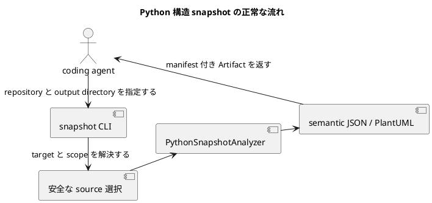

# iss-00004 Generate Python Structure Snapshots — 設計

詳細: [Design Guide](../../../../../../docs/authoring/design.md)

## 設計目標

- `python` domain の `snapshot` を、CLI から source acquisition、analysis、versioned JSON、PlantUML、manifest、diagnostic まで一つの vertical pipeline として設計する。
- accepted ADR の独立 product ownership、named endpoint、dual snapshot、adapter boundary、agent-first Artifact、安全な static analysis、product HTML exclusion、vertical slicing を破らない。
- common abstraction は lifecycle、diagnostic、Artifact descriptor、graph primitive に限定し、domain-specific identity/member/relation/matching を adapter が所有する。

| Design ID | Requirement trace | 判断 |
| --- | --- | --- |
| I01-DES-001 | I01-REQ-001 | CLI/application boundaryとPython domain portを分離し、snapshot outcomeをone run transactionにまとめる。 |
| I01-DES-002 | I01-REQ-002 | immutable SourceViewとtarget selectionを返し、parserがmutable repository stateを直接読まない。 |
| I01-DES-003 | I01-REQ-003 | Python-owned identity/member/relation modelをcommon envelopeから分離する。 |
| I01-DES-004 | I01-REQ-004 | ArtifactPublisherがper-domain JSON/PlantUML/run manifestのstaging、collision、SHA-256、atomic publicationを所有する。 |
| I01-DES-005 | I01-REQ-005 | core preflightとdomain-local entity budgetを別gateにし、incomplete publicationを型で表す。 |
| I01-DES-006 | I01-REQ-006 | static execution trap、redaction、canonical ordering、same-input digest invariantをadapter entry/serializerで検証する。 |
| I01-DES-007 | I01-REQ-007 | closed stdout selectorをsource acquisition前に検証し、publication後exact bytesまたはtyped unavailable resultをstderr diagnosticsと分離して出す。 |

## Current / Target

### Current（canonical specification state）

- 本 Issue の canonical state は stable scope ID と repository-relative Requirement/Design/Plan path、accepted ADR、interviewで識別する。採用・実装開始時に HEAD と configured upstream を再検証し、current commit SHA を本文へ固定しない。
- production package、CLI、domain adapter、schema implementation、acceptance fixturesは未実装であり、以下のpath/symbolはすべてplannedである。
- 本Designは親の横断contractをslice固有の構造へ具体化し、依存Issueのpublic contractを変更せずに後続sliceへ渡す。

### Target

- coding agent または人間が、対象 Python repository を実行せずに class 構造を semantic JSON と PlantUML で取得できる。
- source/body/secret を漏らさず、failure と coverage を manifest で agent が機械判定できる。
- downstream Issue はこの Design の stable interface だけへ依存し、内部 class layout を fork しない。

## 責務・Interface

### planned component responsibilities

| planned path / symbol | 状態 | 責務 |
| --- | --- | --- |
| pyproject.toml と uv.lock（planned） | planned | この Issue の implementation target。baseline commit には未実装。 |
| src/code_structure_viz/cli/main.py::main（planned） | planned | この Issue の implementation target。baseline commit には未実装。 |
| src/code_structure_viz/core/config.py::resolve_config（planned） | planned | この Issue の implementation target。baseline commit には未実装。 |
| src/code_structure_viz/core/diagnostics.py::Diagnostic（planned） | planned | この Issue の implementation target。baseline commit には未実装。 |
| src/code_structure_viz/artifacts/writer.py::ArtifactPublisher（planned） | planned | この Issue の implementation target。baseline commit には未実装。 |
| src/code_structure_viz/artifacts/manifest.py::RunManifest（planned） | planned | この Issue の implementation target。baseline commit には未実装。 |
| src/code_structure_viz/adapters/python/analyzer.py::PythonSnapshotAnalyzer（planned） | planned | この Issue の implementation target。baseline commit には未実装。 |
| src/code_structure_viz/adapters/python/model.py（planned） | planned | この Issue の implementation target。baseline commit には未実装。 |
| src/code_structure_viz/adapters/python/renderer.py（planned） | planned | この Issue の implementation target。baseline commit には未実装。 |

### common command interface

```text
code-structure-viz snapshot --repo PATH --output-dir PATH [--domain DOMAIN] [--target SELECTOR] [--format FORMAT] [--config PATH] [--stdout SELECTOR]
code-structure-viz diff --repo PATH --output-dir PATH [--domain DOMAIN] [--from ENDPOINT] [--to ENDPOINT] [--format FORMAT] [--config PATH] [--stdout SELECTOR]
```

- `--output-dir` は必須。writer は existing file を置換せず、全 payload を staging 後に公開する。
- `--format` 未指定は semantic JSON と PlantUML。`--stdout` は output directory requirement を解除しない。
- analysis behavior を environment variable で変更しない。環境は executable discovery と locale-independent process setup にだけ使う。

### stdout selector and stream routing

CLI parser は `--stdout` を optional single-value option として一度だけ受理し、closed grammar `manifest | DOMAIN:FORMAT` を `StdoutSelector` valueへ正規化する。domain/format の resolved selection が確定した直後、source acquisition より前に selector compatibility を検証する。boolean、path、alias、略記、大小文字違い、値省略、重複、未選択 domain、未要求 format は `UsageError` とし、source acquisition と publication の前に exit 2、stdout 空、Artifact 0件で終了する。`OutputTransaction` は開始しない。

通常 publication 後、既存 CLI/application boundary 内の stdout emitter は次のいずれか一つだけを行う。新しい command または独立 architecture layer は追加しない。

1. selector なしなら `run-summary/v1` を canonical JSON 1行として出す。
2. selected Artifact が利用可能なら、公開 file を binary read して exact bytes を複製する。
3. selected Artifact が利用不能なら、`RunOutcome`/`DomainOutcome` から `stdout-result/v1` 1行を構築する。

stdout emitter は diagnostic renderer と分離し、diagnostic は stderr だけへ出す。exact-byte copy に summary、BOM、改行補正を加えない。`stdout-result/v1` は status と stable reason だけを参照し、source content、absolute path、secret を受け取る field を持たない。handled SIGINT は cleanup 完了後に `run_status: interrupted` を返せる場合だけ exit 130 の result line を出す。process を強制終了された場合の出力は契約外である。

### snapshot path excludes comparison facilities

command dispatch は `SnapshotSourceRequest` と `DiffSourceRequest` を型で分ける。snapshot branch は単一のrun-start `SourceView`だけを作り、`ComparisonEndpointResolver`、start-HEAD anchor、`FileChangeSet`、`ChangedPathAdmissionGate` を呼び出せない依存方向にする。CLI validation はdiff-only optionをsnapshot requestへ変換する前に拒否する。acceptance fixtureはimplicit base不在と1,001 non-domain changed pathsを同時に持つrepositoryでsnapshotが通常処理されること、diff-only option併用だけがexit 2になることを検証する。

### source interface

```json
{
  "contract": "code-structure-viz.source-view/v1",
  "endpoint": {"kind": "commit-or-frozen-working-tree", "digest": "sha256"},
  "files": [{"path": "repository/relative", "sha256": "digest", "media_type": "text/plain"}],
  "fingerprint": "safe-run-fingerprint",
  "diagnostics": []
}
```

SourceView は immutable value object であり、absolute temporary path を serializer へ渡さない。

### domain adapter interface

```text
analyze_snapshot(SourceView, ResolvedConfig, TargetSelection) -> DomainSnapshotResult
compare_snapshots(DomainSnapshot, DomainSnapshot, DiffPolicy) -> DomainDiffResult
render_semantic_json(DomainResult) -> bytes
render_plantuml(DomainResult, VisualVocabulary) -> bytes
```

この Issue が未使用の method は実装を強制しない。後続 slice が stable contract を additive に拡張する。

### incomplete classes and publication

`DomainOutcome` は `status` に加え、status が `incomplete` の場合だけ `incomplete_kind: partial_safe | payload_unavailable` と `payload_available` を持つ。

- `partial_safe` は isolated failure set、safe subset、explicit coverage frontier、safe diagnostics、redaction pass、entity-budget pass、requested renderer passをすべて満たす場合だけ生成する。requested domain payload と manifest descriptor を同一 transaction で公開する。
- `payload_unavailable` は safe subset不在、global acquisition/protocol/schema/security/unsafe-path failure、entity overrun、または diff side failureで生成する。affected payload descriptorは空とし、safe core manifestだけを許す。
- all-domain `RunOutcome` はどちらもoverall `incomplete`/exit 3へ集約するが、`partial_safe` payloadと健全 siblingを捨てない。run-level fatalだけがfinal manifestを含む全stagingを破棄する。

serializer と manifest builder は `incomplete_kind` と `payload_available` の整合を検証する。`partial_safe` なのにrequested descriptorが欠ける状態、`payload_unavailable` なのにaffected descriptorがある状態はinternal contract failureとしてpublication前に拒否する。

## data / failure

### semantic snapshot model

`PythonSnapshot`は`code-structure-viz.semantic/v1`、domain `python`、document kind `snapshot`を持つimmutable valueである。identityはnormalized module path + qualified class name。field/method/property/decoratorとtyped/import relationsをdomain-owned recordsとしてcanonical sortする。default literal、body、docstring、commentをmodelへ入れない。

### state, publication, and entity budget

```text
request -> core preflight -> SourceView -> Python analysis -> entity gate -> render -> stage -> publish
             | fatal/usage                     | incomplete      | incomplete | fatal
```

- core preflight failureはexit 1または2でfile Artifactを公開しない。
- target evidence不在は`not_applicable`、status/diagnosticのみ。parse/read failureでsafe partial snapshotを生成できる場合はpayload自体に`incomplete`を明示しexit 3。
- `EntityBudgetGate`（planned）はsemantic entity countをrender前に検査する。default 500超過はdomain incomplete、exit 3、semantic JSON/PlantUMLなし、safe run manifestへrequested/resolved/count/diagnosticを記録する。valid `--max-entities`は通常公開を許可する。invalid valueはexit 2。snapshot pipelineは`ChangedPathAdmissionGate`を構築・実行せず、diff専用`--max-changed-paths`を受けた場合はusage error、exit 2、Artifactなしとする。
- `OutputTransaction`はcollision/fingerprint/integrityをpublish前に検査し、failed stagingをcleanupする。

### safety and determinism

SourceViewはrepository-relative pathとcontent digestだけをdomain serializerへ渡す。same source bytes、target、resolved config、adapter versionではentity/member/relation/diagnostic/Artifact descriptor順序とpublished bytesのSHA-256が一致する。

## 変更対象

| planned file | planned change | 存在確認 |
| --- | --- | --- |
| pyproject.toml と uv.lock（planned） | planned | この Issue の implementation target。baseline commit には未実装。 |
| src/code_structure_viz/cli/main.py::main（planned） | planned | この Issue の implementation target。baseline commit には未実装。 |
| src/code_structure_viz/core/config.py::resolve_config（planned） | planned | この Issue の implementation target。baseline commit には未実装。 |
| src/code_structure_viz/core/diagnostics.py::Diagnostic（planned） | planned | この Issue の implementation target。baseline commit には未実装。 |
| src/code_structure_viz/artifacts/writer.py::ArtifactPublisher（planned） | planned | この Issue の implementation target。baseline commit には未実装。 |
| src/code_structure_viz/artifacts/manifest.py::RunManifest（planned） | planned | この Issue の implementation target。baseline commit には未実装。 |
| src/code_structure_viz/adapters/python/analyzer.py::PythonSnapshotAnalyzer（planned） | planned | この Issue の implementation target。baseline commit には未実装。 |
| src/code_structure_viz/adapters/python/model.py（planned） | planned | この Issue の implementation target。baseline commit には未実装。 |
| src/code_structure_viz/adapters/python/renderer.py（planned） | planned | この Issue の implementation target。baseline commit には未実装。 |

追加で planned:

- tests/fixtures/generate-python-structure-snapshots/ に source-only fixture を置き、fixture の application code を実行しない。
- docs/contracts/ に schema と CLI behavior を配置する。これらはplanned implementation targetであり、本Designは実装済みとは扱わない。
- lockfile と license inventory を同じ Issue の acceptance に含める。

変更しない領域:

- temporal diff、Git endpoint 解決、moved matching
- SQLAlchemy 固有 ER semantics、Next.js component semantics
- Python module の import 実行、runtime reflection、bytecode analysis
- 製品機能としての HTML report generation

## 移行・互換性・rollback

- baseline に production implementation がないため in-place data migration は N/A。
- public schema/CLI は `/v1` と preview release で開始し、同一 major 内は field の additive extension を原則とする。
- persistent data migration は N/A。release 前は Issue 単位で revert する。schema/CLI を preview 公開した後は既存 v1 reader を壊さず、v1 additive fix または新 schema version で forward recovery する。
- legacy CLI compatibility layer は作らない。legacy evidence の algorithm/test idea を採用するときは provenance note、license decision、CodeStructureViz-owned regression test を同じ change に含める。

## testability

| Test ID | 分類 | planned test file | command |
| --- | --- | --- | --- |
| I01-AT-001 | normal | tests/acceptance/python/test_snapshot_cli.py | uv run pytest tests/acceptance/python/test_snapshot_cli.py -q |
| I01-AT-002 | boundary | tests/integration/python/test_targeted_snapshot.py | uv run pytest tests/integration/python/test_targeted_snapshot.py -q |
| I01-AT-003 | incomplete class matrix | tests/acceptance/python/test_snapshot_failures.py | partial_safe JSON+PlantUML+manifest、payload_unavailable manifest-only、coverage/diagnostic、exit 3 |
| I01-AT-004 | security | tests/security/test_python_static_boundary.py | uv run pytest tests/security/test_python_static_boundary.py -q |
| I01-AT-005 | determinism | tests/acceptance/python/test_snapshot_determinism.py | uv run pytest tests/acceptance/python/test_snapshot_determinism.py -q |
| I01-AT-006 | entity budget / diff-only option rejection | tests/acceptance/python/test_snapshot_budget.py | uv run pytest tests/acceptance/python/test_snapshot_budget.py -q |
| I01-AT-007 | stdout selector matrix | tests/acceptance/python/test_stdout_selector.py | selector grammar、exact bytes、unavailable result、summary、stderr、exit/publication |

- unit testはdomain parser/matcher/serializerとcanonicalizationのpure functionを対象にする。
- integration testはtemporary Git repositoryまたはimmutable source fixtureを使い、Git stateとsource bytesのbefore/afterを比較する。
- acceptance testは実CLI process、output directory、manifest/checksum、exit code、stdout/stderr、published file setを観測する。
- security testはimport/build/plugin/DB execution trap、source/secret/literal/absolute path/raw hunkのnegative scan、unsafe symlink、Git mutation allowlistを検査する。
- table-driven casesはstatusだけでなくpublication、manifest presence/absence、digest、requested/resolved budget values、actual countsまでassertする。

## risk

- 最初の slice に common foundation を入れすぎると後続 adapter が不要な抽象へ拘束される。domain-neutral envelope、diagnostic、Artifact publication だけに限定する。
- Python typing 表現の正規化が過剰だと source semantics を失う。raw source ではなく安全な canonical type expression と unresolved marker を併記する。
- whole repository 解析の breadth が大きい。entity budget と deterministic traversal で fail closed にする。

- Re-evaluation trigger: security/privacy incident、target repository の不可逆変更、secret leak、rollback に incident response が必要な設計へ変わる場合は Planning Level を `critical` に上げる。
- Stop condition: Python snapshot の CLI→source selection→AST analysis→semantic JSON/PlantUML→manifest→acceptance test が単独で成立する前に、Git diff、SQLAlchemy row model、Next bridge の実装へ進まない。



target application を実行せず、source bytes から二形式の Artifact までを一つの acceptance boundary として届けます。
