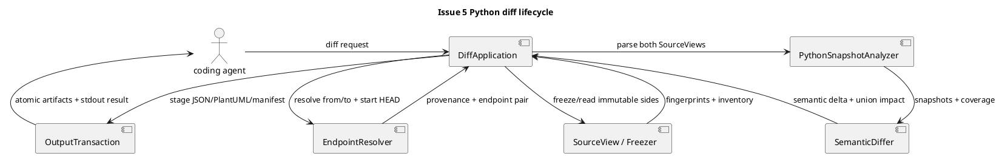

# iss-00005 Compare Python Structure Changes Safely — 設計

詳細: [Design Guide](../../../../../../docs/authoring/design.md)

## 1. 設計判断

この文書は実装開始前の案ではなく、Issue 5 の実装コードと公開契約を対応付ける
as-built 設計である。Issue の状態は SpecDock の完了処理前なので `draft` を維持するが、
下記の path、symbol、データ形状、検証方法は 2026-08-27 時点の実装に一致する。

| ID | 要件 | 採用した設計 |
| --- | --- | --- |
| I02-DES-001 | I02-REQ-001 | `DiffApplication` が endpoint 解決、source 固定、Python 解析、差分、Artifact 公開を 1 run として調整する。 |
| I02-DES-002 | I02-REQ-002 | `ComparisonEndpointResolver` が named endpoint と implicit base を local object だけで解決し、`WorkingTreeFreezer` が開始時の working tree を private staging に固定する。 |
| I02-DES-003 | I02-REQ-003 | `DomainPresenceResolver` と `CanonicalEmptySide` が real、canonical empty、analysis failed を区別する。 |
| I02-DES-004 | I02-REQ-004 | `FileChangeSet`、semantic delta、impact、matching、side provenance を JSON の別フィールドとして公開する。 |
| I02-DES-005 | I02-REQ-005 | changed-path gate は domain 解析前、entity gate は renderer 前に実行し、run fatal と domain incomplete を分離する。 |
| I02-DES-006 | I02-REQ-006 | Git command allowlist、固定環境、静的 AST 解析、bounded subprocess、canonical JSON、atomic publication を採用する。 |
| I02-DES-007 | I02-REQ-007 | Hunk は status、path、行範囲、ordinal、content-independent ID だけを持つ value object とする。working-tree では凍結済み bytes の `SequenceMatcher` から範囲を作る。 |
| I02-DES-008 | I02-REQ-008 | `--stdout` は closed selector を acquisition 前に検証し、公開済み bytes の複製または typed unavailable result を返す。 |
| I02-DES-009 | I02-REQ-009 | `GitPathIdentity` が raw UTF-8 spelling と NFC canonical pathを併記し、canonical collision、duplicate inventory、skip-worktree欠落をfail-closedで処理する。 |
| I02-DES-010 | I02-REQ-010 | `GitlinkWorktreeState` がmode `160000` pathごとにnested HEAD、tracked/staged dirty、untracked dirtyをread-only観測し、親側FileChangeSetへ一件の `M` として投影する。 |
| I02-DES-011 | I02-REQ-011 | `BaseCandidateObservation` がimplicit base候補のordinal/origin/reference/object/merge-base/dispositionを保持し、`ComparisonEndpoints` がselected候補と配列の整合性を検証する。 |

## 2. 実装コンポーネント

| path / symbol | 責務 | 状態 |
| --- | --- | --- |
| `src/code_structure_viz/application/diff.py::DiffApplication` | 1 run の orchestration、gate、publication、cancellation | 実装済み |
| `src/code_structure_viz/source/git_repository.py::GitRepositoryReader` | Git version/root/ref/tree/blob/name-status 読み取り、raw path identity、index stage/skip-worktree、untracked/unmerged、gitlink state 列挙。固定環境で read-only 実行 | 実装済み |
| `src/code_structure_viz/source/endpoints.py::ComparisonEndpointResolver` | `from`/`to`、`head`、`working-tree`、implicit base、start HEAD anchor、候補評価 provenance の解決 | 実装済み |
| `src/code_structure_viz/source/freezer.py::WorkingTreeFreezer` | working-tree source を repository 外 staging へ凍結し、再読取時に drift を検出 | 実装済み |
| `src/code_structure_viz/source/source_view.py::SourceViewBuilder` / `SourceView` | secure file read、raw/NFC path identity collision、skip-worktree sparse state、gitlink state、fingerprint、inventory | 実装済み |
| `src/code_structure_viz/source/file_changes.py::FileChangeSet` / `HunkMetadata` | Git metadata と frozen bytes からの metadata-only file change evidence。duplicate canonical map、sparse、gitlinkを安全に分類 | 実装済み |
| `src/code_structure_viz/semantic/diff.py::DomainPresenceResolver` / `SemanticDiffer` / `ImpactExplorer` | side 分類、canonical empty、entity/member/relation delta、union impact | 実装済み |
| `src/code_structure_viz/adapters/python/matcher.py::PythonMoveMatcher` | name evidence、exact structural fingerprint、one-to-one の高信頼 move だけを採用 | 実装済み |
| `src/code_structure_viz/adapters/python/diff_renderer.py` | semantic diff JSON と member-level PlantUML の deterministic rendering | 実装済み |
| `src/code_structure_viz/artifacts/manifest.py::DiffManifestBuilder` | diff provenance、budget、side、Artifact descriptor を `run-manifest/v1` へ組み立てる | 実装済み |

`pyclassuml`、`tree-git-diff`、SQLAlchemy、Next.js、HTML/Tailscale はこの Issue の実行時依存に
含めない。既存 snapshot CLI の path と contract は維持し、diff の新規コードから既存外部 CLI を
import しない。

## 3. CLI と endpoint

```text
code-structure-viz diff --repo PATH --domain python --output-dir PATH
  [--from REF] [--to REF] [--pr-target REF]
  [--format semantic-json|plantuml] [--stdout SELECTOR]
  [--upstream-depth N] [--downstream-depth N]
  [--max-changed-paths N] [--max-entities N] [--config PATH]
```

`--repo`、`--domain python`、`--output-dir` は必須。format 省略時は semantic JSON と PlantUML の
順に生成する。`--from working-tree`、不正な ref、重複 option、未選択 format/domain は
source acquisition 前の usage error（exit 2、stdout 空、Artifact なし）である。

| `from` | `to` | before | after | resolution method |
| --- | --- | --- | --- | --- |
| なし | なし | start HEAD に対する implicit base | start 時 frozen working tree | `implicit-base-from-start-head-anchor` |
| REF | なし | REF | start 時 frozen working tree | `explicit-from-to-working-tree` |
| なし | `working-tree` | start HEAD に対する implicit base | start 時 frozen working tree | `implicit-base-from-start-head-anchor` |
| なし | `REF`/`head` | endpoint anchor に対する implicit base | REF または start HEAD | `implicit-base-from-endpoint-anchor` |
| REF | REF/`head` | REF | REF または start HEAD | `explicit-from-to` |

implicit candidate は `--pr-target`、config の target/upstream、`origin/HEAD`、local
`main`/`develop`/`master` の順で、既存 local object に merge-base があるものだけを採用する。
評価した候補は `BaseCandidateObservation` として順序を保持し、候補のorigin、requested reference、
resolved object、merge-base、`selected`/`no-merge-base`/`unresolved`/`not-evaluated` dispositionを
`comparison.candidate_observations`へ出力する。明示endpointでは空配列、implicitではselectedを一件だけ
含む。fetch、checkout、worktree/index/ref mutation は行わない。

## 4. source acquisition と cancellation

1. run 開始に Git version、repository identity、HEAD、tracked/cached/untracked path、unmerged path、index stage/mode/object/skip-worktree、gitlink nested state を取得する。
2. commit side は `ls-tree` を一度列挙し、blob bytes を一度だけ読み、`SourceView` を構築する。missing object は domain empty に変換せず fatal とし、candidate `.py` の non-blob または working-tree の non-regular/read failure は `CSV-PY-001` の failed source として記録する。
3. working-tree side は `WorkingTreeFreezer` が secure descriptor read と symlink/path/collision checks を行い、repository 外の staging へコピーする。source bytes と inventory を同じ run の証拠にする。
4. 解析中・公開直前に cancellation checkpoint を置く。Git 子プロセスは process group として bounded stdout/stderr で監視し、cancel 時は terminate/kill して exit 130 を返す。
5. working-tree 公開直前に HEAD、path enumeration、index flags、untracked、unmerged、gitlink nested state、source inventory/fingerprint を再取得して開始時と比較する。不一致は `CSV-SOURCE-001` の fatal とし、staging を公開しない。

`SourceView` の公開 fingerprint は source schema、head、file descriptor、failures の canonical bytes
から作る。working-tree の内部 `SourceInventoryEntry` は path、raw path、kind、size、digest に加えて
tracking state、Git mode/type、object identity、availability、unmerged state、検証済み content を持つ。
追加 metadata は内部 state fingerprint と FileChangeSet 分類だけに使い、public SourceView/manifest、
source body、absolute staging path、Git stderr へ渡さない。inventory の `unavailable`/`other` は path が
存在する証拠として扱い、untracked なら `?` の FileChange として changed-path budget に含める。
取得不能な path を absent または canonical empty side へ変換しない。commit side の blob/object 欠損・
read failure は `GitReadError` をそのまま run fatal にし、working-tree の bounded content evidence の
みが domain-local `payload_unavailable` へ縮退できる。

### 4.1 path identity、sparse checkout、gitlink

GitのNUL-delimited path bytesは各sourceで `GitPathIdentity(raw_text, canonical_path)` に変換する。
`raw_text` はUTF-8 strict decodeした元の綴り、`canonical_path` は安全なrepository-relative NFC pathであり、
内部 sort/mapの前に両方を保持する。複数sourceまたは同一sourceで異なるraw spellingが同じcanonical pathへ
収束した場合、canonical keyの上書きやwinner選択をせず `CSV-DIFF-003` でrun fatalにする。

working-tree と commit の cross-side 比較では、両側の inventory を canonical map または changed-path
budget に渡す前に一つの identity 集合として検証する。同じ raw spelling の再観測は許可するが、片側だけの
NFD/NFC 変更を含む異なる raw spelling は `GitPathIdentityCollisionFatal` に変換し、`DiffApplication` が
`CSV-DIFF-003`・exit 1・Artifact なしで停止する。raw spelling は内部照合だけに使い、public SourceView、
manifest、diagnostic、file-change payloadへ新しい raw field を追加しない。

index stage 0のmode/objectは `git ls-files --stage -z --cached`、skip-worktreeとassume-unchanged flagは
`git ls-files -v -z --cached`からraw identityごとに照合する。skip-worktree pathが作業木に欠落した場合の
inventoryは `materialization_state: "sparse-unavailable"`、`availability: "unavailable"` とし、通常の削除
`D`やGit blobの再構築へ変換しない。skip flagのない欠落tracked pathだけを `absent`/`D` とする。

mode `160000` はsuperprojectのgitlinkとしてsource fileへ展開しない。`GitlinkWorktreeState` は「初期化済み・
HEAD取得済み・binding検証済み」の完全な観測だけを表し、未初期化、欠落、外部/unsafe gitdir pointer、未読
HEADを clean/uninitialized の成功値へ縮退させない。初期観測でその状態になった場合は `CSV-DIFF-003`、
公開直前の再観測でなった場合は `CSV-SOURCE-001` とし、いずれも staging を公開しない。

nested binding は nested path と `.git` の各 component に symlink がなく、`.git` directory または bounded
`gitdir: ` pointer が nested directory か superproject の検証済み `.git` 配下に解決することを確認する。
観測中は `rev-parse`、`ls-tree`、`ls-files` の read-only metadata allowlistだけを、固定環境・明示した
`--git-dir`/`--work-tree` bindingで実行する。`git diff`、`git status`、external diff、textconv、clean/process
filter、hook、任意 helperは実行しない。HEAD tree、index metadata、untracked path、通常ファイルの raw bytes
hashを比較し、HEADがindex objectと異なる、tracked/staged dirty、またはuntracked dirtyなら、親側の同じpathを
一件の `M` としてFileChangeSetへ渡す。nestedの内容、秘密、stderr、binding identityは公開しない。

通常ファイルのraw bytesをGitのworking-tree dirty判定の代替として使用する前に、内部の
`GitlinkComparisonProfile`を構築する。profileはnested repositoryのlocal/worktree configを
`git config --no-includes`、属性を`git check-attr -z --all`、index flagを`git ls-files -v`で取得し、
`config_digest`、`attributes_digest`、`index_flags_digest`、`core.filemode`を含むcanonical digestを持つ。
`GIT_ATTR_NOSYSTEM=1`を固定環境へ追加し、include、外部attributes、`core.autocrlf`/`core.eol`、
`filter.*`/`diff.*`、`ident`、`working-tree-encoding`、未指定でないtext系属性、skip-worktree/
assume-unchanged、未対応mode、`core.symlinks=false`下のsymlinkはraw比較を許可しない。
profileがclosed-world条件を満たさない場合はraw bytesを読まず、初期観測を`CSV-DIFF-003`で停止する。
許可された場合も`core.filemode=false`で無視するのはregular fileの`100644`/`100755`差だけとし、
file typeの変更やsymlinkのtarget変更はdirtyとする。profile digest、tracked raw-content digest、
untracked path集合は公開しない内部state fingerprintへ含め、公開直前の変化は`CSV-SOURCE-001`へ変換する。

### 4.2 implicit candidate provenance

`ComparisonEndpointResolver._resolve_implicit_base` は候補をdeduplicateした評価順のtupleとして保持する。
解決失敗はbuiltin候補なら `unresolved` として記録して次候補へ進み、explicit/config候補のunresolvedは
endpoint fatalとする。merge-baseなしは `no-merge-base`、最初の成功は `selected`、後続候補は
`not-evaluated` とする。`ComparisonEndpoints.__post_init__` がordinal連番、selected一件、selected
reference/merge-baseとの一致を検証し、明示endpointのselected/merge-base混入を拒否する。

## 5. FileChangeSet

commit-to-commit は `git diff --no-ext-diff --no-textconv --no-color --find-renames=50% --find-copies=50% --name-status -z --format= -- <before> <after>` の name/status metadata だけを使う。working-tree は Git の patch を読み直さず、開始時に列挙した inventory と frozen before/after bytes から status（`A/M/D/R/C/T/U/?`）を決める。

通常の content hunk は `SequenceMatcher` の opcode を old/new line range へ変換する。純粋な
`parse_unified_hunks` helper は bounded（payload 16 MiB、line 128 KiB）で、Git quoted path の
UTF-8/C escape/octal を厳格に decode し、対応 path のない hunk や不正 path を成功扱いしない。
production diff lifecycle はこの raw patch helper を呼ばない。

公開 schema `code-structure-viz.file-change-set/v1` は次の形だけを許可する。

```json
{"schema":"code-structure-viz.file-change-set/v1","before":"<sha>","after":"<sha>","files":[{"status":"M","old_path":"src/app.py","new_path":"src/app.py","hunks":[{"old_start":1,"old_line_count":1,"new_start":1,"new_line_count":1,"ordinal":0,"hunk_id":"<sha256>"}]}]}
```

`hunk_id` は status/path/range/ordinal の canonical JSON の SHA-256 であり、patch body、context、
source、comment、literal、secret、absolute path を保持しない。path は repository-relative NFC
UTF-8 のみで、sort は UTF-8 bytes order とする。

index-only stateはhunk本文の代用にしない。skip-worktreeで欠落したregular pathは `sparse-unavailable`
として `unavailable` content evidenceを持ち、`D`やfake hunkを生成しない。通常tracked pathの欠落だけが
`absent`/`D`となる。mode `160000` のgitlinkはnested repositoryの変更を親側の同一path一件の `M` に集約し、
nested pathのFileChangeSetやhunkを生成しない。gitlink stateの安全な再取得が開始時と一致しなければ、
`CSV-SOURCE-001` fatalで公開を停止する。

working-tree classifier は budget より前に次の順で canonical record を確定する。同一 path の tracked→
untracked は `D` と `?`、mode-only は `M`、regular/symlink/gitlink 間は `T`、identity が一意な cross-
path は `R`/`C` 一件とする。候補が複数、identity が欠ける、または source path が同一 path transition
ですでに使用済みなら `A`/`D`/`?` へ安全に戻す。従って `FileChangeSet.count`、changed-path budget、
manifest の actual は同じ canonical record tuple から計算される。hunk projection は budget admission
後に行い、`ContentEvidence(absent|available|unavailable)` のうち available bytes と true absent だけ
を SequenceMatcher に渡す。未知 bytes は empty side にしない。line terminator を保持した bounded range
を生成し、unavailable は hunk を空にするが、status/path record と domain failure evidence は保持する。

## 6. Python semantic diff

各 side は既存 `PythonSnapshotAnalyzer` と `PythonTargetSelector` で immutable `SourceView` bytes
だけを AST 解析する。`SemanticDiffer` は entity、member、relation を closed identity で比較し、
class/decorator/member/relation の delta に加えて changed entity ID も seed にする。空白、comment、
import order だけの変更は seed にならない。

`DomainPresenceResolver.side` の分類は次の通り。

| before | after | status | payload |
| --- | --- | --- | --- |
| absent | absent | `not_applicable` | semantic/PlantUML なし、file-change と safe manifest のみ |
| real | real | `complete` | semantic diff JSON と PlantUML |
| real | absent | `complete` | internal canonical empty side と比較し全 removed |
| absent | real | `complete` | internal canonical empty side と比較し全 added |
| analysis failed を含む | 任意 | `incomplete/payload_unavailable` | affected semantic/PlantUML なし、safe manifest のみ |

working-tree に `U` が含まれる場合もこの行を適用する。`semantic_sides.before` は before source
を通常どおり解析できれば `real`（失敗時だけ `analysis-failed`）、`semantic_sides.after` は
`analysis-failed` とし、解析を行わない after source fingerprint を digest に使う。両 side を
根拠なく `analysis-failed` に固定しない。U 分岐では before selection を一度だけ実行し、その同じ
selection の actual coverage/diagnostics と before side を domain outcome に渡す。after は解析せず、
zero coverage の `analysis-failed` side として保持するため、safe manifest の side、coverage、diagnostic
が一つの observation と矛盾しない。

canonical empty side は sorted key の canonical UTF-8 JSON（domain、document kind、空 entities/
members/relations）から毎回同じ digest を得る。endpoint/side 名や source body は含めず、standalone
Artifact として公開しない。

impact は before/after relation の union graph を使い、deleted entity の before edge も辿る。
upstream/downstream は別 frontier、default depth は各 1、depth 0 でも frontier coverage を記録する。
move は identity change、同名または同じ qualified name、exact structural fingerprint、unique
one-to-one candidate の全条件を満たすときだけ `moved`、それ以外は removed+added とする。

## 7. budget、publication、stream

- changed-path default は 1,000。超過は domain 解析前の run fatal exit 1、diagnostic と run-summary のみ、output directory は作成しない。
- Python entity default は 500。超過は domain `incomplete/payload_unavailable` exit 3、`file-changes.json` と safe `run-manifest.json` だけを公開する。
- side acquisition/static analysis failure、unmerged path、unsafe path、schema/integrity failure は affected payload を推測せず unavailable とする。working-tree の changed Python bytes が unavailable/binary/bounded-input violation の場合は affected payload を公開せず、metadata-only FileChangeSet と safe manifest を exit 3 で公開する。非 Python changed path は取得不能でも偽の hunk を出さない。commit blob/object の欠損・read failureは run fatal exit 1 とする。
- `OutputTransaction` は staging、descriptor/hash check、collision check 後に no-replace atomic rename する。run fatal/usage/interrupt は staging を破棄する。

`--stdout` は `manifest` または `python:semantic-json`/`python:plantuml` の一回だけ。available
Artifact は公開後の exact bytes を複製し、unavailable は `stdout-result/v1`、selector 省略時は
`run-summary/v1` の canonical JSON 1 行を返す。diagnostic は stderr のみで、source/body/secret/
absolute path/Git stderr/traceback を含めない。

`run-manifest/v1` の `comparison.candidate_observations` は常に出力する。explicit `from`/`to` は空配列、
implicit baseは評価順の候補配列（selected候補一件、必要ならno-merge-base/unresolved/not-evaluated）を
出力し、`selected_base_candidate` と `merge_base` はselected observationと同じ値でなければならない。

## 8. 公開契約と検証対象

更新した schema は `schemas/file-change-set-v1.schema.json`、`semantic-v1.schema.json`、
`run-manifest-v1.schema.json`、`diagnostic-v1.schema.json`。diff manifest は comparison、sources、
semantic_sides、file_change_set、changed_path_budget、domain budget、Artifact descriptors を含む。
diff が `payload_unavailable` の場合も run-level `file-changes.json` descriptor は保持し、domain の
semantic/PlantUML artifact paths は空にする。設定済み comparison 候補は `config.resolved.comparison`
へ `target_ref`/`upstream_ref`（未指定側は `null`）として記録し、manifest の diagnostic catalog は
`CSV-DIFF-001`〜`003` を受理する。
snapshot の既存 manifest/schema は同じ JSON serializer と契約を共有するが、snapshot fingerprint と
diff fingerprint はそれぞれの正本入力から独立に計算する。

| 観測領域 | 実装テスト |
| --- | --- |
| endpoint、working-tree、budget、CLI | `tests/acceptance/python/test_diff_cli.py`, `tests/acceptance/git/test_changed_path_budget.py` |
| working-tree status authority、R/C/T、tracked transition、mode、drift、missing object、sparse、gitlink | `tests/acceptance/python/test_diff_cli.py`, `tests/unit/source/test_file_changes.py`, `tests/unit/source/test_git_repository.py` |
| raw Git path identity、NFC collision、implicit candidate provenance | `tests/acceptance/python/test_diff_cli.py`, `tests/contracts/test_json_schemas.py`, `tests/unit/source/test_git_repository.py`, `tests/unit/source/test_source_view.py` |
| all-path hunk evidence、non-Python、LF/CRLF、unavailable | `tests/acceptance/python/test_diff_cli.py`, `tests/unit/source/test_file_changes.py` |
| domain presence、entity budget、stdout | `tests/acceptance/python/test_domain_presence_diff.py`, `test_diff_entity_budget.py`, `test_stdout_selector.py` |
| semantic seed、impact、move | `tests/acceptance/python/test_semantic_seed.py`, `tests/integration/python/test_impact_union_graph.py`, `test_move_matching.py` |
| Git/source safety、cancellation | `tests/unit/source/test_git_repository.py`, `test_source_view.py`, `tests/integration/source/test_git_repository.py`, `tests/security/test_git_read_only.py` |
| hunk redaction/protocol、schema | `tests/unit/source/test_file_changes.py`, `tests/security/test_file_change_hunk_redaction.py`, `tests/contracts/test_json_schemas.py` |

受入れの正本は test の実ファイル名と実行結果であり、未作成の仮想 test path を契約に記載しない。
HTML report、Tailscale/GitHub Pages 配信、SQLAlchemy/Next adapter、legacy CLI compatibility は後続
Issue の責務で、この Issue の成功条件には含めない。


