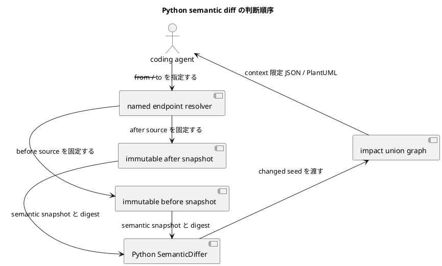

# iss-00005 Compare Python Structure Changes Safely — 設計

詳細: [Design Guide](../../../../../../docs/authoring/design.md)

## 設計目標

- `python` domain の `diff` を、CLI から source acquisition、analysis、versioned JSON、PlantUML、manifest、diagnostic まで一つの vertical pipeline として設計する。
- accepted ADR の独立 product ownership、named endpoint、dual snapshot、adapter boundary、agent-first Artifact、安全な static analysis、product HTML exclusion、vertical slicing を破らない。
- common abstraction は lifecycle、diagnostic、Artifact descriptor、graph primitive に限定し、domain-specific identity/member/relation/matching を adapter が所有する。

| Design ID | Requirement trace | 判断 |
| --- | --- | --- |
| I02-DES-001 | I02-REQ-001 | CLI/application boundary と domain port を分離し、observable outcome を一 run transaction にまとめる。 |
| I02-DES-002 | I02-REQ-002 | source acquisition は immutable SourceView と provenance を返し、parser が repository state を直接読まない。 |
| I02-DES-003 | I02-REQ-003 | domain-owned identity/member/relation model を common envelope から分離する。 |
| I02-DES-004 | I02-REQ-004 | ArtifactPublisher が JSON/PlantUML/manifest の staging、collision check、SHA-256、atomic publication を所有する。 |
| I02-DES-005 | I02-REQ-005 | typed diagnostic と complete/not_applicable/incomplete state machine で failure を空結果へ潰さない。 |
| I02-DES-006 | I02-REQ-006 | security invariant と budget を adapter entry/exit で検証し、unsafe result を公開しない。 |

## Current / Target

### Current（verified baseline）

- exact commit `7951ddabc2e6a3d66edb77eada7c6c16923264f7` は SpecDock 0.2.3、template 状態の canonical R/D/P、interview、8 accepted ADR を含む。
- CodeStructureViz の production package、CLI、domain adapter、semantic schema、acceptance fixtures は存在しない。
- `pyclassuml` と `tree-git-diff` は legacy evidence であり、CodeStructureViz の dependency ではない。

### Target

- coding agent が named endpoint で before/after Python semantic snapshot を安全に固定し、意味のある class/member/relation change と影響 context だけを比較できる。
- source/body/secret を漏らさず、failure と coverage を manifest で agent が機械判定できる。
- downstream Issue はこの Design の stable interface だけへ依存し、内部 class layout を fork しない。

## 責務・Interface

### planned component responsibilities

| planned path / symbol | 状態 | 責務 |
| --- | --- | --- |
| src/code_structure_viz/source/endpoints.py::ComparisonEndpointResolver（planned） | planned | この Issue の implementation target。baseline commit には未実装。 |
| src/code_structure_viz/source/freezer.py::WorkingTreeFreezer（planned） | planned | この Issue の implementation target。baseline commit には未実装。 |
| src/code_structure_viz/source/git_repository.py::ReadOnlyGitRepository（planned） | planned | この Issue の implementation target。baseline commit には未実装。 |
| src/code_structure_viz/source/file_changes.py::FileChangeSet（planned） | planned | この Issue の implementation target。baseline commit には未実装。 |
| src/code_structure_viz/semantic/diff.py::SemanticDiffer（planned） | planned | この Issue の implementation target。baseline commit には未実装。 |
| src/code_structure_viz/semantic/impact.py::ImpactExplorer（planned） | planned | この Issue の implementation target。baseline commit には未実装。 |
| src/code_structure_viz/adapters/python/matcher.py::PythonMoveMatcher（planned） | planned | この Issue の implementation target。baseline commit には未実装。 |
| src/code_structure_viz/adapters/python/diff_renderer.py（planned） | planned | この Issue の implementation target。baseline commit には未実装。 |

### common command interface

```text
code-structure-viz snapshot --repo PATH --output-dir PATH [--domain DOMAIN] [--target SELECTOR] [--format FORMAT] [--config PATH]
code-structure-viz diff --repo PATH --output-dir PATH [--domain DOMAIN] [--from ENDPOINT] [--to ENDPOINT] [--format FORMAT] [--config PATH]
```

- `--output-dir` は必須。writer は existing file を置換せず、全 payload を staging 後に公開する。
- `--format` 未指定は semantic JSON と PlantUML。`--stdout` は output directory requirement を解除しない。
- analysis behavior を environment variable で変更しない。環境は executable discovery と locale-independent process setup にだけ使う。

### source interface

```json
{
  "contract": "code-structure-viz.source-view/v1",
  "endpoint": {"kind": "commit-or-frozen-working-tree", "digest": "sha256"},
  "files": [{"path": "repository/relative", "sha256": "digest", "media_type": "text/plain"}],
  "fingerprint": "safe-run-fingerprint",
  "diagnostics": []
}
```

SourceView は immutable value object であり、absolute temporary path を serializer へ渡さない。

### domain adapter interface

```text
analyze_snapshot(SourceView, ResolvedConfig, TargetSelection) -> DomainSnapshotResult
compare_snapshots(DomainSnapshot, DomainSnapshot, DiffPolicy) -> DomainDiffResult
render_semantic_json(DomainResult) -> bytes
render_plantuml(DomainResult, VisualVocabulary) -> bytes
```

この Issue が未使用の method は実装を強制しない。後続 slice が stable contract を additive に拡張する。

## data / failure

### semantic envelope

- `schema`: `code-structure-viz.semantic/v1`
- `document_kind`: `snapshot` または `diff`
- `domain`: `python`
- `status`: `complete`、`not_applicable`、`incomplete`
- `entities`、`members`、`relations`: domain-owned payload
- `coverage`: selected/discovered/analyzed/skipped/unknown counts と frontier
- `diagnostics`: stable code、severity、scope、recoverability、safe location
- `provenance`: tool/contract/adapter version、endpoint digest、resolved config digest

### visual vocabulary

| 意味 | 色 | 記号/線 |
| --- | --- | --- |
| added | green | `+` |
| removed | red | `-` と dashed |
| modified | yellow | `~` |
| moved | blue | `→` |
| unknown | gray | `?` |

色は補助であり、dark mode でも legend、記号、線種、text label を維持する。

### state and failure taxonomy

```text
requested -> preflight -> source_acquired -> analyzed -> rendered -> staged -> verified -> published
                 |              |              |           |          |
                 +-> usage/fatal+-> incomplete +-> incomplete+-> fatal+-> fatal
```

- usage/config: invalid option、unknown config key、type error。exit 2。
- core fatal: invalid repository、endpoint unresolved、fingerprint drift、output collision、minimum runtime 不足。exit 1。
- domain incomplete: target があるが parse/protocol/semantic coverage を安全に完了できない。exit 3。
- interrupt: staging を cleanup、exit 130。

- endpoint unresolved、missing Git object、fingerprint drift、implicit path budget 超過では semantic success Artifact を公開せず nonzero とする。
- 一部 Python source の安全な解析が不可能でも unaffected snapshot/diff が成立する場合は incomplete、成功 Artifact と diagnostic を保持し exit 3 とする。
- moved 候補が複数ある場合は unknown moved を捏造せず removed+added と matching diagnostic を返す。

## 変更対象

| planned file | planned change | 存在確認 |
| --- | --- | --- |
| src/code_structure_viz/source/endpoints.py::ComparisonEndpointResolver（planned） | planned | この Issue の implementation target。baseline commit には未実装。 |
| src/code_structure_viz/source/freezer.py::WorkingTreeFreezer（planned） | planned | この Issue の implementation target。baseline commit には未実装。 |
| src/code_structure_viz/source/git_repository.py::ReadOnlyGitRepository（planned） | planned | この Issue の implementation target。baseline commit には未実装。 |
| src/code_structure_viz/source/file_changes.py::FileChangeSet（planned） | planned | この Issue の implementation target。baseline commit には未実装。 |
| src/code_structure_viz/semantic/diff.py::SemanticDiffer（planned） | planned | この Issue の implementation target。baseline commit には未実装。 |
| src/code_structure_viz/semantic/impact.py::ImpactExplorer（planned） | planned | この Issue の implementation target。baseline commit には未実装。 |
| src/code_structure_viz/adapters/python/matcher.py::PythonMoveMatcher（planned） | planned | この Issue の implementation target。baseline commit には未実装。 |
| src/code_structure_viz/adapters/python/diff_renderer.py（planned） | planned | この Issue の implementation target。baseline commit には未実装。 |

追加で planned:

- tests/fixtures/compare-python-structure-changes-safely/ に source-only fixture を置き、fixture の application code を実行しない。
- docs/contracts/ に schema と CLI behavior を配置する。ただし本 package は repository へ直接変更を行わない。
- lockfile と license inventory を同じ Issue の acceptance に含める。

変更しない領域:

- SQLAlchemy row semantics と Next component semantics
- auto fetch、checkout、worktree/index/refs の変更
- Git R/C を semantic moved と同一視すること
- legacy pyclassuml/tree-git-diff CLI compatibility

## 移行・互換性・rollback

- baseline に production implementation がないため in-place data migration は N/A。
- public schema/CLI は `/v1` と preview release で開始し、同一 major 内は field の additive extension を原則とする。
- persistent migration は N/A。fingerprint や endpoint contract に不具合があれば release を停止して Issue 全体を revert する。公開済み schema は旧 snapshot digest を読める additive correction または schema version up で forward recovery する。
- legacy CLI compatibility layer は作らない。legacy evidence の algorithm/test idea を採用するときは provenance note、license decision、CodeStructureViz-owned regression test を同じ change に含める。

## testability

| Test ID | 分類 | planned test file | command |
| --- | --- | --- | --- |
| I02-AT-001 | normal | tests/acceptance/python/test_diff_cli.py | uv run pytest tests/acceptance/python/test_diff_cli.py -q |
| I02-AT-002 | boundary | tests/integration/python/test_impact_union_graph.py | uv run pytest tests/integration/python/test_impact_union_graph.py -q |
| I02-AT-003 | negative | tests/acceptance/git/test_diff_fail_closed.py | uv run pytest tests/acceptance/git/test_diff_fail_closed.py -q |
| I02-AT-004 | security | tests/security/test_git_read_only.py | uv run pytest tests/security/test_git_read_only.py -q |
| I02-AT-005 | semantic | tests/acceptance/python/test_semantic_seed.py | uv run pytest tests/acceptance/python/test_semantic_seed.py -q |
| I02-AT-006 | matching | tests/integration/python/test_move_matching.py | uv run pytest tests/integration/python/test_move_matching.py -q |
| I02-AT-007 | budget | tests/acceptance/git/test_changed_path_budget.py | uv run pytest tests/acceptance/git/test_changed_path_budget.py -q |

- unit test は domain parser/matcher/serializer の pure function を対象にする。
- integration test は temporary Git repository と immutable fixture source を使い、Git state の before/after fingerprint を比較する。
- acceptance test は実際の CLI process、output directory、manifest/checksum、exit code、stdout/stderr を観測する。
- security test は import/build/plugin/DB execution trap、secret literal、absolute path、unsafe symlink、Git mutation allowlist を検査する。

## risk

- working tree が解析中に変わる race。外部 freeze、二重 fingerprint、final publication 前 gate で成功の誤認を防ぐ。
- hunk overlap に依存すると semantic false positive が生じる。hunk は候補選択だけに使い、dual snapshot の domain diff を正本とする。
- move matching の誤結合は removed+added より有害。全条件 conjunction と unique candidate を必須にする。

- Re-evaluation trigger: security/privacy incident、target repository の不可逆変更、secret leak、rollback に incident response が必要な設計へ変わる場合は Planning Level を `critical` に上げる。
- Stop condition: before/after snapshot の独立再生成、endpoint/fingerprint provenance、semantic seed、impact union、failure matrix が acceptance test で固定されるまで SQLAlchemy/Next diff の共通化へ進まない。



Git status や hunk を seed の正本にせず、二つの immutable semantic snapshot から差分と影響範囲を決めます。
