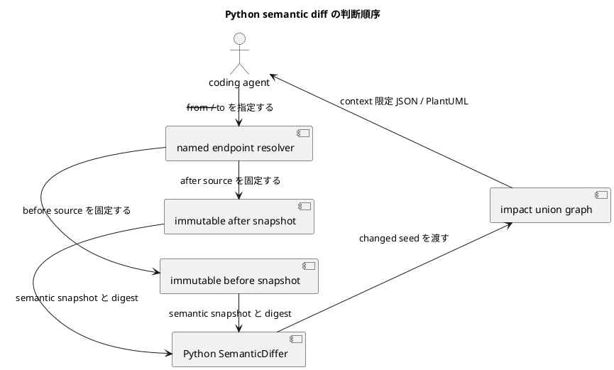

# iss-00005 Compare Python Structure Changes Safely — 設計

詳細: [Design Guide](../../../../../../docs/authoring/design.md)

## 設計目標

- `python` domain の `diff` を、CLI から source acquisition、analysis、versioned JSON、PlantUML、manifest、diagnostic まで一つの vertical pipeline として設計する。
- accepted ADR の独立 product ownership、named endpoint、dual snapshot、adapter boundary、agent-first Artifact、安全な static analysis、product HTML exclusion、vertical slicing を破らない。
- common abstraction は lifecycle、diagnostic、Artifact descriptor、graph primitive に限定し、domain-specific identity/member/relation/matching を adapter が所有する。

| Design ID | Requirement trace | 判断 |
| --- | --- | --- |
| I02-DES-001 | I02-REQ-001 | Comparison application serviceがendpoint/source/domain/outputをone observable runとして調整する。 |
| I02-DES-002 | I02-REQ-002 | ComparisonEndpointResolverとWorkingTreeFreezerがstart HEAD anchorを含むimmutable side provenanceを生成する。 |
| I02-DES-003 | I02-REQ-003 | DomainPresenceResolverがreal snapshot、canonical empty-side、not_applicable、analysis failureを混同せずside pairを構成する。 |
| I02-DES-004 | I02-REQ-004 | Python diff serializerがside descriptors、metadata-only FileChangeSet、SemanticChangeSet、impact、matchingを別fieldで出力する。 |
| I02-DES-005 | I02-REQ-005 | run-level changed-path admissionとdomain-local entity gateを別state transitionとしてexit/publicationへ写像する。 |
| I02-DES-006 | I02-REQ-006 | read-only Git allowlist、static execution trap、redaction、canonical ordering、fingerprint/atomicityを検証する。 |
| I02-DES-007 | I02-REQ-007 | HunkMetadataをrange/status/ordinal/content-independent IDだけのvalue objectにし、raw patch bodyの型とserializer経路を設けない。 |

## Current / Target

### Current（verified baseline）

- exact verified current commit `867ee6929283dfc84711bce245b784d2b8e3e9e6` は本Issueのcanonical Requirement/Design/Plan、accepted ADR、interviewを含む。
- production package、CLI、domain adapter、schema implementation、acceptance fixturesは未実装であり、以下のpath/symbolはすべてplannedである。
- 本Designは親の横断contractをslice固有の構造へ具体化し、依存Issueのpublic contractを変更せずに後続sliceへ渡す。

### Target

- coding agent が named endpoint で before/after Python semantic snapshot を安全に固定し、意味のある class/member/relation change と影響 context だけを比較できる。
- source/body/secret を漏らさず、failure と coverage を manifest で agent が機械判定できる。
- downstream Issue はこの Design の stable interface だけへ依存し、内部 class layout を fork しない。

## 責務・Interface

### planned component responsibilities

| planned path / symbol | 状態 | 責務 |
| --- | --- | --- |
| src/code_structure_viz/source/endpoints.py::ComparisonEndpointResolver（planned） | planned | この Issue の implementation target。baseline commit には未実装。 |
| src/code_structure_viz/source/freezer.py::WorkingTreeFreezer（planned） | planned | この Issue の implementation target。baseline commit には未実装。 |
| src/code_structure_viz/source/git_repository.py::ReadOnlyGitRepository（planned） | planned | この Issue の implementation target。baseline commit には未実装。 |
| src/code_structure_viz/source/file_changes.py::FileChangeSet（planned） | planned | この Issue の implementation target。baseline commit には未実装。 |
| src/code_structure_viz/semantic/diff.py::SemanticDiffer（planned） | planned | この Issue の implementation target。baseline commit には未実装。 |
| src/code_structure_viz/semantic/impact.py::ImpactExplorer（planned） | planned | この Issue の implementation target。baseline commit には未実装。 |
| src/code_structure_viz/adapters/python/matcher.py::PythonMoveMatcher（planned） | planned | この Issue の implementation target。baseline commit には未実装。 |
| src/code_structure_viz/adapters/python/diff_renderer.py（planned） | planned | この Issue の implementation target。baseline commit には未実装。 |

### common command interface

```text
code-structure-viz snapshot --repo PATH --output-dir PATH [--domain DOMAIN] [--target SELECTOR] [--format FORMAT] [--config PATH]
code-structure-viz diff --repo PATH --output-dir PATH [--domain DOMAIN] [--from ENDPOINT] [--to ENDPOINT] [--format FORMAT] [--config PATH]
```

- `--output-dir` は必須。writer は existing file を置換せず、全 payload を staging 後に公開する。
- `--format` 未指定は semantic JSON と PlantUML。`--stdout` は output directory requirement を解除しない。
- analysis behavior を environment variable で変更しない。環境は executable discovery と locale-independent process setup にだけ使う。

### source interface

```json
{
  "contract": "code-structure-viz.source-view/v1",
  "endpoint": {"kind": "commit-or-frozen-working-tree", "digest": "sha256"},
  "files": [{"path": "repository/relative", "sha256": "digest", "media_type": "text/plain"}],
  "fingerprint": "safe-run-fingerprint",
  "diagnostics": []
}
```

SourceView は immutable value object であり、absolute temporary path を serializer へ渡さない。

### domain adapter interface

```text
analyze_snapshot(SourceView, ResolvedConfig, TargetSelection) -> DomainSnapshotResult
compare_snapshots(DomainSnapshot, DomainSnapshot, DiffPolicy) -> DomainDiffResult
render_semantic_json(DomainResult) -> bytes
render_plantuml(DomainResult, VisualVocabulary) -> bytes
```

この Issue が未使用の method は実装を強制しない。後続 slice が stable contract を additive に拡張する。

## data / failure

### endpoint and side provenance

`ComparisonEndpointResolver`（planned）はrequested `from`/`to`、resolved commit、start HEAD、base candidate、merge-base、resolution methodを返す。`--to working-tree`だけの場合、`WorkingTreeFreezer`がrun開始時working treeをfreezeし、同時点の`HEAD^{commit}`をmerge-base anchorにする。SourceViewはfrozen digestだけを公開しtemporary absolute pathを漏らさない。

### domain presence and canonical empty-side

`DomainPresenceResolver`（planned）は各sideを`real`、`canonical-empty-side`、`analysis-failed`に分類する。canonical empty-sideは`code-structure-viz.empty-side/v1`のdomain別canonical JSONで、empty arraysとversioned identityを持ちSHA-256を計算する。endpoint/side名をbytesへ含めずstandalone Artifactとしてpublishしない。

| side classification | DomainDiffResult |
| --- | --- |
| absent / absent | `not_applicable`; payloadなし |
| real / real | `complete`; normal semantic diff |
| real / canonical-empty | `complete`; all removed |
| canonical-empty / real | `complete`; all added |
| analysis-failedを含む | `incomplete`; added/removedを生成せずaffected payloadなし |

### metadata-only FileChangeSet

```json
{
  "status": "A|M|D|R|C|T|U|?",
  "old_path": "repository/relative-or-null",
  "new_path": "repository/relative-or-null",
  "hunks": [{
    "old_start": 1,
    "old_line_count": 2,
    "new_start": 1,
    "new_line_count": 3,
    "ordinal": 0,
    "hunk_id": "sha256-of-canonical-metadata"
  }]
}
```

`hunk_id`はpath/status/ranges/ordinalだけから生成する。Git diff parserはline rangesを抽出後にpatch bodyを破棄し、raw/context/added/deleted linesをmodel、log、diagnostic、Artifactへ渡さない。

### budget and publication state machine

- `ChangedPathAdmissionGate`（planned）はdomain comparison前にimplicit actual countをdefault 1,000と比較する。超過はrun fatal exit 1、diagnostic only、semantic/PlantUML/final manifestなし。valid overrideはmanifestへrequested/resolved/countを記録する。
- `EntityBudgetGate`（planned）はPython diff entity countをrender前にdefault 500と比較する。超過はdomain incomplete exit 3、affected JSON/PlantUMLなし、safe manifestあり。valid overrideは通常公開。
- invalid overrideはusage/config exit 2。OutputTransactionはrun fatalでstaging全体を破棄し、domain incompleteではsafe manifestだけをpublishする。

### semantic diff and failure

semantic seedはmember/relation deltaだけ。impact graphはbefore/after unionで、deleted entityはbefore edgeを使う。matching ambiguityはremoved+added。source acquisition/static analysis failureはempty-sideへ変換しない。

## 変更対象

| planned file | planned change | 存在確認 |
| --- | --- | --- |
| src/code_structure_viz/source/endpoints.py::ComparisonEndpointResolver（planned） | planned | この Issue の implementation target。baseline commit には未実装。 |
| src/code_structure_viz/source/freezer.py::WorkingTreeFreezer（planned） | planned | この Issue の implementation target。baseline commit には未実装。 |
| src/code_structure_viz/source/git_repository.py::ReadOnlyGitRepository（planned） | planned | この Issue の implementation target。baseline commit には未実装。 |
| src/code_structure_viz/source/file_changes.py::FileChangeSet（planned） | planned | この Issue の implementation target。baseline commit には未実装。 |
| src/code_structure_viz/semantic/diff.py::SemanticDiffer（planned） | planned | この Issue の implementation target。baseline commit には未実装。 |
| src/code_structure_viz/semantic/impact.py::ImpactExplorer（planned） | planned | この Issue の implementation target。baseline commit には未実装。 |
| src/code_structure_viz/adapters/python/matcher.py::PythonMoveMatcher（planned） | planned | この Issue の implementation target。baseline commit には未実装。 |
| src/code_structure_viz/adapters/python/diff_renderer.py（planned） | planned | この Issue の implementation target。baseline commit には未実装。 |

追加で planned:

- tests/fixtures/compare-python-structure-changes-safely/ に source-only fixture を置き、fixture の application code を実行しない。
- docs/contracts/ に schema と CLI behavior を配置する。これらはplanned implementation targetであり、本Designは実装済みとは扱わない。
- lockfile と license inventory を同じ Issue の acceptance に含める。

変更しない領域:

- SQLAlchemy row semantics と Next component semantics
- auto fetch、checkout、worktree/index/refs の変更
- Git R/C を semantic moved と同一視すること
- legacy pyclassuml/tree-git-diff CLI compatibility

## 移行・互換性・rollback

- baseline に production implementation がないため in-place data migration は N/A。
- public schema/CLI は `/v1` と preview release で開始し、同一 major 内は field の additive extension を原則とする。
- persistent migration は N/A。fingerprint や endpoint contract に不具合があれば release を停止して Issue 全体を revert する。公開済み schema は旧 snapshot digest を読める additive correction または schema version up で forward recovery する。
- legacy CLI compatibility layer は作らない。legacy evidence の algorithm/test idea を採用するときは provenance note、license decision、CodeStructureViz-owned regression test を同じ change に含める。

## testability

| Test ID | 分類 | planned test file | command |
| --- | --- | --- | --- |
| I02-AT-001 | endpoint matrix | tests/acceptance/python/test_diff_cli.py | uv run pytest tests/acceptance/python/test_diff_cli.py -q |
| I02-AT-002 | impact boundary | tests/integration/python/test_impact_union_graph.py | uv run pytest tests/integration/python/test_impact_union_graph.py -q |
| I02-AT-003 | fail closed | tests/acceptance/git/test_diff_fail_closed.py | uv run pytest tests/acceptance/git/test_diff_fail_closed.py -q |
| I02-AT-004 | Git safety | tests/security/test_git_read_only.py | uv run pytest tests/security/test_git_read_only.py -q |
| I02-AT-005 | semantic seed | tests/acceptance/python/test_semantic_seed.py | uv run pytest tests/acceptance/python/test_semantic_seed.py -q |
| I02-AT-006 | matching | tests/integration/python/test_move_matching.py | uv run pytest tests/integration/python/test_move_matching.py -q |
| I02-AT-007 | changed-path budget | tests/acceptance/git/test_changed_path_budget.py | uv run pytest tests/acceptance/git/test_changed_path_budget.py -q |
| I02-AT-008 | domain presence | tests/acceptance/python/test_domain_presence_diff.py | uv run pytest tests/acceptance/python/test_domain_presence_diff.py -q |
| I02-AT-009 | hunk redaction | tests/security/test_file_change_hunk_redaction.py | uv run pytest tests/security/test_file_change_hunk_redaction.py -q |
| I02-AT-010 | entity budget | tests/acceptance/python/test_diff_entity_budget.py | uv run pytest tests/acceptance/python/test_diff_entity_budget.py -q |

- unit testはdomain parser/matcher/serializerとcanonicalizationのpure functionを対象にする。
- integration testはtemporary Git repositoryまたはimmutable source fixtureを使い、Git stateとsource bytesのbefore/afterを比較する。
- acceptance testは実CLI process、output directory、manifest/checksum、exit code、stdout/stderr、published file setを観測する。
- security testはimport/build/plugin/DB execution trap、source/secret/literal/absolute path/raw hunkのnegative scan、unsafe symlink、Git mutation allowlistを検査する。
- table-driven casesはstatusだけでなくpublication、manifest presence/absence、digest、requested/resolved budget values、actual countsまでassertする。

## risk

- working tree が解析中に変わる race。外部 freeze、二重 fingerprint、final publication 前 gate で成功の誤認を防ぐ。
- hunk overlap に依存すると semantic false positive が生じる。hunk は候補選択だけに使い、dual snapshot の domain diff を正本とする。
- move matching の誤結合は removed+added より有害。全条件 conjunction と unique candidate を必須にする。

- Re-evaluation trigger: security/privacy incident、target repository の不可逆変更、secret leak、rollback に incident response が必要な設計へ変わる場合は Planning Level を `critical` に上げる。
- Stop condition: before/after snapshot の独立再生成、endpoint/fingerprint provenance、semantic seed、impact union、failure matrix が acceptance test で固定されるまで SQLAlchemy/Next diff の共通化へ進まない。



Git status や hunk を seed の正本にせず、二つの immutable semantic snapshot から差分と影響範囲を決めます。
