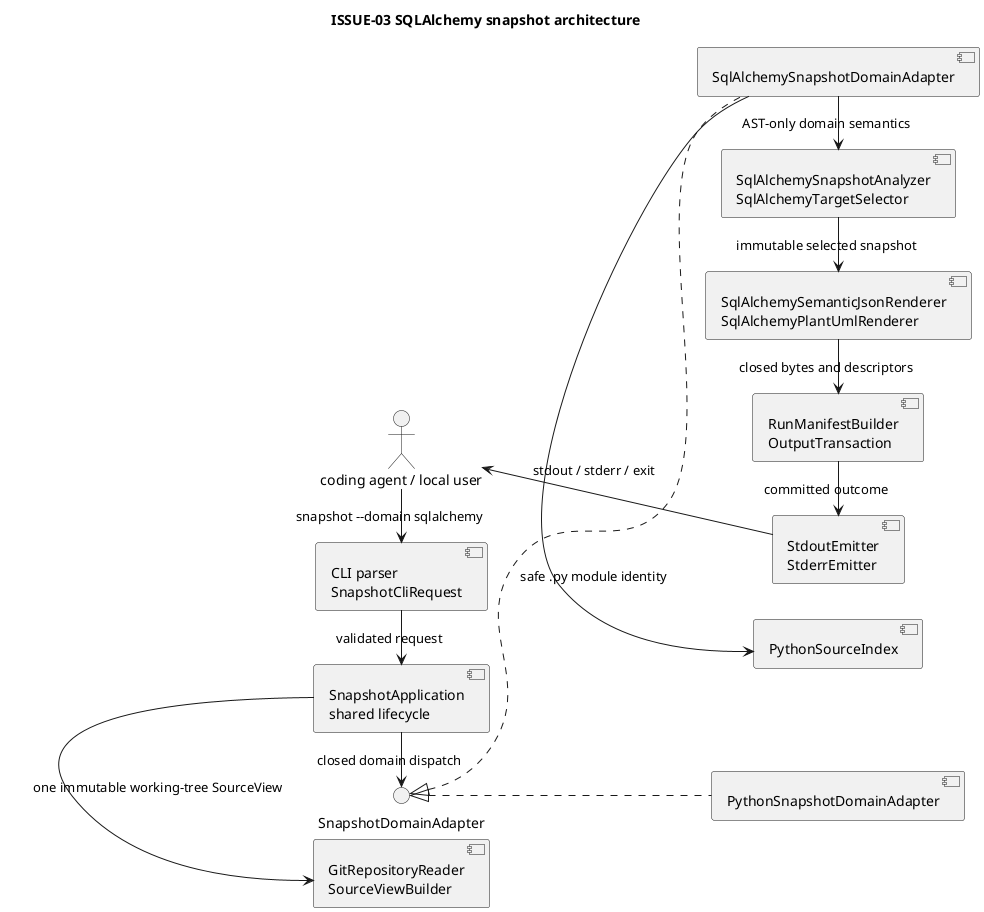

# iss-00006 Generate SQLAlchemy ER Snapshots — 設計

詳細: [Design Guide](../../../../../../docs/authoring/design.md)

## 設計目標

- hardened済みのPython snapshot source/publication lifecycleを複製せず、SQLAlchemy domain adapterをclosed dispatchでadditiveに接続する。
- SQLAlchemy packageやtarget moduleをimportせず、frozen `.py` sourceのPython 3.12 ASTとstatic binding graphだけからER snapshotを構成する。
- table/row/relation identity、applicability、target selection、redaction、PlantUMLをSQLAlchemy adapter内へ閉じ、common coreをgeneric ORM modelへ肥大させない。
- Python snapshot/diffのpublic bytes、Git safety、atomic no-replace writer、stdout/exit contractを回帰で固定する。
- Luna Max coderがpath、symbol、field、sort、failure mapping、test commandを補完しなくてよい実装境界を定める。

| Design ID | Requirement trace | 設計判断 |
| --- | --- | --- |
| I03-DES-001 | I03-REQ-001, 009 | existing `SnapshotApplication`へclosed `SnapshotDomainAdapter` portを追加し、Python/SQLAlchemyを同一source/output lifecycleでdispatchする。 |
| I03-DES-002 | I03-REQ-002 | `SnapshotCliRequest.domain`を`python|sqlalchemy`へ拡張し、existing `TargetSpec`/format/stdout/config grammarを再利用する。`DiffCliRequest`はPython-onlyを維持する。 |
| I03-DES-003 | I03-REQ-003, 008 | `SourceViewBuilder`を一回だけ使い、language-level module identity/collisionをnew `PythonSourceIndex`へ抽出する。各domainはそこからown diagnosticsへmapする。 |
| I03-DES-004 | I03-REQ-003, 004, 005 | SQLAlchemy analyzerをimport binding、declarative base graph、table binding、row/relation extractionの有限passへ分け、runtime fallbackを持たない。 |
| I03-DES-005 | I03-REQ-004, 005 | SQLAlchemy-owned immutable model、canonical ID tuple、closed enum、exact sort/dedupe invariantを導入する。 |
| I03-DES-006 | I03-REQ-002, 005, 007 | `SqlAlchemyTargetSelector`がexisting path/module/class targetをtable seedへ解決し、internal relation graphをdepth-boundedに選択する。 |
| I03-DES-007 | I03-REQ-006, 008 | raw/default/check/join expressionをmodel構築前に`RedactedExpression`へ縮退し、raw AST textをrenderer DTOへ渡さない。 |
| I03-DES-008 | I03-REQ-007 | `SnapshotAnalysis`、domain-aware `DomainOutcome`、domain-aware `EntityBudgetGate`でcomplete/not_applicable/partial_safe/payload_unavailableを一意にする。 |
| I03-DES-009 | I03-REQ-006, 009 | existing canonical JSON、manifest、artifact descriptor、writer、streams、schemasをclosed domain unionとして拡張し、arbitrary path/field/PlantUML lineを許可しない。 |
| I03-DES-010 | I03-REQ-008, 010 | stdlib-only AST、static execution trap、redaction scan、exact Python golden regression、offline wheel、existing CI laneを受入れ境界にする。 |
| I03-DES-011 | I03-REQ-009 | Python diff modules/schema branchは変更せず、SQLAlchemy snapshot branchだけを追加する。 |
| I03-DES-012 | I03-REQ-010 | new tests/fixtures/goldensを現行repository layoutへ合わせ、`pyproject.toml`/lock/license/CIは変更不要をgateで確認する。 |

## Current / Target

### Current（verified implementation state）

- `src/code_structure_viz/application/snapshot.py` は closed domain adapter factory 経由で Python/SQLAlchemy analyzer・selector・renderer を同一 lifecycle に dispatchし、`SnapshotCliRequest.domain`、`ArtifactDescriptor.domain`、manifest/stream paths、schema の SQLAlchemy branch も実装済みである。
- `SnapshotApplication`、`SourceViewBuilder`、`EntityBudgetGate`、`DomainOutcome`、`RunManifestBuilder`、`OutputTransaction`、`StdoutEmitter`/`StderrEmitter` は race/path/Git/output hardening を含めて実装済みである。
- `application/diff.py`、`semantic/diff.py`、`source/endpoints.py`、`source/freezer.py`、`source/file_changes.py`、`source/git_repository.py` は Python diff の accepted implementation のままであり、SQLAlchemy diff は接続されていない。
- `schemas/semantic-v1.schema.json`、`run-manifest-v1.schema.json`、`run-summary-v1.schema.json`、`stdout-result-v1.schema.json`、`diagnostic-v1.schema.json` は Python branch を維持したまま SQLAlchemy の closed branch を実装済みである。
- `tests/contracts/test_scope_exclusions.py` と `tests/packaging/test_distribution.py` は SQLAlchemy runtime/import、SQLAlchemy diff、HTML を拒否しつつ、未インストール・offline wheel の SQLAlchemy source snapshot を検証する。
- `src/code_structure_viz/adapters/sqlalchemy/`、SQLAlchemy fixtures、contracts、acceptance/integration/security/unit tests は現行 checkpoint に存在し、最終ゲートで再検証する対象である。
- runtime dependency は 0 件。existing workflow は SQLAlchemy test path を full `pytest`/contract/security/package job で実行するため、workflow job 追加は不要である。

### Target architecture



### dependency direction

```text
cli -> application -> core/source/artifact ports
application.snapshot -> application.snapshot_domain -> closed first-party adapters
adapters.python.snapshot_adapter -> existing Python analyzer/selector/renderers
adapters.sqlalchemy.snapshot_adapter -> SQLAlchemy analyzer/selector/renderers
adapters.python + adapters.sqlalchemy -> source.python_modules, core.domains, core value objects
source / artifacts -X-> adapters.sqlalchemy
adapters.sqlalchemy -X-> cli, Git diff, database, SQLAlchemy runtime
application.diff / semantic.diff -X-> adapters.sqlalchemy in this Issue
```

`SnapshotDomainAdapter`はpublic third-party plugin ABIではない。domain factoryは`python`と`sqlalchemy`のclosed mappingだけを受理する。

## repository path / symbol contract

下表以外のproduction pathを追加・変更しない。下表の `new — add` は実装着手時の作成責務を示す履歴ラベルであり、現行 checkpoint では実在する path を既存成果物として扱う。現行 branch から継続する実装者は不存在を前提に再作成せず、必要な修正・検証だけを表の責務内で行う。existing symbolのsignature変更は表に記載した範囲に限定し、Python public behaviorを変えない。

### existing — modify

| path | existing symbol | additive change |
| --- | --- | --- |
| `src/code_structure_viz/cli/parser.py` | `SnapshotCliRequest`, `DomainFormatSelector`, `_parse_stdout`, `_validate_usage_priority`, `parse_cli` | implemented snapshot domain typeを`Literal["python", "sqlalchemy"]`へ拡張し、domain/selector compatibilityをrequest domainで検証する。`DiffCliRequest.domain`と`parse_diff_cli`はPython-only。 |
| `src/code_structure_viz/cli/main.py` | `_HELP`, `_run_application`, `main` | helpをimplemented surfaceへ更新する。application dispatch自体はsnapshot/diffの二分を維持し、SQLAlchemy専用commandを作らない。 |
| `src/code_structure_viz/application/snapshot.py` | `SnapshotApplication.run` | source/output lifecycleを保持し、domain adapter factory、generic analysis→budget→render→manifest flowへ置換する。second SourceView/transactionを作らない。 |
| `src/code_structure_viz/application/diff.py` | `DiffApplication._domain_outcome`, `_unmerged_domain` | `DomainOutcome` factoryへ`domain="python"`を明示するだけのinternal call-site adjustmentを行う。Python diff semantics、Artifact bytes、status、Git flowは変更しない。 |
| `src/code_structure_viz/core/outcomes.py` | `DomainOutcome`, factory methods | new `DomainName`とrequired `domain` fieldを追加し、factoryは`domain=`を必須にする。status/payload/artifact invariantは維持する。 |
| `src/code_structure_viz/core/budget.py` | `EntityBudgetGate.admit` | `domain`を受け、Pythonは`CSV-PY-010`、SQLAlchemyは`CSV-SA-013`を返すclosed mappingにする。budget DTO shapeは変更しない。 |
| `src/code_structure_viz/core/diagnostics.py` | `DiagnosticCode`, `_SPECS`, `_validate_context` | `CSV-SA-001`〜`013`と`domain="sqlalchemy"`のclosed context rulesを追加する。run/source/Python既存codeのmessage/contextを変えない。 |
| `src/code_structure_viz/adapters/python/module_index.py` | `PythonModuleIndex.build`, `IndexedModule`, `ModuleCollision` | new language-level `PythonSourceIndex`をmapするwrapperへ変更する。既存return type、diagnostic、order、candidate countを維持する。 |
| `src/code_structure_viz/artifacts/manifest.py` | `ArtifactDescriptor`, `RunManifestBuilder`, `_run_fingerprint`, `_domain_value` | snapshotだけをdomain/adapter/coverage-awareにする。`DiffManifestBuilder`のPython bytesとshapeを維持する。 |
| `src/code_structure_viz/artifacts/writer.py` | `_FINAL_PATHS`, `OutputTransaction`, `_validate_content` | SQLAlchemy snapshotの二pathとclosed PlantUML validatorを追加する。descriptor/no-follow/fsync/no-replace/private-path invariantを緩和しない。 |
| `src/code_structure_viz/artifacts/streams.py` | `_summary`, `StdoutEmitter` | actual `DomainOutcome.domain`とclosed snapshot artifact registryを使用する。Python snapshot/diff pathsを維持する。 |
| `schemas/diagnostic-v1.schema.json` | existing schema | SQLAlchemy diagnostic code/domain/context variantsをclosed追加する。 |
| `schemas/semantic-v1.schema.json` | existing Python snapshot/diff schema | existing Python documentをunchanged branchへ保持し、SQLAlchemy snapshot branchを`oneOf`追加する。SQLAlchemy diff branchは追加しない。 |
| `schemas/run-manifest-v1.schema.json` | existing manifest schema | command/adapter/contracts/domain coverage/artifactにSQLAlchemy snapshotのclosed branchを追加する。Python diff branchを維持する。 |
| `schemas/run-summary-v1.schema.json` | existing summary schema | single domain `sqlalchemy` variantsを追加する。maxItems 1を維持する。 |
| `schemas/stdout-result-v1.schema.json` | existing stdout result schema | `sqlalchemy:semantic-json|plantuml` variantsを追加する。reason/field orderは維持する。 |
| `docs/contracts/cli-v1.md` | existing contract | SQLAlchemy snapshot grammar、target、SQLAlchemy diff rejectionを追加する。 |
| `docs/contracts/config-v1.md` | existing contract | `[python]`がv1 Python-source acquisition scopeとして両domainへ適用されることを明記する。schema keyは追加しない。 |
| `docs/contracts/run-manifest-v1.md` | existing contract | SQLAlchemy adapter/domain coverage/artifact descriptorを追加する。 |
| `docs/contracts/stdout-v1.md` | existing contract | SQLAlchemy selector/summary/result matrixを追加する。 |
| `tests/unit/cli/test_parser.py` | existing tests | SQLAlchemy domain/target/selector、SQLAlchemy diff rejection、usage priorityを追加する。 |
| `tests/unit/core/test_budget.py` | existing tests | domain-specific budget diagnosticを追加する。 |
| `tests/unit/core/test_diagnostics.py` | existing tests | SQLAlchemy code cardinality/context/orderに加え、distinct occurrence symbolを持つ同一lineの`CSV-SA-009`が`canonical_diagnostics`で保持され、same symbolの再発見だけがdedupeされることを追加する。 |
| `tests/unit/core/test_outcomes.py` | existing tests | required domainとimpossible cross-domain stateを追加する。 |
| `tests/unit/artifacts/test_manifest.py` | existing tests | SQLAlchemy snapshot manifestとPython exact regressionを追加する。 |
| `tests/unit/artifacts/test_writer.py` | existing tests | SQLAlchemy path/PlantUML redaction metadata/type_parameters/component-safe dot escaping/private path/invalid line/atomic publicationを追加する。 |
| `tests/unit/artifacts/test_streams.py` | existing tests | SQLAlchemy summary/exact/unavailableを追加する。 |
| `tests/contracts/test_json_schemas.py` | existing tests | SQLAlchemy valid/invalid closed schema casesを追加する。 |
| `tests/contracts/test_scope_exclusions.py` | existing tests | SQLAlchemy snapshotを許可し、SQLAlchemy package import、SQLAlchemy diff、Next、HTMLを引き続き拒否する。 |
| `tests/packaging/test_distribution.py` | existing tests | SQLAlchemy未install・network trap下でSQLAlchemy source snapshotを実行するoffline wheel caseを追加する。 |

### new — add（実装着手時の作成責務。現行 checkpoint では実在 path を既存成果物として扱う）

| path | new symbol / content | responsibility |
| --- | --- | --- |
| `src/code_structure_viz/core/domains.py` | `DomainName`, `SNAPSHOT_DOMAINS`, `DIFF_DOMAINS` | core/CLI/outcome/artifactが共有するclosed first-party domain vocabularyを定義する。adapter、application、schema logicを持たない。 |
| `src/code_structure_viz/application/snapshot_domain.py` | `SnapshotAdapterContract`, `SnapshotAnalysis`, `SnapshotDomainAdapter`, `snapshot_adapter_for` | common snapshot lifecycleが必要とするopaque payload/coverage、adapter metadata、render portとclosed first-party factoryだけを定義する。 |
| `src/code_structure_viz/source/python_modules.py` | `PythonSourceStage`, `PythonSourceFailure`, `PythonSourceModule`, `PythonSourceCollision`, `PythonSourceIndex` | SourceViewの`.py` path→module mapping、source failure、module collisionをdiagnostic-free language valueとして一度定義する。 |
| `src/code_structure_viz/adapters/python/snapshot_adapter.py` | `PythonSnapshotDomainAdapter` | existing Python module index/analyzer/selector/renderersを`SnapshotDomainAdapter`へ適合させ、public bytesを維持する。 |
| `src/code_structure_viz/adapters/sqlalchemy/__init__.py` | package marker | first-party SQLAlchemy adapter package。 |
| `src/code_structure_viz/adapters/sqlalchemy/model.py` | enums、immutable public DTOs、`SqlAlchemyInternalDeclarationSpan`、`SqlAlchemyRowEvidence`、`sqlalchemy_occurrence_diagnostic_symbol` | table/row/relation/coverage/redaction identity、public invariant、internal AST occurrence identity、collision-safe diagnostic symbol、sort keyを所有する。internal span/evidenceはserializeしない。 |
| `src/code_structure_viz/adapters/sqlalchemy/analyzer.py` | `SqlAlchemySnapshotAnalyzer`, `SqlAlchemyAnalysisResult` | encoding/AST/import binding/base graph/table/row/relation extraction、applicability、failure isolationを所有する。 |
| `src/code_structure_viz/adapters/sqlalchemy/selection.py` | `SqlAlchemySelectionResult`, `SqlAlchemyTargetSelector` | existing TargetSpecのresolution、seed union、depth traversal、frontier、selected snapshotを所有する。 |
| `src/code_structure_viz/adapters/sqlalchemy/semantic_json.py` | `SqlAlchemySemanticJsonRenderer` | SQLAlchemy snapshot branchのcanonical JSON DTOだけを生成する。 |
| `src/code_structure_viz/adapters/sqlalchemy/plantuml.py` | `SqlAlchemyPlantUmlRenderer`, `escape_plantuml_label`, `_render_table_display` | closed ER vocabulary、injective component escaping、renderer-owned schema/table separator、deterministic table/row/edge renderingを所有する。 |
| `src/code_structure_viz/adapters/sqlalchemy/snapshot_adapter.py` | `SqlAlchemySnapshotDomainAdapter` | source index→analysis→selection→SnapshotAnalysisとrenderer dispatchを接続する。 |
| `docs/contracts/sqlalchemy-semantic-v1.md` | contract document | exact JSON fields、IDs、sort、redaction、coverageを記述する。 |
| `docs/contracts/sqlalchemy-plantuml-v1.md` | contract document | exact title、alias、row/edge vocabulary、type_parameters、redaction metadata placement、injective escaping、legendを記述する。 |
| `tests/helpers/sqlalchemy_snapshot.py` | fixture/golden invocation helpers | existing CLI/fixture_repo/golden helperを組み合わせ、SQLAlchemy-specific expected file setを定義する。 |
| `tests/unit/sqlalchemy/__init__.py` | package marker | current unit-test package convention。 |
| `tests/unit/sqlalchemy/test_model.py` | unit tests | ID/invariant/sort/non-lossy dedupe/full-span lossy occurrence key/occurrence diagnostic symbol/redaction DTO。 |
| `tests/unit/sqlalchemy/test_analyzer.py` | unit tests | bindings/base/table/row/relation/applicability/failure。 |
| `tests/unit/sqlalchemy/test_selection.py` | unit tests | path/module/class targetとdepth/frontier。 |
| `tests/unit/sqlalchemy/test_semantic_json.py` | unit tests | exact DTO/bytes/order。 |
| `tests/unit/sqlalchemy/test_plantuml.py` | unit tests | exact vocabulary/type_parameters/redaction metadata/underscore・quote・dot injective escaping/component split/no literal。 |
| `tests/integration/sqlalchemy/__init__.py` | package marker | current integration-test package convention。 |
| `tests/integration/sqlalchemy/test_er_semantics.py` | integration tests | cross-module base/import/Table/relationship/FK resolution、lossy/non-lossy canonicalization、same-line sibling occurrence preservation。 |
| `tests/acceptance/sqlalchemy/__init__.py` | package marker | current acceptance-test package convention。 |
| `tests/acceptance/sqlalchemy/test_snapshot_cli.py` | acceptance | complete/default/format/manifest/paths。 |
| `tests/acceptance/sqlalchemy/test_snapshot_targets.py` | acceptance | target union/depth/missing/ambiguous。 |
| `tests/acceptance/sqlalchemy/test_snapshot_failures.py` | acceptance | not_applicable/partial_safe/payload_unavailable/table/lossy row collision/same-line sibling collision。 |
| `tests/acceptance/sqlalchemy/test_snapshot_determinism.py` | acceptance | rerun/order/enumeration stability。 |
| `tests/acceptance/sqlalchemy/test_snapshot_budget.py` | acceptance | 500/501/override/invalid/diff-only options。 |
| `tests/acceptance/sqlalchemy/test_stdout_selector.py` | acceptance | selector matrix and exact bytes。 |
| `tests/security/test_sqlalchemy_static_boundary.py` | security | target import/DB/build/network trap、redaction rule/count cross-artifact equality、underscore/quote/dot escape collision、component split collision、path/source scans、Git state。 |
| `tests/contracts/test_sqlalchemy_goldens.py` | contract | all SQLAlchemy golden files/schema/digest。 |
| `tests/fixtures/sqlalchemy_snapshot/` | source fixtures | source-only modern/classic/association/target/failure/lossy identity/same-line sibling/redaction metadata/escape/component split collision cases。 |
| `tests/golden/sqlalchemy_snapshot/` | expected artifacts | canonical JSON/PlantUML/manifest/stdout/stderr/exit/published-files。 |

### existing — verify only, do not modify unless a failing required test proves necessity

| path | reason |
| --- | --- |
| `src/code_structure_viz/core/config.py` | config v1 shape/preference remains unchanged。 |
| `src/code_structure_viz/source/targets.py` | existing path/module/class target grammar/DTO/sort is reused without extension。 |
| `src/code_structure_viz/semantic/canonical_json.py` | existing canonical encoding/order/final-LF behavior is reused unchanged。 |
| `src/code_structure_viz/adapters/python/analyzer.py`、`selection.py`、`semantic_json.py`、`plantuml.py` | new Python snapshot adapter delegates to these existing symbols; domain semantics/output bytes remain unchanged。 |
| `src/code_structure_viz/source/source_view.py` | existing secure working-tree freeze/drift contract is reused as-is。 |
| `src/code_structure_viz/source/git_repository.py` | Git hardening/allowlist is not broadened。 |
| `src/code_structure_viz/semantic/diff.py` | Python dual-snapshot diff remains Python-owned。 |
| `src/code_structure_viz/source/{endpoints,freezer,file_changes}.py` | snapshot does not invoke comparison facilities。 |
| `schemas/file-change-set-v1.schema.json`、`docs/contracts/file-change-set-v1.md` | SQLAlchemy snapshot has no FileChangeSet。 |
| `docs/contracts/python-semantic-v1.md`、`python-plantuml-v1.md` | Python public contract is unchanged。 |
| `pyproject.toml`、`uv.lock`、`THIRD_PARTY_LICENSES.md` | dependency addition is neither required nor allowed。 |
| `.github/workflows/ci.yml` | existing jobs already execute full tests/contracts/security/package; job addition is unnecessary。 |

## shared snapshot domain port

### value objects

`src/code_structure_viz/core/domains.py`は`DomainName = Literal["python", "sqlalchemy"]`、`SNAPSHOT_DOMAINS = ("python", "sqlalchemy")`、`DIFF_DOMAINS = ("python",)`を所有する。`src/code_structure_viz/application/snapshot_domain.py`は次のshapeを所有する。field名と意味を変更する場合はDesignを先に更新する。

```text
DomainName                            # new core.domains.DomainName

SnapshotAdapterContract
  domain: DomainName
  adapter_name: str                 # python-ast | sqlalchemy-ast
  adapter_version: str              # "1"
  plantuml_contract: str            # code-structure-viz.plantuml/<domain>/v1
  semantic_path: str
  plantuml_path: str

SnapshotAnalysis
  status: complete | not_applicable | incomplete
  incomplete_kind: partial_safe | payload_unavailable | null
  payload: object | null             # domain-owned immutable snapshot
  coverage: object                   # domain-owned immutable coverage
  diagnostics: tuple[Diagnostic, ...]
  entity_count: int | null

SnapshotDomainAdapter Protocol
  contract: SnapshotAdapterContract
  analyze(SourceView, SnapshotCliRequest, ResolvedConfig) -> SnapshotAnalysis
  render(OutputFormat, payload, SourceView, SnapshotCliRequest, ResolvedConfig) -> bytes
  coverage_value(coverage) -> Mapping[str, object]
```

invariant:

- complete: payloadあり、incomplete_kind null、entity_count non-negative。
- not_applicable: payloadなし、incomplete_kind null、entity_count 0、diagnosticなし。
- partial_safe: payloadあり、entity_count non-negative。
- payload_unavailable: payloadなし、entity_countはknown countまたはnull。
- adapterはArtifact path、budget decision、manifest、transactionを作らない。applicationがcommon lifecycleとして所有する。
- `snapshot_adapter_for`はexact `if/match`またはclosed mappingで`python`/`sqlalchemy`だけを返す。concrete adapter importはfunction-localにしてProtocol定義とのcycleを避け、unknown domainをfallback adapterへ送らない。

### `SnapshotApplication.run` lifecycle

```text
checkpoint
-> Python/Git/repository/output/config/head/path preflight (existing order)
-> OutputTransaction.begin
-> SourceViewBuilder.build(..., config.python) exactly once
-> closed adapter analyze
-> generic EntityBudgetGate(domain, selected table/class count)
-> construct DomainOutcome(domain=...)
-> if payload_available: adapter.render requested formats
-> OutputTransaction.stage_snapshot_payload(domain, format, bytes)
-> RunManifestBuilder.render(adapter contract + coverage_value)
-> stage manifest
-> existing SourceViewBuilder.assert_unchanged
-> bind staged bytes for stdout
-> atomic commit
-> abort in finally
```

- `SnapshotApplication`はSQLAlchemy concrete model classを`isinstance`で分岐しない。
- usage/config/run fatal/interrupt exception mappingはexisting classを維持する。
- adapter内部exceptionがDesignでtyped mappingされていない場合は`CSV-INTERNAL-001` run fatalへfail closedする。
- Python adapter regressionはexisting snapshot goldensのexact bytesで確認する。

## PythonSourceIndex design

`SourceViewBuilder`が既にsecure bytesを所有するため、new `PythonSourceIndex`はfilesystem/Gitを読まない。

```text
PythonSourceIndex
  build(SourceView, PythonConfig) -> PythonSourceIndex
  modules: tuple[PythonSourceModule, ...]
  failures: tuple[PythonSourceFailure, ...]
  collisions: tuple[PythonSourceCollision, ...]
  candidate_file_count: int

PythonSourceModule
  module: str
  source: SourceFile

PythonSourceFailure
  path: PurePosixPath
  stage: read | path_safety | module_identity | module_collision
  source_code: DiagnosticCode | null

PythonSourceCollision
  module: str
  paths: tuple[PurePosixPath, ...]
```

- module mapping algorithmは現行`adapters/python/module_index.py::_module_name`と同じ: deepest matching source root、config order tie-break、`.py`、`__init__.py`、valid non-keyword identifier parts。
- sortはmodule/pathのUTF-8 bytes。
- source failure/collisionからdomain diagnosticを作らない。Python wrapperは既存`PY_*`、SQLAlchemy adapterは`SA_*`へmapする。
- `PythonModuleIndex.build`のexisting observable return/diagnostics/orderは変更しない。

## SQLAlchemy static analysis

### analyzer result / passes

`SqlAlchemySnapshotAnalyzer.analyze(PythonSourceIndex) -> SqlAlchemyAnalysisResult`のshapeは次で固定する。

```text
SqlAlchemyApplicability = absent | present | indeterminate

SqlAlchemyAnalysisResult
  snapshot: SqlAlchemySnapshot       # target selection前のsafe full graph。emptyも許す
  applicability: SqlAlchemyApplicability
```

- `absent`: all candidatesをindex/parseでき、supported/unknown SQLAlchemy useが0。snapshotはempty、failure/unknown 0、`partial_safe=false`。selectorはtargetなしならnot_applicable。
- `present`: 少なくとも一つのsupported SQLAlchemy declarationを安全に同定した状態。table 0件のabstract/base-only snapshotも許し、failure/unknown 0ならtargetなしでcomplete empty payloadにする。safe table一件以上とlocalized failure/unknownが共存する場合は`partial_safe=true`。
- `indeterminate`: supported declarationを安全に同定できず、failed sourceまたはunknown SQLAlchemy evidenceによりabsenceも証明できない。payload unavailable。

`present`でもsafe table 0件かつfailure/unknownがある場合、empty payloadをsafe subsetとみなさずpayload unavailableとする。explicit targetがある場合、applicabilityにかかわらずseed 0/ambiguousはtarget failureである。

`SqlAlchemySnapshotAnalyzer`は次の順序で有限passを行う。

1. `PythonSourceIndex.modules`をpath/module UTF-8 orderで処理する。encodingはexisting Python analyzerと同じ`tokenize.detect_encoding(io.BytesIO(content).readline)`、strict decodeを使い、`ast.parse(text, filename=repository_relative_path, mode="exec", type_comments=False, feature_version=(3, 12))`をexactly once実行する。encodingは`SyntaxError|UnicodeDecodeError|LookupError`、parseは`SyntaxError|ValueError|RecursionError`をtyped failureへmapする。
2. direct module-body `Import`/`ImportFrom`、top-level assignment、module top-level class definitionだけをindexする。function/local/nested class declarationはunsupported occurrenceとして必要な場合だけfrontierへ記録し、table/mapped classへ昇格しない。star import、rebinding、duplicate bindingはambiguousにする。
3. repository-local relative/absolute importをmodule indexへ解決し、class/base/Table binding graphを作る。
4. `DeclarativeBase` subclassと`declarative_base()` assignmentをseedに、candidate class数を上限とするfixed-pointでdeclarative classを証明する。
5. static table declaration/bindingを抽出し、exact `__table__` linkだけをmergeする。unrelated same identityはcollision groupへ分離する。
6. safe tableごとにcolumn/constraint/index/FK/relationship/inheritance/association evidenceをdomain DTOへ変換する。raw expressionはpass中にredaction categoryへ置換する。
7. row/relation ID groupをnon-lossyとlossy redacted-expression identityへ分類する。non-lossyはexact semantic payloadをcanonicalizeし、lossyはpublic line rangeではなくexact row-producing AST declarationのfull internal UTF-8 byte spanを含むoccurrence keyで同一declarationの再発見だけをdedupeする。distinct occurrence groupは全除外し、occurrence-specific diagnostic symbolを持つdiagnostic/frontierを追加する。
8. applicability、safe subset、coverage、diagnosticsを`SqlAlchemyAnalysisResult`へ確定する。

AST node、decoded source text、raw literal、raw expressionはanalysis local変数であり、`SqlAlchemySnapshot`、diagnostic、rendererへ保持しない。`PythonSourceIndex`はmodule/path acquisitionだけを共有し、Python adapterのprivate `_ParsedModule`/type rendererをSQLAlchemyへimportしない。SQLAlchemy analyzerは同じfrozen bytesをdomain-owned passとして一回parseするが、second SourceView、filesystem read、Git readは行わない。

### allowlisted canonical symbols

binding resolverは次のcanonical symbolだけをSQLAlchemy construction primitiveとして認識する。module aliasはstatic importからのみ展開する。

```text
sqlalchemy.Table
sqlalchemy.Column
sqlalchemy.ForeignKey
sqlalchemy.ForeignKeyConstraint
sqlalchemy.PrimaryKeyConstraint
sqlalchemy.UniqueConstraint
sqlalchemy.CheckConstraint
sqlalchemy.Index
sqlalchemy.Computed
sqlalchemy.Identity
sqlalchemy.orm.DeclarativeBase
sqlalchemy.orm.declarative_base
sqlalchemy.orm.Mapped
sqlalchemy.orm.mapped_column
sqlalchemy.orm.relationship
```

- `sqlalchemy.ext.declarative.declarative_base`はclassic compatibility inputとして`sqlalchemy.orm.declarative_base`へnormalizeする。
- `sqlalchemy.schema`または`sqlalchemy.sql.schema`からimportされた同名schema construction symbolは上記canonical symbolへnormalizeしてよい。listed type symbolは`sqlalchemy.types.<Name>`からimportされた場合も`sqlalchemy.<Name>`へnormalizeする。
- unknown moduleの同名symbol、star import、runtime `getattr`、factory wrapperは認識しない。

column typeはruntime classをimportせず、safe symbolのcanonical nameを次のclosed tableでcategoryへmapする。constructor callのargument/keyword valueは評価せず、`RedactedExpression`一件へ縮退する。

| canonical name / terminal symbol | category |
| --- | --- |
| `sqlalchemy.Integer`, `sqlalchemy.BigInteger`, `sqlalchemy.SmallInteger`, `builtins.int` | `integer` |
| `sqlalchemy.String`, `sqlalchemy.Unicode`, `sqlalchemy.CHAR`, `sqlalchemy.VARCHAR`, `sqlalchemy.NCHAR`, `sqlalchemy.NVARCHAR`, `builtins.str` | `string` |
| `sqlalchemy.Text`, `sqlalchemy.UnicodeText` | `text` |
| `sqlalchemy.Boolean`, `builtins.bool` | `boolean` |
| `sqlalchemy.Date`, `datetime.date` | `date` |
| `sqlalchemy.DateTime`, `datetime.datetime` | `datetime` |
| `sqlalchemy.Time`, `datetime.time` | `time` |
| `sqlalchemy.Numeric`, `sqlalchemy.DECIMAL`, `decimal.Decimal` | `decimal` |
| `sqlalchemy.Float`, `sqlalchemy.REAL`, `sqlalchemy.DOUBLE`, `builtins.float` | `float` |
| `sqlalchemy.JSON` | `json` |
| `sqlalchemy.LargeBinary`, `sqlalchemy.BINARY`, `sqlalchemy.VARBINARY`, `builtins.bytes` | `binary` |
| `sqlalchemy.Uuid`, `sqlalchemy.UUID`, `uuid.UUID` | `uuid` |
| `sqlalchemy.Enum` | `enum` |
| `sqlalchemy.ARRAY` | `array` |
| 上記以外のsafe dotted type symbol | `custom` |
| safe symbolへ縮退できないexpression | `unknown` |

aliasをcanonicalizeできる場合は`type.name`へcanonical dotted nameを記録する。dynamic expressionでは`type.name`をnullにし、source spellingやconstructor argumentを出力しない。

### static string / bool / symbol / annotation rules

- static stringはdirect `ast.Constant(str)`だけ。concat、f-string、name lookup、call、subscriptを評価しない。
- static boolはdirect `True`/`False`だけ。`None`、integer truthiness、name lookupをboolへ変換しない。
- safe symbolはName/Attribute chainをstatic import/local definitionへ解決したNFC dotted identifierだけ。call/subscript/lambda bodyをsymbol化しない。
- annotationはproven `Mapped[X]`を一度だけunwrapする。`typing.Optional[X]`、`X | None`はtarget/type `X`へ縮退するが、nullable boolは推測しない。direct quoted forward referenceはwhole stringがsafe dotted identifierの場合だけsymbolとして受理し、`"User | None"`等のstring expressionをparse/evalしない。relationship collectionはouter `builtins.list|set|tuple`または`typing.List|Set|Tuple`のsingle element typeだけを`many`とし、そのelementはsafe symbolまたはsafe quoted forward referenceを許す。それ以外のgeneric/unionは`unknown`。
- relationshipはexplicit static `uselist`をcardinalityより優先し、`True -> many`、`False -> scalar`。未指定時だけ上記collection annotationを`many`、non-collection safe mapped-class annotationを`scalar`、その他を`unknown`とする。
- `ast.literal_eval`、unparse、repr、source segment取得を使わない。

### internal AST declaration span

`SqlAlchemyInternalDeclarationSpan`はfrozen `SourceView` bytesをPython 3.12 `ast.parse`した結果のexact row-producing declaration nodeからだけ作るadapter-internal valueであり、public DTOではない。`CheckConstraint`と`Index`ではexpression argumentではなくouter construction `ast.Call`全体をdeclaration nodeとする。

```text
SqlAlchemyInternalDeclarationSpan
  start_line: positive int                 # ast.lineno
  start_utf8_byte_column: non-negative int # ast.col_offset, zero-based
  end_line: int >= start_line              # ast.end_lineno
  end_utf8_byte_column: non-negative int    # ast.end_col_offset, zero-based exclusive
```

- Python ASTの`col_offset`/`end_col_offset`をUnicode code point indexへ変換せず、そのsource lineに対するUTF-8 byte offsetとして保持する。source slice、token text、identifier spellingを取得しない。
- same AST nodeを複数passで再発見した場合、pathと4 span値が同じなので同じinternal occurrenceとなる。同一物理行のsibling outer `Call`はstart/end byte columnの少なくとも一つが異なるため別occurrenceとなる。
- supported direct declaration nodeで4 metadata fieldが欠落、bool、負値、逆転、またはsame-lineで`end_utf8_byte_column <= start_utf8_byte_column`ならparser/internal invariant failureとしてpublication前に停止する。target source内容に応じてspanを推測・補完しない。
- `SqlAlchemySourceLocation`、semantic JSON、PlantUML、manifest、stdout/stderr diagnostic schemaへcolumn fieldを追加しない。public source rangeは従来どおりpath/start_line/end_lineだけである。internal spanはrow evidence canonicalizationとhashed diagnostic symbol生成後に破棄する。

### declarative/table extraction

- direct class baseがcanonical `DeclarativeBase`、proven local/imported declarative base、またはmodule-level exact `declarative_base()` bindingならdeclarative class候補である。
- `__abstract__ = True`はstatic baseとして保持するが、explicit table declarationがない限りentityを作らない。
- class tableはstatic `__tablename__`、direct `__table__ = Table(...)`、またはproven static Table bindingへの`__table__`参照で決める。同じclassに`__tablename__`と`__table__`が両方ある場合は両方のsafe identityが一致するときだけ`__table__` rowsへclass mapping sourceを統合し、不一致または片側dynamicならtable identity unknownとする。special attributeのduplicate/rebindingもunknownである。
- schema sourceのpriorityはexplicit `Table(..., schema=...)`、class `__table_args__` static mapping/tuple-ending mapping、nullの順。`__table_args__`はdirect dict（unpackなし、recognized keyは`schema`だけ）またはzero-or-more supported constraint/index + optional final direct dictのtupleだけを受理する。`None`はschema/constraintなしとして受理する。dynamic mapping、unknown key/element、`**` expansionはschemaの不在を証明できないためclass table identity unknownとする。複数static valueが競合した場合もtable identity unknownとする。
- module-level Tableはsingle-name assignmentだけを受理する。tuple unpack、attribute target、conditional assignmentはunknown evidenceである。
- exact `__table__` binding linkはTable entityへmapped class sourceを追加する。name/schemaだけの一致でmergeしない。

### column/constraint/index extraction

- class `AnnAssign`/`Assign`のdirect `mapped_column`/`Column`、proven declarative classのbare `Mapped[T]`、Table call内のdirect `Column`をcolumn候補とする。
- column nameはexplicit first static stringがあればそれ、なければclass attribute名。Table Columnはstatic string必須。
- typeはallowlisted SQLAlchemy type symbolまたはsafe annotation symbolをclosed categoryへmapする。safe type constructor callはcalleeだけをtype identityに使い、全positional/keyword/`*`/`**` argumentを一つの`type.parameters` redacted boundaryとして破棄する。calleeをsafe symbolへ解決できないdynamic typeはunknown。
- `primary_key`、`nullable`、`unique`、`index`はstatic boolまたはnull unknown。column keyword `default`、`server_default`、`onupdate`、`server_onupdate`とdirect positional/keyword `Computed`、`Identity`をclosed redaction descriptorへ変換する。
- class/Table argumentのdirect `PrimaryKeyConstraint`、`UniqueConstraint`、`CheckConstraint`、`ForeignKeyConstraint`、`Index`を抽出する。column listsはdirect static strings/safe column symbolsだけ。
- column keyword `primary_key=True`、`unique=True`、`index=True`はcolumn rowのflagに加え、対応するunnamed primary_key/unique/index row evidenceを生成し、explicit constraint/index evidenceと同じidentity/dedupe ruleへ通す。
- direct inline `ForeignKey(STATIC_TARGET, ...)`とtable-level `ForeignKeyConstraint`はforeign_key row evidenceを生成する。target string grammarは`table.column`または`schema.table.column`の2/3 non-empty NFC segmentだけとし、quoted-dot identifierやdynamic expressionを推測しない。
- check/index expressionはclosed redaction descriptorまたはindex termへ変換し、bodyを捨てる。index termのargument順はindex semanticsとして保持するが、row collectionのdeclaration順はsort keyへ入れない。

### closed call grammar

call parserは`*args`、`**kwargs`、duplicate keyword、同じsemantic slotへ複数candidateを受理しない。次のclosed grammar外のargument/keywordは対象declarationを公開せず`CSV-SA-009`とfailure frontierへ送る。table identityだけを独立に証明でき、unsupported child declarationを隔離できる場合はtable entityをpartial-safe subsetへ残してよい。

| construction | accepted positional shape | accepted keywords / precedence |
| --- | --- | --- |
| class `mapped_column` / `Column` | optional first static column-name string、optional one safe type expression、zero or more direct `ForeignKey`/`Computed`/`Identity` calls。この順序を崩さない。 | `nullable`、`primary_key`、`unique`、`index`はstatic bool、`default`、`server_default`、`onupdate`、`server_onupdate`はredacted boundary。explicit call typeがannotation typeより優先し、call type不在時だけproven `Mapped[T]`を使う。conflicting explicit name/typeはrow unsupported。 |
| Table内 `Column` | first positional static name必須、optional one safe type expression、zero or more direct `ForeignKey`/`Computed`/`Identity` calls。 | class columnと同じclosed keyword set。 |
| `Table` | first static table name、second opaque metadata expression、remainingはdirect `Column`またはsupported table constraint。metadataは評価・serializeしない。 | `schema`のdirect static stringだけ。unknown keyword、dynamic mapping expansion、autoload/reflection keywordはtable declarationをunsafeにする。 |
| `PrimaryKeyConstraint` / `UniqueConstraint` | one or more static column stringsまたはproven same-table column symbols。 | optional static `name`だけ。 |
| `CheckConstraint` | exactly one expression boundary。 | optional static `name`だけ。expressionは常にredactedする。 |
| `Index` | first positional static nameまたは`None`、以降one or more column term / expression boundary。 | optional static `unique`だけ。 |
| `ForeignKey` | exactly one static target string。 | optional static `name`; `ondelete`/`onupdate`はredacted boundary。 |
| `ForeignKeyConstraint` | exactly two equal-length non-empty static column/target-string sequences。 | optional static `name`; `ondelete`/`onupdate`はredacted boundary。 |
| `relationship` | zero or one target positional argument。annotation fallbackはtarget positional/`argument=`がない場合だけ。 | 下節のaccepted keyword setだけ。positional targetと`argument=`併用はunsupported。 |

`name=None`を許すconstructionはdirect `None`だけをunnamedとして受理する。unknown keywordを黙って無視してcompleteにしない。`comment`、`info`、dialect-specific keyword、custom wrapperはinitial releaseではunsupportedである。

### relationship / inheritance / association extraction

- direct `relationship(...)` valueだけをrelationship rowとする。targetはfirst argument/`argument=`のsafe string/symbol、または`Mapped[...]` annotationから解決する。accepted keywordは`argument`、`uselist`、`back_populates`、`secondary`、`primaryjoin`、`secondaryjoin`、`order_by`、`foreign_keys`だけである。その他keywordまたは`**kwargs`があるrelationshipはrow全体をunknownとして隔離し、部分的なrowを作らない。accepted shapeでtargetだけを解決できない場合はtarget `unknown`のsafe relationship rowをpartial_safe payloadへ残す。
- relationship target resolutionは次のclosed順序とする。(1) proven local/import bindingがsafe mapped classへ到達しown table identityを持つならinternal table、(2) same moduleのsafe mapped class、(3) safe mapped classes全体でsimple class名が一意ならinternal table、(4) source index外moduleへのproven imported/dotted symbolならexternal mapped_class、(5) safe dotted static stringでinternal一致なしならexternal mapped_class、(6) unresolved simple string、ambiguous internal class、own table identityのないclassはunknown。repository-wide uniquenessはsafe mapped classだけを対象とする。
- cardinalityはstatic `uselist`が最優先、次に`Mapped[list|set|tuple[Target]]`をmany、scalar annotationをscalar、その他unknownとする。runtime collection classを評価しない。
- `back_populates`はsafe structural string、`secondary`はproven internal Table bindingまたはsafe static `table`/`schema.table`だけを保持する。internal table identity一致ならinternal、safe static identityでrepository内一致なしならexternal table、dynamic/ambiguousはunknown。accepted keywordのvalueがdynamicでもrow owner/name/targetを安全に作れる場合、`uselist=null`/cardinality `unknown`、`back_populates=null`、`secondary=unknown target`としてrowをpartial-safe payloadへ残し、対応diagnostic/frontierを出す。`primaryjoin`/`secondaryjoin`/`order_by`/`foreign_keys`はpresence+redaction countだけ。
- childとparentの両方にsafe table identityがあるproven declarative inheritanceだけをinheritance row/relationにする。strategyは出力しない。
- proven internal module-level `secondary` Table entityだけにassociation_table marker rowを付け、source mapped tableからsecondary tableへのassociation relationを作る。external/unknown secondaryはrelationship rowのtarget descriptorとdiagnostic/frontierだけを持ち、synthetic table/markerを作らない。

## immutable model / public DTO

### model symbols

`adapters/sqlalchemy/model.py`は次を定義する。

```text
SqlAlchemyRowKind = column | primary_key | unique | check | index |
                    foreign_key | relationship | inheritance | association_table
SqlAlchemyRelationKind = foreign_key | relationship | inheritance | association
SqlAlchemyTargetKind = table | mapped_class | unknown
SqlAlchemyTargetResolution = internal | external | unknown
SqlAlchemyCardinality = scalar | many | unknown
SqlAlchemyTypeCategory = integer | string | text | boolean | date | datetime |
                         time | decimal | float | json | binary | uuid | enum |
                         array | custom | unknown
RedactedExpressionCategory = absent | literal | callable | sql_expression |
                             computed | identity | unknown
IndexTermKind = column | expression

SqlAlchemyInternalDeclarationSpan          # adapter-internal, non-serialized
SqlAlchemyRowEvidence                      # adapter-internal, non-serialized
sqlalchemy_occurrence_diagnostic_symbol    # adapter-internal pure function

SqlAlchemySourceLocation
RedactedExpression
SqlAlchemyTypeDescriptor
SqlAlchemyIndexTerm
SqlAlchemyMappingSource
SqlAlchemyTable
SqlAlchemyColumnRow
SqlAlchemyPrimaryKeyRow
SqlAlchemyUniqueRow
SqlAlchemyCheckRow
SqlAlchemyIndexRow
SqlAlchemyForeignKeyRow
SqlAlchemyRelationshipRow
SqlAlchemyInheritanceRow
SqlAlchemyAssociationTableRow
SqlAlchemyRow                         # closed type alias of the nine row classes
SqlAlchemyRelationTarget
SqlAlchemyRelation
SqlAlchemyCoverageFrontier
SqlAlchemyFailedSource
SqlAlchemyRedactionSummary
SqlAlchemyCoverage
SqlAlchemySnapshot
```

### closed supporting DTOs

```text
SqlAlchemyInternalDeclarationSpan
  start_line: positive int
  start_utf8_byte_column: non-negative int
  end_line: int >= start_line
  end_utf8_byte_column: non-negative int

SqlAlchemyRowEvidence
  row: SqlAlchemyRow
  declaration_span: SqlAlchemyInternalDeclarationSpan

SqlAlchemySourceLocation
  path: repository-relative str
  range: {start_line: positive int, end_line: int >= start_line}

RedactedExpression
  present: bool
  category: RedactedExpressionCategory
  redacted: bool

SqlAlchemyTypeDescriptor
  category: SqlAlchemyTypeCategory
  name: safe canonical dotted symbol | null
  parameters: RedactedExpression

SqlAlchemyIndexTerm
  kind: column | expression
  column_name: str | null
  expression: RedactedExpression

SqlAlchemyRelationTarget
  resolution: internal | external | unknown
  kind: table | mapped_class | unknown
  id: sqlalchemy table id | null
  schema_name: str | null
  table_name: str | null
  symbol: safe dotted symbol | null
  display_name: str
```

invariant:

- `RedactedExpression(present=false)`は`category=absent`かつ`redacted=false`。`present=true`は`category!=absent`かつ`redacted=true`であり、raw value fieldを持たない。
- `SqlAlchemyIndexTerm(kind=column)`は`column_name`あり、`expression.present=false`。`kind=expression`は`column_name=null`、`expression.present=true`。
- internal targetは`kind=table`、table `id`/`table_name`あり、`symbol=null`。external table targetは`id=null`かつ`table_name`あり。external mapped-class targetはtable fields null、`symbol`あり。unknown targetは`kind=unknown`、`id/schema_name/table_name/symbol`がすべてnull、`display_name="<unknown>"`。
- source path、semantic identifier、safe symbolはstrict UTF-8/NFC、NUL/controlなし。safe structural stringはさらに`\`、leading `/`/`~`、Windows drive/UNC spelling、`..` path segment、`://`を拒否する。absolute path、AST node、source textをfieldへ保持しない。
- `SqlAlchemyRowEvidence`はcanonicalization中だけ存在し、public rowの`source.range`とinternal declaration spanのline値が一致しなければinvariant failureである。`declaration_span`はpublic row/coverage/frontierへcopyせず、same-occurrence dedupe、conflict diagnostic生成、内部検証後に破棄する。

### snapshot/entity/row/relation DTO

```text
SqlAlchemySnapshot
  entities: tuple[SqlAlchemyTable, ...]
  members: tuple[SqlAlchemyRow, ...]
  relations: tuple[SqlAlchemyRelation, ...]
  coverage: SqlAlchemyCoverage
  diagnostics: tuple[Diagnostic, ...]
  partial_safe: bool

SqlAlchemyTable
  id: sqlalchemy:table:<64 lowercase hex>
  kind: "table"
  schema_name: str | null
  name: str
  display_name: str
  mapping_kind: declarative_class | table | mixed
  mapping_sources: tuple[SqlAlchemyMappingSource, ...]

SqlAlchemyMappingSource
  kind: declarative_class | table
  module: str
  symbol: str
  source: SqlAlchemySourceLocation

SqlAlchemyRow = SqlAlchemyColumnRow | SqlAlchemyPrimaryKeyRow |
                    SqlAlchemyUniqueRow | SqlAlchemyCheckRow |
                    SqlAlchemyIndexRow | SqlAlchemyForeignKeyRow |
                    SqlAlchemyRelationshipRow | SqlAlchemyInheritanceRow |
                    SqlAlchemyAssociationTableRow

each row class common prefix
  id: sqlalchemy:row:<64 lowercase hex>
  owner_id: table id
  kind: exact row-kind Literal
  name: str | null
  source: SqlAlchemySourceLocation
  kind-specific fields from the closed table below

SqlAlchemyRelation
  id: sqlalchemy:relation:<64 lowercase hex>
  kind: SqlAlchemyRelationKind
  source_id: table id
  target: SqlAlchemyRelationTarget
  via_member_id: row id | null
  role: str | null
  source: SqlAlchemySourceLocation
```

### exact kind-specific row fields

`SqlAlchemyRow`はnine frozen dataclassのclosed unionとし、次の`oneOf`だけを許す。単一dataclassへ全kindのoptional fieldを詰め込まない。表にないfield、free-form `metadata`、raw expression、arbitrary dictを持たない。canonical JSON field orderはcommon prefix `id`、`owner_id`、`kind`、`name`、`source`の後に表のrequired fieldを記載順で続ける。supporting DTO、table、mapping source、relationもDesign記載順をfield orderとする。

| `kind` | required kind-specific fields | field meaning |
| --- | --- | --- |
| `column` | `type: SqlAlchemyTypeDescriptor`, `nullable: bool|null`, `primary_key: bool|null`, `unique: bool|null`, `index: bool|null`, `default`, `server_default`, `onupdate`, `server_onupdate`, `computed`, `identity: RedactedExpression` | explicit static boolだけをboolとし、未指定・dynamicはnull。default類はvalueを持たない。`name`必須。 |
| `primary_key` | `columns: tuple[str, ...]` | columnsはUTF-8 sort済みunique setとして1件以上。`name`はstatic declared nameまたはnull。 |
| `unique` | `columns: tuple[str, ...]` | columnsはUTF-8 sort済みunique setとして1件以上。`name`はstatic declared nameまたはnull。 |
| `check` | `expression: RedactedExpression` | `expression.present=true`かつcategoryは`sql_expression|literal|unknown`。`name`はstatic declared nameまたはnull。 |
| `index` | `unique: bool|null`, `terms: tuple[SqlAlchemyIndexTerm, ...]` | 1件以上。term順はindex semanticsとして保持する。`name`はstatic declared nameまたはnull。 |
| `foreign_key` | `local_columns: tuple[str, ...]`, `target: SqlAlchemyRelationTarget`, `target_columns: tuple[str, ...]`, `ondelete`, `onupdate: RedactedExpression` | local/target columnsは同数かつ1件以上。`name`はstatic constraint nameまたはnull。action valueは公開しない。 |
| `relationship` | `target: SqlAlchemyRelationTarget`, `cardinality: SqlAlchemyCardinality`, `uselist: bool|null`, `back_populates: str|null`, `secondary: SqlAlchemyRelationTarget|null`, `primaryjoin`, `secondaryjoin`, `order_by`, `foreign_keys: RedactedExpression` | `name`はmapped attribute名で必須。join/order/foreign-key expression bodyを公開しない。 |
| `inheritance` | `target: SqlAlchemyRelationTarget` | distinct safe parent tableへのproven declarative inheritanceだけ。`name=null`。 |
| `association_table` | `source_table: SqlAlchemyRelationTarget`, `relationship_target: SqlAlchemyRelationTarget`, `relationship_member_id: row id` | proven internal secondary Table entityに置くmarker。`owner_id`はsecondary table id、`source_table`はrelationship owner table、`name`はrelationship attribute名。external/unknown secondaryにはmarker entity/rowを合成しない。 |

`primary_key`と`unique`のcolumnsはset semanticsとしてUTF-8 sortする。`index.terms`とforeign-key local/target column pairはordered semanticsとしてdirect argument orderを保持する。row自体のsource declaration順、filesystem enumeration順、AST walk順はpublic collection order/IDへ使用しない。

### identity functions

すべてのpreimageはexisting `encode_canonical_json`でencodingし、final LFを含むbytesのSHA-256を使用する。IDへpath/range/declaration order/default/check/join/raw sourceを含めない。

- table preimage:

```json
{"schema":"code-structure-viz.sqlalchemy-table-id/v1","schema_name":null,"table_name":"users"}
```

- row preimage:

```json
{"schema":"code-structure-viz.sqlalchemy-row-id/v1","owner_id":"sqlalchemy:table:0000000000000000000000000000000000000000000000000000000000000000","kind":"column","identity_key":{"name":"id"}}
```

- relation preimage:

```json
{"schema":"code-structure-viz.sqlalchemy-relation-id/v1","kind":"foreign_key","source_id":"sqlalchemy:table:0000000000000000000000000000000000000000000000000000000000000000","target":{"resolution":"internal","id":"sqlalchemy:table:1111111111111111111111111111111111111111111111111111111111111111","schema_name":null,"table_name":"account","symbol":null},"via_member_id":"sqlalchemy:row:2222222222222222222222222222222222222222222222222222222222222222","role":null}
```

row `identity_key`は次で固定する。

| row kind | identity key |
| --- | --- |
| `column` | `{"name": <column name>}` |
| named `primary_key` / `unique` / `check` / `index` / `foreign_key` | `{"name": <declared name>}` |
| unnamed `primary_key` / `unique` | `{"columns": [ordered column names]}` |
| unnamed `check` | `{"expression_category": <redacted category>}`。redaction categoryはlossyなのでdistinct source occurrenceをequivalent duplicateとみなさない。 |
| unnamed `index` | `{"unique": bool|null, "terms": [closed term identity values]}`。expression termを一件以上含む場合はlossy、column termだけならnon-lossyとする。 |
| unnamed `foreign_key` | `{"local_columns": [...], "target": <target identity value>, "target_columns": [...]}` |
| `relationship` | `{"name": <attribute name>}` |
| `inheritance` | `{"target": <target identity value>}` |
| `association_table` | `{"source_table": <target identity value>, "relationship_member_id": <relationship row id>}`。owner table idがsecondary identityを与える。 |

`closed term identity value`はcolumn termなら`{"kind":"column","column_name":<name>}`、expression termなら`{"kind":"expression","expression_category":<redacted category>}`とする。expression termはraw expressionを区別できないmany-to-one valueであるため、そのtermを一件以上含むunnamed index identity全体をlossyとする。

`target identity value`は`resolution`、`id`、`schema_name`、`table_name`、`symbol`だけをこの順で持ち、`display_name`を含めない。named rowはnameをstable identityとし、columns/target/cardinality等の変更を将来diffで`modified`にできる。unnamed rowはsafe structural keyが変わればremove/addになる。

relation preimageは`kind`、`source_id`、target identity value、`via_member_id`、`role`だけを持つ。foreign-key/relationship relationの`via_member_id`は対応row id、association relationはassociation_table marker row id、inheritanceはnull。`role`はrelationship/associationのattribute名、それ以外null。association relationの`source_id`はmarkerの`source_table.id`、targetはmarker ownerのsecondary tableである。

row-level `CSV-SA-009`のoccurrence diagnostic symbolは次のpreimageをfield insertion orderどおりexisting `encode_canonical_json`でencodingし、final LFを含むbytesへSHA-256を適用して作る。

```json
{"schema":"code-structure-viz.sqlalchemy-occurrence-diagnostic-symbol/v1","owner_id":"sqlalchemy:table:0000000000000000000000000000000000000000000000000000000000000000","kind":"check","path":"models.py","span":{"start_line":42,"start_utf8_byte_column":12,"end_line":42,"end_utf8_byte_column":47}}
```

`sqlalchemy_occurrence_diagnostic_symbol(...)`のreturnはexact `sqlalchemy:occurrence:<64 lowercase hex>`である。preimageはclosed schema discriminator、hashed table owner ID、closed row kind、repository-relative NFC path、full internal spanだけを持つ。raw source、SQL expression、constraint/index/column/table identifier、literal、absolute pathを持たず、byte column decimalをsymbolへ直接埋め込まない。canonical JSON framingによりfield/length境界が曖昧にならず、同じoccurrenceは同じsymbol、same-line siblingを含む別spanは別preimage/symbolになる。

### exact ordering / dedupe / conflict

```text
table_sort_key = (
  schema_name is not null,
  utf8(schema_name or ""),
  utf8(table_name),
  utf8(id),
)

mapping_source_sort_key = (
  kind_rank,
  utf8(module),
  utf8(symbol),
  utf8(source.path),
  source.range.start_line,
  source.range.end_line,
)

row_sort_key = (
  utf8(owner_id),
  row_kind_rank,
  utf8(name or ""),
  utf8(id),
  utf8(source.path),
  source.range.start_line,
  source.range.end_line,
)

relation_sort_key = (
  utf8(source_id),
  relation_kind_rank,
  target_resolution_rank,
  utf8(target.id or target.display_name),
  utf8(role or ""),
  utf8(id),
  utf8(source.path),
  source.range.start_line,
  source.range.end_line,
)
```

rankはexplicit constant mapで固定する。

```text
row kind: column, primary_key, unique, check, index, foreign_key,
          relationship, inheritance, association_table
relation kind: foreign_key, relationship, inheritance, association
target resolution: internal, external, unknown
mapping source: declarative_class, table
```

table canonicalizationはexact same `Table` bindingを共有するdeclarative/Table sourceだけを`mapping_sources` unionへmergeし、別bindingのunrelated declarationが同一table IDへ到達した場合はpublic payloadが同じでも全groupを`CSV-SA-008` collisionとして除外する。row/relation canonicalizationは同一IDをfirst/last winnerで上書きしない。

non-lossy identityでは、同一ID+同一semantic payload（`id`/`source`を除くcommon/kind-specific public fields）はsource locationが異なっても一件へ畳み、public `source`には`(path,start_line,end_line)`のUTF-8/数値sortで最小のcanonical representativeを置く。等価な追加locationはsemantic omissionではなくstatusをincompleteにしない。同一IDでsemantic payloadが異なる場合は全該当row/relation evidenceを除外し、各conflicting `SqlAlchemyRowEvidence`へそのfull spanから作るoccurrence diagnostic symbolを`symbol`とする`CSV-SA-009`を出す。

lossy identityはunnamed `check`と、expression termを一件以上含むunnamed `index`に限定する。internal `occurrence_key = (owner_id, kind, source.path, declaration_span.start_line, declaration_span.start_utf8_byte_column, declaration_span.end_line, declaration_span.end_utf8_byte_column)`とし、同一occurrence keyかつ同一public payloadのmulti-pass再発見だけを一件へ畳む。同一lossy row ID groupをoccurrence keyでcollapseした後にdistinct occurrenceが2件以上残る場合、public payloadが同一でもsemantic equalityを証明できないため全row evidenceを除外し、各distinct occurrenceへ`sqlalchemy_occurrence_diagnostic_symbol`を`symbol`、`source.path`を`path`、`declaration_span.start_line`を`line`とする`CSV-SA-009`をexactly一件出す。同一occurrence内でpayloadが競合した場合も全evidenceを除外する。existing frozen `Diagnostic` equalityではdistinct symbolsが異なるため`canonical_diagnostics`はsame-line sibling diagnosticsを保持し、同じoccurrenceの再発見だけをdedupeする。除外rowからderived row/relationを生成しない。safe table/rowが残るrunは`partial_safe`、残らなければexisting payload-unavailable ruleへ従う。

`CSV-SA-010`はunresolved relation target専用で、既知target同士のpayload conflictまたはlossy identity conflictへ流用しない。

### redaction accounting

redaction categoryはAST node typeとproven construction symbolだけで次の順に決め、node value/bodyは読まない。

| input boundary | category |
| --- | --- |
| field absent | `absent` |
| direct `ast.Constant`、list/tuple/dict/set literal node | `literal` |
| direct `ast.Lambda`またはsafe Name/Attribute callable symbol | `callable` |
| canonical `Computed(...)` | `computed` |
| canonical `Identity(...)` | `identity` |
| その他のCall/BinOp/BoolOp/Compare/Subscript等のexpression | `sql_expression` |
| closed casesへ分類不能なnode | `unknown` |

`unknown` descriptorまたはunknown target/typeがselected payloadに残る場合、payload自体は安全でもstatusは`partial_safe`であり、対応diagnostic/frontierを必須とする。row identity/ownerを安全に作れないunsupported declarationはrowを公開せず、unknown_declarationsとdiagnostic/frontierだけを残す。

- `RedactedExpression.present=true`一件につき`redacted_values`を1増やす。expression内のliteral/node数は数えず、source bodyを走査してcountしない。
- type constructorにargument/keywordが一つ以上あればconstructor全体を一つの`type.parameters` descriptorとしてpresentにし、exactly 1件と数える。`String(255)`は1件、`Numeric(10, 2, asdecimal=True)`も1件であり、argument/keyword/nested nodeごとに加算しない。zero-argument symbolはabsent。all supplied value nodesがdirect literalならcategoryは`literal`、それ以外は上記closed precedenceで`sql_expression|unknown`へ縮退する。
- check、default、server_default、column `onupdate`/`server_onupdate`、computed、identity、index expression term、FK `ondelete`/`onupdate`、relationship `primaryjoin`/`secondaryjoin`/`order_by`/`foreign_keys`をそれぞれ独立したboundaryとして数える。
- static table/column/constraint/index名、safe relationship target、`back_populates`はowned semantic identifierでありredaction countへ含めない。ただしPlantUML escapingを必須とする。
- coverageの`redacted_values`はfinal selected payloadに存在するdescriptorだけの合計である。unknown/conflictとしてpayloadから除外したraw expressionは保持せず、countではなくdiagnostic/frontierで欠落を示す。`SqlAlchemySnapshot.coverage.redaction`をsemantic JSON、PlantUML renderer、manifest `coverage_value`の唯一のsummary authorityとし、各renderer/builderで再集計しない。

## target selection / graph

`SqlAlchemyTargetSelector.select(analysis, targets, upstream_depth, downstream_depth)` は次を返す。

```text
SqlAlchemySelectionResult
  status: complete | not_applicable | incomplete
  incomplete_kind: partial_safe | payload_unavailable | null
  snapshot: SqlAlchemySnapshot | null
  coverage: SqlAlchemyCoverage
  diagnostics: tuple[Diagnostic, ...]
```

- whole modeは全safe tables。`applicability=absent`ならnot_applicable。`present`かつsafe table 0、failure/unknown 0ならcomplete empty snapshot。safe table一件以上とlocalized failure/unknownならpartial_safe、safe table 0とfailure/unknownならpayload_unavailable。`indeterminate`はpayload_unavailable。
- path/module targetはmatching table set、class targetはexact one mapped class/tableをseedにする。
- target missing/ambiguousは`CSV-SA-011/012`、payload_unavailable。
- graphはfull safe snapshotのinternal relationだけから作り、seed unionをupstream reverse/downstream forwardへseparate BFSする。
- frontierはdepth limitで未選択となるtable IDをdirection/table/depth_limitとして記録する。
- selected tableの全safe rowsを含める。relation edgeはsource/target双方がselectedの場合だけ`relations`へ含め、boundary targetはrow target descriptorとfrontierで保持する。
- `selected_entities`はfinal selected table数であり、entity budget actualに一致する。

## coverage / outcome / diagnostic mapping

### SQLAlchemy coverage

```text
SqlAlchemyCoverage
  candidate_files: int
  parsed_files: int
  failed_files: tuple[SqlAlchemyFailedSource, ...]
  evidence_files: tuple[str, ...]
  selected_modules: tuple[str, ...]
  mapped_classes: int
  association_tables: int
  selected_entities: int
  unknown_declarations: int
  frontier: tuple[SqlAlchemyCoverageFrontier, ...]
  redaction: SqlAlchemyRedactionSummary

SqlAlchemyFailedSource
  path: repository-relative str
  stage: read | path_safety | encoding | parse | module_identity | module_collision
  diagnostic_code: CSV-SA-001 | CSV-SA-002 | CSV-SA-003 | CSV-SA-004 | CSV-SA-005

SqlAlchemyCoverageFrontier
  direction: upstream | downstream | failure
  kind: file | module | class | table | row | relation
  reference: safe path | symbol | semantic id
  reason: depth_limit | failed_source | unsupported_pattern | unresolved_reference |
          identity_collision | target_missing | target_ambiguous

SqlAlchemyRedactionSummary
  rule_version: "code-structure-viz.sqlalchemy-redaction/v1"
  redacted_values: int
```

- `candidate_files`は`PythonSourceIndex.candidate_file_count`、`parsed_files`はAST parse成功数。
- `evidence_files`はsupportedまたはunknown SQLAlchemy declaration useを一件以上持つpathのUTF-8 sort済みunique tuple。import-only fileは含めない。
- `mapped_classes`と`association_tables`はtarget selection前のsafe full analysis count、`selected_entities`はfinal selected table数。
- `selected_modules`とredaction summaryはfinal selected payloadに対応する。`unknown_declarations`はstatus/coverageへ影響した除外evidence件数で、同一occurrenceを複数passで重複計上しない。
- frontier sortはdirection rank、kind rank、UTF-8 reference、reason rank。failed source sortはUTF-8 path、stage rank、diagnostic code。

`coverage_value`はこのclosed shapeだけを返す。manifest schemaはPython coverage/diff coverage/SQLAlchemy coverageの`oneOf`とする。

### diagnostic catalog

| code | exact fixed English message | severity / recoverable | required context |
| --- | --- | --- | --- |
| `CSV-SA-001` | `SQLAlchemy source could not be read safely.` | error / true | `domain="sqlalchemy"` + path |
| `CSV-SA-002` | `SQLAlchemy source encoding could not be decoded safely.` | error / true | domain + path |
| `CSV-SA-003` | `SQLAlchemy source could not be parsed with the v1 Python 3.12 grammar.` | error / true | domain + path + optional line |
| `CSV-SA-004` | `SQLAlchemy source path does not map to a valid Python module identity.` | error / true | domain + path |
| `CSV-SA-005` | `More than one SQLAlchemy source file maps to the same Python module identity.` | error / true | domain + symbol(module) |
| `CSV-SA-006` | `SQLAlchemy declarative binding could not be resolved statically.` | warning / true | domain + path + symbol + line |
| `CSV-SA-007` | `SQLAlchemy table identity could not be resolved statically.` | error / true | domain + path + symbol + line |
| `CSV-SA-008` | `More than one unrelated declaration maps to the same SQLAlchemy table identity.` | error / true | domain + symbol(table id) |
| `CSV-SA-009` | `SQLAlchemy row declaration could not be represented safely.` | warning / true | domain + path + symbol + line |
| `CSV-SA-010` | `SQLAlchemy relation target could not be resolved statically.` | warning / true | domain + path + symbol + line |
| `CSV-SA-011` | `Requested SQLAlchemy target was not found in the safe source view.` | error / false | domain + exact path xor symbol |
| `CSV-SA-012` | `Requested SQLAlchemy target is ambiguous.` | error / false | domain + exact path xor symbol |
| `CSV-SA-013` | `SQLAlchemy table count exceeds the resolved max-entities limit.` | error / false | domain only |

messageへsource spelling、default/check/join body、URL、Git stderrをformatしない。`diagnostic()`は既存safe option/config keyの仕組みを維持し、SQLAlchemy codeに任意format parameterを追加しない。existing `Diagnostic` field setとdiagnostic schemaを変更せず、existing `canonical_diagnostics` sort/dedupeを再利用する。row occurrenceの`CSV-SA-009`は`domain="sqlalchemy"`、public repository-relative `path`、hashed occurrence `symbol`、public `line=start_line`を持つ。同一code/path/line/messageでもsymbolが異なるdistinct siblingは保持され、同じsymbolのmulti-pass再発見だけがdedupeされることを`tests/unit/core/test_diagnostics.py`で固定する。

### failure classification

- safe tablesあり + localized failures/unknown/conflicting row/relation/table groupを隔離可能: partial_safe。
- safe selected tablesなし、absence証明不能、target failure、全selected table collision: payload_unavailable。
- path collision等がSourceView全体のsecurity invariantを破りsafe subsetを証明できない場合: payload_unavailable。writer/schema/private path/internal invariantはrun fatal。
- entity overrunはanalysis resultをtruncateせずpayload_unavailableへ変換する。
- not_applicableはcandidate parse/index成功、evidence 0、targets 0の場合だけ。

## semantic JSON / manifest / schema integration

### SQLAlchemy semantic document

field orderは次で固定する。

```text
type
schema
domain
document_kind
status
incomplete_kind (partial_safeだけ)
source
request
coverage
entities
members
relations
diagnostics
```

- `source`はexisting public SourceView descriptor shape。
- `request.targets`はexisting target DTO order、depthはresolved value。
- statusはpayload documentなので`complete|incomplete`だけ。not_applicable/payload_unavailable documentは作らない。
- tables/members/relationsはmodel sort orderをそのままserializeする。serializerでresort/dedupeしない。

### run manifest

`RunManifestBuilder.render`はsnapshot adapter contractを受け、次を検証する。

- exactly one `DomainOutcome`で、そのdomainがadapter/request/artifact descriptorと一致する。
- artifact paths/media types/formatsがclosed snapshot registryと一致する。
- Python adapter metadataはexisting exact values、SQLAlchemyは`sqlalchemy-ast/1`。
- snapshot run fingerprint preimageのfield orderはexisting Python bytesを維持して`schema`、`tool_version`、`adapter_version`、`source_fingerprint`、`config_sha256`、`command`、`request`とする。`adapter_version`は`python-ast/1`または`sqlalchemy-ast/1`、`command`内のdomainがselected domainを与える。新しいtop-level fieldをPython preimageへ挿入せず、raw payload bytesも入れない。
- `contracts.plantuml`はselected domainのcontractで、Python diff manifestはexisting builderを通る。
- domain coverageはadapterのclosed `coverage_value`だけを受ける。SQLAlchemy semantic renderer、PlantUML renderer、manifest builderは同じimmutable `SqlAlchemyRedactionSummary`を受け、rule/countを別々に再計算しない。

### schema strategy

- `semantic-v1.schema.json` rootをPython existing documentとSQLAlchemy snapshot documentのclosed `oneOf`にする。Python defsのconst/required/additionalPropertiesを緩和しない。
- manifest schemaはcommand/domain combinationをclosed branchにする。`diff+sqlalchemy`、`snapshot+next`、cross-domain artifact pathを拒否する。
- schema testsは既存Python golden全件とnew SQLAlchemy golden全件をvalid、cross-domain field injection/raw literal field/unknown row kindをinvalidとする。
- runtime writerはschema fileをloadしない。

## PlantUML design

### exact document skeleton

```text
@startuml
title SQLAlchemy ER snapshot
left to right direction
skinparam linetype ortho
hide methods
entity "<safe display>" as T_<table-id-hex> {
  <closed row lines>
}
T_<source> --> T_<target> : foreign_key <safe row name>
T_<source> ..> T_<target> : relationship <safe row name>
T_<child> --|> T_<parent> : inheritance
T_<source> -- T_<secondary> : association <safe row name>
legend right
  rule_version=code-structure-viz.sqlalchemy-redaction/v1
  redacted_values=<canonical nonnegative ASCII decimal>
  --> foreign_key
  ..> relationship
  --|> inheritance
  -- association table
  [redacted] literal/expression value omitted
endlegend
@enduml
```

entity bodyはsemantic `members` orderで、各rowを次のexact single-line templateへ変換する。user-controlled structural valueは`escape_plantuml_label`後のsingle-line valueである。renderer-owned constantsの`<default>`、`<unnamed>`、`<unknown>`、`?`、`-`、`[redacted:<category>]`はescape対象ではなくclosed literalとして出す。table/target displayはprecomposed `display_name`をblind escapeせず、renderer-owned markerとescaped schema/table/symbol componentから組み立てる。`_render_table_display(schema_name, table_name)`はschemaがnullなら`escape_plantuml_label(table_name)`、schemaありなら`escape_plantuml_label(schema_name) + "." + escape_plantuml_label(table_name)`を返し、この中央のliteral `.`だけがrenderer-owned separatorである。null nameは`<unnamed>`、null boolは`?`、absent optional target/stringは`-`、present redacted descriptorは`[redacted:<category>]`とする。type parameter descriptorはcolumn lineの`type_parameters` fieldへ同じtoken ruleで出す。applicable zero-table snapshotはentity/edgeを0件とし、header、redaction metadataを含むlegend、`@enduml`だけを同じ順で出す。

| row kind | exact body line template |
| --- | --- |
| `column` | `  column <name> : <type.category> type=<type.name|-> type_parameters=<token|-> nullable=<true|false|?> primary_key=<true|false|?> unique=<true|false|?> index=<true|false|?> default=<token|-> server_default=<token|-> onupdate=<token|-> server_onupdate=<token|-> computed=<token|-> identity=<token|->` |
| `primary_key` | `  primary_key <name|<unnamed>> columns=<comma-separated columns>` |
| `unique` | `  unique <name|<unnamed>> columns=<comma-separated columns>` |
| `check` | `  check <name|<unnamed>> expression=<redacted token>` |
| `index` | `  index <name|<unnamed>> unique=<true|false|?> terms=<ordered comma-separated column:<name> or redacted token>` |
| `foreign_key` | `  foreign_key <name|<unnamed>> local=<comma-separated columns> target=<target display> remote=<comma-separated columns> ondelete=<token|-> onupdate=<token|->` |
| `relationship` | `  relationship <name> target=<target display> cardinality=<scalar|many|unknown> uselist=<true|false|?> back_populates=<value|-> secondary=<target display|-> primaryjoin=<token|-> secondaryjoin=<token|-> order_by=<token|-> foreign_keys=<token|->` |
| `inheritance` | `  inheritance target=<target display>` |
| `association_table` | `  association_table <relationship name> source=<source table display> target=<relationship target display> relationship_member=<64 lowercase hex row-id suffix>` |

list separatorは`,`一文字で追加空白なし。empty listはmodel invariant違反でrendererへ到達しない。`type.name`とtarget displayもlabel escaping対象であり、row ID/path/range/source bodyはPlantUMLへ出さない。

- aliasはtable IDの64hexだけを使う。user-controlled nameをaliasへ使わない。
- row lineはkind prefix、safe name、closed type/category/bool/target/redaction markerだけ。raw SQL、default/check/join bodyを表示しない。
- internal relationで両endpointがselectedの場合だけedgeを描く。external/unknown targetはtable row markerに留め、synthetic entityを作らない。
- colorに意味を依存せず、line style、label、legendを必須にする。
- `escape_plantuml_label`はNFC後、Unicode categoryがLetter/Numberのcode pointとASCII space、`-`、`/`、`$`だけをそのまま残す。user-controlled underscoreとdotはpassthroughしない。その他の各code pointは`_U` + uppercase 4〜6桁hex scalar + `_`へ置換し、input `_`は必ず`_U005F_`、input `.`は必ず`_U002E_`になる（例: `" -> _U0022_`、`_U0022_ -> _U005F_U0022_U005F_`、`. -> _U002E_`、`_U002E_ -> _U005F_U002E_U005F_`、`{ -> _U007B_`、LFはmodel invariantで到達不可）。input由来のunderscoreがrawで残らないためescape token literalとencoded code pointが衝突せず、input由来のdotがrawで残らないためrenderer-owned separatorとcomponent contentが衝突しない。`(schema=a, table=b.c)`は`a.b_U002E_c`、`(schema=a.b, table=c)`は`a_U002E_b.c`となる。renderer-owned alias `T_<hex>`、row keywords、metadata keys、placeholder、schema/table separatorのliteral `.`はこのfunctionへ渡さずsyntaxとして従来どおり出す。renderer以外がPlantUML textを組み立てない。
- redaction metadata lineは`legend right`の直後にexactly oneずつ、rule line、count lineの順で置く。rule lineはexact fixed string、count lineは`  redacted_values=(0|[1-9][0-9]*)`に一致し、leading zero、sign、space suffixを許さない。
- writerのSQLAlchemy validatorはexact skeleton、上記metadataのpresence/uniqueness/order/rule/count grammar、各column lineの`type_parameters` field exactly once、allowed line prefix、alias hex、relation grammar、escaped component token grammar、schema-qualified table display内のrenderer-owned separator位置、final LF、private path scanを検証する。raw user `.`/`_`/quoteをcomponentとして許さず、Python validatorを共通のpermissive regexへ置換しない。

## writer / streams / publication

### artifact registry

```text
(snapshot, python, semantic-json)     -> python.snapshot.semantic.json
(snapshot, python, plantuml)         -> python.snapshot.puml
(snapshot, sqlalchemy, semantic-json)-> sqlalchemy.snapshot.semantic.json
(snapshot, sqlalchemy, plantuml)     -> sqlalchemy.snapshot.puml
(diff, python, semantic-json)         -> python.diff.semantic.json
(diff, python, plantuml)              -> python.diff.puml
(diff, python, file-change-set)       -> file-changes.json
```

`ArtifactDescriptor.create_snapshot(domain, format, content)`と`OutputTransaction.stage_snapshot_payload(domain, format, content)`を追加する。media typeは`semantic-json`/`file-change-set`が`application/json`、`plantuml`が`text/vnd.plantuml; charset=utf-8`に閉じる。existing `create`/`stage_payload`を残す場合はPython snapshot wrapperとしてexact behaviorを維持する。

### streams

- `DomainOutcome.domain`をsummary/selector resolutionの唯一のdomain authorityにする。payload class名やartifact prefixから推測しない。
- `StdoutEmitter`はoutcome domain、selector、domain artifact pathsをcross-checkする。
- partial_safeはavailable pathをexact copy、payload_unavailable/not_applicableはtyped result。
- usage stdout空、diagnostic stderr-only、manifest exact bytesを維持する。

## test seams / acceptance fixtures

### fixture families

`tests/fixtures/sqlalchemy_snapshot/` は少なくとも次を持つ。

- `canonical_model`: DeclarativeBase、Mapped/mapped_column、constraints/index/FK/relationship。
- `classic_declarative`: declarative_base + Column。
- `association_table`: Table + relationship secondary。
- `cross_module`: imported Base/class/Table binding。
- `targeted`: path/module/class targetとup/down graph。
- `applicable_empty`: safe abstract/base-only SQLAlchemy evidence、table 0、complete empty payload。
- `not_applicable`: safe Python only。
- `partial_safe`: safe table + broken/dynamic/collision declaration。
- `payload_unavailable`: no safe table + failure/unknown、explicit target miss。
- `redaction`: secret-like default/server_default/check/join/URL sentinel。
- `lossy_identity_conflict`: one safe table/column、same-category unnamed check 2件、same expression-term identity unnamed index 2件。partial_safe、`CSV-SA-009` 4件、check/index row 0件、member total 1件を固定する。同一occurrence rediscoveryとordinary non-lossy duplicateのcontrol caseも持つ。
- `lossy_same_line_siblings`: same-category unnamed check outer calls 2件とsame ordered expression-term identityのunnamed index outer calls 2件を同一物理行へ置く。4 full internal spans/occurrence symbolsがdistinct、partial_safe/exit 3、`CSV-SA-009` exactly 4、check/index row 0、safe column/member total 1を固定し、public source/diagnostic schemaにbyte column fieldがないこともassertする。
- `redaction_metadata`: `String(255)`と`Numeric(10, 2, asdecimal=True)`だけをredacted boundaryとし、JSON/PlantUML/manifestのrule/count 2、column `type_parameters` tokenを固定する。
- `escape_collision`: user labels `"`と`_U0022_`をdistinct encoded labelsとして固定する。
- `component_split_collision`: `(schema=a, table=b.c)`と`(schema=a.b, table=c)`を同じsnapshotに置き、displayがexact `a.b_U002E_c`と`a_U002E_b.c`でdistinct、raw input dotなし、renderer-owned separatorだけliteralであることを固定する。
- `identity_order`: declaration/import/filesystem order variants。

fixture sourceはSQLAlchemyをinstallせず、importした場合にsentinel side effectが起きる形でもCLIが成功することを確認する。

`tests/golden/sqlalchemy_snapshot/<case>/`はexisting Python golden conventionを再利用し、case outcomeに応じて次をexact filenameで持つ。

```text
exit-code.txt
published-files.txt
stdout.run-summary.jsonl
stderr.jsonl
sqlalchemy.snapshot.semantic.json    # payload available + requested時だけ
sqlalchemy.snapshot.puml             # payload available + requested時だけ
run-manifest.json                    # valid core outcome時だけ
```

stdout selector固有bytesはacceptance testがpublished fileとのexact equalityまたは`stdout-result/v1` expected objectで検証し、同一bytesを別名goldenへ重複保存しない。

### test seam ownership

- model/analyzer/selector/rendererはSourceView/AST/immutable DTOを直接unit testし、filesystem/DBをmock domain logicへ混ぜない。lossy identity testはfull AST span、same-occurrence key/symbol stability、same-line sibling key/symbol distinctness、status、diagnostic code/context/count、final row countまでassertする。
- acceptanceはactual `python -m code_structure_viz`、temporary Git root、outside-repo output、stdout/stderr/exit/published file bytesを同時に観測する。redaction metadata testはJSON、PlantUML、manifestのrule/countをcross-readしてexact equalityをassertする。
- securityはtarget import、`sqlite3.connect`/socket/network、application write sentinel、Git state、source/literal/path negative scanを行う。PlantUML collision-pair goldenで`_U0022_`と`_U005F_U0022_U005F_`、component-split goldenで`a.b_U002E_c`と`a_U002E_b.c`のdistinctnessをassertし、raw user dot/underscore/quoteがcomponentへ通らないことを確認する。productが必要とするGit subprocessはallowlistで別検証する。
- packagingはwheelだけをoffline venvへinstallし、SQLAlchemy package不在でSQLAlchemy snapshotを実行する。
- Python snapshot/diff exact goldens、all source/Git/security regressionをfull gateで再実行する。

## migration / compatibility / rollback

- persistent data/DB migrationはN/A。Artifactはimmutable run outputで既存outputをrewriteしない。
- public extensionはsame `/v1` schemaのclosed domain variant追加であり、existing Python branchを変更しない。
- internal `DomainOutcome.domain`追加は全call siteを一回でmigrationし、mixed old/new constructorを残さない。
- unsafe SQLAlchemy patternが見つかった場合はpatternをunknown/incompleteへ狭めるforward recoveryを優先する。runtime evaluationやidentity変更でsuccessを維持しない。
- rollback unitはSQLAlchemy adapter、shared domain extensions、schemas/docs/testsを一体でrevertし、Issue 4/5 accepted implementationを戻さない。

## risk / stop conditions

| risk | control / stop condition |
| --- | --- |
| shared refactorでPython bytesが変わる | existing Python snapshot/diff goldensに一byteでも差が出たらSQLAlchemy実装を進めずshared seamを修正する。 |
| SQLAlchemy API自由度によるfalse success | allowlisted direct pattern以外はunknown/incomplete。runtime fallbackを禁止する。 |
| structural stringとsecret literalの混同 | structural identifier fieldをclosed列挙し、その他literal/expressionをmodel前でredactする。negative sentinel scanを必須にする。 |
| table identity collisionをpathで隠す | identityはschema/tableのみ。unrelated collisionは隔離しwinnerを選ばない。 |
| generic core肥大 | common portはopaque payload/coverageとlifecycle metadataだけ。SQLAlchemy fieldをcoreへ追加しない。 |
| writer validator緩和 | SQLAlchemy固有validatorを追加し、Python validator/closed pathsを維持する。 |
| hidden dependency | `pyproject.dependencies == []`、lock/license equality、offline wheelをgateにする。 |
| Issue 7へのscope creep | `diff --domain sqlalchemy`、SemanticDiffer、empty side、matching/ghost rowを作らない。 |

現時点でmaterial owner blockerはない。上記stop conditionに該当した場合だけ、implementationを中断してRequirement/Design authorityへ戻す。
