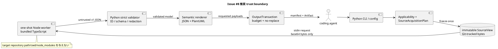
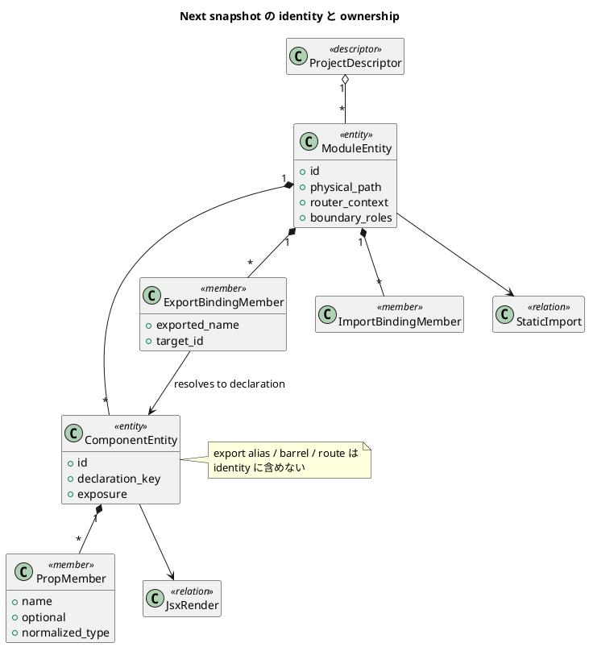
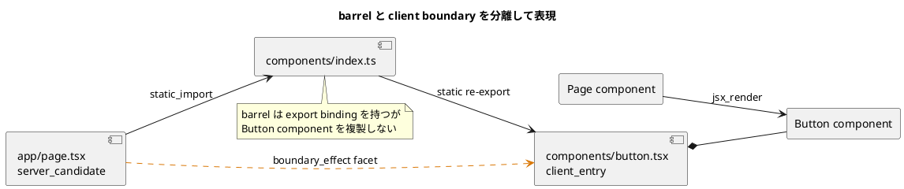

# 20260831t022358z-decision-candidate Issue #8 Next.js Component Snapshot Best-Practice Design Candidate

この文書は、Issue #8 を実装する前に採否を判断するための **未採用の設計候補** である。
後続 AI agent が、現在のコードと canonical Requirement / Design / Plan を再確認しながら、
仕様更新と実装を一貫して進められる粒度まで契約を具体化する。

この Artifact 自体は durable authority ではない。ここで提案する identity、source acquisition、
failure contract には現行 canonical 文書との差分があるため、採用時は先に Requirement / Design / Plan へ
明示的に反映し、その後に実装すること。

**Decision outcome (2026-08-31):** userは本候補の中心判断を承認し、調査内容をArtifactへ保存したうえで
canonical Requirement / Design / Planへ反映し、commit/push後にChatGPT Use Strictでレビューする方針を承認した。
authorityは反映先canonical docsにあり、本Artifactの`authority: draft`は変更しない。

**Strict review correction (2026-08-31):** first Strict reviewは、bundled TypeScript standard libraryだけでは
`React.FC`、class component、`memo`/`forwardRef`/`lazy`、`next/dynamic`の採用subsetを閉じて解析できないと判定した。
修復後の正本は、version/digest/license固定の`TrustedTypeEnvironment/v1`、closed declaration/export resolution、
source acquisition plan、private protocol、PropsTypeIR、relation/boundary algorithm、failure/packaging matrixを定義する
canonical Designである。本候補内のより粗い記述と競合する場合はcanonical Requirement / Design / Planを優先する。

## 読み方と規範語

- `MUST` / `MUST NOT`: 採用後の v1 contract に必要な条件。
- `SHOULD`: 強い推奨。外す場合は Design に理由と代替の検証方法を残す。
- `MAY`: v1 の正しさを損なわない任意要素。
- `候補値`: 実測で調整可能だが、無制限にはしない値。
- `complete empty`: 適用対象で解析が完全に成功し、該当 entity が 0 件の正常結果。
- `not_applicable`: 適用対象ではないため、Node adapter を起動しない正常結果。
- `partial_safe`: promised semantics の一部を局所的に欠くが、安全な subset と欠落範囲を証明できる結果。
- `payload_unavailable`: domain payload を安全に公開できず、safe manifest だけを公開できる結果。

## Context

### 目的

利用者が Next.js repository を build・execute せずに、次を決定的な JSON と PlantUML で取得できる
snapshot-only の vertical slice を作る。

- module と component の安定した identity
- component の公開 export と props
- static import、literal dynamic import、静的に証明できる JSX render
- `"use client"` に基づく client boundary の正の証拠
- coverage、diagnostic、toolchain provenance、Artifact digest

### 解くべき本質

Issue #8 は単なる TypeScript AST walker ではない。次の五つを同時に満たす必要がある。

1. 対象 repository のコードを実行せず、Git から凍結した同一 bytes を解析する。
2. React / Next.js の意味を過剰推測せず、証明できる静的 subset だけを表現する。
3. re-export、alias、route 移動、type 表記差で不要に揺れない identity を作る。
4. Node / TypeScript の失敗を Python core の publication contract に安全に閉じ込める。
5. 次 Issue の temporal diff が偽の add/remove を生まない primitive facts を残す。

### 現行 canonical 文書から再検討すべき点

| 論点 | 現行案の傾向 | この候補での再設計 |
| --- | --- | --- |
| Component identity | module path + exported name | 宣言位置を identity とし、export は別 member にする |
| Node の入力 | repository path を bridge に渡す余地 | Python が凍結した bytes のみを stdin で渡す |
| monorepo 発見 | Next target evidence を自動探索し得る | project root を `--project` / config で明示する |
| client/server | module boundary の二値化余地 | 正の証拠に基づく複数 role と unknown を許す |
| relation | import/render/boundary を同一平面に置き得る | module graph と component graph を分離する |
| partial | parse/type failure の安全 subset | promised semantics の欠落有無で厳密に分類する |

### 変更しない親契約

- `snapshot` と `diff` は分離し、Issue #8 は Next snapshot だけを所有する。
- target repository の Git state と source bytes は read-only とする。
- `--repo`、`--output-dir`、closed `--format`、closed `--stdout`、entity budget、
  atomic no-replace publication は既存 core contract に従う。
- output に source body、comment、literal value、secret、absolute path、raw compiler stderr を含めない。
- Python / SQLAlchemy domain は Node を必要とせず、既存の bytes と golden を維持する。
- runtime component tree、hydration、Next build、plugin、application entry point、custom HOC の実行は対象外。

## Options

### Architecture options

| option | 利点 | 欠点 | 判定 |
| --- | --- | --- | --- |
| Python だけで TS/TSX を構文解析 | runtime が一つ | TypeChecker の意味情報、alias、signature を正しく扱えない | reject |
| Node が target repository を直接読む | 実装が短い | source drift、symlink、config / module resolution、target `node_modules` への信頼が増える | reject |
| Python が bytes を凍結し、一回限りの Node worker が in-memory 解析 | trust boundary と determinism を保ちつつ TypeChecker を使える | protocol と packaging が必要 | **candidate** |
| 常駐 Node daemon | 起動コストを下げられる | cache/state drift、lifecycle、隔離、再現性が複雑 | v1 reject |

### Component identity options

| option | barrel alias 変更 | default export の改名 | diff の安定性 | 判定 |
| --- | --- | --- | --- | --- |
| export module path + exported name | identity が変わる | identity が変わる | 低い | reject |
| route path + display name | route 移動で変わる | 推測が必要 | 低い | reject |
| declaration module + declaration key、export は binding | binding だけ変わる | named declaration は維持、anonymous default は予約 slot | 高い | **candidate** |

### Applicability options

| option | monorepo | 誤検出 | 再現性 | 判定 |
| --- | --- | --- | --- | --- |
| 全 repository を自動走査 | 手軽 | unrelated package を拾う、workspace semantics が曖昧 | 低い | reject |
| `next.config.*` や `app/` の存在で推測 | 手軽 | config 実行や directory-name heuristic に依存 | 低い | reject |
| 明示 project root + 直下 `package.json` の `next` dependency | 少し指定が必要 | 低い | 高い | **candidate** |

### Static relation options

| option | 精度 | coverage | 判定 |
| --- | --- | --- | --- |
| JSX syntax の字面だけを scan | alias / symbol の誤認が多い | 広く見える | reject |
| runtime tree を推測 | 静的 snapshot の限界を超える | 未証明 | reject |
| TypeChecker symbol + bounded output-flow | 証明可能な relation に限定 | unknown を明示する必要 | **candidate** |

## Candidate

## 1. 結論

採用候補は、**Python-owned immutable SourceView + one-shot first-party Node adapter +
Python-owned strict validation/publication** である。

```text
CLI/config
  -> Python: applicability と project/target を確定
  -> Python: Git tracked/control/source bytes を SourceView に凍結
  -> Node: bundled TypeScript + in-memory CompilerHost で semantic analysis
  -> Python: response を untrusted input として schema/identity/redaction/order 検証
  -> Python: public semantic JSON / PlantUML / manifest を生成
  -> Python: budget、source drift、atomic no-replace publication
```

Node は解析 engine であって trust boundary の owner ではない。Node response に含まれる ID、count、digest、
path、安全性判定を Python が無条件に信頼してはならない。

## 2. Scope と CLI

### 2.1 v1 command

```text
code-structure-viz snapshot
  --repo GIT_ROOT
  --domain next
  --output-dir PATH
  [--project REPOSITORY_RELATIVE_DIRECTORY]...
  [--target path:REPO_REL_FILE_OR_DIR]...
  [--target component:EXPORTING_MODULE#EXPORTED_NAME]...
  [--upstream-depth N]
  [--downstream-depth N]
  [--config PATH]
  [--format semantic-json|plantuml]...
  [--max-entities N]
  [--stdout manifest|next:semantic-json|next:plantuml]
```

### 2.2 option contract

- `--repo` MUST continue to mean the exact Git root. `--project` によって意味を変えない。
- `--project` は repeatable で、repository-relative directory を受け取る。
- CLI の `--project` が一つでもあれば、config `[next].project_roots` を置き換える。
- default `[next].project_roots` は `["."]` とする。
- monorepo は `--project apps/web` のように明示する。workspace/package manager を自動推測しない。
- `[next].source_roots` MAY により、project root 外の repository-local shared package を許可する。
- `path:` は exact file または lexical directory subtree を選ぶ。
- `component:` は `EXPORTING_MODULE#EXPORTED_NAME` という export address で選ぶが、
  resolution 後は canonical declaration component を対象とする。
- multiple target は normalize / deduplicate した union とする。
- explicit target の missing、ambiguous、out-of-scope は domain 全体を `payload_unavailable` にする。
  暗黙の全 project fallback をしてはならない。
- depth は target と同時にだけ使用可能とし、target がなければ usage error にする。
- route selector は v1 に入れない。route は attribute であり identity / selector の正本にしない。
- snapshot に diff-only option を渡した場合は既存契約どおり exit 2、Artifact なしとする。

## 3. Applicability と source acquisition

### 3.1 Next project の判定

選択された各 project root 直下の `package.json` が、`dependencies.next` または
`devDependencies.next` に non-empty string を直接持つ場合だけ、その project を applicable とする。

次は evidence にしない。

- `next.config.*` の存在
- `app/`、`pages/`、`.next/` など directory 名だけの存在
- source 内の `next/*` import だけ
- repository 全体の間接 dependency / lockfile entry

結果の区別:

| 状態 | 結果 | Node probe |
| --- | --- | --- |
| applicable project が 0、explicit target なし | `not_applicable` | しない |
| applicable project があり component が 0 | `complete empty` | する |
| manifest / config が malformed で不在を証明できない | `payload_unavailable` | 必要な段階まで |
| applicable project があり Node 不在 | `payload_unavailable` | 起動試行で確定 |

### 3.2 domain-owned SourceAcquisitionPlan

現在の `.py` 中心の acquisition を ad hoc に分岐させず、domain が immutable plan を返す形へ狭く一般化する。

```text
SourceAcquisitionPlan
  domain
  project_roots[]
  program_file_suffixes[]
  context_file_suffixes[]
  control_files[]
  include_roots[]
  exclusions[]
  limits
```

- Python / SQLAlchemy の plan は既存の対象 bytes、順序、golden を変えない。
- Next program files は `.ts`、`.tsx`、`.js`、`.jsx`。
- `.d.ts` は context-only とし、entity を生成しない。
- hard exclusions は `.git`、`node_modules`、`.next`、`out`、`dist`、`build`、`coverage`。
- test/spec/story は default exclusion にしない。tsconfig / jsconfig または明示 config で選ぶ。
- config lookup order は `tsconfig.json`、`jsconfig.json`、versioned built-in safe config。
- `extends`、`baseUrl`、`paths` は frozen SourceView 内の repository-local path だけを解決する。
- package-based `extends` や target `node_modules` が必要なら安全に失敗し、暗黙に disk を読まない。
- TypeScript standard library は adapter に bundling した exact version を使う。
- external ambient types は opaque reference とし、target package を展開しない。

### 3.3 immutable request

Python は run start で control/source bytes を凍結し、Node には path ではなく次を stdin で渡す。

```json
{
  "schema": "code-structure-viz.next-adapter/v1",
  "request_id": "safe-hash",
  "projects": [{"root": "apps/web", "config_path": "apps/web/tsconfig.json"}],
  "files": [{"path": "apps/web/app/page.tsx", "content_base64": "...", "sha256": "..."}],
  "targets": [],
  "limits": {},
  "adapter_options": {}
}
```

public Artifact に source bytes や base64 を転記してはならない。

### 3.4 candidate transport limits

| limit | candidate default | failure |
| --- | ---: | --- |
| one file | 4 MiB | `payload_unavailable` |
| total frozen bytes | 64 MiB | `payload_unavailable` |
| file count | 20,000 | `payload_unavailable` |
| adapter stdout | 16 MiB | `payload_unavailable` |
| captured stderr | 64 KiB | safe summary only |
| wall clock | 60 s | process group terminate、`payload_unavailable` |
| Node old-space | 512 MiB | `payload_unavailable` |

limit 超過時に silent truncation をしてはならない。候補値は acceptance fixture の実測で調整できるが、
unbounded にしてはならない。

## 4. Process boundary と packaging

### 4.1 Node worker

- one request / one response / one process とする。
- fixed executable と fixed adapter entrypoint を argv 配列で起動し、`shell=false` とする。
- private empty working directory を使い、target repository を cwd にしない。
- minimal environment とし、`NODE_OPTIONS`、`NODE_PATH`、package-manager injection を除去する。
- process group、timeout、stdout/stderr byte cap、memory cap を適用する。
- target application、Next config、plugin、build script、migration、package script を import / execute しない。
- `npm`、`npx`、network、target `node_modules` を runtime に使わない。

### 4.2 bundled toolchain

Python package / release に、compiled first-party adapter、exact TypeScript runtime、lockfile、license inventory を
compatibility unit として含める。runtime install は offline で完結することを検証する。

Node 22+ は applicable Next run にだけ必要であり、Python / SQLAlchemy snapshot、core install、core tests の
必須依存にしてはならない。

### 4.3 in-memory CompilerHost

adapter は custom `CompilerHost` を用い、request 内の virtual file map と bundled TypeScript lib 以外を
読まない。module resolution が request 外へ出る場合は external / unresolved として閉じる。

## 5. Semantic domain model

### 5.1 identity の原則

identity には「同じ概念である限り変わらない primitive」だけを入れる。range、順序、alias、route、wrapper、
props、display name のような変化しやすい情報は payload / member に置く。

ID は versioned kind と canonical JSON key を SHA-256 で hash し、Python が再計算する。

### 5.2 ProjectDescriptor

- provenance と grouping の descriptor であり entity budget に数えない。
- repository-relative project root、config path、router coverage、toolchain provenance を持つ。
- workspace/package-manager semantics を推測しない。

### 5.3 ModuleEntity

```text
ModuleIdentityKey = {
  kind: "next_module",
  repository_relative_physical_path: "apps/web/components/button.tsx"
}
```

- physical module path を identity とする。
- extension normalization、index collapsing、route path は行わない。
- router kind、`use client`、boundary roles、source range は attributes / facts とする。

### 5.4 ComponentEntity

```text
ComponentIdentityKey = {
  kind: "next_component",
  module_id: "...",
  declaration_key: "Button" | "@anonymous-default"
}
```

- declaration site を identity の anchor とする。
- named declaration は binding name を declaration key にする。
- anonymous default export は module-local reserved slot `@anonymous-default` を使う。
- source range、exported name、barrel path、route path、wrapper、props は identity に含めない。
- module-scope local component は、exported / route root から proven `jsx_render` または supported wrapper で
  到達可能な場合だけ含め、`exposure: reachable_local` とする。
- unreachable local component は v1 payload に含めない。

### 5.5 ExportBindingMember

```text
ExportBindingIdentityKey = {
  owner_module_id: "...",
  exported_name: "Button"
}
```

- target は canonical Component ID または Module/external descriptor。
- barrel / re-export / alias は binding を増やすが Component を複製しない。
- default export は exported name `default` として binding に保持する。

### 5.6 ImportBindingMember

- owner Module と imported origin / imported name / type-only/value role を semantic identity に使う。
- local alias、source order、source range、quote style は identity から除外する。
- unresolved / external は安全な descriptor とし、internal entity を捏造しない。

### 5.7 PropMember

```text
PropIdentityKey = {
  component_id: "...",
  prop_name: "variant"
}
```

- normalized type、optional、default evidence、source range は payload。
- `children` は effective public signature に実在するときだけ出す。
- `ref` は public signature に実在するときだけ出す。
- default value は出力しない。必要なら `has_direct_default: true` のような redacted evidence のみ許可する。

## 6. Component recognition

PascalCase だけでは Component と認定しない。少なくとも一つの positive evidence を要求する。

- TypeChecker で React element-compatible な callable / construct signature を安全に確認できる。
- class が閉じた React class provenance を持つ。
- recognized App / Pages Router UI entry の default export である。
- function/class の output-flow から JSX / React element を保守的に証明できる。
- closed wrapper allowlist の内側で component symbol を一意に解決できる。

v1 closed wrapper allowlist:

- `memo`
- `forwardRef`
- `lazy`
- literal import pattern を満たす `next/dynamic`

custom HOC は実行も一般推論もせず、unknown / coverage limitation とする。証明できない Component entity を
名前から捏造してはならない。

## 7. Props normalization

### 7.1 source of truth

TypeChecker が component の effective call / construct signature に与える第一 parameter を起点にする。
source spelling や `typeToString()` の生文字列を public contract にしてはならない。

対象に含める:

- inline object、interface、type alias
- repository-local imported type
- destructuring parameter
- `React.FC` / equivalent safe callable signature
- class props
- `forwardRef`
- generic、union、intersection

### 7.2 closed type IR

```text
TypeNode =
  primitive
  | type_parameter(ordinal)
  | redacted_literals(base_kind, count)
  | repository_reference(module_id, exported_name)
  | external_reference(package_name, exported_name?)
  | array(element)
  | tuple(elements, rest?)
  | union(members)
  | intersection(members)
  | function(parameters_without_names, return_type)
  | object(properties)
  | opaque(stable_reason)
```

Normalization MUST:

- Unicode NFC を適用する。
- generic parameter name を出さず declaration ordinal に alpha-normalize する。
- union / intersection / property を canonical key で sort・deduplicate する。
- string / number literal value を出さず base kind と count に redact する。
- function parameter name を出さない。
- recursive / unsupported / over-limit type は `opaque` に閉じる。

候補 limits:

| item | candidate limit |
| --- | ---: |
| type depth | 16 |
| nodes per prop | 512 |
| union/intersection members | 64 |
| nested object properties | 256 |
| signatures per component | 16 |

limit 到達は配列の末尾を切るのではなく、該当 subtree を `opaque(type_complexity_limit)` に置換し、
coverage を `partial` にする。`any` は open-world のため partial、正確な `unknown` / `never` は complete と
表現できる。

## 8. Relation model

### 8.1 two-plane graph

module dependency と component render を別平面にする。両者を暗黙に fan-out させない。

| kind | source | target | traversal plane |
| --- | --- | --- | --- |
| `static_import` | Module | Module / external | module |
| `literal_dynamic_import` | Module | Module / external | module |
| `jsx_render` | Component | Component / external | component |
| `component_wrap` | Component | Component | component |

Module contains Component は ownership であり traversal depth を 1 消費しない。

relation identity は source ID、kind、target descriptor、semantic role から作る。range、source order、local alias、
syntax spelling は payload に置く。重複 occurrence は一 relation に aggregate し、`occurrence_count` と
`contexts: direct | conditional | collection` を持てる。

### 8.2 proven JSX output-flow

lexical scan ではなく、Component の output へ流れる expression だけを追う。

roots:

- function return / concise arrow body
- class `render()` return
- single-assignment local const への bounded backward flow

safe recursive forms:

- JSX element / fragment の children
- conditional / logical expression
- array literal
- safe built-in `Array` / `ReadonlyArray` の `map` / `flatMap` callback
- exact React provenance を持つ `createElement`

relation にしない:

- event handler 内の JSX
- render prop / function child の未実行 body
- arbitrary nested function / helper call
- lowercase intrinsic と Fragment
- ambiguous / unresolved symbol
- runtime conditional result の推測

external target は descriptor を保持できるが synthetic internal entity や traversal を作らない。

### 8.3 dynamic behavior

- literal `import("./x")` は `literal_dynamic_import` を作れる。
- non-literal import は relation を作らず、intentional unsupported / unknown coverage を記録する。
- literal-pattern `next/dynamic` は module relation を作れる。
- component target が一意に証明できた場合だけ component relation を作る。

### 8.4 direction

- downstream: source -> dependency / rendered target。
- upstream: reverse adjacency。
- depth traversal は internal entity だけを辿り、external descriptor は frontier で止める。

## 9. Client boundary

client/server を排他的な runtime classification にしない。positive evidence から複数 role を導出する。

### 9.1 primitive facts

- `client_entry`: directive prologue に exact `"use client"` / `'use client'` がある。
- `router_context`: `app_ui`、`pages_ui`、`pages_api`、`app_route_handler`、`none`。
- import edge role: value / type-only / dynamic / unresolved。

### 9.2 derived roles

- `client_dependency`: `client_entry` から internal static value import / re-export で到達可能。
- `server_candidate`: closed App Router UI entry seed から、client entry に入る直前まで static value edge で到達可能。
- `unknown`: 上記の正の証拠がない。Pages Router も自動 server 扱いしない。

同じ Module が `client_dependency` と `server_candidate` の両方を持つことを許す。これは矛盾ではなく、
異なる entry context からの到達可能性を表す。

type-only import、dynamic import、JSX relation、external / unresolved edge は role propagation に使わない。
`server_candidate -> client_entry` の value edge は underlying relation の `boundary_effect` facet とし、
duplicate traversal edge を作らない。

`no directive = server`、hydration boundary、runtime bundle inclusion を主張してはならない。Issue #9 では
primitive facts / edges を比較し、派生 role の cascade を primary change として増幅しない。

## 10. Adapter response と Python validation

Node stdout は exact one JSON document `code-structure-viz.next-adapter/v1` とする。stdout の前後に log を
混ぜない。diagnostic の raw text を public response に入れない。

Python MUST validate / recompute:

1. protocol version と closed schema (`additionalProperties: false`)
2. request file set に対する repository-relative path containment
3. entity/member/relation ref integrity と重複
4. closed enum と required field
5. literal / source body / comment / absolute path / unsafe diagnostic の不在
6. canonical ordering と Unicode normalization
7. entity/member/relation identity ID
8. counts、coverage totals、source/config digest、Artifact digest
9. explicit target がすべて一意に解決されたこと
10. requested renderer が同じ semantic model を表すこと

validation failure を `partial_safe` に downgrade してはならない。response 全体を
`payload_unavailable` として拒否する。

## 11. Public outputs

### 11.1 filenames と schemas

- `next.snapshot.semantic.json`
- `next.snapshot.puml`
- semantic envelope: `code-structure-viz.semantic/v1`
- PlantUML contract: `code-structure-viz.plantuml/next/v1`
- manifest: existing `code-structure-viz.run-manifest/v1`
- adapter protocol: private `code-structure-viz.next-adapter/v1`

既存 closed registry / schema に Next branch を明示追加する。`additionalProperties: false` を緩めたり、
未知 domain を silently accept したりしてはならない。

### 11.2 entity budget

default 500 の budget には selected internal `ModuleEntity` と `ComponentEntity` だけを数える。
ProjectDescriptor、members、relations、external descriptors、frontier は数えない。

501 以上は truncation せず `payload_unavailable`、exit 3、safe manifest-only とする。
positive `--max-entities N` は既存 contract に従う。

### 11.3 manifest provenance

manifest には少なくとも次を safe metadata として残す。

- Node、TypeScript、adapter、protocol version
- selected project roots と config path（repository-relative）
- source acquisition plan version / digest
- source/config digest（content 自体は含めない）
- target / depth / entity budget の requested と resolved value
- coverage summary、stable diagnostic code、status、incomplete kind
- Artifact relative path、size、SHA-256

### 11.4 stdout と publication

- available selector は公開 file と exact same bytes。
- selector なしは existing deterministic run-summary 1 行。
- unavailable selector は existing stdout-result 1 行。
- diagnostic は stderr のみ。
- requested formats は一つの transaction として all-or-none で publish する。
- existing path は上書きせず、source drift / transaction invariant failure は fatal とする。

## 12. Coverage と failure algebra

原則: diagnostic が存在するかではなく、**promised v1 semantics を欠落させたか** で complete / partial を決める。

| condition | domain status | payload | manifest | exit |
| --- | --- | --- | --- | ---: |
| Next project なし、absence を証明 | `not_applicable` | なし | あり | 0 |
| applicable、entity 0、解析完了 | `complete` empty | requested empty payloads | あり | 0 |
| closed v1 の intentional unsupported を unknown として完全表現 | `complete` + diagnostic | requested payloads | あり | 0 |
| promised semantics の局所欠落、安全 subset と coverage を全 renderer で証明 | `incomplete/partial_safe` | JSON + PlantUML | あり | 3 |
| explicit target missing / ambiguous / out-of-scope | `incomplete/payload_unavailable` | なし | safe manifest | 3 |
| config / Program / Node / protocol / schema / security / identity seed failure | `incomplete/payload_unavailable` | なし | safe manifest | 3 |
| entity 501+ / transport cap | `incomplete/payload_unavailable` | なし | safe manifest | 3 |
| CLI grammar、unknown config key、invalid type/value | usage error | なし | なし | 2 |
| Git / SourceView integrity、source drift、serializer / transaction invariant | fatal | なし | なし | 1 |
| handled interrupt | interrupted | なし | cleanup 後なし | 130 |

`partial_safe` の必要条件:

- failure が file / component / relation scope に隔離される。
- 残る entity、member、relation の identity と ref integrity が完全である。
- 欠落範囲を count / stable code で明示できる。
- JSON と PlantUML が同じ subset を表す。
- redaction、target completeness、budget、schema をすべて満たす。

一つでも証明できなければ `payload_unavailable` とする。raw compiler message、stderr、literal、absolute path を
diagnostic message に混ぜない。occurrence ID が必要なら safe occurrence identity を hash する。

## 13. End-to-end trust flow



## 14. Domain model overview



## 15. Static graph example



## 16. Implementation sequence

設計 adoption と implementation を混ぜない。次の順序を守る。

### Phase 0: canonical adoption gate

1. この候補と current HEAD の実装・tests・schemas を再確認する。
2. identity を「declaration component + export binding」に変更する判断を人間が採用する。
3. Requirement / Design / Plan の stale greenfield assumptions、project selection、failure table、test trace を更新する。
4. canonical validation と independent spec review を通す。

### Phase 1: acceptance and schema first

- CLI / config / protocol / semantic / manifest fixture を先に固定する。
- barrel alias、anonymous default、local reachable component、zero component、not applicable を golden にする。
- outcome table の publication / exit / stdout / stderr を table-driven test にする。

### Phase 2: source acquisition generalization

- domain-owned immutable `SourceAcquisitionPlan` / profile を導入する。
- Next project / target / config parser を追加する。
- Python / SQLAlchemy の captured bytes と golden が完全一致することを先に証明する。

現在の実在 path で再確認すべき候補:

- `src/code_structure_viz/source/source_view.py`
- `src/code_structure_viz/source/targets.py`
- `src/code_structure_viz/core/config.py`
- `src/code_structure_viz/core/domains.py`
- `src/code_structure_viz/application/snapshot_domain.py`

### Phase 3: hardened adapter boundary

- Python `NextAdapterRunner` / protocol validator。
- compiled Node entrypoint と bundled TypeScript runtime。
- private stdin request、in-memory `CompilerHost`、fixed environment、limits。
- schema-noise、oversize、timeout、malformed response、path injection tests。

planned paths は current tree に合わせて確定する。canonical 文書の `adapters/next/...` は existence を再確認し、
存在しない symbol を実装済みとして扱わない。

### Phase 4: semantic analyzer

1. Module / Component / binding identity
2. component recognition
3. closed props IR
4. import / dynamic import graph
5. bounded JSX output-flow
6. client boundary primitive facts と derived roles
7. canonical ordering / coverage

### Phase 5: Python validation and renderers

- strict response validator と ID/count/digest recomputation。
- Next semantic mapper と JSON Schema branch。
- Next PlantUML renderer / visual legend。
- Artifact / manifest / stream / outcome closed registry integration。

関連する現行実在 path:

- `src/code_structure_viz/artifacts/writer.py`
- `src/code_structure_viz/artifacts/manifest.py`
- `src/code_structure_viz/artifacts/streams.py`
- `tests/contracts/test_json_schemas.py`

### Phase 6: hardening and packaging

- Node optionality、offline install、lockfile、license inventory。
- source execution trap、filesystem escape、symlink、environment injection、raw diagnostic leak。
- determinism rerun、output collision、interrupt cleanup、source drift。
- existing security test の「subprocess は Git だけ」という仮定があれば、exact Git runner と exact Next runner の
  allowlist に狭く更新し、任意 subprocess を許可しない。

### Phase 7: Issue #9 handoff

- stable identity keys と primitive boundary facts を明文化する。
- derived role cascade、range、order、diagnostic wording を matching key に使わない。
- Issue #8 の complete / partial / unavailable matrix を diff side acquisition の前提として渡す。

## 17. Acceptance matrix

最低限、次を CLI process の observable evidence で固定する。

### Normal

- App Router と Pages Router の TS/TSX。
- safe JS/JSX subset。
- named/default/anonymous default、direct export、barrel re-export、alias。
- reachable local component と unreachable local omission。
- props: destructuring、interface、alias、import、generic、union、intersection、class、FC、forwardRef。
- static import、literal dynamic import、JSX conditional/collection/createElement。
- `client_entry`、client dependency、server candidate、boundary effect、dual role。
- targetless、path target、component export-address target、depth traversal。
- same input の byte-identical rerun。

### Empty / not applicable

- selected project に Next dependency がない -> Node なし、not applicable。
- Next project だが component 0 -> complete empty payloads。
- monorepo の explicit project selection が unrelated package を拾わない。

### Partial safe

- 一つの file / relation scope だけ promised semantics を欠き、safe subset と exact coverage を証明。
- JSON と PlantUML が同じ subset。
- exit 3、payload descriptors あり、stdout selector は exact partial payload。

### Payload unavailable

- missing Node、unsupported Node version、timeout、memory / stdout / file cap。
- malformed protocol、schema mismatch、protocol noise、absolute path、bad ref、bad ID、duplicate ID。
- malformed project manifest / config、unsafe external extends、Program creation failure。
- any explicit target missing / ambiguous / out-of-scope。
- 501 entities at default budget。
- requested payload なし、safe manifest-only、exit 3。

### Usage / fatal / interrupt

- invalid / duplicate option、unknown config key、wrong type、depth without target -> exit 2、Artifact 0。
- Git / SourceView integrity、source drift、writer/transaction invariant -> exit 1、Artifact 0。
- SIGINT -> exit 130、staging cleanup、Artifact 0。

### Security / redaction

- fixture package scripts、Next config、plugins、application modules が実行されない。
- target cwd / node_modules / network / npm / npx を使用しない。
- symlink / traversal / request-response path escape を拒否する。
- JSON、PlantUML、manifest、stdout、stderr、logs を source body、comment、literal、secret-like value、
  absolute path、raw compiler text で negative scan する。
- target Git HEAD、refs、index、tracked/untracked bytes が before / after で一致する。

## 18. Stop conditions

以下のいずれかが未解決なら implementation completion としない。

- declaration identity と export binding の canonical adoption が未完了。
- Node が frozen bytes 以外の target filesystem を読む。
- TypeChecker の source spelling を public type contract にしている。
- explicit target failure を全-project fallback している。
- complete / partial_safe / payload_unavailable の判定が diagnostic 文言に依存する。
- partial JSON と PlantUML が別 subset を表す。
- entity budget を silent truncation で回避する。
- Python / SQLAlchemy に Node runtime requirement または output byte drift を持ち込む。
- package lock / license / offline / security / deterministic golden の evidence がない。

## 19. Deliberate non-goals

- Next build、React rendering、RSC Flight、hydration、browser execution。
- runtime component tree と conditional branch の実行結果。
- custom HOC / framework plugin の一般推論。
- package manager / workspace の自動探索。
- route selector、route diff、temporal component diff。
- source code snippet、literal default value、comment、documentation extraction。
- public plugin ABI、persistent Node service、target repository cache。

## 20. Decision requests before canonical reflection

この候補を canonical に反映する前に、人間が最低限承認する判断は次の四つである。

1. Component identity を export site から declaration site へ変更し、export binding を分離する。
2. monorepo project root を自動探索せず、CLI / config で明示する。
3. Node に target path を渡さず、Python が凍結した bytes だけを渡す。
4. client/server を排他的分類ではなく、positive-evidence role として表現する。

## Reflection

- この Artifact は `draft` / `authority: draft` のまま保持する。
- user approvalを受け、採用項目をcanonical Requirement / Design / Planへ再記述した。Strict review findingにより変更する場合も、canonical側を先に修復する。
- identity の変更は Issue #9 の matching semantics に影響するため、親 Epic と downstream trace も更新する。
- 数値 limit は acceptance fixture で検証し、採用値を Design / config schema / manifest contract に一度だけ定義する。
- canonical 更新後に SpecDock validation と independent strict spec review を行う。
- 実装結果・実行 command・test evidence は Plan ではなく Report に記録する。
- 却下・変更した候補は削除せず、理由と代替案を本 Artifact または accepted ADR の decision log に残す。
