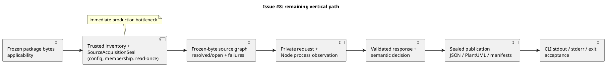

# 20260921t110834z-disc Issue #8 Root-Cause Analysis and Recommended Implementation Sequence

複数の証拠を統合し、選択肢と trade-off を整理します。一つの source の調査は `research` を使います。

## Inputs

- 統合する evidence:
  - ChatGPT analysis requested for Issue #8: session `issue8-current-root-cause-refresh`; Oracle-resolved model `gpt-5.6-sol`, effort `Pro` (both verified by that run). Full response is retained in the local, ignored Workbench at `.workbench/reports/issue8-root-cause-analysis-chatgpt-pro-20260921-refresh.md`.
  - Current-v1 authority: Issue #8 `requirement.md`, `design.md`, `plan.md`, `docs/contracts/next-config-v1.md`, schemas, reference validator, and tests.
  - Production surface reviewed: `src/code_structure_viz/adapters/next/applicability.py` and `configuration.py`; relevant tests include `test_config_inheritance_retains_origins_through_actual_source_seal`, `test_project_membership_rejects_declaring_config_escape`, and `test_project_configuration_rejects_observed_root_config_omitted_from_candidates`.
  - Fixed-SHA review evidence for `736539dea2297e29a0e3989456f683c1e8f73742`: pass with P0=0, P1=0, P2=1; the one P2 concerned membership-origin traceability, not changed runtime behavior.
  - Local verification performed after the documentation remediation: focused pytest (6 passed, 539 deselected), `./spec-dock/scripts/spec-dock validate` (ok, nodes=10), and `git diff --check` (pass for tracked diff).

## Synthesis

- 一致する事実と未確定事項:
  - **Issue #8 is incomplete because the CLI-to-Artifact vertical path is incomplete.** The evidence supplied for this analysis does not establish a current user-observed CLI defect. The local production implementation reaches package applicability and pure config/JSONC/extends/compiler-option/membership/project-configuration helpers; the actual `SourceAcquisitionSeal`, frozen-source graph, Node protocol/process boundary, semantic decision, publication, manifests, and CLI acceptance remain to be completed or certified.
  - **The fixed-SHA P2 was a traceability gap.** Three meanings had been compressed into “project-relative”: (1) resolve each `files`/`include`/`exclude` value from the directory of the config that declares it, including inherited configs; (2) render the resolved result as a repository-relative POSIX path; and (3) reject unsafe paths and enforce containment within the selected project root. Current local Requirement, Design, Plan, and `next-config-v1` wording now separates these meanings and points to the existing source-seal regression. This is a documentation correction, not a new compatibility promise or path-policy relaxation.
  - A pure `resolve_project_configuration` call cannot establish that its `frozen_controls` input is complete. The upstream trusted inventory/seal must prove that every observed root `tsconfig.json`/`jsconfig.json` is represented, in addition to the helper rejecting an observed root config omitted from `control_candidates`.
  - **Dual direct Next declarations are a closed fail-closed case, not an unresolved product choice.** The current reference validator, production helper, and tests reject declarations in both `dependencies` and `devDependencies` as malformed because no safe precedence is defined. An older Design Round table says otherwise, but the Design explicitly marks Round sections non-normative. The Requirement's top-level prose could state this rule more directly; that is optional traceability work, not authorization to change behavior.
  - The prior review pass applies only to SHA `736539d…`; it does not certify the later local commits or the current documentation candidate. Focused tests and SpecDock validation also do not prove the complete Issue acceptance path.

### Root-cause flow

## Options and trade-offs

- 選択肢と利点・制約:
  - **推奨: Current-v1 Planどおり、因果順に小さな実装単位で進む。** まずは実在する trusted inventory から configuration/membership を single-read `SourceAcquisitionSeal` へ結び、同じ seal identity から `FinalSourceAcquisitionPlan` と `SourceView` を得る。candidate omission、caller-supplied membership、post-seal read、revision drift を負例で閉じる。これにより後段の Node やpublicationが未検証の caller dataを根拠にするのを防ぐ。
  - 次に frozen bytes から source graph と closed failure union を導出する（この段階ではNodeを起動しない）。その後、最小のprivate request / process policy・observation / response-validation境界、semantic model、actual-byte publication finalizer、manifest/selector/stdout/stderr/exit、runtime/package hardeningとcoverage registryへ進む。各unitで Current-v1 Plan のacceptanceとpositive/negative evidenceを閉じる。
  - 既存のpure helperやreference contractを作り直さない。`SourceAcquisitionSeal`接続の責任はtrusted enumerator・source reader・sealに置き、TypeScript完全互換、target code/configの実行、package-based extends、外部pathアクセスなどへスコープを拡大しない。
  - 一括でCLI/Node/semantic/publicationを実装する案は推奨しない。依存境界が多く、失敗源の識別が難しくなり、未証明のpath/config/process情報が後段へ混入するリスクがある。

### 推奨する実行チェックポイント

1. **DOC-01 — traceability candidateを確定する:** membership-origin修正とこの分析Artifactを正規記録に残す。focused regressions、SpecDock、必要な直接品質gateを実施し、clean/pushed exact SHAで新しいfixed-SHA reviewを取る。以前の`736539d…`のpassを再利用しない。
2. **Source-seal unit:** `PackageApplicabilityMatrix`の後、applicable rootsだけについてtrusted inventoryからcontrolsを凍結する。single-read観測からconfig closure、membership、plan/viewを一度にsealし、欠落候補・二重read・revision drift・caller injectionを拒否する。
3. **Source-graph unit:** frozen source bytesからresolved/open edgesとsafe frontierを導出し、通常read failureとintegrity fatalを区別する。Node実行より先に完了する。
4. **Process/protocol unit:** trusted Node identity、policyと実測launch observation、bounded capture、exact-one response、closed schema/provenanceを順に結び付ける。証明不能時はunavailable。
5. **Semantic/publication/CLI unit:** component identity・props・relations・boundary rolesをvalidated decisionへまとめ、finalizerがcandidate bytesとmeasurementを一度sealする。Artifact/manifest/selector/stdout/stderr/exitはその同じ決定から投影し、再render/retryしない。
6. **Final acceptance:** current-tree full tests・quality gates・pinned PlantUML・security/determinism/offline/package checks・CLI-to-Artifact matrixを一つのcandidateで実施し、Issue completionとfixed-SHA reviewのscopeを混同しない。

### Luna Max workflowの適用状況

この作業では同skillの運用要素（bounded unit、acceptance/evidence、focused tests、resume-state記録、品質gateを混同しない）を参照した。現在のCodex実行モデルがLuna Maxであることは未確認のため、モデル設定まで準拠したとは扱わない。今回のDOC-01は文書中心なので、behaviour実装用TDD gateとは区別し、既存回帰を実行している。

### Local state snapshot (2026-09-21 Asia/Tokyo)

- Branch: `iss-00008-generate-nextjs-component-snapshots`.
- Local HEAD: `533e26f7a1dba4e2fea927493d0f36efb93f5a0b`; configured upstream and live GitHub ref: `736539dea2297e29a0e3989456f683c1e8f73742` (local branch is ahead by two commits).
- Current candidate has modified Requirement, Design, Plan, and `docs/contracts/next-config-v1.md`, plus the Issue Artifacts. It is dirty, not yet freshly reviewed, and has not been pushed. The full current-tree suite and final quality gate remain pending.
- Do not claim Issue #8 complete from this analysis, these focused checks, the older review pass, or the docs-only remediation.

## Reflection

- durable な結論を Requirement / Design / Plan または accepted ADR に再記述する。
  - The membership-origin rule was incorporated into current-v1 Requirement, Design, Plan, and `docs/contracts/next-config-v1.md`; the path-origin review reconciliation is preserved in Artifact `20260921t102546z-disc`.
  - This Artifact records an evidence-based implementation recommendation, not new product authority. Future agents must re-check live Git state and Current-v1 documents before implementation; this timestamped SHA/state snapshot may become stale.
