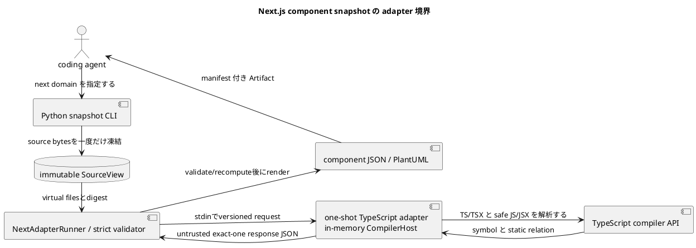

# iss-00008 Generate Next.js Component Snapshots — 設計

詳細: [Design Guide](../../../../../../docs/authoring/design.md)

## 設計目標

- `next` domain の `snapshot` を、CLI から source acquisition、analysis、versioned JSON、PlantUML、manifest、diagnostic まで一つの vertical pipeline として設計する。
- accepted ADR の独立 product ownership、named endpoint、dual snapshot、adapter boundary、agent-first Artifact、安全な static analysis、product HTML exclusion、vertical slicing を破らない。
- common abstraction は lifecycle、diagnostic、Artifact descriptor、graph primitive に限定し、domain-specific identity/member/relation/matching を adapter が所有する。

| Design ID | Requirement trace | 判断 |
| --- | --- | --- |
| I05-DES-001 | I05-REQ-001 | explicit project/targetをdomain-awareに解決し、Next snapshotを既存one-run outcome/publication pipelineへ接続する。 |
| I05-DES-002 | I05-REQ-002 | domain-owned SourceAcquisitionPlanでPythonがbytesを一度だけ凍結し、one-shot Node workerはvirtual filesとbundled TypeScriptだけを解析する。 |
| I05-DES-003 | I05-REQ-003 | declaration Componentとexport bindingを分離し、closed props IR、two-plane static relation、positive-evidence boundary fact/roleをNext semanticsとする。 |
| I05-DES-004 | I05-REQ-004 | `next-adapter/v1` responseをuntrusted inputとしてPythonがstrict validate/recomputeし、public semantic/PlantUML/manifestをPython側でrenderする。 |
| I05-DES-005 | I05-REQ-005 | promised semanticsの欠落に基づきcomplete/partial_safe/payload_unavailableを分類し、explicit target、budget、transport failureをfail-closedにする。 |
| I05-DES-006 | I05-REQ-006 | fixed process boundary、in-memory CompilerHost、finite limits、redaction、offline bundle、Node optionality、same-input determinismを検証する。 |
| I05-DES-007 | I05-REQ-007 | closed stdout selectorをsource acquisition前に検証し、publication後exact bytesまたはtyped unavailable resultをstderr diagnosticsと分離して出す。 |

## Current / Target

### Current（canonical specification state）

- 本 Issue の canonical state は stable scope ID と repository-relative Requirement/Design/Plan path、accepted ADR、interviewで識別する。採用・実装開始時に HEAD と configured upstream を再検証し、current commit SHA を本文へ固定しない。
- Python package、CLI、Git/SourceView、config/targets、outcomes、Python/SQLAlchemy adapter、schema、manifest、stdout/writer、tests/goldenは実装済み。Next production adapter、Node workspace、protocol/schema、fixtures/goldenは未実装である。
- current closed registriesは`python/sqlalchemy`を所有し、source candidate/target/configはPython semanticsへ具体依存する。Nextはこれらをopen-endedにせずclosed branchとして追加する。
- 本Designは親の横断contractをslice固有の構造へ具体化し、依存Issueのpublic contractを変更せずに後続sliceへ渡す。

### Target

- coding agent が first-party TypeScript adapter を通じ、Next.js repository の module、exported component、props、static relation、client boundary を JSON と PlantUML で取得できる。
- source/body/secret を漏らさず、failure と coverage を manifest で agent が機械判定できる。
- downstream Issue はこの Design の stable interface だけへ依存し、内部 class layout を fork しない。

## 責務・Interface

### planned component responsibilities

| planned path / symbol | 状態 | 責務 |
| --- | --- | --- |
| `src/code_structure_viz/source/source_view.py`（existing） | existing extension | domain-owned acquisition planを受け、既存Git/source safetyでbytesを凍結する。 |
| `src/code_structure_viz/source/targets.py`（existing） | existing extension | Python grammarを維持し、Next project/path/component selectorへdomain-aware routingする。 |
| `src/code_structure_viz/core/config.py`（existing） | existing extension | closed `[next]` config、value source、digestを追加する。 |
| `src/code_structure_viz/core/domains.py`、`application/snapshot_domain.py`（existing） | existing extension | Nextをsnapshot registryへだけ追加する。 |
| `src/code_structure_viz/artifacts/`、`core/outcomes.py`（existing） | existing extension | Next coverage/path/schema/stream/writer/publication invariantを追加する。 |
| `src/code_structure_viz/adapters/next/`（planned） | new | applicability、protocol、hardened runner、response validator/mapperを所有する。 |
| first-party Node workspace（planned、exact pathはbuild設定確認後に固定） | new | compiled adapter、TypeScript analyzer/model、in-memory CompilerHost、lock/licenseを所有する。 |

### common command interface

```text
code-structure-viz snapshot --repo PATH --output-dir PATH [--domain DOMAIN] [--project RELATIVE_DIR] [--target SELECTOR] [--format FORMAT] [--config PATH] [--stdout SELECTOR]
code-structure-viz diff --repo PATH --output-dir PATH [--domain DOMAIN] [--from ENDPOINT] [--to ENDPOINT] [--format FORMAT] [--config PATH] [--stdout SELECTOR]
```

- `--output-dir` は必須。writer は existing file を置換せず、全 payload を staging 後に公開する。
- `--format` 未指定は semantic JSON と PlantUML。`--stdout` は output directory requirement を解除しない。
- analysis behavior を environment variable で変更しない。環境は executable discovery と locale-independent process setup にだけ使う。
- `--repo`はexact Git root。repeatable `--project`はconfig `[next].project_roots`を置換し、defaultは`.`。monorepo/workspaceを自動探索しない。
- Next targetは`path:REPO_REL_FILE_OR_DIR`または`component:EXPORTING_MODULE#EXPORTED_NAME`。後者はexport addressをcanonical declarationへ解決する。explicit target失敗はfallbackしない。

### stdout selector and stream routing

CLI parser は `--stdout` を optional single-value option として一度だけ受理し、closed grammar `manifest | DOMAIN:FORMAT` を `StdoutSelector` valueへ正規化する。domain/format の resolved selection が確定した直後、source acquisition より前に selector compatibility を検証する。boolean、path、alias、略記、大小文字違い、値省略、重複、未選択 domain、未要求 format は `UsageError` とし、source acquisition と publication の前に exit 2、stdout 空、Artifact 0件で終了する。`OutputTransaction` は開始しない。

通常 publication 後、既存 CLI/application boundary 内の stdout emitter は次のいずれか一つだけを行う。新しい command または独立 architecture layer は追加しない。

1. selector なしなら `run-summary/v1` を canonical JSON 1行として出す。
2. selected Artifact が利用可能なら、公開 file を binary read して exact bytes を複製する。
3. selected Artifact が利用不能なら、`RunOutcome`/`DomainOutcome` から `stdout-result/v1` 1行を構築する。

stdout emitter は diagnostic renderer と分離し、diagnostic は stderr だけへ出す。exact-byte copy に summary、BOM、改行補正を加えない。`stdout-result/v1` は status と stable reason だけを参照し、source content、absolute path、secret を受け取る field を持たない。handled SIGINT は cleanup 完了後に `run_status: interrupted` を返せる場合だけ exit 130 の result line を出す。process を強制終了された場合の出力は契約外である。

### snapshot path excludes comparison facilities

command dispatch は `SnapshotSourceRequest` と `DiffSourceRequest` を型で分ける。snapshot branch は単一のrun-start `SourceView`だけを作り、`ComparisonEndpointResolver`、start-HEAD anchor、`FileChangeSet`、`ChangedPathAdmissionGate` を呼び出せない依存方向にする。CLI validation はdiff-only optionをsnapshot requestへ変換する前に拒否する。acceptance fixtureはimplicit base不在と1,001 non-domain changed pathsを同時に持つrepositoryでsnapshotが通常処理されること、diff-only option併用だけがexit 2になることを検証する。

### source interface

```json
{
  "contract": "code-structure-viz.source-view/v1",
  "endpoint": {"kind": "commit-or-frozen-working-tree", "digest": "sha256"},
  "files": [{"path": "repository/relative", "sha256": "digest", "media_type": "text/plain"}],
  "fingerprint": "safe-run-fingerprint",
  "diagnostics": []
}
```

SourceView は immutable value object であり、absolute temporary path を serializer へ渡さない。

### domain adapter interface

```text
analyze_snapshot(SourceView, ResolvedConfig, TargetSelection) -> DomainSnapshotResult
compare_snapshots(DomainSnapshot, DomainSnapshot, DiffPolicy) -> DomainDiffResult
render_semantic_json(DomainResult) -> bytes
render_plantuml(DomainResult, VisualVocabulary) -> bytes
```

この Issue が未使用の method は実装を強制しない。後続 slice が stable contract を additive に拡張する。

### incomplete classes and publication

`DomainOutcome` は `status` に加え、status が `incomplete` の場合だけ `incomplete_kind: partial_safe | payload_unavailable` と `payload_available` を持つ。

- `partial_safe` は isolated failure set、safe subset、explicit coverage frontier、safe diagnostics、redaction pass、entity-budget pass、requested renderer passをすべて満たす場合だけ生成する。requested domain payload と manifest descriptor を同一 transaction で公開する。
- `payload_unavailable` は safe subset不在、global acquisition/protocol/schema/security/unsafe-path failure、entity overrun、または diff side failureで生成する。affected payload descriptorは空とし、safe core manifestだけを許す。
- all-domain `RunOutcome` はどちらもoverall `incomplete`/exit 3へ集約するが、`partial_safe` payloadと健全 siblingを捨てない。run-level fatalだけがfinal manifestを含む全stagingを破棄する。

serializer と manifest builder は `incomplete_kind` と `payload_available` の整合を検証する。`partial_safe` なのにrequested descriptorが欠ける状態、`payload_unavailable` なのにaffected descriptorがある状態はinternal contract failureとしてpublication前に拒否する。

## Adopted Next v1 semantics

### Project applicability and source plan

- selected project root直下`package.json`のdirect `dependencies.next`または`devDependencies.next`がnon-empty stringの場合だけapplicableとする。
- `next.config.*`、directory名、source import、lockfile indirect entryはapplicability evidenceにしない。
- applicable project 0かつexplicit targetなしはNode probeなし`not_applicable`。applicableでComponent 0は`complete empty`。malformed manifest/configはabsenceを証明できないため`payload_unavailable`。
- immutable `SourceAcquisitionPlan`はproject roots、program/context/control files、include roots、hard exclusions、finite limits、plan versionを持つ。
- program filesは`.ts/.tsx/.js/.jsx`、`.d.ts`はcontext-only。hard excludeは`.git`、`node_modules`、`.next`、`out`、`dist`、`build`、`coverage`。
- test/spec/storyはdefault excludeにしない。config lookupは`tsconfig.json`、`jsconfig.json`、versioned built-in safe configの順。
- repository-local `extends/baseUrl/paths`だけをfrozen SourceView内で解決し、package-based extends/target node_modulesを暗黙に読まない。
- Python coreがplanに従いsource bytesを一度だけ凍結し、Node requestへrepository-relative path、base64 content、digest、project/config/target/limitだけを渡す。target root path/cwdを渡さない。

### Process and toolchain boundary

- one request/one response/one process。fixed executable/compiled entrypoint argv、`shell=false`、private empty cwd、minimal envを使う。
- `NODE_OPTIONS`/`NODE_PATH`を除去し、npm/npx/network/target node_modules、Next config、plugin、build/migration/package/application moduleを利用しない。
- custom in-memory `CompilerHost`はrequest virtual filesとbundled TypeScript libだけを読む。
- compiled first-party adapter、exact TypeScript runtime、lockfile、license inventoryを一つのcompatibility unitとしてbundleする。
- Node 22 LTS以上はapplicable Next runだけで必要とし、Python/SQLAlchemy core install/run/testへ持ち込まない。

candidate finite limitsは4 MiB/file、64 MiB total、20,000 files、16 MiB stdout、64 KiB stderr capture、60秒、512 MiB old-space。実測で採用値を調整できるが、unbounded/silent truncationは不可。

### Identity and members

- `ProjectDescriptor`はgrouping/provenanceでentity budget外。
- `ModuleEntity` identityはrepository-relative physical module path。route/router/boundary/rangeはattribute。
- `ComponentEntity` identityはModule ID + declaration key。named bindingまたはmodule-local `@anonymous-default`を使い、range/export/barrel/route/wrapper/propsを含めない。
- `ExportBindingMember` identityはowner Module + exported nameで、target declaration Component IDをpayloadに持つ。barrel/re-export/aliasはbindingを増やすがComponentを複製しない。
- `ImportBindingMember`はowner Module + origin/imported name/type-value role。local alias/order/rangeはidentity外。
- `PropMember` identityはComponent ID + prop name。type/optional/default evidence/rangeはpayload。
- exported/route rootからproven renderまたはsupported wrapperで到達するmodule-local Componentだけを`reachable_local`として含め、unreachable localは省く。
- IDはversioned kind + canonical identity JSONのSHA-256で作り、Pythonが再計算する。

### Component recognition and props

- PascalCaseだけでComponentと認定しない。safe React-compatible callable/construct signature、closed React class provenance、recognized UI route default、proven JSX output-flow、closed wrapper originのpositive evidenceを要求する。
- v1 wrapper allowlistは`memo`、`forwardRef`、`lazy`、literal-pattern `next/dynamic`。custom HOCはunknown/coverage limitation。
- propsはTypeCheckerのeffective call/construct signatureから取得し、source spelling/`typeToString()` raw textをpublic contractにしない。
- closed type IRはprimitive、ordinal type parameter、redacted literals、repository/external reference、array、tuple、union、intersection、parameter-name-free function、object、opaque。
- NFC、canonical sort/dedup、generic alpha-normalizationを行い、literal value/function parameter名を出さない。`children`/`ref`はpublic signatureに実在するときだけ。
- candidate complexity limitsはdepth 16、nodes/prop 512、union/intersection 64、nested properties 256、signatures/component 16。over-limit subtreeはtruncationせずopaque + partial coverage。

### Two-plane relations

| kind | source | target | plane |
| --- | --- | --- | --- |
| `static_import` | Module | Module/external | module |
| `literal_dynamic_import` | Module | Module/external | module |
| `jsx_render` | Component | Component/external | component |
| `component_wrap` | Component | Component | component |

containmentはownership/zero-hopで、import/render planeを暗黙fan-outしない。relation identityはsource/kind/target/semantic role。range/order/local alias/syntaxはpayload。

JSX relationはComponent return、concise arrow、class render、single-assignment constへのbounded backward flowをrootにし、JSX children、conditional/logical、array、安全なArray/ReadonlyArray map/flatMap、exact React `createElement`を閉じて追う。event handler、render prop/function child、arbitrary helper、ambiguous symbol、runtime resultはedgeにしない。nonliteral importはedgeなし+unknown coverage。externalはfrontierで止める。

downstreamはsource→dependency/render target、upstreamはreverse。depth traversalはinternal entityだけ。

### Positive-evidence client boundary

- direct `client_entry`: exact directive prologue。
- direct `router_context`: `app_ui`、`pages_ui`、`pages_api`、`app_route_handler`、`none`。
- derived `client_dependency`: client_entryからinternal static value import/re-exportで到達。
- derived `server_candidate`: closed App Router UI seedからclient entry直前まで到達。runtime server claimではない。
- `unknown`: positive evidenceなし。Pages Routerも自動server扱いしない。
- 同一Moduleのclient_dependency/server_candidate dual roleを許す。type-only/dynamic/JSX/external/unresolved edgeはpropagationに使わない。
- boundary crossingはunderlying value edgeの`boundary_effect` facetでduplicate traversal edgeを作らない。Issue #9はprimitive fact/edgeをprimary diffにする。

### Adapter validation and public contracts

Node stdoutはexact one `code-structure-viz.next-adapter/v1` JSON document。Pythonはprotocol version、closed schema、path containment、ref integrity、duplicate/enum、redaction、NFC/order、ID、count/coverage/digest、explicit target completeness、renderer subset consistencyを検証・再計算する。validation failureはpartialへdowngradeせずresponse全体を拒否する。

public paths/contracts:

- `next.snapshot.semantic.json` / existing `code-structure-viz.semantic/v1`
- `next.snapshot.puml` / `code-structure-viz.plantuml/next/v1`
- existing `code-structure-viz.run-manifest/v1`

manifestはNode/TypeScript/adapter/protocol version、project/config path、source plan/config/source digest、target/depth/budget requested/resolved、coverage、safe diagnostic、Artifact path/size/SHA-256を持つ。

closed domain/schema/artifact/stream/writer/outcome registryへNext branchを明示追加し、`additionalProperties: false`やallowlistを緩めない。

## data / failure

### adapter protocol and semantic model

Python bridgeはfrozen SourceView bytesを`code-structure-viz.next-adapter/v1` requestとしてstdinへ送り、stdoutのexact one JSON documentをuntrusted inputとしてvalidateする。adapterはin-memory TypeScript compiler APIだけを使い、target filesystem/build/config/plugin/applicationを実行しない。Pythonはresponseのpath/ref/redaction/order/ID/count/digestを検証・再計算してdomain `next` snapshotへmapする。

### applicability and failure

- explicit project rootsにdirect Next dependencyがないと証明できた場合は`not_applicable`でNode probeなし。applicable projectのComponent 0は`complete empty`。
- malformed applicability/config evidence、explicit target failure、Node missing、protocol noise/schema mismatch、global TypeScript Program/security/identity failureは`payload_unavailable`。safe partial snapshotはpromised semanticsの欠落が局所化され、全rendererで同じsubset/coverageを証明できる場合だけ。
- nonliteral dynamic behaviorはunknown diagnosticとcoverage countで、runtime tree/relationを作らない。

### entity budget and publication

`EntityBudgetGate`はselected internal Module+Component countをrender前にdefault 500と比較する。501以上はdomain `incomplete/payload_unavailable` exit 3、affected JSON/PlantUMLなし、safe run manifestへrequested/resolved/count/diagnosticを記録する。member/relation/external/frontier/project descriptorは数えない。valid overrideは通常公開、invalid valueはexit 2。snapshot pipelineは`ChangedPathAdmissionGate`を構築・実行せず、diff専用optionはusage error、Artifactなし。OutputTransactionはabsolute path/protocol noise/unsafe fieldをpublish前に拒否する。

### determinism and optionality

same frozen source bytes、source plan、project/target、resolved config、Node/TypeScript/adapter/protocol versionではresponse orderingとpublished digestが一致する。Node dependencyはNext applicable runにだけ必要で、npm/network runtime requirementを持たずcore-only install/testから分離する。

## 変更対象

| planned file | planned change | 存在確認 |
| --- | --- | --- |
| `src/code_structure_viz/source/source_view.py` | existing extension | domain-owned acquisition planを追加し、Python/SQLAlchemy bytesを維持する。 |
| `src/code_structure_viz/source/targets.py` | existing extension | domain-aware Next path/component targetを追加し、Python grammarを維持する。 |
| `src/code_structure_viz/core/config.py` | existing extension | closed `[next]` project/source/config/limit fieldsとprovenanceを追加する。 |
| `src/code_structure_viz/core/domains.py` / `application/snapshot_domain.py` | existing extension | Nextをsnapshotへだけ登録する。 |
| `src/code_structure_viz/application/snapshot.py` / `core/outcomes.py` | existing extension | applicability、runner、Next outcome/path invariantを接続する。 |
| `src/code_structure_viz/artifacts/manifest.py` / `streams.py` / `writer.py` | existing extension | Next coverage/provenance、stdout paths、final paths、PlantUML validationを追加する。 |
| `src/code_structure_viz/adapters/next/` | new planned | applicability、protocol、hardened runner、validator/mapper。 |
| first-party Node workspace | new planned | compiled adapter、analyzer/model、TypeScript bundle、lock/license。exact pathはbuild設定確認後に固定する。 |

追加で planned:

- `tests/fixtures/next_snapshot/`にsource-only fixtureを置き、fixture application/package/config codeを実行しない。
- `tests/acceptance/next/`、`tests/contracts/next/`、`tests/security/test_next_static_boundary.py`とgolden/schemaを配置する。
- lockfile と license inventory を同じ Issue の acceptance に含める。

変更しない領域:

- runtime component tree、hydration result、browser rendering、React Server Components の実行
- non-literal dynamic import の推測、Next build/plugin 実行
- temporal component diff
- public plugin ABI、product HTML report

## 移行・互換性・rollback

- baseline に production implementation がないため in-place data migration は N/A。
- public schema/CLI は `/v1` と preview release で開始し、同一 major 内は field の additive extension を原則とする。
- data migration は N/A。Node adapter release は Python package と互換 matrix を固定する。protocol mismatch は adapter を incomplete として隔離し、旧 protocol reader を保持した additive fix または version up で forward recovery する。
- legacy CLI compatibility layer は作らない。legacy evidence の algorithm/test idea を採用するときは provenance note、license decision、CodeStructureViz-owned regression test を同じ change に含める。

## testability

| Test ID | 分類 | planned test file | command |
| --- | --- | --- | --- |
| I05-AT-001 | identity/exports/props/relations/boundary/targets | tests/acceptance/next/test_snapshot_cli.py | uv run pytest tests/acceptance/next/test_snapshot_cli.py -q |
| I05-AT-002 | frozen request/protocol/Python strict validation | tests/contracts/next/test_adapter_protocol.py | uv run pytest tests/contracts/next/test_adapter_protocol.py -q |
| I05-AT-003 | JS/JSX/wrappers/type IR/output-flow safe subset | Node adapter tests（exact commandはworkspace確定時に固定） | runtime package managerを呼ばないcompiled artifactとunit fixtureを検証 |
| I05-AT-004 | incomplete class matrix | tests/acceptance/next/test_adapter_failures.py | partial_safe JSON+PlantUML+manifest、payload_unavailable manifest-only、protocol/schema/security、exit 3 |
| I05-AT-005 | security | tests/security/test_next_static_boundary.py | uv run pytest tests/security/test_next_static_boundary.py -q |
| I05-AT-006 | optionality | tests/acceptance/next/test_optionality.py | uv run pytest tests/acceptance/next/test_optionality.py -q |
| I05-AT-007 | entity budget / diff-only option rejection | tests/acceptance/next/test_snapshot_budget.py | uv run pytest tests/acceptance/next/test_snapshot_budget.py -q |
| I05-AT-008 | stdout selector matrix | tests/acceptance/next/test_stdout_selector.py | selector grammar、exact bytes、unavailable result、summary、stderr、exit/publication |

- unit testはdomain parser/matcher/serializerとcanonicalizationのpure functionを対象にする。
- integration testはtemporary Git repositoryまたはimmutable source fixtureを使い、Git stateとsource bytesのbefore/afterを比較する。
- acceptance testは実CLI process、output directory、manifest/checksum、exit code、stdout/stderr、published file setを観測する。
- security testはtarget cwd/node_modules/network/npm/npx/import/build/config/plugin execution trap、source/secret/literal/comment/absolute path/raw compiler textのnegative scan、unsafe symlink/path escape、Git mutation allowlistを検査する。current subprocess allowlistはexact Git runner + exact Next runnerへ狭く更新し、任意subprocessを許可しない。
- table-driven casesはstatusだけでなくpublication、manifest presence/absence、digest、requested/resolved budget values、actual countsまでassertする。

## risk

- Python/Node 二 runtime で protocol drift が起きる。versioned schema、golden fixtures、strict parser で境界を固定する。
- Next/React static patterns は幅広い。初期 release は根拠のある static subset を列挙し、runtime tree を推測しない。
- Node を core 必須にすると Python/SQLAlchemy 利用を壊す。applicability preflight 後だけ adapter を要求する。
- bundled TypeScriptとtarget expectation、package-based tsconfig extendsを閉じることによるcoverage低下、candidate resource/type limitsの実測不足をacceptanceで評価する。

- Re-evaluation trigger: security/privacy incident、target repository の不可逆変更、secret leak、rollback に incident response が必要な設計へ変わる場合は Planning Level を `critical` に上げる。
- Stop condition: declaration identity/export binding、frozen-bytes-only Node、closed props IR、two-plane relations、positive-evidence boundary、complete/partial/unavailable、finite limits、offline bundle、Node optionalityがacceptanceで成立するまでNext diffへ進まない。



Next固有semanticsはfirst-party TypeScript adapterが所有する。source bytes、process trust、public validation/rendering、outcome/publicationはPython coreが所有し、両者はversioned private JSONで接続する。
