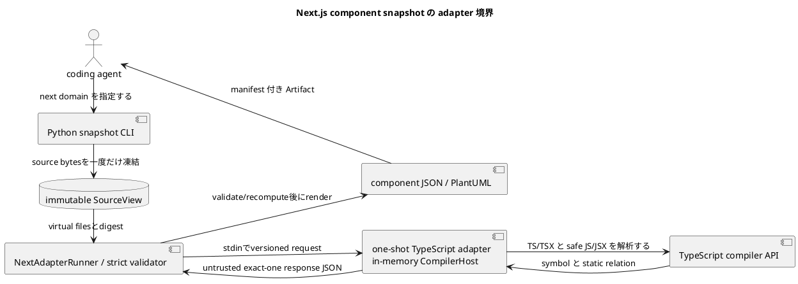
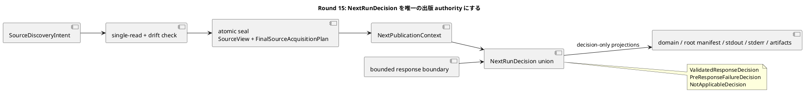

# iss-00008 Generate Next.js Component Snapshots — 設計

詳細: [Design Guide](../../../../../../docs/authoring/design.md)

## 設計目標

- `next` domain の `snapshot` を、CLI から source acquisition、analysis、versioned JSON、PlantUML、manifest、diagnostic まで一つの vertical pipeline として設計する。
- accepted ADR の独立 product ownership、named endpoint、dual snapshot、adapter boundary、agent-first Artifact、安全な static analysis、product HTML exclusion、vertical slicing を破らない。
- common abstraction は lifecycle、diagnostic、Artifact descriptor、graph primitive に限定し、domain-specific identity/member/relation/matching を adapter が所有する。

| Design ID | Requirement trace | 判断 |
| --- | --- | --- |
| I05-DES-001 | I05-REQ-001 | explicit project/targetをdomain-awareに解決し、Next snapshotを既存one-run outcome/publication pipelineへ接続する。 |
| I05-DES-002 | I05-REQ-002 | domain-owned SourceAcquisitionPlanでPythonがbytesを一度だけ凍結し、one-shot Node workerはvirtual files、bundled TypeScript、closed TrustedTypeEnvironmentだけを解析する。 |
| I05-DES-003 | I05-REQ-003 | declaration Componentとexport bindingを分離し、closed props IR、two-plane static relation、positive-evidence boundary fact/roleをNext semanticsとする。 |
| I05-DES-004 | I05-REQ-004 | `next-adapter/v1` responseをuntrusted inputとしてPythonがstrict validate/recomputeし、public semantic/PlantUML/manifestをPython側でrenderする。 |
| I05-DES-005 | I05-REQ-005 | promised semanticsの欠落に基づきcomplete/partial_safe/payload_unavailableを分類し、explicit target、budget、transport failureをfail-closedにする。 |
| I05-DES-006 | I05-REQ-006 | fixed process boundary、in-memory CompilerHost、finite limits、redaction、offline bundle、Node optionality、same-input determinismを検証する。 |
| I05-DES-007 | I05-REQ-007 | closed stdout selectorをsource acquisition前に検証し、publication後exact bytesまたはtyped unavailable resultをstderr diagnosticsと分離して出す。 |

## Current / Target

### Current（canonical specification state）

- 本 Issue の canonical state は stable scope ID と repository-relative Requirement/Design/Plan path、accepted ADR、interviewで識別する。採用・実装開始時に HEAD と configured upstream を再検証し、current commit SHA を本文へ固定しない。
- Python package、CLI、Git/SourceView、config/targets、outcomes、Python/SQLAlchemy adapter、schema、manifest、stdout/writer、tests/goldenは実装済み。Next production adapter、Node workspace、protocol/schema、fixtures/goldenは未実装である。
- current closed registriesは`python/sqlalchemy`を所有し、source candidate/target/configはPython semanticsへ具体依存する。Nextはこれらをopen-endedにせずclosed branchとして追加する。
- 本Designは親の横断contractをslice固有の構造へ具体化し、依存Issueのpublic contractを変更せずに後続sliceへ渡す。

### Target

- coding agent が first-party TypeScript adapter を通じ、Next.js repository の module、exported component、props、static relation、client boundary を JSON と PlantUML で取得できる。
- source/body/secret を漏らさず、failure と coverage を manifest で agent が機械判定できる。
- downstream Issue はこの Design の stable interface だけへ依存し、内部 class layout を fork しない。

### Round 8 review state

ChatGPT Use Strict Round 8 は `review_status: fail`、P0=0、P1=4、P2=0 だった。
4件の修復は、root run manifestのNext branch、凍結source bytesによる独立export
census、response検証後のEntityBudgetGate、program-only semantic ownershipとして、
このDesignとdata-only contractへ反映する。fresh exact-SHA Strictは未実行・未通過で、
readinessは未確定である。production Next adapter/CLIは未実装のまま維持する。

### Round 9 contract remediation (design-fixed)

Round 9 は `review_status: fail`、P0=0、P1=7、P2=1。fresh exact-SHA Strictは
未実行・未通過で、readinessは未確定、production実装は未着手である。次の閉じた
設計を実装前契約として固定する。

1. Python-owned frozen UTF-8 tokenizerは、local export list、default alias/
   declaration/expression、複数・改行入りspecifier、comments、NFC Unicode
   IdentifierName、CRLF、BOMを認識し、token identityとexact byte spanを返す。
   Nodeのsyntax identityはこのcensusとexact-equalでなければならない。
2. re-export observationとは別に、`syntax_identity`、`source_specifier`、
   `imported_name`、resolved source Module、expanded exported name、target
   declarationを持つsource-edge witnessを返す。Pythonはfrozen module graphから
   alias/star/cycle/conflictを再計算し、observation・public ExportBinding・coverage
   countを比較する。value/type/unknownはcoverage-onlyである。
3. response validation後のEntityBudgetGateはpre-budget outcomeを入力にし、
   under-budgetのcomplete/partial_safeを同じoutcomeでmanifest/stdoutへ投影する。
   overrunだけを`payload_unavailable`へ落とし、valid overrideもpartial_safeを
   completeへ昇格させない。
4. `max_adapter_stderr_capture_bytes`（adapter childのincremental UTF-8 capture）
   と`max_stderr_bytes`（public diagnostic encode/write）を別カウンタにする。limitは
   inclusive、limit+1はprocess-group termination、raw/partial disposal、固定
   `CSV-NEXT-LIMIT-003`、manifest上のraw bytes非公開とする。
5. `max_total_array_items`（response全array aggregate）、`max_array_items`（各array）、
   `max_collection_items`（semantic collection）を分離し、materialize前のcounterで
   100001を拒否する。`max_model_records`は10,000へ固定し、公開model recordごとの
   ID-only proof rowを含めてもaggregate/raw capへ到達する値にする。
6. `SourceAcquisitionPlan/v1` descriptor/schemaはresolved control paths、local
   extends closure、file-role map、projects、suffixes、exclusions、limits、trusted
   digestの全fieldをcanonical JSON SHA-256へ含める。input/config/source-planは
   NFC UTF-8 root-path order、semantic recordsはrecord-ID orderとする。
7. public targetは`path:`だけであり、pathから解決したinternal Component seedは
   traversal/taint witness内部に限定する。public component selectorを再導入しない。

### Round 10 review state and Pass A remediation

ChatGPT Use Strict Round 10 は `review_status: fail`、P0=0、P1=8、P2=0 だった
（詳細は `20260901t000000z-disc-strict-spec-review-round-10.md`）。fresh exact-SHA
Strictは未実行・未通過で、readinessは未確定、production Next adapter/CLIは未実装である。
Pass Aの設計固定は次のとおりとする。

1. Project対応はimmutable ID/rootをキーに比較する。input/config/source-plan/root
   manifestはNFC UTF-8 root-path order、semantic collectionsとrun fingerprintの
   project recordはID orderとして、それぞれのsurfaceで独立に検証する。
2. `EntityBudgetGate`のpre-budget outcomeはvalidated proof/modelから導出し、既定値を
   持たない。under budgetは`complete`または`partial_safe`を保持し、overrunだけを
   `payload_unavailable`へ変換する。artifactはrequested formatだけを選ぶ。
3. `next-path-v1`をcanonical non-root POSIX path値として共有し、root sentinel `.`は
   rootを表すフィールドだけで許可する。empty segment、embedded dot、trailing slash、
   control、backslash、非NFCを拒否し、4096はUTF-8 path value bytes（`path:` prefixを
   除く）として数える。
4. program roleかつ`.ts/.tsx/.js/.jsx`の各Fileは、同一project/pathのsemantic Module
   exactly oneを要求する。欠落・重複・Componentだけの置換はfile/directory targetを
   fail closedにする。

Round 10 Pass Bで、closed export grammar、独立re-export graph、public stderr、bounded
JSON decoderのdata-only closureを実装前契約へ反映した。export scannerはmodule-level
深さ・JSX/property/regex/template/string/commentの除外、async/generic/type span、
semicolon/ASI方針とexact UTF-8 bytesを固定する。re-exportはraw declaration/edgeから
alias、star 0..N（default除外）、cycle/conflictを再計算し、main proofへ統合する。
public stderrはcanonical JSONLを先にUTF-8 encodeし、inclusive limit/+1、partial write 0、
`CSV-NEXT-LIMIT-003`、manifest-onlyを固定する。responseはduplicate key、depth、string、
per-array/aggregateをbounded decoderでmaterialize前に数える。fresh exact-SHA Strictは
未実行・未通過、readiness未確定、production実装未着手である。

### Round 11 review state and Pass C remediation

Round 11 は exact SHA `75ac0e0b34347b825c0bec2e6fbf9ff2068d9a1b`、CI run
`33422630936`（7/7 success）で `review_status: fail`、P0=0、P1=8、P2=0だった。証拠は
`20260901t010000z-disc-strict-spec-review-round-11.md`へ保存する。Pass Cでは、root-path
orderとsemantic ID orderを分離した逆順二projectのresponse→domain→root→fingerprint
chain、全projectionで同一のrun context、全path surfaceで共有するUTF-8/NFC helper、
program File→exactly one Moduleのtyped pre-model failureをdata-only validator/schema/
fixture/testへ反映した。Pass Dでは、module-level JSX lexical scanner、raw declaration/edgeからの
独立re-export witness、public diagnostic stderrのbounded JSONL gate、raw response bytes専用の
bounded decoderを追加でfixture/testへ反映した。fresh exact-SHA Strictとreadiness確認は未実施で、
production adapter/CLIは未実装のままである。

Pass Cの設計不変条件は次のとおりとする。

1. Project対応はID/rootで行う。input/config/source-plan/root manifestはNFC UTF-8
   root-path order、semantic record collectionはrecord-ID orderとし、各surfaceの
   submitted順を独立に検証する。formatsと実際のstdout selectorはfingerprint preimageへ含める。
2. `NextRunContext`は`requested_formats`、budgetのrequested/resolved/source、
   `stdout_selector`を持つ唯一のprojection contextであり、response、gate、domain、root
   runで値を複製する。selectorは`null`、`manifest`、またはrequested formatに対応するNext selectorに閉じ、FORMAT_ORDERを暗黙補完しない。
3. `next-path-v1`の`maxLength`は補助ガードであり、NFC、UTF-8 byte（4095/4096受理、4097拒否）、
   root `.`の文脈規則は共通helperが再検証する。ordinary file pathにroot sentinelを許さない。
4. target resolution前にprogram File→Module写像を型付きfailureとして判定し、missing/
   duplicate/Component-onlyのfile/directory targetは`CSV-NEXT-TARGET-001`、全domain
   `payload_unavailable`、no artifact、manifest/stdout unavailable、exit 3へ投影する。

### Round 11 Pass D（P1-3〜P1-6）

Pass Dのdata-only契約は次を固定する。

1. export scannerはJSXのself-closing tag、fragment、同名nested tag、属性と属性式をstack/lexical
   stateで閉じ、string/template/comment/regex/property内の`export`を構文として扱わない。async
   declaration、generic/type span、ASI方針、BOM/CRLF、Unicode NFC、exact UTF-8 byte spanを同じ
   source censusから再計算する。
2. re-export witnessはraw declarationとedgeだけから独立導出する。original/exported nameを分離し、
   legal double alias、star 0..N（default除外）、cycle/conflict/missing sourceのreasonを閉じた
   witnessへ保持する。そこからcomponent bindingとvalue/type coverageを投影し、response proofで
   exact compareする。
3. public diagnostic stderrはcanonical JSONL全行をUTF-8 encodeしてから計測する。inclusive limitは
   出力し、limit+1はpartial write 0、`CSV-NEXT-LIMIT-003`、raw/partial disposal、manifest-only
   projectionとする。adapter capture counterとは分離する。
4. response trust boundaryはraw bytes一つだけとし、bounded decoderがduplicate key、nesting、decoded
   string bytes、per-array、aggregate array itemsをmaterialization前に数える。個別arrayが上限内でも
   aggregate 100001はrejectし、成功時だけ同じ入口からobject/schema/envelope validationへ進む。

Pass DはRound 11のP1をローカル契約へ反映した状態を示すだけであり、Round 11 Strictの
`review_status: fail`（P0=0、P1=8、P2=0）を書き換えない。fresh exact-SHA Strictは未実施・未通過で、
readinessは未確定、production adapter/CLIも未着手である。

### Round 12 review state and remediation contract

ChatGPT Use Strict Round 12 は exact SHA `48266f813353a7fd78e4e15d72ff6d33c4142827`、CI run
`33435802167`（7/7 success）に対して `review_status: fail`、P0=0、P1=8、P2=0を返した。原文と
transcript digestは `artifacts/20260901t020000z-disc-strict-spec-review-round-12.md` に固定する。
Round 12の修復は実装前の契約だけを更新し、fresh exact-SHA Strictは未実行・未通過、readinessは
未確定、production adapter/CLIは未着手である。

- 二projectのinverse-order fixtureは、request→validated response→domain→publication/root manifest→
  fingerprintを同一modelで接続し、projectをID/rootで対応させ、各surfaceの順序を独立検証する。
- `NextRunContext/v1` は `null`、`manifest`、`next:semantic-json`、`next:plantuml` を閉じた値として
  requestが所有する。responseは全contextをexact echoし、gateはcontextからresolved budgetだけを得る。
  omitted selectorや500のsourceをformat順や値から推測しない。
- responseはraw bytes→bounded decoder→closed schema→shared path/ref/count基礎検証→typed target判定
  の順で検証する。targetのmissing/duplicate/component_onlyがあっても、wrong schema、extra field、
  unsafe compound mutationはprotocol/schema failureを迂回できない。
- JSX lexerはNFC Unicode IdentifierName segmentのpaired/nested/member/namespace tag、attribute/text
  state、偽export除外を閉じる。re-exportはexported-name tableのみでlookupし、owner Module、resolved
  physical target、original/exported name、cycle/conflict reasonを独立witnessへ保持する。
- component resolutionはnon-null target declarationを要求し、double alias/star（default除外、0..N）を
  binding/coverageへ投影する。schema-valid cycle/conflict responseは`CSV-NEXT-EXPORT-001`のdomain/root/
  stdout unavailable、exit 3 vectorへ進む。全path surfaceは`#`を含む値をshared helperで拒否し、File→Module
  target failureはfile/directory targetそれぞれで三分類する。`missing`は選択されたprogram Fileが存在するが
  Moduleがなく期待されるModule identityを参照するComponentもない純粋な欠落、`component_only`はModuleが
  ない一方でそのComponentが残る状態、`duplicate`は同じ選択Fileにbyte-identicalなModule行が複数ある状態
  である。`duplicate`は選択対象の同一行だけに限る狭い例外としてtyped failureへ進め、三分類すべてを
  response→diagnostic→domain→root manifest→stdout unavailable→exit 3へ投影する。

### Round 13 review state and remediation design

Round 13 Strict は対象SHA `991516bf730f4f2ddb3d15067702dcfae95ec6b1`、CI run `33446911714`
（7/7 success）で `review_status: fail`、P0=0、P1=9、P2=1だった。詳細は
`artifacts/20260901t040000z-disc-strict-spec-review-round-13.md` に保持する。data-only設計の
修復後もfresh exact-SHA Strictは未実行・未通過、readinessは未確定、production implementationは
未着手であり、履歴のfailをpassへ変更しない。

- **Authority:** raw responseはbounded decode→closed schema→proof-base→typed targetの順に検証し、
  一つのimmutable `NextRunDecision`だけを後段へ渡す。valid responseは
  `ValidatedResponseDecision`、response成立前の失敗は`PreResponseFailureDecision`、適用対象外は
  `NotApplicableDecision`とし、各variantがpayload availability、diagnostic、counts、artifacts、exit
  behaviorを閉じて所有する。
- **Publication:** semantic六collectionとPlantUMLは同じvalidated modelからrenderし、canonical bytes、
  artifact hashes、root descriptorを再計算する。schema-validな順序・payload変異をrootで拒否する。
- **Failure/graph:** `missing`・`component_only`・`duplicate`を全projectionへ保持し、double alias、
  empty/multi starとdefault exclusion、cycle/conflictを独立whole-run vectorで`CSV-NEXT-EXPORT-001`
  または`CSV-NEXT-TARGET-001`、unavailable stdout、exit 3へ写像する。
- **Re-export/lexing:** owner/file、source/imported/original/exported name、syntax identity、byte spanを
  含むbijective joinを要求する。IdentifierName表はUnicode 15.0.0へ固定し、Other_ID setsとU+00B7を
  含め、そのversionをcompatibility/run-fingerprintへ入れる。
- **Shared boundaries:** root-or-path schemaを全path surfaceへ適用し、root `.`を文脈限定で受理する。
  private adapter responseの`max_adapter_response_bytes`はdecode前に検査し、16 MiB+1はmaterializationもpartial
  writeも行わない。`max_stdout_bytes`は公開selected stdoutのv1互換aliasである。
- **Evidence hygiene:** Round 13の対象SHA/CI/fail countsとP1-1..P1-9/P2-1をartifactへ記録し、HTMLの
  重複項目を除く。local gate successをStrict pass、readiness、またはproduct implementationの開始と解釈しない。

### Round 14 review state and remediation design

Round 14の初回connector失敗と成功した再試行の完全なtranscriptは
`artifacts/20260901t031000z-disc-strict-spec-review-round-14.md`へ保存する。成功した再試行は対象SHA
`cf5da416e25e76068ed99caf0d450d0e2d5b28df`、CI run `33457932686`（7/7 success）を確認したが、
`review_status: fail`、P0=0、P1=5、P2=2、`implementation_ready: no`である。fresh current-SHA Strictは
未実行・未確認、readinessは未確定、production implementationは未着手であり、履歴のfailをpassへ
変更しない。

Round 14の設計閉包は次のとおりである。

- **Decision union:** `NextRunDecision`をclosed unionとして実装し、pre-response failureはrequest-owned
  `NextRunContext`、closed stage/diagnostic、known/null counts、`payload_unavailable`、artifact 0件、
  exit 3を保持する。domain/root/manifest/stdout/stderrはdecision projectionだけを受け、各failureの
  `_domain`や独立statusをauthorityにしない。
- **Proof semantics:** `not_selected`とselection-only `target_excluded`はcompleteを維持する。
  `unsupported`はunknown coverageと`CSV-NEXT-UNSUPPORTED-001`を持つcomplete、locality proof付きの
  taint/failedだけがpartial_safe、adapter proofの`over_budget`はprotocol rejection、予算超過は
  Python `EntityBudgetGate`、explicit target identity failureはtyped payload unavailableとする。
- **Deterministic Unicode:** Unicode 15.0.0のID_Start/ID_Continue/Other_ID sets/U+00B7/Join_Controlを
  checked-in deterministic tableで判定し、table digestをtrusted profile、compatibility、run fingerprint
  の全preimageへ含める。host Unicode databaseへの依存を禁止する。
- **Reachable limits and capture:** proofの公開model recordはID/reference evidenceとし、
  `max_model_records=10,000`へ固定する。9,999 compact context Files + 1 Projectのschema-valid
  responseをexact boundary、10,001件をmodel-limit boundaryとして実wireで検証し、aggregate/raw
  precedenceも同じ入口で固定する。child stdoutは`max_adapter_stdout_capture_bytes`でincremental
  captureし、exact受理、+1停止・破棄・未decode・`CSV-NEXT-LIMIT-003`/manifest-only/exit 3を固定する。
- **Target failures:** stdoutの正本はsorted unique `target_failures:[{target_key,reason}]`であり、
  `missing`/`component_only`/`duplicate`をtarget unavailable branchだけに許す。available、not_applicable、
  generic unavailable、fatal、interruptでは同fieldを禁止し、top-level単一`reason`は持たない。
- **Source seal:** `SourceDiscoveryIntent`→two-phase single-read→`FinalSourceAcquisitionPlan`と`SourceView`
  のatomic sealを採用し、drift check後のreadを禁止する。reader instrumentationで一回読み・同一seal・
  frozen byte一致を検証する。

最小受入テストは、pre-response node/protocol/limitの全projection、proof reason四ケース、Python version間
Unicode全code point digest、model/aggregate/rawのexact/+1、stdout capture exact/+1、target failure cardinality、
source reader sealを`tests/contracts/test_next_contracts.py`とschema mutationで実行する。local gateの成功は
fresh Strict pass、implementation readiness、production implementation開始を意味しない。

## 責務・Interface

### planned component responsibilities

| planned path / symbol | 状態 | 責務 |
| --- | --- | --- |
| `src/code_structure_viz/source/source_view.py`（existing） | existing extension | domain-owned acquisition planを受け、既存Git/source safetyでbytesを凍結する。 |
| `src/code_structure_viz/source/targets.py`（existing） | existing extension | Python grammarを維持し、Next project/path targetへdomain-aware routingする。内部Component seedは解決後のselection stateでのみ扱う。 |
| `src/code_structure_viz/core/config.py`（existing） | existing extension | closed `[next]` config、value source、digestを追加する。 |
| `src/code_structure_viz/core/domains.py`、`application/snapshot_domain.py`（existing） | existing extension | Nextをsnapshot registryへだけ追加する。 |
| `src/code_structure_viz/artifacts/`、`core/outcomes.py`（existing） | existing extension | Next coverage/path/schema/stream/writer/publication invariantを追加する。 |
| `src/code_structure_viz/adapters/next/`（planned） | new | applicability、protocol、hardened runner、response validator/mapperを所有する。 |
| `adapters/next/`（planned source workspace） | new | compiled adapter、TypeScript analyzer/model、in-memory CompilerHost、lock/licenseを所有する。runtime assetsはwheel内`src/code_structure_viz/_next_runtime/`へ配置する。 |

### common command interface

```text
code-structure-viz snapshot --repo PATH --output-dir PATH [--domain DOMAIN] [--project RELATIVE_DIR] [--target SELECTOR] [--format FORMAT] [--config PATH] [--stdout SELECTOR]
code-structure-viz diff --repo PATH --output-dir PATH [--domain DOMAIN] [--from ENDPOINT] [--to ENDPOINT] [--format FORMAT] [--config PATH] [--stdout SELECTOR]
```

- `--output-dir` は必須。writer は existing file を置換せず、全 payload を staging 後に公開する。
- `--format` 未指定は semantic JSON と PlantUML。`--stdout` は output directory requirement を解除しない。
- analysis behavior を environment variable で変更しない。環境は executable discovery と locale-independent process setup にだけ使う。
- `--repo`はexact Git root。repeatable `--project`はconfig `[next].projects[].root`を置換し、defaultは`.`。source/configはproject descriptorから解決し、monorepo/workspaceを自動探索しない。
- Next targetの公開文法は`path:REPO_REL_FILE_OR_DIR`だけである。これは内部
  semantic Module/Component IDとは別の利用者向けアドレスであり、
  `component:`、`module:`、`file:`形式は受理しない。file pathは、対応する
  frozen Fileが`program` roleかつsuffix `.ts`、`.tsx`、`.js`、`.jsx`の場合だけ
  File・Module・Component集合へ解決する。`.d.ts`、`package.json`、
  `tsconfig.json`、`jsconfig.json`はcontext/control provenanceでありdirect target
  にはできない。directory pathは全canonical descendant frozen集合へ解決し、
  context/control Fileをprovenanceに残してもsemantic childは作らない。複数descendant
  は正常で、missing、project-scope ambiguity、out-of-scope、選択集合の
  tainted/excluded/failed recordのいずれか一つでも`CSV-NEXT-TARGET-001`・
  `payload_unavailable`・no-artifactとする。

### stdout selector and stream routing

CLI parser は `--stdout` を optional single-value option として一度だけ受理し、closed grammar `manifest | DOMAIN:FORMAT` を `StdoutSelector` valueへ正規化する。domain/format の resolved selection が確定した直後、source acquisition より前に selector compatibility を検証する。boolean、path、alias、略記、大小文字違い、値省略、重複、未選択 domain、未要求 format は `UsageError` とし、source acquisition と publication の前に exit 2、stdout 空、Artifact 0件で終了する。`OutputTransaction` は開始しない。

通常 publication 後、既存 CLI/application boundary 内の stdout emitter は次のいずれか一つだけを行う。新しい command または独立 architecture layer は追加しない。

1. selector なしなら `run-summary/v1` を canonical JSON 1行として出す。
2. selected Artifact が利用可能なら、公開 file を binary read して exact bytes を複製する。
3. selected Artifact が利用不能なら、closed `NextRunDecision` の projection から `stdout-result/v1` 1行を構築する。

stdout emitter は diagnostic renderer と分離し、diagnostic は stderr だけへ出す。exact-byte copy に summary、BOM、改行補正を加えない。`stdout-result/v1` は status と stable reason だけを参照し、source content、absolute path、secret を受け取る field を持たない。handled SIGINT は cleanup 完了後に `run_status: interrupted` を返せる場合だけ exit 130 の result line を出す。process を強制終了された場合の出力は契約外である。

Nextのunavailable target projectionは、decisionが保持する全target failureをcanonical sorted
`target_failures: [{target_key, reason}]`として出す。`missing`、`component_only`、`duplicate`はtarget
payload unavailable branchだけで許可し、available、not_applicable、generic domain unavailable、fatal、
interruptではtarget failureも旧top-level単一`reason`も出さない。

### snapshot path excludes comparison facilities

command dispatch は `SnapshotSourceRequest` と `DiffSourceRequest` を型で分ける。snapshot branch は単一のrun-start `SourceView`だけを作り、`ComparisonEndpointResolver`、start-HEAD anchor、`FileChangeSet`、`ChangedPathAdmissionGate` を呼び出せない依存方向にする。CLI validation はdiff-only optionをsnapshot requestへ変換する前に拒否する。acceptance fixtureはimplicit base不在と1,001 non-domain changed pathsを同時に持つrepositoryでsnapshotが通常処理されること、diff-only option併用だけがexit 2になることを検証する。

### source interface

```json
{
  "schema": "code-structure-viz.source-view/v1",
  "kind": "working-tree",
  "head_commit": "full-sha-or-null",
  "files": [{"path": "repository/relative", "kind": "regular", "resolved_target": null, "size_bytes": 1, "sha256": "digest"}],
  "failures": [],
  "fingerprint": "source-view-fingerprint"
}
```

これはcurrent `SourceView` descriptorに合わせた説明である。internal `SourceFile.content`、inventory、state fingerprintはpublic serializerへ渡さない。Next extensionはこの型を置換せず、各fileに別のplan-owned role mapを対応付ける。absolute temporary pathをserializerへ渡さない。

### domain adapter interface

```text
analyze_snapshot(SourceView, ResolvedConfig, TargetSelection) -> DomainSnapshotResult
compare_snapshots(DomainSnapshot, DomainSnapshot, DiffPolicy) -> DomainDiffResult
render_semantic_json(DomainResult) -> bytes
render_plantuml(DomainResult, VisualVocabulary) -> bytes
```

この Issue が未使用の method は実装を強制しない。後続 slice が stable contract を additive に拡張する。

### incomplete classes and publication

`DomainOutcome` は `status` に加え、status が `incomplete` の場合だけ `incomplete_kind: partial_safe | payload_unavailable` と `payload_available` を持つ。

- `partial_safe` は isolated failure set、safe subset、explicit coverage frontier、safe diagnostics、redaction pass、entity-budget pass、requested renderer passをすべて満たす場合だけ生成する。requested domain payload と manifest descriptor を同一 transaction で公開する。
- `payload_unavailable` は safe subset不在、global acquisition/protocol/schema/security/unsafe-path failure、entity overrun、または diff side failureで生成する。affected payload descriptorは空とし、safe core manifestだけを許す。
- Issue #8はsingle-domain outcomeだけを所有する。`partial_safe`はpayload+manifest、`payload_unavailable`はmanifest-only、run-level fatalはfinal manifestを含む全stagingを破棄する。multi-domain aggregationはIssue #10へ委譲する。

serializer と manifest builder は `incomplete_kind` と `payload_available` の整合を検証する。`partial_safe` なのにrequested descriptorが欠ける状態、`payload_unavailable` なのにaffected descriptorがある状態はinternal contract failureとしてpublication前に拒否する。

## Adopted Next v1 semantics

### Project applicability and source plan

- selected project root直下`package.json`のdirect `dependencies.next`または`devDependencies.next`がnon-empty stringの場合だけapplicableとする。
- `next.config.*`、directory名、source import、lockfile indirect entryはapplicability evidenceにしない。
- applicable project 0かつexplicit targetなしはNode probeなし`not_applicable`。applicableでComponent 0は`complete empty`。malformed manifest/configはabsenceを証明できないため`payload_unavailable`。
- immutable `SourceAcquisitionPlan`はproject roots、program/context/control files、include roots、hard exclusions、finite limits、plan versionを持つ。
- program filesは`.ts/.tsx/.js/.jsx`、`.d.ts`はcontext-only。hard excludeは`.git`、`node_modules`、`.next`、`out`、`dist`、`build`、`coverage`。
- test/spec/storyはdefault excludeにしない。config lookupは`tsconfig.json`、`jsconfig.json`、versioned built-in safe configの順。
- repository-local `extends/baseUrl/paths`だけをfrozen SourceView内で解決し、package-based extends/target node_modulesを暗黙に読まない。
- Python coreがplanに従いsource bytesを一度だけ凍結し、Node requestへrepository-relative path、base64 content、digest、project/config/target/limitだけを渡す。target root path/cwdを渡さない。

### Process and toolchain boundary

- one request/one response/one process。fixed executable/compiled entrypoint argv、`shell=false`、private empty cwd、minimal envを使う。
- `NODE_OPTIONS`/`NODE_PATH`を除去し、npm/npx/network/target node_modules、Next config、plugin、build/migration/package/application moduleを利用しない。
- custom in-memory `CompilerHost`はrequest virtual files、bundled TypeScript lib、closed TrustedTypeEnvironmentだけを読む。
- compiled first-party adapter、exact TypeScript runtime、lockfile、license inventoryを一つのcompatibility unitとしてbundleする。
- Node 22 LTS以上はapplicable Next runだけで必要とし、Python/SQLAlchemy core install/run/testへ持ち込まない。

v1 finite limitsは4 MiB/file、64 MiB decoded total、20,000 files、96 MiB encoded stdin、各array/aggregate array 100,000、collection 20,000、model records 10,000、16 MiB stdout、public diagnostic stderr 64 KiB、adapter stderr capture 64 KiB、60秒、512 MiB old-spaceとRound 2 decoder/model limitsに固定する。adapter captureとpublic diagnostic emissionは別のincremental counterとし、unbounded/silent truncationは不可。

### Identity and members

- `ProjectDescriptor`はgrouping/provenanceでentity budget外。
- `ModuleEntity` identityはrepository-relative physical module path。route/router/boundary/rangeはattribute。
- `ComponentEntity` identityはModule ID + declaration key。named bindingまたはmodule-local `@anonymous-default`を使い、range/export/barrel/route/wrapper/propsを含めない。
- `ExportBindingMember` identityはowner Module + exported nameで、target declaration Component IDをpayloadに持つ。barrel/re-export/aliasはbindingを増やすがComponentを複製しない。
- `ImportBindingMember`はowner Module + origin/imported name/type-value role。local alias/order/rangeはidentity外。
- `PropMember` identityはComponent ID + prop name。type/optional/default evidence/rangeはpayload。
- exported/route rootからproven renderまたはsupported wrapperで到達するmodule-local Componentだけを`reachable_local`として含め、unreachable localは省く。
- IDはversioned kind + canonical identity JSONのSHA-256で作り、Pythonが再計算する。

### Component recognition and props

- PascalCaseだけでComponentと認定しない。safe React-compatible callable/construct signature、closed React class provenance、recognized UI route default、proven JSX output-flow、closed wrapper originのpositive evidenceを要求する。
- v1 wrapper allowlistは`memo`、`forwardRef`、`lazy`、literal-pattern `next/dynamic`。custom HOCはunknown/coverage limitation。
- propsはTypeCheckerのeffective call/construct signatureから取得し、source spelling/`typeToString()` raw textをpublic contractにしない。
- closed type IRはprimitive、ordinal type parameter、redacted literals、repository/external reference、array、tuple、union、intersection、parameter-name-free function、object、opaque。
- NFC、canonical sort/dedup、generic alpha-normalizationを行い、literal value/function parameter名を出さない。`children`/`ref`はpublic signatureに実在するときだけ。
- v1 complexity limitsはdepth 16、nodes/prop 512、union/intersection 64、nested properties 256、signatures/component 16。over-limit subtreeはtruncationせずopaque + partial coverage。

### Two-plane relations

| kind | source | target | plane |
| --- | --- | --- | --- |
| `static_import` | Module | Module/external | module |
| `literal_dynamic_import` | Module | Module/external | module |
| `jsx_render` | Component | Component/external | component |
| `component_wrap` | Component | Component | component |

containmentはownership/zero-hopで、import/render planeを暗黙fan-outしない。relation identityはsource/kind/target/semantic role。range/order/local alias/syntaxはpayload。

JSX relationはComponent return、concise arrow、class render、single-assignment constへのbounded backward flowをrootにし、JSX children、conditional/logical、array、安全なArray/ReadonlyArray map/flatMap、exact React `createElement`を閉じて追う。event handler、render prop/function child、arbitrary helper、ambiguous symbol、runtime resultはedgeにしない。nonliteral importはedgeなし+unknown coverage。externalはfrontierで止める。

downstreamはsource→dependency/render target、upstreamはreverse。depth traversalはinternal entityだけ。

### Positive-evidence client boundary

- direct `client_entry`: exact directive prologue。
- direct `router_context`: `app_ui`、`pages_ui`、`pages_api`、`app_route_handler`、`none`。
- derived `client_dependency`: direct client_entry factをseedにしたinternal static value closureのtargetとして到達。seed自身はこのroleに含めない。
- derived `server_candidate`: closed App Router UI seedからclient entry直前まで到達。seedがclient entryなら含めず停止し、runtime server claimではない。
- `unknown`: positive evidenceなし。Pages Routerも自動server扱いしない。
- 同一Moduleのclient_dependency/server_candidate dual roleを許す。type-only/dynamic/JSX/external/unresolved edgeはpropagationに使わない。
- boundary crossingはunderlying value edgeの`boundary_effect` facetでduplicate traversal edgeを作らない。Issue #9はprimitive fact/edgeをprimary diffにする。

### Adapter validation and public contracts

Node stdoutはexact one `code-structure-viz.next-adapter/v1` JSON document。Pythonはprotocol version、closed schema、path containment、ref integrity、duplicate/enum、redaction、NFC/order、ID、count/coverage/digest、explicit target completeness、renderer subset consistencyを検証・再計算する。validation failureはpartialへdowngradeせずresponse全体を拒否する。

public paths/contracts:

- `next.snapshot.semantic.json` / existing `code-structure-viz.semantic/v1`
- `next.snapshot.puml` / `code-structure-viz.plantuml/next/v1`
- existing `code-structure-viz.run-manifest/v1`

manifestはNode/TypeScript/adapter/protocol version、project/config path、source plan/config/source digest、target/depth/budget requested/resolved、coverage、safe diagnostic、Artifact path/size/SHA-256を持つ。

closed domain/schema/artifact/stream/writer/outcome registryへNext branchを明示追加し、`additionalProperties: false`やallowlistを緩めない。

## Normative closure contracts

### TrustedTypeEnvironment/v1

target `node_modules`を読まずにReact/JSX/Nextのv1 acceptanceをTypeCheckerで成立させるため、adapter compatibility unitへclosed declaration setをbundleする。

| component | content | provenance |
| --- | --- | --- |
| TypeScript libs | selected compiler versionのstandard `lib.*.d.ts` | TypeScript exact version/digest/license |
| JSX environment | v1で必要な`JSX.Element`、intrinsic boundary、jsx-runtime surfaceの最小declaration | environment schema/version/digest |
| React environment | function/class component、FC-compatible call、memo/forwardRef/lazyの認識に必要な最小declaration | environment schema/version/digest/license |
| Next environment | v1 literal-pattern `next/dynamic`の最小declaration | environment schema/version/digest/license |

- environment contractは`code-structure-viz.next-trusted-types/v1`。compiled adapterと同じwheel resource treeに置く。
- target package versionとの互換を推測せず、これはCodeStructureViz v1 semanticsを定義するtrusted modelである。
- requestはexpected environment digestを持ち、responseはactual digestをechoする。mismatchは`CSV-NEXT-TRUST-001`、payload unavailable。
- manifestはenvironment schema、version、SHA-256、license inventory digestを記録する。
- environment外のexternal declarationをdisk/networkから補わない。package/export identityだけを証明できる場合はexternal reference、props shapeが必要で証明不能なら`opaque(external_unresolved)` + localized partial。
- target sourceがtrusted signatureと構造的に一致しない場合、wrapper/componentを認定せずunknown coverageにする。

### ComponentDeclarationResolution/v1

| source pattern | canonical Component | declaration key | extra Component | wrapper relation | failure |
| --- | --- | --- | --- | --- | --- |
| module-scope `function Button` / `class Button` | value symbol | `Button` |なし |なし | post-NFC collisionでunavailable |
| module-scope `const Button = callable` | outer value binding | `Button` |なし | allowlisted wrapperなら下記規則 | collisionでunavailable |
| `const Button = function Inner(){...}` | outer value binding | `Button` | inner function expressionはentityにしない |なし | positive evidenceなしはunknown |
| overload signatures + implementation | implementation value symbol一件 | outer binding name |なし |なし | implementationなしはunknown |
| `export default function Button()` / named class | named declaration | `Button` |なし |なし |なし |
| direct anonymous default function/class/expression | default result | `@anonymous-default` |なし | allowlisted expressionなら下記規則 |複数default/identity collisionでunavailable |
| `const Public = memo(Inner)` | outer result | `Public` | `Inner`が独立module-scope positive Componentなら保持 | `Public -> Inner` | wrapper/provenance ambiguityはunknown |
| `export default memo(Button)` | default result | `@anonymous-default` | module-scope `Button`を保持 | default result `-> Button` | target ambiguityはunknown |

- declaration keyはNFC後UTF-8 byte identity。binding kind/function/class/constはkeyに入れない。
- type/value merged symbolはvalue symbolだけをComponent候補にする。
- inner function/class expressionはmodule-scope bindingを持たない限り独立Componentにしない。
- `component_wrap` sourceはwrapper result Component、targetは独立entityとして存在するwrapped Component。
- wrapped targetが独立entityでなければrelationを作らずwrapper provenance attributeだけを持つ。
- normalized declaration/export/prop identity collisionはmergeせず`CSV-NEXT-IDENTITY-001`、payload unavailable。

### ExportBindingResolution/v1

The adapter first emits an independent complete `ExportObservation` stream;
the public `ExportBindingMember` is a projection and is never the source of
truth for coverage. Python owns a checked-in frozen UTF-8 source-byte census
fixture and a closed deterministic scanner. Each observation carries the
repository-relative `owner_file_path`, exact `byte_start`/`byte_end`,
`token_identity`, `syntax_kind`, canonical `exported_name`, value/type `role`,
`reexport`, and `star`; TypeChecker resolution is one of `component`, `value`,
`type`, or `unknown`, with an optional `component_id`. Node observations must
exact-match the census syntax identity and Python cross-checks resolution
against the model/TypeChecker witness. Python derives every public binding and
export coverage count, and exact-compares both projections. Omission, duplicate
syntax identity, coordinated observation/binding/count omission, star/type
conflict, and component substitution are rejected.

| export pattern | owner | exported name | target | result |
| --- | --- | --- | --- | --- |
| `export function Button` / `export {Button}` | current Module | `Button` | canonical declaration Component | binding一件 |
| `export default function Button` | current Module | `default` | canonical `Button` Component | binding一件 |
| anonymous/default expression | current Module | `default` | `@anonymous-default` Component | binding一件 |
| `export {Button as default}` | current Module | `default` | local declaration Component | binding一件 |
| `export {default as Button} from "./x"` | current Module | `Button` | resolved remote declaration Component | re-export binding + module relation facet |
| `export {Button as Alias} from "./x"` | current Module | `Alias` | resolved remote declaration Component | re-export binding + module relation facet |
| `export * from "./x"` | current Module | each resolved value export | resolved declarations | canonical exported-name orderで展開 |
| star/local conflictまたは複数star conflict | current Module | conflicting name | ambiguous | `CSV-NEXT-EXPORT-001` payload unavailable |
| type-only export | current Module | — | — | Component ExportBindingを生成しない。type evidenceだけcoverageへ記録 |
| external/unresolved export | current Module | safe name | external/unresolved descriptor | internal Componentを捏造しない |

- exported nameはv1で`default`またはECMAScript IdentifierNameのNFC formに限定する。string-named exportは`CSV-NEXT-TARGET-001` unknown/target unresolvedでv1対象外。
- binding IDはowner Module ID + exported name + value role。source range/order/alias syntaxを含めない。
- re-export cycleはvisited `(module_id, exported_name)`で停止し、一意declarationへ到達できないexplicit targetはpayload unavailable。

### ProjectRootValidationMatrix

project rootsはCLI occurrence順に依存せず、NFC pathをUTF-8 bytesでsortしてdigestへ入れる。

| input condition | normalized result | outcome |
| --- | --- | --- |
| `.`またはrelative POSIX directory、Git root内、non-symlink | canonical path | valid |
| absolute、backslash、NUL、empty、`.` segment、`..`、non-NFC collision |なし | usage `CSV-CONFIG-004` / exit 2 |
| explicit/config rootが存在しない、regular file、symlink |なし | usage `CSV-CONFIG-004` / exit 2 |
| 同一normalized rootの重複 | なし | usage `CSV-USAGE-002` / exit 2 |
| ancestor/descendant rootの同時選択 | なし | usage `CSV-NEXT-PROJECT-001` / exit 2 |
| 複数disjoint roots | canonical sorted tuple | valid |

overlapping rootsを禁止するため、各source moduleのowning projectは一意。source rootsはRound 2の`projects[].source_roots`でprojectごとに所有し、複数project ownershipを拒否する。

### PackageApplicabilityMatrix

`package.json`はUTF-8のみ。先頭UTF-8 BOM一つは除去する。duplicate-key rejecting JSON parserを使い、rootはobjectでなければならない。

| package observation | project state | aggregate effect |
| --- | --- | --- |
| fileなし | non_applicable | 他にapplicableがなければdomain not_applicable |
| valid object、dependency tablesなし/`next`なし | non_applicable | 同上 |
| `dependencies.next`または`devDependencies.next`がnon-empty string | applicable |解析対象 |
| `next` presentだがempty/non-string、dependency table non-object | malformed |domain payload unavailable |
| invalid UTF-8/BOM、invalid JSON、duplicate key、root non-object、read failure | malformed |domain payload unavailable |

- 両dependency tableにvalid non-empty `next`があればapplicable。version semanticsは解釈せずredacted existenceだけを使う。
- 一方でも`next` keyがinvalidなら、他方がvalidでもconflicting evidenceとしてmalformed。
- 複数projectはapplicableだけを解析し、non-applicable countをmanifest coverageに記録する。malformedが一件でもあれば全domain payload unavailable。全project non-applicableならnot_applicable。

### TargetResolutionMatrix

| target | grammar / resolution | selected zero | failure |
| --- | --- | --- | --- |
| `path:FILE` | selected project/source root内で、program roleかつ`.ts/.tsx/.js/.jsx`のexact frozen file | fileにComponent 0ならcomplete empty | missing/out-of-scope、`.d.ts`/control direct targetは`CSV-NEXT-TARGET-001` payload unavailable |
| `path:DIRECTORY` | frozen inventoryに存在するlexical directory subtree。program fileのsemantic childrenを全件選択し、context/control Fileはprovenanceに限定 | subtreeにComponent 0ならcomplete empty | missing/out-of-scope、選択集合のtaint/exclusion/failureは`CSV-NEXT-TARGET-001` payload unavailable |

- path/file-directory判定はfrozen inventoryで行い、host filesystemを再参照しない。
- directory targetは一致する全fileをcanonical path/ID順に含め、一部だけを選ぶ
  shortcutや単一descendant前提を置かない。pathはrepository-relativeでNFC化し、
  traversal・backslash・control文字・`#`を拒否する。
- request、config、proofのtarget key/status/published IDsは同じ frozen SourceView
  から独立再計算し、submitted listを先にsortしてから比較しない。
- project overlapを禁止済みのためownershipは一意。source rootはowning project descriptor内だけで宣言し、同じresolved file/source rootを複数projectが宣言した場合は`CSV-NEXT-PROJECT-002` payload unavailable。
- multiple targetsはcanonical target keyでdeduplicate/sortしたunion。入力順違いはsame bytes。一件でもresolution failureまたは選択集合のtaint/exclusion/failureがあれば全target payload unavailable。
- targetなしは全applicable project。depthはtargetありのときだけ。

### SourceDiscoveryIntent → SourceAcquisitionPlan/v1 and discovery closure

`SourceDiscoveryIntent`はrun開始時のrepository root、候補control path、project root、固定された
suffix/exclusion規則だけを持つ探索意図であり、最終的なbytesやrole mapを権威として持たない。
`FinalSourceAcquisitionPlan`と`SourceView`がfilesystemから得た唯一の凍結結果である。

plan value object:

```text
schema = code-structure-viz.source-acquisition-plan/next/v1
projects = canonical tuple[{root,source_roots,config_path}]
program_suffixes = [.js,.jsx,.ts,.tsx]
context_suffixes = [.d.ts]
hard_exclusions = fixed tuple
control_paths = canonical tuple
file_roles = path -> program|context|control
limits = source transport limits
trusted_type_environment_digest
```

plan digest preimageは上の全fieldをcanonical JSONでencodeし、path/tupleはNFC UTF-8 byte order。source content digestは含めず、SourceView fingerprintへ分離する。

discovery procedure（two-phase single-read protocol）:

1. common Git repositoryがrun-start inventory/state fingerprintを取得し、`SourceDiscoveryIntent`をsealする。
2. validated project rootsからknown `package.json`と`tsconfig.json`/`jsconfig.json`候補をcontrol pathへ追加する。
3. descriptor-safe readでcontrol bytesを一度だけ`control_snapshot`へ取得し、その保持bytesでapplicability/configを解析する。
4. repository-local `extends`をvisited path setで解き、新規controlだけを一度読みsnapshotへ追加する。既読controlを再読しない。
5. resolved include/exclude/source rootsをrun-start inventoryへ適用し、program/context path closureを確定する。
6. control以外のprogram/context bytesを一度だけ取得しcontrol snapshotと結合し、最後にinventory/state driftを検証する。
7. 最終readとdrift checkが成功した時点で、`FinalSourceAcquisitionPlan`、logical `SourceView`、plan digest、
   file-role mapを同じatomic seal operationで確定する。それ以降target filesystemを読まない。

各pathのreadはinstrumented readerで一回だけであることを検証する。planのcontrol/extends/file-role mapと
SourceViewのfrozen bytes集合は同じseal入力から導出し、後段がplanを再解決したりfilesystemを再読したり
してはならない。

control failureはglobal payload unavailable、unsafe path/inventory/state driftはrun fatal。program/context read/UTF-8/parse failureはlocalized coverageを証明できる場合だけpartial safe。

### Config projection and compiler options

- config modelをcommon `traversal/limits` + per-domain `python/next` branchへ分ける。
- `domain_config_projection(domain)`はselected domainに必要なbranchだけを返す。
- `domain_config_digest(domain)`はprojectionのcanonical JSON digest。
- Python/SQLAlchemyのcurrent projection、config SHA preimage、manifest encoding、source candidate/failure code/sort/fingerprintをbyte-for-byte維持する。
- `[next]`は`--domain next`でだけrequired/default-resolved。Python/SQLAlchemy runではNext defaultをdigest/manifestへ含めない。
- Next projectionはper-project root/source roots/config path、targets、TrustedTypeEnvironment digest、type/source/process limitsを持つ。

compiler option policy:

| category | handling |
| --- | --- |
| `jsx` | `preserve/react/react-jsx/react-jsxdev`をclosed enumへnormalize。emitしない |
| `allowJs/checkJs` | booleanを採用し、program suffix selection/JS diagnosticsに反映 |
| `baseUrl/paths` | repository-local frozen pathだけ採用 |
| module/moduleResolution | exact `esnext` / `bundler`へnormalizeし、Round 2のvirtual resolutionだけ。host/node_modules fallbackなし |
| `plugins/typeRoots/types` package refs |実行/外部resolutionせず`CSV-NEXT-CONFIG-002` payload unavailable |
| emit/outDir/declaration/build options | analysisに使わずsafe ignored-option coverageへ記録 |
| unknown/invalid option type | `CSV-NEXT-CONFIG-001` payload unavailable |

### Private adapter request/response v1

implementation前に次をclosed JSON Schema (`additionalProperties: false`) とpositive/negative fixturesで固定する。

request required fields:

| field | contract |
| --- | --- |
| `schema` | exact `code-structure-viz.next-adapter-request/v1` |
| `request_id` | canonical request preimage SHA-256 |
| `adapter_version` | expected bundled adapter version |
| `trusted_type_environment` | schema/version/SHA-256 expected descriptor |
| `projects` | sorted `{id,root,source_roots,config_path,config_digest,compiler_options,file_ids}`。projectごとにProgram一件 |
| `files` | unique sorted `{id,path,project_id,roles,effective_role,size,sha256,content_base64}`。project ownershipは一件 |
| `targets` | public `path:<repository-relative-file-or-directory>` keys only; internal IDs are never request syntax |
| `limits` | exact normalized analysis/process-relevant limits |

response required fields:

| field | contract |
| --- | --- |
| `schema` | exact `code-structure-viz.next-adapter-response/v1` |
| `request_id` | requestとexact match |
| `adapter_version` | expected exact match |
| `trusted_type_environment_digest` | expected exact match |
| `model` | projects/modules/components/members/relations/coverage/safe diagnostic codes。`coverage.counts.internal_entities` is exactly published Module + Component count |
| `proof.export_observations` | complete independent owner/name/role/reexport/syntax/resolution observation stream; Python projects it into bindings and coverage |
| `model_digest` | canonical `model` bytes SHA-256。Pythonが再計算 |

Artifact digestはresponseに含めない。Python renderer/publication後にだけ計算する。

JSON decoderはUTF-8、duplicate key拒否、integer-only safe counts、maximum nesting/string/array limitsを適用する。bad base64、duplicate path、digest mismatch、extra field、unknown enum/refはresponse/request全体を拒否する。

### Process and CompilerHost failure matrix

| observation | result |
| --- | --- |
| Node discovery/version failure | payload unavailable `CSV-NEXT-NODE-001` |
| spawn failure | payload unavailable `CSV-NEXT-NODE-002` |
| timeout / process group termination | payload unavailable `CSV-NEXT-NODE-003` |
| `v8_old_space_mib` process failure | payload unavailable `CSV-NEXT-LIMIT-004` |
| stdout cap / public diagnostic cap超過 | process terminateまたはpayload unavailable `CSV-NEXT-LIMIT-003`。raw/partial bytes非公開 |
| adapter stderr capture cap超過 | process group terminate、raw/partial capture disposal、payload unavailable `CSV-NEXT-LIMIT-003`。adapter text非公開 |
| non-zero exit（valid JSON有無を問わない） | responseを捨てpayload unavailable `CSV-NEXT-NODE-004` |
| zero exit + stdout noise/malformed/duplicate key | payload unavailable `CSV-NEXT-PROTOCOL-001` |
| valid response + stderr | responseを検証し、stderrはraw非公開。safe fixed diagnostic countのみmanifestへ記録 |
| SIGINT | process group cleanup、run interrupted exit 130 |

`v8_old_space_mib`はV8 old-space limitであり総RSS上限と呼ばない。OS-level memory isolationを導入する場合は別field/acceptanceとする。

CompilerHostは`readFile/fileExists/directoryExists/realpath/getCurrentDirectory/getDirectories/readDirectory/module resolution`をvirtual map/bundled trusted environment内に閉じ、`writeFile`は常に拒否する。host filesystem callback、target cwd、network、child processが一度でも呼ばれたらsecurity failure。local extends cycle、path escape、unsafe compiler optionはadapter起動前に拒否する。

### PropsTypeIR/v1

全variantは`kind` discriminantを持ち、unknown fieldを拒否する。

| kind | required fields | canonical rule |
| --- | --- | --- |
| `primitive` | `name` | closed enum `boolean,bigint,number,string,symbol,null,undefined,void,never,unknown` |
| `type_parameter` | `ordinal` | declaration orderの0-based integer。source name非公開 |
| `redacted_literals` | `base`, `count` | baseは`boolean,bigint,number,string`。value非公開 |
| `reference` | `scope,module,exported_name,type_arguments` | scope `repository/external/trusted`。repository moduleはModule ID、external moduleはsafe package name、trusted module/globalはTrustedTypeEnvironmentのclosed allowlistだけを参照 |
| `array` | `element,readonly` | readonly boolean |
| `tuple` | `elements,rest,readonly` | elementは`type,optional`、restはTypeNode/null |
| `union` / `intersection` | `members` |同kindをflatten、canonical bytesでdedupe/sort |
| `function` | `type_parameter_count,this_type,parameters,return_type` | parameterは`type,optional,rest`。name非公開 |
| `object` | `properties,index_signatures,call_signatures` | propertyは`name,type,optional,readonly`。index keyは`string/number/symbol` |
| `opaque` | `reason` | closed stable reason |

`opaque.reason`:

- `any_open_world`
- `external_unresolved`
- `unsupported_syntax`
- `recursive_type`
- `type_complexity_limit`
- `ambiguous_signature`
- `trusted_type_mismatch`

rules:

- property/reference/export namesはNFC。quoted propertyはdecoded nameだけを保持し、literal spellingを出さない。
- repository referenceはcanonical declaration/exportへ解決。aliasはpayload/diagnosticでidentityに入れない。
- generic type argumentをrecursive normalize。generic declaration parameterはordinal化。
- recursionはactive TypeChecker type-ID stackで検出し`opaque(recursive_type)`。
- conditional/mapped/keyof/template-literal等がclosed variantへlossless normalize不能なら`opaque(unsupported_syntax)`。
- object property/index/call signatureはcanonical identity bytesでsort/dedup。
- Component overloadはReact-compatible public signaturesをcanonicalizeし、同一shapeをdedupeする。16以下の複数shapeはprop名ごとにtype unionを作り、全shapeでrequiredな場合だけrequired。correlation lossをcoverage factとして記録する。16超または一意統合不能は`opaque(ambiguous_signature)`。
- `any`は`opaque(any_open_world)`。external package/export identityだけ証明できればreference、shapeが必要で解決不能なら`opaque(external_unresolved)`。

normative type limitsはdepth 16、nodes/prop 512、union/intersection 64、nested properties 256、signatures/component 16。fixtureが変更必要性を示した場合はproduction実装前にcanonical DesignとStrict gateを更新する。

counting:

- root TypeNodeをdepth 1/node 1。
- child TypeNodeごとにnode +1。property/parameter descriptor自体はnodeに数えない。
- union/intersectionはflatten/dedup後member count。
- nested property countは一つのobject nodeのdirect properties。
- signature countはdedup前のReact-compatible public signatures。

local type complexity/recursion/unsupported/any/external unresolvedはaffected Prop subtreeをopaqueにし、Component/Prop target identityを保持できる場合は`partial_safe` + exact prop coverage。entity/source/transport/process/protocol limitはpayload unavailable。intentional custom HOC/nonliteral runtime behaviorはv1がunknownを約束するためcomplete+diagnosticを許す。

### SelectionAndTraversal/v1

1. targetなしはapplicable project内の全internal Module/Componentをselectし、depth optionは禁止。
2. path file/directory targetはsubtreeのprogram Moduleをmodule-plane seed、そのcontained Componentをcomponent-plane seedにする。
3. path targetから解決したinternal Componentをcomponent-plane seed、そのowner Moduleをmodule-plane seedにする。Component IDをpublic target文法として受理しない。
4. containmentはzero-hopでcounterpartをresultへ含めるが、relation depthを消費しない。
5. upstream/downstreamは各planeで独立BFS。depth 0はseed+zero-hop containment、Nは最大N relation edges。
6. module relationからComponentへ、component relationからModule relationへimplicit fan-outしない。
7. internal targetはvisited `(plane,entity_id,min_depth)`で一度だけ展開。external/unresolvedはfrontier descriptorとして含め、展開しない。
8. multiple target union後に一度だけBFSし、canonical ID orderでserializeする。

`static_import`はvalue/type importと`export ... from`/star re-exportを含み、relation payload `role: value|type`、`reexport: bool`を持つ。boundary propagationはvalueだけ。literal dynamic importは`role: value`。

occurrence aggregationは必須。relation identityが同じoccurrenceを一件へ集約し、`occurrence_count`、canonical sorted unique `contexts: direct|conditional|collection`を持つ。range/order/local aliasはpublic identity/payloadに保持しない。

### JsxOutputFlow/v1

algorithm:

```text
for each recognized Component root:
  enqueue direct return expressions / concise body / class render returns
  visit expressions with identity-based visited set
  follow JSX children, fragment, conditional, logical, array
  follow immutable single-assignment const alias edges backward, max 64
  follow safe Array/ReadonlyArray map/flatMap callback return
  resolve JSX tag or exact React createElement symbol through TypeChecker
  emit relation only when target is unique internal/external symbol
```

- reassigned/multi-assignment/destructured alias、arbitrary helper/nested function、event handler、render prop/function childのbodyを追わない。
- cycleはvisited expression IDで停止。
- expression visit 10,000/component、alias backward edges 64をv1 defaultとする。
- flow limit到達はaffected Component relation coverageをlocalized partial。既存の証明済みrelationsは保持。
- lowercase intrinsicとFragmentはentity/relation targetにしない。
- exact React `createElement` provenanceはTrustedTypeEnvironment symbol identityで確認する。
- `next/dynamic` literal module edgeを作り、export target一意時だけComponent edge。nonliteralはcomplete+unknown diagnosticでedgeなし。

### RouterContextClassification/v1

pathはproject-relative physical module path。suffixは`.ts/.tsx/.js/.jsx`。

| ordered pattern | context |
| --- | --- |
| `app/**/route.*`、`src/app/**/route.*` | `app_route_handler` |
| `app/**/{page,layout,template,loading,error,not-found,default}.*`、`src/app/**/...` | `app_ui` |
| `pages/api/**`、`src/pages/api/**` | `pages_api` |
| `pages/**`、`src/pages/**` | `pages_ui` |
| その他 | `none` |

ordered first match。route group/dynamic/parallel segmentはdirectory tokenとしてそのまま扱い、route display pathをidentityにしない。Pages `_app/_document/_error`は`pages_ui` contextだが、Component認定には別positive evidenceを要求する。

### BoundaryRolePropagation/v1

- UTF-8 BOMはsource decoderで一度だけ除去。comments/whitespaceはAST triviaとして許可。
- `client_entry`はprogram bodyのdirective prologueにあるparenthesizedでないexact string expression `"use client"`。最初のnon-directive statement後は認めない。
- client dependency closureは各client entryからinternal static `role:value` import/re-exportをforward fixed-pointで辿る。seed自身は`client_entry`であり`client_dependency`には含めない。ただし別client entryからcycleで到達しても重複roleは増やさない。
- server candidate seedは`app_ui` route module。seed自身がclient entryならserver candidateへ加えず停止する。それ以外はseedを含めinternal static value edgeをforwardに辿り、target client entryは加えず停止する。
- cycleはModule ID visited set。type/dynamic/JSX/external/unresolved edgeを伝播に使わない。
- 異なるseed/closureにより同一Moduleがclient_dependencyとserver_candidateのdual roleを持てる。
- value edgeのsourceがserver_candidate、targetがclient_entryなら、そのunderlying `static_import` relation payloadに`boundary_effect: server_to_client_entry`を付ける。別relationを生成しない。
- public Module attributesはsorted `boundary_facts`と`boundary_roles`。Issue #9 primary change seedはdirect fact/router context/static edgeで、derived roleはcontext/secondary change。

### FailureClassification/v1

Issue #8/current CLI/run-manifest/run-summaryはsingle-domain (`maxItems: 1`)。healthy sibling/all-domain aggregationはIssue #10へ委譲し、本Issueのoutcome/publicationから除外する。

| stage | scope / example | stable diagnostic | promised missing | outcome | payload / manifest / stdout / exit |
| --- | --- | --- | --- | --- | --- |
| CLI/config | invalid project/target/depth/key/type | existing usage/config + `CSV-NEXT-PROJECT-001` | N/A | usage | payload 0 / manifestなし / stdout空 / 2 |
| applicability |全projectでNext direct dependencyなし | `CSV-NEXT-APPLICABILITY-001` info | no | not_applicable | payloadなし / manifest / typed stdout-resultまたはsummary / 0 |
| analysis | applicable、Component 0 |なし | no | complete empty | requested empty payloads / manifest / exact bytesまたはsummary / 0 |
| closed unsupported | custom HOC、nonliteral dynamic | `CSV-NEXT-UNSUPPORTED-001` | no。v1はunknownを約束 | complete+diagnostic | payloads / manifest / 0 |
| local source | program read/UTF-8/parse failureをfile単位隔離 | `CSV-NEXT-SOURCE-001` | yes/local | partial_safe条件を満たす場合だけ | same-subset JSON+PlantUML / manifest / 3 |
| local type/flow | opaque reason、flow step limit | `CSV-NEXT-TYPE-001` / `CSV-NEXT-FLOW-001` | yes/local | partial_safe条件を満たす場合だけ | same-subset payloads / manifest / 3 |
| explicit target | missing/ambiguous/out-of-scope/cycle | `CSV-NEXT-TARGET-001` | yes/global target | payload_unavailable | payloadなし / manifest / unavailable stdout / 3 |
| project/control | malformed package/config/extends/conflict | `CSV-NEXT-CONFIG-001/002` | yes/global domain | payload_unavailable | payloadなし / manifest / 3 |
| trusted types | digest/version mismatch | `CSV-NEXT-TRUST-001` | yes/global domain | payload_unavailable | payloadなし / manifest / 3 |
| process/protocol | Node discovery/spawn/timeout/nonzero、adapter stdout capture、stderr/raw cap、noise/schema/ref/ID | `CSV-NEXT-NODE-*` / `CSV-NEXT-PROTOCOL-*` / `CSV-NEXT-LIMIT-003` | yes/global domain | payload_unavailable | payloadなし / manifest / 3 |
| source/transport/entity | file 4MiB、total 64MiB、20k files、model/entity 501+ | `CSV-NEXT-LIMIT-001/002/005` | yes/global domain | payload_unavailable | payloadなし / manifest count / 3 |
| common source integrity | Git root/inventory/path collision/unsafe symlink/read invariant | existing `CSV-REPO-*`/`CSV-SOURCE-*` | run source untrusted | fatal | payloadなし / final manifestなし / run unavailable / 1 |
| publication | source drift、writer/serializer/transaction invariant | existing `CSV-SOURCE-001`/`CSV-INTERNAL-001` | run result untrusted | fatal | payloadなし / final manifestなし / 1 |
| signal | handled SIGINT | `CSV-INTERRUPT-001` | N/A | interrupted | staging cleanup / manifestなし / 130 |

`partial_safe` required predicates:

1. failure setがfile/component/prop/relationへ閉じる。
2. 残るidentity/ref integrityが完全。
3. exact coverage count/frontierとsafe diagnostic codeを持つ。
4. all explicit targetsのidentityは解決済み。target内の局所type/relation欠落だけをpartialにできる。
5. JSON/PlantUMLが同一subset。
6. redaction、trusted types、protocol validation、budgetを満たす。

一つでも満たさなければpayload unavailable。raw compiler/stderr/source/literal/pathをdiagnostic messageに含めない。

### Closed registry and packaging extension matrix

| surface | existing path | required Next delta / acceptance |
| --- | --- | --- |
| CLI/domain | `src/code_structure_viz/cli/parser.py`、`core/domains.py` | parserが既に持つNext stdout syntaxを再実装せず、domain/project/target/compatibilityを一貫して有効化 |
| diagnostics | `src/code_structure_viz/core/diagnostics.py`、`schemas/diagnostic-v1.schema.json` |上記`CSV-NEXT-*` closed code/spec/message/recoverabilityを追加しraw textを拒否 |
| config | `src/code_structure_viz/core/config.py`、`docs/contracts/config-v1.md` | per-domain projection/digest、closed `[next]` fields/value sources |
| source | `source/source_view.py`、`docs/contracts/source-view-v1.md` | current SourceViewを維持しplan/file-role/TrustedTypeEnvironment provenanceを追加 |
| adapter dispatch | `application/snapshot.py`、`application/snapshot_domain.py` | applicability、runner、strict validator、Next adapter contract |
| semantic schema | `schemas/semantic-v1.schema.json`、`docs/contracts/next-semantic-v1.md`（planned） | Next entity/member/relation/type IR/coverage branch、`additionalProperties:false` |
| private protocol | `schemas/next-adapter-request-v1.schema.json` / response（planned） | request/response positive/negative fixtures、duplicate/noise/ref/ID/digest拒否 |
| manifest/summary | `schemas/run-manifest-v1.schema.json`、`run-summary-v1.schema.json`、`artifacts/manifest.py` | single Next domain、toolchain/trusted types/project/source-plan provenance、Next coverage encoder |
| stdout result | `schemas/stdout-result-v1.schema.json`、`artifacts/streams.py`、`docs/contracts/stdout-v1.md` | existing syntax + Next snapshot paths/exact bytes/unavailable reason |
| writer | `artifacts/writer.py` | `_FINAL_PATHS`へNext 2 paths、Next PlantUML parser/escaping/alias/legend/status validation |
| PlantUML contract | `docs/contracts/next-plantuml-v1.md`（planned） | Module/Component/props/import/render/wrap/boundaryのshape/line/label、color非依存legend |
| wheel/sdist | `pyproject.toml` | compiled adapter/TrustedTypeEnvironmentを`src/code_structure_viz/_next_runtime/` package resourcesへ含める。source Node workspaceは`adapters/next/` |
| resource lookup | `src/code_structure_viz/adapters/next/runner.py`（planned） | `importlib.resources`でinstalled wheel resourceを解決し、checkout-relative pathへfallbackしない |
| distribution | `tests/packaging/test_distribution.py` | wheel/sdist member golden、checkout外offline run、runtime Python deps noneの維持 |
| lock/license | `adapters/next/package-lock.json`、`THIRD_PARTY_LICENSES.md` | npm build dependencies/TypeScript/trusted declarationsのexact resolve/license inventory digest |
| security | `tests/security/test_python_static_boundary.py`、new Next test | arbitrary subprocessを許可せずexact Git runner + exact Next runnerのみ。filesystem/network/exec traps |
| CI | `.github/workflows/ci.yml` | core-only no-Node、Node 22、latest-supported、wheel/offline/license lanes |

Node source workspaceはbuild inputで、runtime wheelはcompiled outputとtrusted declarationsだけをpackage resourceに含める。runtimeはnpm/npxを呼ばない。sdistにはreproducible rebuild用source workspace/lock/licenseを含め、wheelには実行に必要なclosed assetsだけを含める。

Next PlantUML v1はaliasを`N_M_<64hex>`/`N_C_<64hex>`に閉じ、label escaping、member order、relation line style、boundary marker、unknown/partial note、legendをcontract fixtureで固定する。writerは許可外row/alias/path/absolute pathを拒否する。

## Round 2 normative closure

このsectionは上記contractの曖昧caseを閉じる。競合時はこのsectionを優先する。

### Trusted declaration manifest and anti-shadowing

`TrustedTypeEnvironmentManifest/v1`は`schema`、environment/TypeScript version、license inventory digest、`files[{virtual_path,sha256,license_id}]`、reserved module/global、certified symbolsを持つclosed recordである。

- trusted pathは`/.code-structure-viz/trusted/v1/`配下だけ。target pathと交差しない。
- reserved specifierは`react`、`react/jsx-runtime`、`react/jsx-dev-runtime`、`next/dynamic`。reserved globalは`JSX`と同梱standard lib global。
- certified symbolはspecifier/global、export path、declaration file SHA-256、symbol kind、signature digestで一意。Component/wrapper/createElement/Array map認定はこのidentityだけを使う。PropsTypeIRのtrusted referenceも、TypeScript 5.9.2 AST/TypeCheckerから導出したこのcertified module/export集合（およびその集合を裏付けるbundled `typescript/lib` root）だけを受理する。
- target ambient module、global augmentation、triple-slash type/lib reference、`paths` aliasがreserved specifier/globalをdeclare、merge、augment、redirectした場合は`CSV-NEXT-TRUST-002`、domain payload unavailable。symbol mergeを許さない。
- target pathとtrusted virtual pathのNFC衝突は`CSV-NEXT-TRUST-003`、payload unavailable。
- repository-local `baseUrl/paths`はreserved specifier以外だけを対象にし、frozen fileへ一意解決する場合だけ許可する。
- manifest自身のcanonical JSON SHA-256をrequest expected、response actual、run manifestへ記録する。
- ambient React/Next、global JSX/Array augmentation、jsx-runtime alias、trusted path collision、symbol mergeをnegative fixtureにする。

### Finite Component recognition and export algorithm

認定はcanonical path/declaration key順の単調algorithmで行う。setは追加だけで候補数を超えるiterationを許さない。

1. module-scope value declaration candidateを収集する。
2. route default、trusted callable/construct signature、trusted React class provenanceからinitial seedを作る。
3. allowlisted wrapperのouter result candidateを追加し、argument/import callbackが一意candidateへ解決する場合だけwrap候補を作る。
4. 全candidateに`JsxOutputFlow/v1`を実行し、JSX/createElement outputが証明されたcandidateを追加する。
5. proven render/wrap relationのtargetとなるreachable local candidateを追加する。
6. 追加0なら終了する。候補数回後も追加がある状態はinternal contract failure、payload unavailable。

`recognized Component root`はstep開始時のrecognized set、`candidate root`は全candidateを意味する。output-flow positive evidenceはcandidateへ実行し、循環定義を避ける。

| default/export syntax | Component result | ExportBinding target |
| --- | --- | --- |
| `export default Button` / `(Button)` | 新規Componentなし | local/alias chainの既存declaration |
| `const Alias = Button; export default Alias` | 新規Componentなし | immutable alias chain終点 |
| `export default memo(Button)`等allowlisted call | `@anonymous-default` wrapper result | result。wrapped targetは別Component |
| named default function/class | named declaration | named declaration |
| anonymous function/classでpositive evidence成立 | `@anonymous-default` | 同Component |
| allowlisted wrapper result | `@anonymous-default` | 同Component |
| raw JSX element value | none | non-component value export coverage。Component seedが必要なpath選択ならpayload unavailable |
| arbitrary call/object/literal/conditional | none | unknown coverage。Component seedが必要なpath選択ならpayload unavailable |

- alias chainはmodule-scope `const`、single initializer/write、identifier/parenthesized identifierだけ。cycle/ambiguityはunknown、path targetから解決したinternal Component seedが必要な場合はpayload unavailable。
- `export *`は一意にComponentへ解決するvalue exportだけをExportBindingへ展開する。non-component valueはbindingを作らず`non_component_value_export_count`へ、type-onlyは別countへ記録する。
- fixed-point、alias、star expansionはNFC UTF-8 byte order。collision/ambiguous starはpayload unavailable。

### Per-project ownership and closed config semantics

global source rootを廃止し、Next projectionを`projects=[{root,source_roots,config_path}]`へ一本化する。

- CLI `--project ROOT`はrootだけを置換し、source roots/configはroot固有configまたはbuilt-inから解決する。
- `[next].projects`はrootごとのtable array。source/config pathはowning project root配下に限定する。
- 同一resolved physical file/source rootが複数projectへ入る場合は`CSV-NEXT-PROJECT-002`、payload unavailable。shared sourceを自動推測しない。
- project/control/program/context symlinkはすべて`CSV-NEXT-SOURCE-002`で拒否する。一般SourceViewのsymlink許容をNext planへ継承しない。

| config concern | v1 rule |
| --- | --- |
| syntax | UTF-8 JSONC。先頭BOM一つ、comment、trailing commaを許可。duplicate key/multiple root/non-objectを拒否 |
| lookup | explicit、project `tsconfig.json`、`jsconfig.json`、built-inの順。両方存在時はtsconfig |
| extends | repository-relative string一件。package ref/array/escape/cycleを拒否。baseからderivedへmerge、files/include/excludeはderivedが置換 |
| files | project-relative literal POSIX path tuple。globなし |
| include/exclude | segment `*`,`?`,`**`だけ。brace/extglob/class/backslash/absolute/`..`を拒否 |
| defaults | `allowJs=true`,`checkJs=false`,`jsx=preserve`,`module=esnext`,`moduleResolution=bundler` |
| accepted module/resolution | `esnext`/`bundler`だけ |
| typeRoots/types/plugins | v1では拒否 |

module resolutionはvirtual inventoryだけを使う。relative/baseUrl/pathsにexact file、`.ts,.tsx,.js,.jsx,.d.ts` substitution、`/index` substitutionを固定順で適用し、一意候補だけ採用する。`.js/.jsx/.mjs/.cjs` suffixは同stemへ同順で置換する。bare specifierはreserved trusted以外external frontierで止める。ambiguityはunknown、explicit identityに必要ならpayload unavailable。

### Two-phase single-read freeze

`SourceDiscoveryIntent`はrun開始時のrepository root、候補control path、project root、固定された
suffix/exclusion規則だけを持つ探索意図である。最終bytesやrole mapは所有せず、
`FinalSourceAcquisitionPlan`と`SourceView`がfilesystemから得た唯一の凍結結果となる。一つのlogical
SourceViewは次のprotocolで作り、各path bytesは一度だけ読む。

1. run-start inventory/state fingerprintを固定し、`SourceDiscoveryIntent`をsealする。
2. selected projectのknown package/config候補をdescriptor-safeに一度読み、`control_snapshot`へbytes/digestを保持する。
3. 保持bytesだけでapplicability/config/extends closureを解く。新たなlocal extendsは一度読み追加し、既読controlを再読しない。
4. config closureからprogram/context path closureをinventory上で確定する。
5. control以外のprogram/context bytesを一度読み、control snapshotと結合する。
6. inventory/state driftを再検証する。成功した最後のreadとdrift checkの直後に、
   `FinalSourceAcquisitionPlan`、logical SourceView、plan digest、file-role mapを同じatomic seal operationで確定する。
7. seal後はtarget filesystemを読まない。planの再解決、role mapの再構築、path bytesの再読は契約違反である。

同一pathが複数roleを持つ場合は`control > context > program`で一recordにし、role setも保持する。phase間
drift、descriptor/path mismatch、read-after-freezeはrun fatal。instrumented readerで各pathのread回数が一回、
plan/viewのcontrol・extends・file-role mapが凍結bytes集合と一致し、両者が同じseal operationを共有することを
検証する。

### Protocol family, closed model, and digest preimages

- familyは`code-structure-viz.next-adapter/v1`。
- request schemaは`code-structure-viz.next-adapter-request/v1`、response schemaは`code-structure-viz.next-adapter-response/v1`。両方の`protocol` fieldがfamily IDを持つ。
- `request_id = SHA256(canonical_json(request without request_id))`。
- `model_digest = SHA256(canonical_json(model))`。
- `run_fingerprint = SHA256(canonical_json({source_view_fingerprint,source_plan_digest,domain_config_digest,projects,targets,formats,stdout_selector,limits,node_version,typescript_version,adapter_version,protocol,trusted_environment_digest}))`。`formats`と実際の`stdout_selector`はcanonical `NextRunContext`から供給し、欠落時に`FORMAT_ORDER`を補わない。limits（`max_model_records`を含む）の変更はrun fingerprintを変えるが、operational limitはsemantic compatibility preimageへ入れない。
- Artifact digestはpublished exact bytes、manifest digestはmanifest自身のdigest fieldを除いたcanonical bytesから計算する。

snapshot/model/manifestは`identity_versions={project:1,file:1,module:1,component:1,member:1,relation:1,fact:1,props_ir:1}`と`semantic_compatibility_id`を持つ。compatibility IDはsemantic schema ID、identity versions、recognition/export/props/relation/fact/boundary algorithm version、TrustedTypeEnvironment `semantic_profile_id`のcanonical JSON SHA-256。content-only environment digest、adapter patch、Node patch、config/source digestはpreimageに入れない。identity/payload semanticsまたはtrusted certified signatureを変えるとalgorithm/profile versionを上げ、compatibility IDを変える。

request/response/modelは`additionalProperties:false`。modelは次のclosed collectionを持つ。

```text
private model = {schema, projects[], files[], modules[], components[], members[], relations[], facts[], coverage, diagnostics[]}
public semantic snapshot = {type, schema, domain, document_kind, status, compatibility, source, request, coverage, projects[], files[], entities[], members[], relations[], facts[], diagnostics[]}
ProjectRecord = {id,root,source_roots,config_path|null,config_digest,compiler_options,file_ids}
ModuleRecord = {id,project_id,path,router_context,client_entry,derived_roles[]}
ComponentRecord = {id,module_id,declaration_key,recognition_evidence[],props_state}
MemberRecord = {id,owner_id,kind:export_binding|import_binding|prop,payload}
RelationRecord = {id,plane:module|component,kind,source_id,target,facets}
FactRecord = {id,owner_id,kind:client_entry|router_context,value}
```

record IDはkind prefix + identity tuple canonical JSON digest。arraysはID順、unique。refはdeclared record、closed external/unresolved descriptor、またはTrustedTypeEnvironmentのclosed symbolだけ。diagnosticはclosed code/severity/recoverability/path-or-symbol-ref/countだけでraw compiler textを持たない。

`private model` は adapter response の検証単位として collection ごとに保持し、Python の public serializer が `modules[]` と `components[]` を `entities[]` へ統合する。両表現は同一 ID・coverage・diagnostic subsetを使い、serializer は collection の追加・欠落・並べ替えを許さない。`projects[]` と `files[]` は両表現に残し、各 file の `project_id` と各 project の `file_ids` を相互検証する。

closed payload variants:

- export binding payloadは`{exported_name,role:value,target_component_id,reexport:boolean}`。targetがinternal Componentへ一意解決しないexportはrecordを作らずcoverageへ入れる。
- import binding payloadは`{local_component_id|null,imported_name,role:value|type,source:{kind:internal,module_id}|{kind:external|unresolved,safe_specifier,exported_name|null}}`。local alias spellingはidentity/payloadへ入れない。
- prop payloadは`{name,type:TypeNode,optional,readonly,default_evidence}`。
- module relation kindは`static_import|literal_dynamic_import`、targetは`{kind:internal,module_id}`または`{kind:external|unresolved,safe_specifier,exported_name|null}`、facetsは`{role:value|type,reexport,boundary_effect:none|server_to_client_entry}`。
- `jsx_render` targetは`{kind:internal,component_id}|{kind:external|unresolved,safe_specifier,exported_name|null}`。`component_wrap` targetはinternal Component IDだけ。facetsは`{occurrence_count,contexts:[direct|conditional|collection]}`。
- client entry fact valueはboolean trueだけ、router context fact valueは`app_ui|app_route_handler|pages_ui|pages_api|none`。
- derived roleはModule payloadのsorted unique `client_dependency|server_candidate`だけでFact/Relation recordを増やさない。

### Normative resource limits

| resource | v1 default | failure |
| --- | --- | --- |
| files | 20,000 | payload unavailable |
| decoded bytes/file | 4 MiB | payload unavailable |
| decoded source total | 64 MiB | payload unavailable |
| encoded stdin | 96 MiB | spawn前payload unavailable |
| JSON nesting | 64 | request/response reject |
| JSON string bytes | 8 MiB | request/response reject |
| array items | each array 100,000 / aggregate 100,000 / collection 20,000 | request/response reject |
| model records | 10,000 | payload unavailable |
| stdout | 16 MiB | terminate/payload unavailable |
| adapter stdout capture | 16 MiB UTF-8, incremental | process-group terminate/payload unavailable |
| public diagnostic stderr | 64 KiB UTF-8 | payload unavailable |
| adapter stderr capture | 64 KiB UTF-8, incremental | process-group terminate/payload unavailable |
| timeout | 60 s | terminate/payload unavailable |
| V8 old space | 512 MiB | process failure/payload unavailable |

v1は総RSS上限を約束しない。finite memoryはencoded/decoded bytes、decoder、collections/model、V8 old-spaceを上記で制限する意味である。OS-level RSS isolationは将来の別contract。

diagnostic mappingはfile bytes/encoded stdin=`LIMIT-001`、file count/decoded total=`LIMIT-002`、JSON/string/array/stdout/public diagnostic stderr/adapter stderr capture/adapter stdout capture=`LIMIT-003`、V8 old-space=`LIMIT-004`、model records/entity budget=`LIMIT-005`。timeoutは`NODE-003`。adapter stdout/stderr captureはpublic diagnostic emissionとは別のincremental process-group trust boundaryであり、超過時はraw/partial bytesを破棄する。stdout decoderはcapture成功後に一度だけ呼び、partial bytesからmodelやdiagnosticを作らない。

### Complete PropsTypeIR and JavaScript extraction

- 全TypeNodeは`kind`とvariant記載fieldだけを持つ。
- `function.this_type`は`TypeNode|null`。
- `object.index_signatures[]`は`{key:string|number|symbol,value_type,readonly}`。
- `object.call_signatures[]`はfunction payload shape。function propertyはproperty typeとしてfunction TypeNodeを使う。
- reference scopeは`repository|external|trusted`。`exported_name`はIdentifierName、`default`、trusted global/libのnullだけ。
- external moduleは`(@scope/)?name(/subpath)*` grammar。exportはIdentifierName/default。specifier以外を保持しない。
- property identityはNFC name、index identityはkey、call identityはcanonical signature bytes。重複identityはpayload unavailable。
- `default_evidence`は`none|parameter_initializer|destructuring_initializer|class_default_props|jsdoc_default`。値は保持しない。
- overloadはnormalize後canonical bytesでsort/dedupeし、union化したpropへ`coverage.correlation_losses[{component_id,prop_ids,signature_count}]`を記録する。

TypeNode variant selectionは次の順で最初に一致したものを使う。

1. any/unknown/unsupported/recursive/limitをopaqueへ写像する。
2. primitive/literal/type parameterを対応variantへ写像する。
3. array/tuple/callable/union/intersectionを対応variantへ写像する。
4. effective props rootのrepository interface/type alias/class shapeはobjectへstructural展開する。
5. nested anonymous objectはobjectへ展開し、nested named repository typeはreferenceにする。
6. external named/default typeはexternal reference、trusted global/libはtrusted reference `exported_name:null`にする。external referenceの`exported_name`はIdentifierNameまたは`default`で、nullを許さない。

| source | props extraction | outcome |
| --- | --- | --- |
| TS/TSX callable/wrapper | effective trusted-compatible call signature first parameter | closed IRまたはlocalized opaque |
| React class | trusted base class generic props argument | closed IRまたはlocalized opaque |
| JS/JSX + JSDoc | TypeChecker JSDoc type | closed IRまたはlocalized opaque |
| JS/JSX destructured/default param | names + available JSDoc/inferred primitive。initializerはdefault evidenceのみ | unknown typeは`opaque(any_open_world)` |
| JS/JSX `propTypes`/`defaultProps` | names/default evidenceだけ。validator非実行 | partial_safe |
| untyped/implicit any/checkJs false | props存在 + `opaque(any_open_world)` | partial_safe |
| zero parameter / explicit empty object | `props_state:no_props` | complete |
| signature ambiguity | `props_state:unknown` + opaque ambiguous | partial_safe |

`props_state`は`known|no_props|unknown`。opaque subtree/source/correlation lossをcoverageへ入れ、JSON/PlantUMLで同じsubsetを使う。

JS merge precedenceはJSDoc type、parameter/destructuring inference、`propTypes` names、`defaultProps` evidenceの順。`propTypes/defaultProps`は`Component.propTypes = {}`、`Component.defaultProps = {}`、class static propertyのdirect object literalだけを読む。spread、computed key、method/getter、alias object、call resultはunknown coverage。`defaultProps`はoptional flagを変えず`default_evidence`だけを変える。重複sourceのtype conflictはより高いprecedenceを採用しcoverageへcountする。

### Exact wrapper and output-flow patterns

- alias backward traversalは各immutable alias edgeを一hopと数え最大64。65到達時はaffected flowをlocalized partial。
- `memo(X)`/`forwardRef(X)`はtrusted named importまたはnamespace member symbol、argument一件、Xが一意candidateの場合だけ。
- `lazy(() => import("./literal"))`はtrusted lazy、zero-arg arrow、literal internal import一件、default exportだけ。
- `dynamic(() => import("./literal"))`はtrusted `next/dynamic`でdefault。`.then(m => m.Name)`のdirect property一件だけnamedを許す。optionsはobject literalなら無視、他はunknown。alias/namespaceはtrusted symbol identityが同じ場合だけ。
- logical `&&`はright、`||`/`??`は両operand、conditionalは両branchを追い、conditionは追わない。
- arrayはelements、`map/flatMap`はtrusted Array/ReadonlyArray receiver + inline callback一件のreturnだけ。任意method/helperは追わない。
- app UI seedがdirect client entryなら`client_entry`だけを持ち、`client_dependency`にも`server_candidate`にも加えない。client dependencyはvalue closureのtargetだけ、server traversalはseed時点で停止する。

### Partial-safe taint proof

taint kindは`parse_file|read_file|type_symbol|export_binding|props_subtree|component_flow|module_relation|boundary_derivation`。

| taint | propagation/removal |
| --- | --- |
| parse/read file | file内全record、incoming explicit re-export、value import依存、component flow、boundary closureをtaint |
| type symbol | 参照Prop subtree/correlationだけ。identityへ必要ならComponent全体 |
| export binding | bindingとそのbindingを通るexplicit target/re-export |
| component flow | affected Componentのrender/wrap relationとdownstream traversal |
| module relation | edgeとそのedgeに依存するderived boundary role |
| boundary derivation | derived role/effectだけ。primitive fact/edgeは保持 |

responseはpublic candidate modelに加え`proof`を返す。proofの
`discovered_records[]`は公開model recordについて
`{collection,record_id,taints[]}`だけを持ち、Pythonが同一response modelから
ID joinする。公開modelに存在しないproof-only recordだけが任意の`record`
payloadを持てる。併せて`failure_roots[{id,kind,path_ref,record_ids}]`、
`causal_edges[{failure_or_record_id,record_id,rule}]`、
`target_resolutions[{target_key,status,record_ids}]`、
`excluded[{record_id,reason}]`をclosed schemaで持つ。Pythonが規範taint rulesを
適用してpublished subsetを生成し、adapter proposed modelとexact bytes比較する。

published subsetはtainted recordを除き、全refがun-tainted recordまたはclosed frontierへ解決し、collectionごとに`discovered = published + excluded + failed`が成立する場合だけ安全。Python validatorはproofからcoverage、taint closure、dangling ref、target completeness、renderer subsetを独立再計算する。countだけの自己申告は受理しない。
`proof.discovered_records`のschema上限は20,000（構造上限）とし、意味上限
`max_model_records=10,000`とは分離する。これにより10,001件のschema-valid
responseをmodel validatorまで運び、`CSV-NEXT-LIMIT-005`として扱える。ID-only
proofはpayloadの重複を除くが、model arrayとproof arrayのID行は別itemなので、
100,000 aggregate itemと16 MiB raw-byteを維持したまま10,000を到達可能な
semantic capとする。

| target | partial_safe permission |
| --- | --- |
| targetless | untainted independent subsetが上記proofを満たす場合 |
| `path:FILE` | selected frozen file/Module/Component identityのtaintは不可。局所prop/flow/derived boundaryだけ可 |
| `path:DIRECTORY` | 全descendantのfrozen file/Module/Component集合を同時に選び、いずれかのidentity taintは不可。局所prop/flow/derived boundaryだけ可 |

`NextCoverageRecord`はdiscovered/published/excluded/failed counts、failed safe paths/reasons、affected IDs、taint frontier、opaque reason counts、unknown relation counts、correlation losses、non-component/type-only export counts、target completenessを持つ。source body/raw diagnosticは持たない。

### Proof reason semantics and outcome ownership

proof reasonからoutcomeへの写像はclosedである。`not_selected`とselection-only `target_excluded`は
意味欠落を表さないためstatusを下げない。intentional `unsupported`はunknown coverageと
`CSV-NEXT-UNSUPPORTED-001`を伴う`complete`である。`tainted`または`failed`は、対象identityを汚染せず
locality proofが成立する場合だけ`partial_safe`へ写像する。adapter proof vocabularyに`over_budget`は
存在せず、現行Pythonの独立`EntityBudgetGate`だけがactual entity countに基づいて`payload_unavailable`
を決める。explicit target identity failure（missing/component_only/duplicate等）はtyped target failureと
して`payload_unavailable`であり、partial-safeへ降格しない。

この写像は少なくとも次のnegative/positive vectorsで固定する。

| proof vector | expected outcome |
| --- | --- |
| unrelated `not_selected` | `complete` / exit 0 |
| intentional `unsupported` | `complete` + `CSV-NEXT-UNSUPPORTED-001` |
| localized taint with locality proof | `partial_safe` / exit 3 |
| adapter `over_budget` | protocol rejection; Python gate not bypassed |

### Public schema, config, renderer, and distribution contract

production adapter実装前のcontract-authoring commitで次を実ファイルとして追加し、mutation/golden testを作る。Strict passはそのfield-level contractを含むcommitに対して行う。

- `semantic-v1.schema.json`: domain enumに`next`、上記Project/Module/Component/Member/Relation/Fact/Coverage discriminated branchを追加。既存Python/SQLAlchemy branchは変更しない。
- `run-manifest-v1.schema.json`: Next domain descriptor内だけにsource plan/config/run fingerprint、projects、targets、toolchain、trusted environment、limits、coverageを追加。
- Next snapshotのroot `request.targets`はdomain-discriminatedなunique path-string arrayとして`next_request.targets`、`next_config.targets`、resolved config、domain targetsと同じcanonical bytesへ投影する。共通Python/SQLAlchemyのobject target grammarは変更しない。
- `tests/fixtures/next_export_census.json`は凍結source bytesを入力とするPython-owned census fixtureとし、source syntax identityの完全性をNode observationと照合する。`tests/fixtures/next_export_graph_cases.json`は独立module graphのalias/star/cycle/conflictを再計算するdata-only witness fixtureである。
- diagnostic catalog: `CSV-NEXT-*`ごとにexact code、severity、recoverable、path/symbol permission、fixed message templateをregistry/docs/schemaへ一件ずつ定義する。
- PlantUML grammar: one statement/line、UTF-8 LF、start/title/legend/packages/entities/members/relations/end固定順。identifierはdigest alias、displayはNFC escape済み。backslash、LF/CR/tab、quote、PlantUML control characterをescapeし、raw source/literalを入力にしない。
- Next projection canonical JSONは`schema,projects,targets,depth,limits,trusted_environment_digest`だけをclosed orderで持つ。
- top-level legacy config SHAは既存Python/SQLAlchemy runで従来bytesを維持する。Next runだけdomain config digestをdescriptorへ追加する。Next-only configは`[python]`不要、未選択branchをprojection/digestへ入れない。
- `adapters/next/` source/lockを管理し、compiled runtime、TypeScript libs、trusted declarations、member manifestを`src/code_structure_viz/_next_runtime/`へchecked-inする。CIはsource build outputとchecked-in member digestを再現比較する。
- wheelはruntime closed assets、sdistはruntimeに加えsource/lock/build scriptを収録する。release buildはnetworkなしで再現する。
- license inventoryはecosystem、package/resource、version、license ID、source URL、content/lock digestを持つ。既存Python rows/order/bytesは不変、Node/trusted rowsは別`next_runtime` sectionへcanonical sortする。
- packaging ownerは既存`tests/packaging/test_distribution.py`を拡張し、Next vectorsを`tests/packaging/test_next_distribution.py`から呼ぶ。両方をgateに含める。

diagnostic catalog v1（messageはこのfixed text、variable dataはsafe structured ref/countだけ）:

| code | severity / recoverable | fixed message |
| --- | --- | --- |
| CSV-NEXT-APPLICABILITY-001 | info / yes | Next.js is not directly declared by the selected project. |
| CSV-NEXT-CONFIG-001 | error / no | The Next.js configuration is invalid or unsupported. |
| CSV-NEXT-CONFIG-002 | error / no | The Next.js configuration requests external or executable type resolution. |
| CSV-NEXT-EXPORT-001 | error / no | A component export cannot be resolved uniquely. |
| CSV-NEXT-FLOW-001 | warning / yes | Component output-flow analysis reached its configured limit. |
| CSV-NEXT-IDENTITY-001 | error / no | Canonical Next.js semantic identities collide. |
| CSV-NEXT-LIMIT-001 | error / no | A source transport limit was exceeded. |
| CSV-NEXT-LIMIT-002 | error / no | The source file count or decoded source total exceeded its configured limit. |
| CSV-NEXT-LIMIT-003 | error / no | Adapter output exceeded a configured byte limit. |
| CSV-NEXT-LIMIT-004 | error / no | The adapter exceeded its V8 old-space limit. |
| CSV-NEXT-LIMIT-005 | error / no | The semantic model or entity count exceeded its configured limit. |
| CSV-NEXT-NODE-001 | error / no | A supported Node.js runtime is unavailable. |
| CSV-NEXT-NODE-002 | error / no | The Next.js adapter process could not be started. |
| CSV-NEXT-NODE-003 | error / no | The Next.js adapter process timed out. |
| CSV-NEXT-NODE-004 | error / no | The Next.js adapter process failed. |
| CSV-NEXT-PROJECT-001 | error / no | Selected Next.js project roots overlap. |
| CSV-NEXT-PROJECT-002 | error / no | A source file belongs to more than one selected project. |
| CSV-NEXT-PROTOCOL-001 | error / no | The Next.js adapter response violates the private protocol. |
| CSV-NEXT-SOURCE-001 | error / yes | A source file could not be analyzed safely. |
| CSV-NEXT-SOURCE-002 | error / no | A selected Next.js source path is a symbolic link. |
| CSV-NEXT-TARGET-001 | error / no | An explicit Next.js target cannot be resolved uniquely. |
| CSV-NEXT-TRUST-001 | error / no | The trusted type environment digest does not match. |
| CSV-NEXT-TRUST-002 | error / no | Target declarations shadow or augment the trusted type environment. |
| CSV-NEXT-TRUST-003 | error / no | A target path collides with a trusted virtual path. |
| CSV-NEXT-TYPE-001 | warning / yes | A props type subtree is represented as opaque. |
| CSV-NEXT-UNSUPPORTED-001 | info / yes | A runtime-dependent pattern is intentionally represented as unknown. |

error/nonrecoverableはpayload unavailable。ただしSOURCE-001はtaint proof、FLOW/TYPEはlocalized proofを満たす場合だけpartial safe。infoはcompleteを許す。diagnostic structured fieldsは`code,severity,recoverable,count,path_ref|null,symbol_ref|null`のみ。

## data / failure

### adapter protocol and semantic model

Python bridgeはprotocol family `code-structure-viz.next-adapter/v1`の`next-adapter-request/v1`をstdinへ送り、stdoutのexact one `next-adapter-response/v1`をuntrusted inputとしてvalidateする。adapterはin-memory TypeScript compiler APIだけを使い、target filesystem/build/config/plugin/applicationを実行しない。Pythonはresponseのpath/ref/redaction/order/ID/count/digestを検証・再計算してdomain `next` snapshotへmapする。

### applicability and failure

- explicit project rootsにdirect Next dependencyがないと証明できた場合は`not_applicable`でNode probeなし。applicable projectのComponent 0は`complete empty`。
- malformed applicability/config evidence、explicit target failure、Node missing、protocol noise/schema mismatch、global TypeScript Program/security/identity failureは`payload_unavailable`。safe partial snapshotはpromised semanticsの欠落が局所化され、全rendererで同じsubset/coverageを証明できる場合だけ。
- nonliteral dynamic behaviorはunknown diagnosticとcoverage countで、runtime tree/relationを作らない。

### entity budget and publication

responseの構造・参照・`max_model_records`検証を先に完了し、その後render/publication直前に独立`EntityBudgetGate`を一度だけ適用する。Gateはsubmitted countを信用せず、selected/published internal Module+Componentのactualを再計算する。501以上はdomain `incomplete/payload_unavailable`、`CSV-NEXT-LIMIT-005`、exit 3、affected JSON/PlantUMLなし、safe run manifestのrequested/resolved/actual countとunavailable stdoutを記録する。member/relation/external/frontier/project descriptorは数えない。500は受理し、600 overrideで501は受理する。all-record 10,001は別の`max_model_records` failureとして扱う。invalid valueはexit 2。snapshot pipelineは`ChangedPathAdmissionGate`を構築・実行せず、diff専用optionはusage error、Artifactなし。OutputTransactionはabsolute path/protocol noise/unsafe fieldをpublish前に拒否する。

### determinism and optionality

same SourceView fingerprint、source plan、project/target/limits、domain config、Node/TypeScript/adapter/protocol、TrustedTypeEnvironment digestではresponse ordering、run/model/Artifact digestが一致する。Node dependencyはNext applicable runだけに必要で、npm/network runtime requirementを持たずcore-only install/testから分離する。

## 変更対象

| planned file | planned change | 存在確認 |
| --- | --- | --- |
| `src/code_structure_viz/source/source_view.py` | existing extension | domain-owned acquisition planを追加し、Python/SQLAlchemy bytesを維持する。 |
| `src/code_structure_viz/source/targets.py` | existing extension | domain-aware Next path targetを追加し、Python grammarを維持する。内部Component seedは公開構文にしない。 |
| `src/code_structure_viz/core/config.py` | existing extension | closed `[next]` project/source/config/limit fieldsとprovenanceを追加する。 |
| `src/code_structure_viz/core/domains.py` / `application/snapshot_domain.py` | existing extension | Nextをsnapshotへだけ登録する。 |
| `src/code_structure_viz/application/snapshot.py` / `core/outcomes.py` | existing extension | applicability、runner、Next outcome/path invariantを接続する。 |
| `src/code_structure_viz/artifacts/manifest.py` / `streams.py` / `writer.py` | existing extension | Next coverage/provenance、stdout paths、final paths、PlantUML validationを追加する。 |
| `src/code_structure_viz/adapters/next/` | new planned | applicability、protocol、hardened runner、validator/mapper。 |
| `adapters/next/` source workspace / `src/code_structure_viz/_next_runtime/` wheel resource | new planned | compiled adapter、analyzer/model、TypeScript/TrustedTypeEnvironment bundle、lock/license。 |

追加で planned:

- `tests/fixtures/next_snapshot/`にsource-only fixtureを置き、fixture application/package/config codeを実行しない。
- `tests/acceptance/next/`、`tests/contracts/next/`、`tests/security/test_next_static_boundary.py`とgolden/schemaを配置する。
- lockfile と license inventory を同じ Issue の acceptance に含める。

変更しない領域:

- runtime component tree、hydration result、browser rendering、React Server Components の実行
- non-literal dynamic import の推測、Next build/plugin 実行
- temporal component diff
- public plugin ABI、product HTML report

## 移行・互換性・rollback

- baseline に production implementation がないため in-place data migration は N/A。
- public schema/CLI は `/v1` と preview release で開始し、同一 major 内は field の additive extension を原則とする。
- data migration は N/A。Node adapter release は Python package と互換 matrix を固定する。protocol mismatch は adapter を incomplete として隔離し、旧 protocol reader を保持した additive fix または version up で forward recovery する。
- legacy CLI compatibility layer は作らない。legacy evidence の algorithm/test idea を採用するときは provenance note、license decision、CodeStructureViz-owned regression test を同じ change に含める。

## testability

| Test ID | 分類 | planned test file | command |
| --- | --- | --- | --- |
| I05-AT-001 | identity/exports/props/relations/boundary/targets | tests/acceptance/next/test_snapshot_cli.py | uv run pytest tests/acceptance/next/test_snapshot_cli.py -q |
| I05-AT-002 | frozen request/protocol/Python strict validation | tests/contracts/next/test_adapter_protocol.py | uv run pytest tests/contracts/next/test_adapter_protocol.py -q |
| I05-AT-003 | JS/JSX/wrappers/type IR/output-flow safe subset | adapters/next/test/safe-subset.test.ts | `npm --prefix adapters/next test -- safe-subset` |
| I05-AT-004 | incomplete class matrix | tests/acceptance/next/test_adapter_failures.py | partial_safe JSON+PlantUML+manifest、payload_unavailable manifest-only、protocol/schema/security、exit 3 |
| I05-AT-005 | security | tests/security/test_next_static_boundary.py | uv run pytest tests/security/test_next_static_boundary.py -q |
| I05-AT-006 | optionality | tests/acceptance/next/test_optionality.py | uv run pytest tests/acceptance/next/test_optionality.py -q |
| I05-AT-007 | entity budget / diff-only option rejection | tests/acceptance/next/test_snapshot_budget.py | uv run pytest tests/acceptance/next/test_snapshot_budget.py -q |
| I05-AT-008 | stdout selector matrix | tests/acceptance/next/test_stdout_selector.py | selector grammar、exact bytes、unavailable result、summary、stderr、exit/publication |
| I05-AT-009 | TrustedTypeEnvironment | tests/acceptance/next/test_trusted_type_environment.py | target types/node_modules/networkなしのReact/Next subset、digest/license provenance |
| I05-AT-010 | contracts / distribution | tests/contracts/next + tests/packaging/test_distribution.py + test_next_distribution.py | closed schemas/PlantUML/diagnostics/writer、wheel/sdist/offline/license |
| I05-AT-011 | compatibility | tests/regression/test_next_domain_compatibility.py | Python/SQLAlchemy source/config/run fingerprintと全published/stream bytes不変 |

- unit testはdomain parser/matcher/serializerとcanonicalizationのpure functionを対象にする。
- integration testはtemporary Git repositoryまたはimmutable source fixtureを使い、Git stateとsource bytesのbefore/afterを比較する。
- acceptance testは実CLI process、output directory、manifest/checksum、exit code、stdout/stderr、published file setを観測する。
- security testはtarget cwd/node_modules/network/npm/npx/import/build/config/plugin execution trap、source/secret/literal/comment/absolute path/raw compiler textのnegative scan、unsafe symlink/path escape、Git mutation allowlistを検査する。current subprocess allowlistはexact Git runner + exact Next runnerへ狭く更新し、任意subprocessを許可しない。
- table-driven casesはstatusだけでなくpublication、manifest presence/absence、digest、requested/resolved budget values、actual countsまでassertする。

## risk

- Python/Node 二 runtime で protocol drift が起きる。versioned schema、golden fixtures、strict parser で境界を固定する。
- Next/React static patterns は幅広い。初期 release は根拠のある static subset を列挙し、runtime tree を推測しない。
- Node を core 必須にすると Python/SQLAlchemy 利用を壊す。applicability preflight 後だけ adapter を要求する。
- bundled TypeScriptとtarget expectation、package-based tsconfig extendsを閉じることによるcoverage低下、固定resource/type limitsの妥当性をacceptanceで評価する。

- Re-evaluation trigger: security/privacy incident、target repository の不可逆変更、secret leak、rollback に incident response が必要な設計へ変わる場合は Planning Level を `critical` に上げる。
- Stop condition: declaration identity/export binding、frozen-bytes-only Node、closed props IR、two-plane relations、positive-evidence boundary、complete/partial/unavailable、finite limits、offline bundle、Node optionalityがacceptanceで成立するまでNext diffへ進まない。



Next固有semanticsはfirst-party TypeScript adapterが所有する。source bytes、process trust、public validation/rendering、outcome/publicationはPython coreが所有し、両者はversioned private JSONで接続する。

## Round 15 remediation design: one decision, one provenance context

Round 15の設計固定点は、`NextRunDecision`を唯一の出版入力にすることである。
`ValidatedResponseDecision`、`PreResponseFailureDecision`、`NotApplicableDecision`の全variantは
同じ`NextPublicationContext`を保持する。contextは、(a) final read後にsealedされたSourceViewのdescriptorと
fingerprint、(b)同じseal operationで得たFinalSourceAcquisitionPlanのdescriptor/digest/seal identity、
(c) public Next config/request、(d) semantic compatibility descriptor/identity versions、(e)実際に検証した
toolchain/trusted environment、(f) `NextRunContext`、(g) run-fingerprint preimageを含む。projection writerは
fixture/default/request再構成を行わず、decisionと
そのcontextを参照する。requestを作れない失敗はrequest-independent `NextDecisionContext`（run identity、
targetsが既知ならtargets、resolved limitsが既知ならlimits、closed stage/code/failure kind、known/null
counts、outcome、payload flag、exit）で同じshapeを維持する。



Response boundaryの順序は、child stdout capture（count-before-retain）→完全private response byte cap
`max_adapter_response_bytes`→bounded UTF-8/JSON decode（duplicate/nesting/string/array）→schema/proof/reference
validation→EntityBudgetGate→publication-copy cap `max_selected_stdout_bytes`である。raw→aggregate→model limitの
precedenceを一つのclassifierにし、model countは実collection合計、proof-only payloadだけの追加、discoveredは
その和とする。`max_model_records=10,000`はschema-valid generated envelopeでexact/+1を検査し、proofのID-only
observationが配列itemとして存在しても、aggregate 100,000とresponse 16 MiBの内側（実wire）で到達することを
確認する。aggregate+1はschema-valid envelopeを実bytes化してbounded decoderが検出し、raw+1は同じ全runで
decode前に検出する。

failure taxonomyはcatalogのref permissionと一対一に対応する。`CSV-NEXT-SOURCE-001`はlocality proofのある
partial-safe、隔離不能なsourceは`CSV-NEXT-SOURCE-003` payload-unavailable、意図的unsupportedはcompleteの
`CSV-NEXT-UNSUPPORTED-001`、adapter proofの`over_budget`はprotocol rejection、entity budget超過はPythonの
`CSV-NEXT-LIMIT-005`だけが所有する。target unavailableはclosed eight-reason enumをtargetごとに一件、
canonical sortedに保持し、Next二selectorのunavailable branchだけへ出す。

Source acquisitionはcallerがfinal plan/path/viewを注入できない。Intentからcontrol/extends/role intentを
読み、final snapshotを一度だけ取得し、revision drift、file digest/size、role/effective role、extends closure
を照合してから一つのsealでplan/viewを生成する。seal後のfilesystem readは不変条件違反であり、instrumented
readerでduplicate read、post-drift read、plan-only/view-only、descriptor mismatchをnegative testする。

IdentifierNameはUnicode 15.0.0のchecked-in interval/tableを全contextで共有し、
`is_identifier_name`（一般名）、`is_binding_identifier`（reserved除外）、`is_declaration_key`（property/export
key）へ分ける。Other_ID sets、U+00B7、Join_Control、NFC、reserved word、JSX/import/export/re-export witness
の同一判定を使い、full Unicode scalar rangeのclassification bitstream digestをknown-answerとしてCIで固定する。
BoundaryRolePropagation/v1はfacts/router/static value edgesだけから再計算する。client seed自身はdependencyに
ならず、client closureのtargetだけがdependency、client app seedはserver candidateでなく、server traversalは
client entryの直前で止める。別closureの結果のみdual roleとなり、submitted roleとexact compareする。

stdoutは別order encoderを持たず、既存canonical JSON（sorted keys、NFC、UTF-8、LF）を唯一のbyte contractとする。
target_failuresを含むunavailable resultも同じencoderでgolden化する。HTMLのresource limit説明は固定個数の断定を
避け、schema/catalogが追加可能なdrift-resistant wordingにする。
