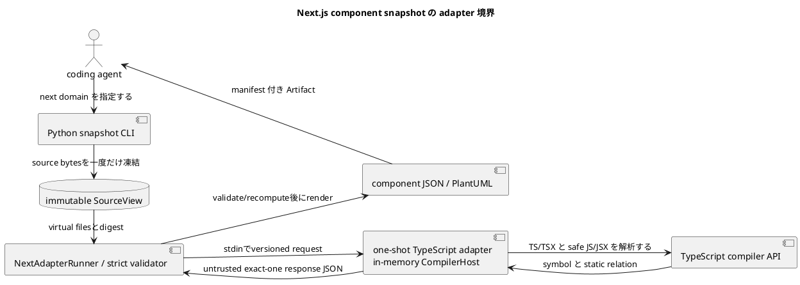

# iss-00008 Generate Next.js Component Snapshots — 設計

詳細: [Design Guide](../../../../../../docs/authoring/design.md)

## 設計目標

- `next` domain の `snapshot` を、CLI から source acquisition、analysis、versioned JSON、PlantUML、manifest、diagnostic まで一つの vertical pipeline として設計する。
- accepted ADR の独立 product ownership、named endpoint、dual snapshot、adapter boundary、agent-first Artifact、安全な static analysis、product HTML exclusion、vertical slicing を破らない。
- common abstraction は lifecycle、diagnostic、Artifact descriptor、graph primitive に限定し、domain-specific identity/member/relation/matching を adapter が所有する。

| Design ID | Requirement trace | 判断 |
| --- | --- | --- |
| I05-DES-001 | I05-REQ-001 | explicit project/targetをdomain-awareに解決し、Next snapshotを既存one-run outcome/publication pipelineへ接続する。 |
| I05-DES-002 | I05-REQ-002 | domain-owned SourceAcquisitionPlanでPythonがbytesを一度だけ凍結し、one-shot Node workerはvirtual files、bundled TypeScript、closed TrustedTypeEnvironmentだけを解析する。 |
| I05-DES-003 | I05-REQ-003 | declaration Componentとexport bindingを分離し、closed props IR、two-plane static relation、positive-evidence boundary fact/roleをNext semanticsとする。 |
| I05-DES-004 | I05-REQ-004 | `next-adapter/v1` responseをuntrusted inputとしてPythonがstrict validate/recomputeし、public semantic/PlantUML/manifestをPython側でrenderする。 |
| I05-DES-005 | I05-REQ-005 | promised semanticsの欠落に基づきcomplete/partial_safe/payload_unavailableを分類し、explicit target、budget、transport failureをfail-closedにする。 |
| I05-DES-006 | I05-REQ-006 | fixed process boundary、in-memory CompilerHost、finite limits、redaction、offline bundle、Node optionality、same-input determinismを検証する。 |
| I05-DES-007 | I05-REQ-007 | closed stdout selectorをsource acquisition前に検証し、publication後exact bytesまたはtyped unavailable resultをstderr diagnosticsと分離して出す。 |

## Current / Target

### Current（canonical specification state）

- 本 Issue の canonical state は stable scope ID と repository-relative Requirement/Design/Plan path、accepted ADR、interviewで識別する。採用・実装開始時に HEAD と configured upstream を再検証し、current commit SHA を本文へ固定しない。
- Python package、CLI、Git/SourceView、config/targets、outcomes、Python/SQLAlchemy adapter、schema、manifest、stdout/writer、tests/goldenは実装済み。Next production adapter、Node workspace、protocol/schema、fixtures/goldenは未実装である。
- current closed registriesは`python/sqlalchemy`を所有し、source candidate/target/configはPython semanticsへ具体依存する。Nextはこれらをopen-endedにせずclosed branchとして追加する。
- 本Designは親の横断contractをslice固有の構造へ具体化し、依存Issueのpublic contractを変更せずに後続sliceへ渡す。

### Target

- coding agent が first-party TypeScript adapter を通じ、Next.js repository の module、exported component、props、static relation、client boundary を JSON と PlantUML で取得できる。
- source/body/secret を漏らさず、failure と coverage を manifest で agent が機械判定できる。
- downstream Issue はこの Design の stable interface だけへ依存し、内部 class layout を fork しない。

## 責務・Interface

### planned component responsibilities

| planned path / symbol | 状態 | 責務 |
| --- | --- | --- |
| `src/code_structure_viz/source/source_view.py`（existing） | existing extension | domain-owned acquisition planを受け、既存Git/source safetyでbytesを凍結する。 |
| `src/code_structure_viz/source/targets.py`（existing） | existing extension | Python grammarを維持し、Next project/path/component selectorへdomain-aware routingする。 |
| `src/code_structure_viz/core/config.py`（existing） | existing extension | closed `[next]` config、value source、digestを追加する。 |
| `src/code_structure_viz/core/domains.py`、`application/snapshot_domain.py`（existing） | existing extension | Nextをsnapshot registryへだけ追加する。 |
| `src/code_structure_viz/artifacts/`、`core/outcomes.py`（existing） | existing extension | Next coverage/path/schema/stream/writer/publication invariantを追加する。 |
| `src/code_structure_viz/adapters/next/`（planned） | new | applicability、protocol、hardened runner、response validator/mapperを所有する。 |
| `adapters/next/`（planned source workspace） | new | compiled adapter、TypeScript analyzer/model、in-memory CompilerHost、lock/licenseを所有する。runtime assetsはwheel内`src/code_structure_viz/_next_runtime/`へ配置する。 |

### common command interface

```text
code-structure-viz snapshot --repo PATH --output-dir PATH [--domain DOMAIN] [--project RELATIVE_DIR] [--target SELECTOR] [--format FORMAT] [--config PATH] [--stdout SELECTOR]
code-structure-viz diff --repo PATH --output-dir PATH [--domain DOMAIN] [--from ENDPOINT] [--to ENDPOINT] [--format FORMAT] [--config PATH] [--stdout SELECTOR]
```

- `--output-dir` は必須。writer は existing file を置換せず、全 payload を staging 後に公開する。
- `--format` 未指定は semantic JSON と PlantUML。`--stdout` は output directory requirement を解除しない。
- analysis behavior を environment variable で変更しない。環境は executable discovery と locale-independent process setup にだけ使う。
- `--repo`はexact Git root。repeatable `--project`はconfig `[next].project_roots`を置換し、defaultは`.`。monorepo/workspaceを自動探索しない。
- Next targetは`path:REPO_REL_FILE_OR_DIR`または`component:EXPORTING_MODULE#EXPORTED_NAME`。後者はexport addressをcanonical declarationへ解決する。explicit target失敗はfallbackしない。

### stdout selector and stream routing

CLI parser は `--stdout` を optional single-value option として一度だけ受理し、closed grammar `manifest | DOMAIN:FORMAT` を `StdoutSelector` valueへ正規化する。domain/format の resolved selection が確定した直後、source acquisition より前に selector compatibility を検証する。boolean、path、alias、略記、大小文字違い、値省略、重複、未選択 domain、未要求 format は `UsageError` とし、source acquisition と publication の前に exit 2、stdout 空、Artifact 0件で終了する。`OutputTransaction` は開始しない。

通常 publication 後、既存 CLI/application boundary 内の stdout emitter は次のいずれか一つだけを行う。新しい command または独立 architecture layer は追加しない。

1. selector なしなら `run-summary/v1` を canonical JSON 1行として出す。
2. selected Artifact が利用可能なら、公開 file を binary read して exact bytes を複製する。
3. selected Artifact が利用不能なら、`RunOutcome`/`DomainOutcome` から `stdout-result/v1` 1行を構築する。

stdout emitter は diagnostic renderer と分離し、diagnostic は stderr だけへ出す。exact-byte copy に summary、BOM、改行補正を加えない。`stdout-result/v1` は status と stable reason だけを参照し、source content、absolute path、secret を受け取る field を持たない。handled SIGINT は cleanup 完了後に `run_status: interrupted` を返せる場合だけ exit 130 の result line を出す。process を強制終了された場合の出力は契約外である。

### snapshot path excludes comparison facilities

command dispatch は `SnapshotSourceRequest` と `DiffSourceRequest` を型で分ける。snapshot branch は単一のrun-start `SourceView`だけを作り、`ComparisonEndpointResolver`、start-HEAD anchor、`FileChangeSet`、`ChangedPathAdmissionGate` を呼び出せない依存方向にする。CLI validation はdiff-only optionをsnapshot requestへ変換する前に拒否する。acceptance fixtureはimplicit base不在と1,001 non-domain changed pathsを同時に持つrepositoryでsnapshotが通常処理されること、diff-only option併用だけがexit 2になることを検証する。

### source interface

```json
{
  "schema": "code-structure-viz.source-view/v1",
  "kind": "working-tree",
  "head_commit": "full-sha-or-null",
  "files": [{"path": "repository/relative", "kind": "regular", "resolved_target": null, "size_bytes": 1, "sha256": "digest"}],
  "failures": [],
  "fingerprint": "source-view-fingerprint"
}
```

これはcurrent `SourceView` descriptorに合わせた説明である。internal `SourceFile.content`、inventory、state fingerprintはpublic serializerへ渡さない。Next extensionはこの型を置換せず、各fileに別のplan-owned role mapを対応付ける。absolute temporary pathをserializerへ渡さない。

### domain adapter interface

```text
analyze_snapshot(SourceView, ResolvedConfig, TargetSelection) -> DomainSnapshotResult
compare_snapshots(DomainSnapshot, DomainSnapshot, DiffPolicy) -> DomainDiffResult
render_semantic_json(DomainResult) -> bytes
render_plantuml(DomainResult, VisualVocabulary) -> bytes
```

この Issue が未使用の method は実装を強制しない。後続 slice が stable contract を additive に拡張する。

### incomplete classes and publication

`DomainOutcome` は `status` に加え、status が `incomplete` の場合だけ `incomplete_kind: partial_safe | payload_unavailable` と `payload_available` を持つ。

- `partial_safe` は isolated failure set、safe subset、explicit coverage frontier、safe diagnostics、redaction pass、entity-budget pass、requested renderer passをすべて満たす場合だけ生成する。requested domain payload と manifest descriptor を同一 transaction で公開する。
- `payload_unavailable` は safe subset不在、global acquisition/protocol/schema/security/unsafe-path failure、entity overrun、または diff side failureで生成する。affected payload descriptorは空とし、safe core manifestだけを許す。
- Issue #8はsingle-domain outcomeだけを所有する。`partial_safe`はpayload+manifest、`payload_unavailable`はmanifest-only、run-level fatalはfinal manifestを含む全stagingを破棄する。multi-domain aggregationはIssue #10へ委譲する。

serializer と manifest builder は `incomplete_kind` と `payload_available` の整合を検証する。`partial_safe` なのにrequested descriptorが欠ける状態、`payload_unavailable` なのにaffected descriptorがある状態はinternal contract failureとしてpublication前に拒否する。

## Adopted Next v1 semantics

### Project applicability and source plan

- selected project root直下`package.json`のdirect `dependencies.next`または`devDependencies.next`がnon-empty stringの場合だけapplicableとする。
- `next.config.*`、directory名、source import、lockfile indirect entryはapplicability evidenceにしない。
- applicable project 0かつexplicit targetなしはNode probeなし`not_applicable`。applicableでComponent 0は`complete empty`。malformed manifest/configはabsenceを証明できないため`payload_unavailable`。
- immutable `SourceAcquisitionPlan`はproject roots、program/context/control files、include roots、hard exclusions、finite limits、plan versionを持つ。
- program filesは`.ts/.tsx/.js/.jsx`、`.d.ts`はcontext-only。hard excludeは`.git`、`node_modules`、`.next`、`out`、`dist`、`build`、`coverage`。
- test/spec/storyはdefault excludeにしない。config lookupは`tsconfig.json`、`jsconfig.json`、versioned built-in safe configの順。
- repository-local `extends/baseUrl/paths`だけをfrozen SourceView内で解決し、package-based extends/target node_modulesを暗黙に読まない。
- Python coreがplanに従いsource bytesを一度だけ凍結し、Node requestへrepository-relative path、base64 content、digest、project/config/target/limitだけを渡す。target root path/cwdを渡さない。

### Process and toolchain boundary

- one request/one response/one process。fixed executable/compiled entrypoint argv、`shell=false`、private empty cwd、minimal envを使う。
- `NODE_OPTIONS`/`NODE_PATH`を除去し、npm/npx/network/target node_modules、Next config、plugin、build/migration/package/application moduleを利用しない。
- custom in-memory `CompilerHost`はrequest virtual files、bundled TypeScript lib、closed TrustedTypeEnvironmentだけを読む。
- compiled first-party adapter、exact TypeScript runtime、lockfile、license inventoryを一つのcompatibility unitとしてbundleする。
- Node 22 LTS以上はapplicable Next runだけで必要とし、Python/SQLAlchemy core install/run/testへ持ち込まない。

candidate finite limitsは4 MiB/file、64 MiB total、20,000 files、16 MiB stdout、64 KiB stderr capture、60秒、512 MiB old-space。実測で採用値を調整できるが、unbounded/silent truncationは不可。

### Identity and members

- `ProjectDescriptor`はgrouping/provenanceでentity budget外。
- `ModuleEntity` identityはrepository-relative physical module path。route/router/boundary/rangeはattribute。
- `ComponentEntity` identityはModule ID + declaration key。named bindingまたはmodule-local `@anonymous-default`を使い、range/export/barrel/route/wrapper/propsを含めない。
- `ExportBindingMember` identityはowner Module + exported nameで、target declaration Component IDをpayloadに持つ。barrel/re-export/aliasはbindingを増やすがComponentを複製しない。
- `ImportBindingMember`はowner Module + origin/imported name/type-value role。local alias/order/rangeはidentity外。
- `PropMember` identityはComponent ID + prop name。type/optional/default evidence/rangeはpayload。
- exported/route rootからproven renderまたはsupported wrapperで到達するmodule-local Componentだけを`reachable_local`として含め、unreachable localは省く。
- IDはversioned kind + canonical identity JSONのSHA-256で作り、Pythonが再計算する。

### Component recognition and props

- PascalCaseだけでComponentと認定しない。safe React-compatible callable/construct signature、closed React class provenance、recognized UI route default、proven JSX output-flow、closed wrapper originのpositive evidenceを要求する。
- v1 wrapper allowlistは`memo`、`forwardRef`、`lazy`、literal-pattern `next/dynamic`。custom HOCはunknown/coverage limitation。
- propsはTypeCheckerのeffective call/construct signatureから取得し、source spelling/`typeToString()` raw textをpublic contractにしない。
- closed type IRはprimitive、ordinal type parameter、redacted literals、repository/external reference、array、tuple、union、intersection、parameter-name-free function、object、opaque。
- NFC、canonical sort/dedup、generic alpha-normalizationを行い、literal value/function parameter名を出さない。`children`/`ref`はpublic signatureに実在するときだけ。
- candidate complexity limitsはdepth 16、nodes/prop 512、union/intersection 64、nested properties 256、signatures/component 16。over-limit subtreeはtruncationせずopaque + partial coverage。

### Two-plane relations

| kind | source | target | plane |
| --- | --- | --- | --- |
| `static_import` | Module | Module/external | module |
| `literal_dynamic_import` | Module | Module/external | module |
| `jsx_render` | Component | Component/external | component |
| `component_wrap` | Component | Component | component |

containmentはownership/zero-hopで、import/render planeを暗黙fan-outしない。relation identityはsource/kind/target/semantic role。range/order/local alias/syntaxはpayload。

JSX relationはComponent return、concise arrow、class render、single-assignment constへのbounded backward flowをrootにし、JSX children、conditional/logical、array、安全なArray/ReadonlyArray map/flatMap、exact React `createElement`を閉じて追う。event handler、render prop/function child、arbitrary helper、ambiguous symbol、runtime resultはedgeにしない。nonliteral importはedgeなし+unknown coverage。externalはfrontierで止める。

downstreamはsource→dependency/render target、upstreamはreverse。depth traversalはinternal entityだけ。

### Positive-evidence client boundary

- direct `client_entry`: exact directive prologue。
- direct `router_context`: `app_ui`、`pages_ui`、`pages_api`、`app_route_handler`、`none`。
- derived `client_dependency`: client_entryからinternal static value import/re-exportで到達。
- derived `server_candidate`: closed App Router UI seedからclient entry直前まで到達。runtime server claimではない。
- `unknown`: positive evidenceなし。Pages Routerも自動server扱いしない。
- 同一Moduleのclient_dependency/server_candidate dual roleを許す。type-only/dynamic/JSX/external/unresolved edgeはpropagationに使わない。
- boundary crossingはunderlying value edgeの`boundary_effect` facetでduplicate traversal edgeを作らない。Issue #9はprimitive fact/edgeをprimary diffにする。

### Adapter validation and public contracts

Node stdoutはexact one `code-structure-viz.next-adapter/v1` JSON document。Pythonはprotocol version、closed schema、path containment、ref integrity、duplicate/enum、redaction、NFC/order、ID、count/coverage/digest、explicit target completeness、renderer subset consistencyを検証・再計算する。validation failureはpartialへdowngradeせずresponse全体を拒否する。

public paths/contracts:

- `next.snapshot.semantic.json` / existing `code-structure-viz.semantic/v1`
- `next.snapshot.puml` / `code-structure-viz.plantuml/next/v1`
- existing `code-structure-viz.run-manifest/v1`

manifestはNode/TypeScript/adapter/protocol version、project/config path、source plan/config/source digest、target/depth/budget requested/resolved、coverage、safe diagnostic、Artifact path/size/SHA-256を持つ。

closed domain/schema/artifact/stream/writer/outcome registryへNext branchを明示追加し、`additionalProperties: false`やallowlistを緩めない。

## Normative closure contracts

### TrustedTypeEnvironment/v1

target `node_modules`を読まずにReact/JSX/Nextのv1 acceptanceをTypeCheckerで成立させるため、adapter compatibility unitへclosed declaration setをbundleする。

| component | content | provenance |
| --- | --- | --- |
| TypeScript libs | selected compiler versionのstandard `lib.*.d.ts` | TypeScript exact version/digest/license |
| JSX environment | v1で必要な`JSX.Element`、intrinsic boundary、jsx-runtime surfaceの最小declaration | environment schema/version/digest |
| React environment | function/class component、FC-compatible call、memo/forwardRef/lazyの認識に必要な最小declaration | environment schema/version/digest/license |
| Next environment | v1 literal-pattern `next/dynamic`の最小declaration | environment schema/version/digest/license |

- environment contractは`code-structure-viz.next-trusted-types/v1`。compiled adapterと同じwheel resource treeに置く。
- target package versionとの互換を推測せず、これはCodeStructureViz v1 semanticsを定義するtrusted modelである。
- requestはexpected environment digestを持ち、responseはactual digestをechoする。mismatchは`CSV-NEXT-TRUST-001`、payload unavailable。
- manifestはenvironment schema、version、SHA-256、license inventory digestを記録する。
- environment外のexternal declarationをdisk/networkから補わない。package/export identityだけを証明できる場合はexternal reference、props shapeが必要で証明不能なら`opaque(external_unresolved)` + localized partial。
- target sourceがtrusted signatureと構造的に一致しない場合、wrapper/componentを認定せずunknown coverageにする。

### ComponentDeclarationResolution/v1

| source pattern | canonical Component | declaration key | extra Component | wrapper relation | failure |
| --- | --- | --- | --- | --- | --- |
| module-scope `function Button` / `class Button` | value symbol | `Button` |なし |なし | post-NFC collisionでunavailable |
| module-scope `const Button = callable` | outer value binding | `Button` |なし | allowlisted wrapperなら下記規則 | collisionでunavailable |
| `const Button = function Inner(){...}` | outer value binding | `Button` | inner function expressionはentityにしない |なし | positive evidenceなしはunknown |
| overload signatures + implementation | implementation value symbol一件 | outer binding name |なし |なし | implementationなしはunknown |
| `export default function Button()` / named class | named declaration | `Button` |なし |なし |なし |
| direct anonymous default function/class/expression | default result | `@anonymous-default` |なし | allowlisted expressionなら下記規則 |複数default/identity collisionでunavailable |
| `const Public = memo(Inner)` | outer result | `Public` | `Inner`が独立module-scope positive Componentなら保持 | `Public -> Inner` | wrapper/provenance ambiguityはunknown |
| `export default memo(Button)` | default result | `@anonymous-default` | module-scope `Button`を保持 | default result `-> Button` | target ambiguityはunknown |

- declaration keyはNFC後UTF-8 byte identity。binding kind/function/class/constはkeyに入れない。
- type/value merged symbolはvalue symbolだけをComponent候補にする。
- inner function/class expressionはmodule-scope bindingを持たない限り独立Componentにしない。
- `component_wrap` sourceはwrapper result Component、targetは独立entityとして存在するwrapped Component。
- wrapped targetが独立entityでなければrelationを作らずwrapper provenance attributeだけを持つ。
- normalized declaration/export/prop identity collisionはmergeせず`CSV-NEXT-IDENTITY-001`、payload unavailable。

### ExportBindingResolution/v1

| export pattern | owner | exported name | target | result |
| --- | --- | --- | --- | --- |
| `export function Button` / `export {Button}` | current Module | `Button` | canonical declaration Component | binding一件 |
| `export default function Button` | current Module | `default` | canonical `Button` Component | binding一件 |
| anonymous/default expression | current Module | `default` | `@anonymous-default` Component | binding一件 |
| `export {Button as default}` | current Module | `default` | local declaration Component | binding一件 |
| `export {default as Button} from "./x"` | current Module | `Button` | resolved remote declaration Component | re-export binding + module relation facet |
| `export {Button as Alias} from "./x"` | current Module | `Alias` | resolved remote declaration Component | re-export binding + module relation facet |
| `export * from "./x"` | current Module | each resolved value export | resolved declarations | canonical exported-name orderで展開 |
| star/local conflictまたは複数star conflict | current Module | conflicting name | ambiguous | `CSV-NEXT-EXPORT-001` payload unavailable |
| type-only export | current Module | — | — | Component ExportBindingを生成しない。type evidenceだけcoverageへ記録 |
| external/unresolved export | current Module | safe name | external/unresolved descriptor | internal Componentを捏造しない |

- exported nameはv1で`default`またはECMAScript IdentifierNameのNFC formに限定する。string-named exportは`CSV-NEXT-TARGET-001` unknown/target unresolvedでv1対象外。
- binding IDはowner Module ID + exported name + value role。source range/order/alias syntaxを含めない。
- re-export cycleはvisited `(module_id, exported_name)`で停止し、一意declarationへ到達できないexplicit targetはpayload unavailable。

### ProjectRootValidationMatrix

project rootsはCLI occurrence順に依存せず、NFC pathをUTF-8 bytesでsortしてdigestへ入れる。

| input condition | normalized result | outcome |
| --- | --- | --- |
| `.`またはrelative POSIX directory、Git root内、non-symlink | canonical path | valid |
| absolute、backslash、NUL、empty、`.` segment、`..`、non-NFC collision |なし | usage `CSV-CONFIG-004` / exit 2 |
| explicit/config rootが存在しない、regular file、symlink |なし | usage `CSV-CONFIG-004` / exit 2 |
| 同一normalized rootの重複 | なし | usage `CSV-USAGE-002` / exit 2 |
| ancestor/descendant rootの同時選択 | なし | usage `CSV-NEXT-PROJECT-001` / exit 2 |
| 複数disjoint roots | canonical sorted tuple | valid |

overlapping rootsを禁止するため、各source moduleのowning projectは一意。shared source rootはproject descriptorではなく、explicit `[next].source_roots` contextとして重複dedupeする。

### PackageApplicabilityMatrix

`package.json`はUTF-8のみ。先頭UTF-8 BOM一つは除去する。duplicate-key rejecting JSON parserを使い、rootはobjectでなければならない。

| package observation | project state | aggregate effect |
| --- | --- | --- |
| fileなし | non_applicable | 他にapplicableがなければdomain not_applicable |
| valid object、dependency tablesなし/`next`なし | non_applicable | 同上 |
| `dependencies.next`または`devDependencies.next`がnon-empty string | applicable |解析対象 |
| `next` presentだがempty/non-string、dependency table non-object | malformed |domain payload unavailable |
| invalid UTF-8/BOM、invalid JSON、duplicate key、root non-object、read failure | malformed |domain payload unavailable |

- 両dependency tableにvalid non-empty `next`があればapplicable。version semanticsは解釈せずredacted existenceだけを使う。
- 一方でも`next` keyがinvalidなら、他方がvalidでもconflicting evidenceとしてmalformed。
- 複数projectはapplicableだけを解析し、non-applicable countをmanifest coverageに記録する。malformedが一件でもあれば全domain payload unavailable。全project non-applicableならnot_applicable。

### TargetResolutionMatrix

| target | grammar / resolution | selected zero | failure |
| --- | --- | --- | --- |
| `path:FILE` | selected project/source root内の`.ts/.tsx/.js/.jsx` exact frozen file | fileにComponent 0ならcomplete empty | missing/out-of-scopeはpayload unavailable |
| `path:DIRECTORY` | frozen inventoryに存在するlexical directory subtree | subtreeにComponent 0ならcomplete empty | missing/out-of-scopeはpayload unavailable |
| `component:MODULE#NAME` | MODULEは`.ts/.tsx/.js/.jsx` repository-relative path、`#`禁止。NAMEは`default`またはIdentifierName | N/A | missing/ambiguous/external/unresolvedはpayload unavailable |

- path/file-directory判定はfrozen inventoryで行い、host filesystemを再参照しない。
- component targetはexport bindingを辿り、canonical declaration Componentを一意に選ぶ。barrel cycleはvisited setで停止。
- extensionless module、string-named export、path中`#`はv1 usage error。
- project overlapを禁止済みのためownershipは一意。shared sourceのComponent targetは、そのsource rootを宣言した一つのselected projectだけに属する。複数projectが同じshared sourceを宣言した場合は`CSV-NEXT-PROJECT-002` payload unavailable。
- multiple targetsはcanonical target keyでdeduplicate/sortしたunion。入力順違いはsame bytes。一件でもresolution failureなら全target payload unavailable。
- targetなしは全applicable project。depthはtargetありのときだけ。

### SourceAcquisitionPlan/v1 and discovery closure

plan value object:

```text
schema = code-structure-viz.source-acquisition-plan/next/v1
project_roots = canonical tuple
source_roots = canonical tuple
program_suffixes = [.js,.jsx,.ts,.tsx]
context_suffixes = [.d.ts]
hard_exclusions = fixed tuple
control_paths = canonical tuple
file_roles = path -> program|context|control
limits = source transport limits
trusted_type_environment_digest
```

plan digest preimageは上の全fieldをcanonical JSONでencodeし、path/tupleはNFC UTF-8 byte order。source content digestは含めず、SourceView fingerprintへ分離する。

discovery procedure:

1. common Git repositoryがrun-start inventory/state fingerprintを取得する。
2. validated project rootsからknown `package.json`と`tsconfig.json`/`jsconfig.json`候補をcontrol pathへ追加する。
3. descriptor-safe readでcontrol bytesを取得し、duplicate-aware decoderでapplicability/configを解析する。
4. repository-local `extends`をvisited path setで再帰し、cycle/escape/package referenceを拒否する。
5. resolved include/exclude/source rootsをrun-start inventoryへ適用し、program/context path closureを確定する。
6. common SourceView readerでcontrol/program/context bytesを取得し、最後にinventory/state driftを検証する。
7. 一つのlogical SourceView、plan digest、file-role mapを確定し、それ以降target filesystemを読まない。

control failureはglobal payload unavailable、unsafe path/inventory/state driftはrun fatal。program/context read/UTF-8/parse failureはlocalized coverageを証明できる場合だけpartial safe。

### Config projection and compiler options

- config modelをcommon `traversal/limits` + per-domain `python/next` branchへ分ける。
- `domain_config_projection(domain)`はselected domainに必要なbranchだけを返す。
- `domain_config_digest(domain)`はprojectionのcanonical JSON digest。
- Python/SQLAlchemyのcurrent projection、config SHA preimage、manifest encoding、source candidate/failure code/sort/fingerprintをbyte-for-byte維持する。
- `[next]`は`--domain next`でだけrequired/default-resolved。Python/SQLAlchemy runではNext defaultをdigest/manifestへ含めない。
- Next projectionはproject roots、source roots、config path policy、TrustedTypeEnvironment digest、type/source/process limitsを持つ。

compiler option policy:

| category | handling |
| --- | --- |
| `jsx` | `preserve/react/react-jsx/react-jsxdev`をclosed enumへnormalize。emitしない |
| `allowJs/checkJs` | booleanを採用し、program suffix selection/JS diagnosticsに反映 |
| `baseUrl/paths` | repository-local frozen pathだけ採用 |
| module/moduleResolution | adapter-owned closed strategyへnormalizeし、host/node_modules fallbackなし |
| `plugins/typeRoots/types` package refs |実行/外部resolutionせず`CSV-NEXT-CONFIG-002` payload unavailable |
| emit/outDir/declaration/build options | analysisに使わずsafe ignored-option coverageへ記録 |
| unknown/invalid option type | `CSV-NEXT-CONFIG-001` payload unavailable |

### Private adapter request/response v1

implementation前に次をclosed JSON Schema (`additionalProperties: false`) とpositive/negative fixturesで固定する。

request required fields:

| field | contract |
| --- | --- |
| `schema` | exact `code-structure-viz.next-adapter-request/v1` |
| `request_id` | canonical request preimage SHA-256 |
| `adapter_version` | expected bundled adapter version |
| `trusted_type_environment` | schema/version/SHA-256 expected descriptor |
| `compiler_options` | closed normalized options |
| `projects` | sorted root/config descriptors |
| `files` | unique sorted path/role/size/SHA-256/base64 bytes |
| `targets` | canonical target keys |
| `limits` | exact normalized analysis/process-relevant limits |

response required fields:

| field | contract |
| --- | --- |
| `schema` | exact `code-structure-viz.next-adapter-response/v1` |
| `request_id` | requestとexact match |
| `adapter_version` | expected exact match |
| `trusted_type_environment_digest` | expected exact match |
| `model` | projects/modules/components/members/relations/coverage/safe diagnostic codes |
| `model_digest` | canonical `model` bytes SHA-256。Pythonが再計算 |

Artifact digestはresponseに含めない。Python renderer/publication後にだけ計算する。

JSON decoderはUTF-8、duplicate key拒否、integer-only safe counts、maximum nesting/string/array limitsを適用する。bad base64、duplicate path、digest mismatch、extra field、unknown enum/refはresponse/request全体を拒否する。

### Process and CompilerHost failure matrix

| observation | result |
| --- | --- |
| Node discovery/version failure | payload unavailable `CSV-NEXT-NODE-001` |
| spawn failure | payload unavailable `CSV-NEXT-NODE-002` |
| timeout / process group termination | payload unavailable `CSV-NEXT-NODE-003` |
| `v8_old_space_mib` process failure | payload unavailable `CSV-NEXT-LIMIT-004` |
| stdout cap / stderr cap超過 | process terminate、payload unavailable `CSV-NEXT-LIMIT-003`。raw/partial bytes非公開 |
| non-zero exit（valid JSON有無を問わない） | responseを捨てpayload unavailable `CSV-NEXT-NODE-004` |
| zero exit + stdout noise/malformed/duplicate key | payload unavailable `CSV-NEXT-PROTOCOL-001` |
| valid response + stderr | responseを検証し、stderrはraw非公開。safe fixed diagnostic countのみmanifestへ記録 |
| SIGINT | process group cleanup、run interrupted exit 130 |

`v8_old_space_mib`はV8 old-space limitであり総RSS上限と呼ばない。OS-level memory isolationを導入する場合は別field/acceptanceとする。

CompilerHostは`readFile/fileExists/directoryExists/realpath/getCurrentDirectory/getDirectories/readDirectory/module resolution`をvirtual map/bundled trusted environment内に閉じ、`writeFile`は常に拒否する。host filesystem callback、target cwd、network、child processが一度でも呼ばれたらsecurity failure。local extends cycle、path escape、unsafe compiler optionはadapter起動前に拒否する。

### PropsTypeIR/v1

全variantは`kind` discriminantを持ち、unknown fieldを拒否する。

| kind | required fields | canonical rule |
| --- | --- | --- |
| `primitive` | `name` | closed enum `boolean,bigint,number,string,symbol,null,undefined,void,never,unknown` |
| `type_parameter` | `ordinal` | declaration orderの0-based integer。source name非公開 |
| `redacted_literals` | `base`, `count` | baseは`boolean,bigint,number,string`。value非公開 |
| `reference` | `scope,module,exported_name,type_arguments` | scope `repository/external`。repository moduleはModule ID、external moduleはsafe package name |
| `array` | `element,readonly` | readonly boolean |
| `tuple` | `elements,rest,readonly` | elementは`type,optional`、restはTypeNode/null |
| `union` / `intersection` | `members` |同kindをflatten、canonical bytesでdedupe/sort |
| `function` | `type_parameter_count,this_type,parameters,return_type` | parameterは`type,optional,rest`。name非公開 |
| `object` | `properties,index_signatures,call_signatures` | propertyは`name,type,optional,readonly`。index keyは`string/number/symbol` |
| `opaque` | `reason` | closed stable reason |

`opaque.reason`:

- `any_open_world`
- `external_unresolved`
- `unsupported_syntax`
- `recursive_type`
- `type_complexity_limit`
- `ambiguous_signature`
- `trusted_type_mismatch`

rules:

- property/reference/export namesはNFC。quoted propertyはdecoded nameだけを保持し、literal spellingを出さない。
- repository referenceはcanonical declaration/exportへ解決。aliasはpayload/diagnosticでidentityに入れない。
- generic type argumentをrecursive normalize。generic declaration parameterはordinal化。
- recursionはactive TypeChecker type-ID stackで検出し`opaque(recursive_type)`。
- conditional/mapped/keyof/template-literal等がclosed variantへlossless normalize不能なら`opaque(unsupported_syntax)`。
- object property/index/call signatureはcanonical identity bytesでsort/dedup。
- Component overloadはReact-compatible public signaturesをcanonicalizeし、同一shapeをdedupeする。16以下の複数shapeはprop名ごとにtype unionを作り、全shapeでrequiredな場合だけrequired。correlation lossをcoverage factとして記録する。16超または一意統合不能は`opaque(ambiguous_signature)`。
- `any`は`opaque(any_open_world)`。external package/export identityだけ証明できればreference、shapeが必要で解決不能なら`opaque(external_unresolved)`。

normative default limitsはcalibration fixtureをI05-PLAN-001で実行してcanonical config/schemaへ採用するまでimplementation gateを開かない。初期proposed defaultsはdepth 16、nodes/prop 512、union/intersection 64、nested properties 256、signatures/component 16。

counting:

- root TypeNodeをdepth 1/node 1。
- child TypeNodeごとにnode +1。property/parameter descriptor自体はnodeに数えない。
- union/intersectionはflatten/dedup後member count。
- nested property countは一つのobject nodeのdirect properties。
- signature countはdedup前のReact-compatible public signatures。

local type complexity/recursion/unsupported/any/external unresolvedはaffected Prop subtreeをopaqueにし、Component/Prop target identityを保持できる場合は`partial_safe` + exact prop coverage。entity/source/transport/process/protocol limitはpayload unavailable。intentional custom HOC/nonliteral runtime behaviorはv1がunknownを約束するためcomplete+diagnosticを許す。

### SelectionAndTraversal/v1

1. targetなしはapplicable project内の全internal Module/Componentをselectし、depth optionは禁止。
2. path file/directory targetはsubtreeのprogram Moduleをmodule-plane seed、そのcontained Componentをcomponent-plane seedにする。
3. component targetはresolved Componentをcomponent-plane seed、そのowner Moduleをmodule-plane seedにする。
4. containmentはzero-hopでcounterpartをresultへ含めるが、relation depthを消費しない。
5. upstream/downstreamは各planeで独立BFS。depth 0はseed+zero-hop containment、Nは最大N relation edges。
6. module relationからComponentへ、component relationからModule relationへimplicit fan-outしない。
7. internal targetはvisited `(plane,entity_id,min_depth)`で一度だけ展開。external/unresolvedはfrontier descriptorとして含め、展開しない。
8. multiple target union後に一度だけBFSし、canonical ID orderでserializeする。

`static_import`はvalue/type importと`export ... from`/star re-exportを含み、relation payload `role: value|type`、`reexport: bool`を持つ。boundary propagationはvalueだけ。literal dynamic importは`role: value`。

occurrence aggregationは必須。relation identityが同じoccurrenceを一件へ集約し、`occurrence_count`、canonical sorted unique `contexts: direct|conditional|collection`を持つ。range/order/local aliasはpublic identity/payloadに保持しない。

### JsxOutputFlow/v1

algorithm:

```text
for each recognized Component root:
  enqueue direct return expressions / concise body / class render returns
  visit expressions with identity-based visited set
  follow JSX children, fragment, conditional, logical, array
  follow one-hop single-assignment const aliases backward
  follow safe Array/ReadonlyArray map/flatMap callback return
  resolve JSX tag or exact React createElement symbol through TypeChecker
  emit relation only when target is unique internal/external symbol
```

- reassigned/multi-assignment/destructured alias、arbitrary helper/nested function、event handler、render prop/function childのbodyを追わない。
- cycleはvisited expression IDで停止。
- expression visit default 10,000/component、alias backward steps default 64。calibration gateでnormative configへ固定する。
- flow limit到達はaffected Component relation coverageをlocalized partial。既存の証明済みrelationsは保持。
- lowercase intrinsicとFragmentはentity/relation targetにしない。
- exact React `createElement` provenanceはTrustedTypeEnvironment symbol identityで確認する。
- `next/dynamic` literal module edgeを作り、export target一意時だけComponent edge。nonliteralはcomplete+unknown diagnosticでedgeなし。

### RouterContextClassification/v1

pathはproject-relative physical module path。suffixは`.ts/.tsx/.js/.jsx`。

| ordered pattern | context |
| --- | --- |
| `app/**/route.*`、`src/app/**/route.*` | `app_route_handler` |
| `app/**/{page,layout,template,loading,error,not-found,default}.*`、`src/app/**/...` | `app_ui` |
| `pages/api/**`、`src/pages/api/**` | `pages_api` |
| `pages/**`、`src/pages/**` | `pages_ui` |
| その他 | `none` |

ordered first match。route group/dynamic/parallel segmentはdirectory tokenとしてそのまま扱い、route display pathをidentityにしない。Pages `_app/_document/_error`は`pages_ui` contextだが、Component認定には別positive evidenceを要求する。

### BoundaryRolePropagation/v1

- UTF-8 BOMはsource decoderで一度だけ除去。comments/whitespaceはAST triviaとして許可。
- `client_entry`はprogram bodyのdirective prologueにあるparenthesizedでないexact string expression `"use client"`。最初のnon-directive statement後は認めない。
- client dependency closureは各client entryからinternal static `role:value` import/re-exportをforward fixed-pointで辿る。seed自身は`client_entry`であり`client_dependency`には含めない。ただし別client entryからcycleで到達しても重複roleは増やさない。
- server candidate seedは`app_ui` route module。seedを含め、internal static value edgeをforwardに辿るが、targetがclient entryならtargetをserver candidateへ加えず展開を止める。
- cycleはModule ID visited set。type/dynamic/JSX/external/unresolved edgeを伝播に使わない。
- 異なるseed/closureにより同一Moduleがclient_dependencyとserver_candidateのdual roleを持てる。
- value edgeのsourceがserver_candidate、targetがclient_entryなら、そのunderlying `static_import` relation payloadに`boundary_effect: server_to_client_entry`を付ける。別relationを生成しない。
- public Module attributesはsorted `boundary_facts`と`boundary_roles`。Issue #9 primary change seedはdirect fact/router context/static edgeで、derived roleはcontext/secondary change。

### FailureClassification/v1

Issue #8/current CLI/run-manifest/run-summaryはsingle-domain (`maxItems: 1`)。healthy sibling/all-domain aggregationはIssue #10へ委譲し、本Issueのoutcome/publicationから除外する。

| stage | scope / example | stable diagnostic | promised missing | outcome | payload / manifest / stdout / exit |
| --- | --- | --- | --- | --- | --- |
| CLI/config | invalid project/target/depth/key/type | existing usage/config + `CSV-NEXT-PROJECT-001` | N/A | usage | payload 0 / manifestなし / stdout空 / 2 |
| applicability |全projectでNext direct dependencyなし | `CSV-NEXT-APPLICABILITY-001` info | no | not_applicable | payloadなし / manifest / typed stdout-resultまたはsummary / 0 |
| analysis | applicable、Component 0 |なし | no | complete empty | requested empty payloads / manifest / exact bytesまたはsummary / 0 |
| closed unsupported | custom HOC、nonliteral dynamic | `CSV-NEXT-UNSUPPORTED-001` | no。v1はunknownを約束 | complete+diagnostic | payloads / manifest / 0 |
| local source | program read/UTF-8/parse failureをfile単位隔離 | `CSV-NEXT-SOURCE-001` | yes/local | partial_safe条件を満たす場合だけ | same-subset JSON+PlantUML / manifest / 3 |
| local type/flow | opaque reason、flow step limit | `CSV-NEXT-TYPE-001` / `CSV-NEXT-FLOW-001` | yes/local | partial_safe条件を満たす場合だけ | same-subset payloads / manifest / 3 |
| explicit target | missing/ambiguous/out-of-scope/cycle | `CSV-NEXT-TARGET-001` | yes/global target | payload_unavailable | payloadなし / manifest / unavailable stdout / 3 |
| project/control | malformed package/config/extends/conflict | `CSV-NEXT-CONFIG-001/002` | yes/global domain | payload_unavailable | payloadなし / manifest / 3 |
| trusted types | digest/version mismatch | `CSV-NEXT-TRUST-001` | yes/global domain | payload_unavailable | payloadなし / manifest / 3 |
| process/protocol | Node/spawn/timeout/nonzero/cap/noise/schema/ref/ID | `CSV-NEXT-NODE-*` / `CSV-NEXT-PROTOCOL-*` | yes/global domain | payload_unavailable | payloadなし / manifest / 3 |
| source/transport/entity | file 4MiB、total 64MiB、20k files、model/entity 501+ | `CSV-NEXT-LIMIT-001/002/005` | yes/global domain | payload_unavailable | payloadなし / manifest count / 3 |
| common source integrity | Git root/inventory/path collision/unsafe symlink/read invariant | existing `CSV-REPO-*`/`CSV-SOURCE-*` | run source untrusted | fatal | payloadなし / final manifestなし / run unavailable / 1 |
| publication | source drift、writer/serializer/transaction invariant | existing `CSV-SOURCE-001`/`CSV-INTERNAL-001` | run result untrusted | fatal | payloadなし / final manifestなし / 1 |
| signal | handled SIGINT | `CSV-INTERRUPT-001` | N/A | interrupted | staging cleanup / manifestなし / 130 |

`partial_safe` required predicates:

1. failure setがfile/component/prop/relationへ閉じる。
2. 残るidentity/ref integrityが完全。
3. exact coverage count/frontierとsafe diagnostic codeを持つ。
4. all explicit targetsのidentityは解決済み。target内の局所type/relation欠落だけをpartialにできる。
5. JSON/PlantUMLが同一subset。
6. redaction、trusted types、protocol validation、budgetを満たす。

一つでも満たさなければpayload unavailable。raw compiler/stderr/source/literal/pathをdiagnostic messageに含めない。

### Closed registry and packaging extension matrix

| surface | existing path | required Next delta / acceptance |
| --- | --- | --- |
| CLI/domain | `src/code_structure_viz/cli/parser.py`、`core/domains.py` | parserが既に持つNext stdout syntaxを再実装せず、domain/project/target/compatibilityを一貫して有効化 |
| diagnostics | `src/code_structure_viz/core/diagnostics.py`、`schemas/diagnostic-v1.schema.json` |上記`CSV-NEXT-*` closed code/spec/message/recoverabilityを追加しraw textを拒否 |
| config | `src/code_structure_viz/core/config.py`、`docs/contracts/config-v1.md` | per-domain projection/digest、closed `[next]` fields/value sources |
| source | `source/source_view.py`、`docs/contracts/source-view-v1.md` | current SourceViewを維持しplan/file-role/TrustedTypeEnvironment provenanceを追加 |
| adapter dispatch | `application/snapshot.py`、`application/snapshot_domain.py` | applicability、runner、strict validator、Next adapter contract |
| semantic schema | `schemas/semantic-v1.schema.json`、`docs/contracts/next-semantic-v1.md`（planned） | Next entity/member/relation/type IR/coverage branch、`additionalProperties:false` |
| private protocol | `schemas/next-adapter-request-v1.schema.json` / response（planned） | request/response positive/negative fixtures、duplicate/noise/ref/ID/digest拒否 |
| manifest/summary | `schemas/run-manifest-v1.schema.json`、`run-summary-v1.schema.json`、`artifacts/manifest.py` | single Next domain、toolchain/trusted types/project/source-plan provenance、Next coverage encoder |
| stdout result | `schemas/stdout-result-v1.schema.json`、`artifacts/streams.py`、`docs/contracts/stdout-v1.md` | existing syntax + Next snapshot paths/exact bytes/unavailable reason |
| writer | `artifacts/writer.py` | `_FINAL_PATHS`へNext 2 paths、Next PlantUML parser/escaping/alias/legend/status validation |
| PlantUML contract | `docs/contracts/next-plantuml-v1.md`（planned） | Module/Component/props/import/render/wrap/boundaryのshape/line/label、color非依存legend |
| wheel/sdist | `pyproject.toml` | compiled adapter/TrustedTypeEnvironmentを`src/code_structure_viz/_next_runtime/` package resourcesへ含める。source Node workspaceは`adapters/next/` |
| resource lookup | `src/code_structure_viz/adapters/next/runner.py`（planned） | `importlib.resources`でinstalled wheel resourceを解決し、checkout-relative pathへfallbackしない |
| distribution | `tests/packaging/test_distribution.py` | wheel/sdist member golden、checkout外offline run、runtime Python deps noneの維持 |
| lock/license | `adapters/next/package-lock.json`、`THIRD_PARTY_LICENSES.md` | npm build dependencies/TypeScript/trusted declarationsのexact resolve/license inventory digest |
| security | `tests/security/test_python_static_boundary.py`、new Next test | arbitrary subprocessを許可せずexact Git runner + exact Next runnerのみ。filesystem/network/exec traps |
| CI | `.github/workflows/ci.yml` | core-only no-Node、Node 22、latest-supported、wheel/offline/license lanes |

Node source workspaceはbuild inputで、runtime wheelはcompiled outputとtrusted declarationsだけをpackage resourceに含める。runtimeはnpm/npxを呼ばない。sdistにはreproducible rebuild用source workspace/lock/licenseを含め、wheelには実行に必要なclosed assetsだけを含める。

Next PlantUML v1はaliasを`N_M_<64hex>`/`N_C_<64hex>`に閉じ、label escaping、member order、relation line style、boundary marker、unknown/partial note、legendをcontract fixtureで固定する。writerは許可外row/alias/path/absolute pathを拒否する。

## data / failure

### adapter protocol and semantic model

Python bridgeはfrozen SourceView bytesを`code-structure-viz.next-adapter/v1` requestとしてstdinへ送り、stdoutのexact one JSON documentをuntrusted inputとしてvalidateする。adapterはin-memory TypeScript compiler APIだけを使い、target filesystem/build/config/plugin/applicationを実行しない。Pythonはresponseのpath/ref/redaction/order/ID/count/digestを検証・再計算してdomain `next` snapshotへmapする。

### applicability and failure

- explicit project rootsにdirect Next dependencyがないと証明できた場合は`not_applicable`でNode probeなし。applicable projectのComponent 0は`complete empty`。
- malformed applicability/config evidence、explicit target failure、Node missing、protocol noise/schema mismatch、global TypeScript Program/security/identity failureは`payload_unavailable`。safe partial snapshotはpromised semanticsの欠落が局所化され、全rendererで同じsubset/coverageを証明できる場合だけ。
- nonliteral dynamic behaviorはunknown diagnosticとcoverage countで、runtime tree/relationを作らない。

### entity budget and publication

`EntityBudgetGate`はselected internal Module+Component countをrender前にdefault 500と比較する。501以上はdomain `incomplete/payload_unavailable` exit 3、affected JSON/PlantUMLなし、safe run manifestへrequested/resolved/count/diagnosticを記録する。member/relation/external/frontier/project descriptorは数えない。valid overrideは通常公開、invalid valueはexit 2。snapshot pipelineは`ChangedPathAdmissionGate`を構築・実行せず、diff専用optionはusage error、Artifactなし。OutputTransactionはabsolute path/protocol noise/unsafe fieldをpublish前に拒否する。

### determinism and optionality

same frozen source bytes、source plan、project/target、resolved config、Node/TypeScript/adapter/protocol versionではresponse orderingとpublished digestが一致する。Node dependencyはNext applicable runにだけ必要で、npm/network runtime requirementを持たずcore-only install/testから分離する。

## 変更対象

| planned file | planned change | 存在確認 |
| --- | --- | --- |
| `src/code_structure_viz/source/source_view.py` | existing extension | domain-owned acquisition planを追加し、Python/SQLAlchemy bytesを維持する。 |
| `src/code_structure_viz/source/targets.py` | existing extension | domain-aware Next path/component targetを追加し、Python grammarを維持する。 |
| `src/code_structure_viz/core/config.py` | existing extension | closed `[next]` project/source/config/limit fieldsとprovenanceを追加する。 |
| `src/code_structure_viz/core/domains.py` / `application/snapshot_domain.py` | existing extension | Nextをsnapshotへだけ登録する。 |
| `src/code_structure_viz/application/snapshot.py` / `core/outcomes.py` | existing extension | applicability、runner、Next outcome/path invariantを接続する。 |
| `src/code_structure_viz/artifacts/manifest.py` / `streams.py` / `writer.py` | existing extension | Next coverage/provenance、stdout paths、final paths、PlantUML validationを追加する。 |
| `src/code_structure_viz/adapters/next/` | new planned | applicability、protocol、hardened runner、validator/mapper。 |
| `adapters/next/` source workspace / `src/code_structure_viz/_next_runtime/` wheel resource | new planned | compiled adapter、analyzer/model、TypeScript/TrustedTypeEnvironment bundle、lock/license。 |

追加で planned:

- `tests/fixtures/next_snapshot/`にsource-only fixtureを置き、fixture application/package/config codeを実行しない。
- `tests/acceptance/next/`、`tests/contracts/next/`、`tests/security/test_next_static_boundary.py`とgolden/schemaを配置する。
- lockfile と license inventory を同じ Issue の acceptance に含める。

変更しない領域:

- runtime component tree、hydration result、browser rendering、React Server Components の実行
- non-literal dynamic import の推測、Next build/plugin 実行
- temporal component diff
- public plugin ABI、product HTML report

## 移行・互換性・rollback

- baseline に production implementation がないため in-place data migration は N/A。
- public schema/CLI は `/v1` と preview release で開始し、同一 major 内は field の additive extension を原則とする。
- data migration は N/A。Node adapter release は Python package と互換 matrix を固定する。protocol mismatch は adapter を incomplete として隔離し、旧 protocol reader を保持した additive fix または version up で forward recovery する。
- legacy CLI compatibility layer は作らない。legacy evidence の algorithm/test idea を採用するときは provenance note、license decision、CodeStructureViz-owned regression test を同じ change に含める。

## testability

| Test ID | 分類 | planned test file | command |
| --- | --- | --- | --- |
| I05-AT-001 | identity/exports/props/relations/boundary/targets | tests/acceptance/next/test_snapshot_cli.py | uv run pytest tests/acceptance/next/test_snapshot_cli.py -q |
| I05-AT-002 | frozen request/protocol/Python strict validation | tests/contracts/next/test_adapter_protocol.py | uv run pytest tests/contracts/next/test_adapter_protocol.py -q |
| I05-AT-003 | JS/JSX/wrappers/type IR/output-flow safe subset | Node adapter tests（exact commandはworkspace確定時に固定） | runtime package managerを呼ばないcompiled artifactとunit fixtureを検証 |
| I05-AT-004 | incomplete class matrix | tests/acceptance/next/test_adapter_failures.py | partial_safe JSON+PlantUML+manifest、payload_unavailable manifest-only、protocol/schema/security、exit 3 |
| I05-AT-005 | security | tests/security/test_next_static_boundary.py | uv run pytest tests/security/test_next_static_boundary.py -q |
| I05-AT-006 | optionality | tests/acceptance/next/test_optionality.py | uv run pytest tests/acceptance/next/test_optionality.py -q |
| I05-AT-007 | entity budget / diff-only option rejection | tests/acceptance/next/test_snapshot_budget.py | uv run pytest tests/acceptance/next/test_snapshot_budget.py -q |
| I05-AT-008 | stdout selector matrix | tests/acceptance/next/test_stdout_selector.py | selector grammar、exact bytes、unavailable result、summary、stderr、exit/publication |
| I05-AT-009 | TrustedTypeEnvironment | tests/acceptance/next/test_trusted_type_environment.py | target types/node_modules/networkなしのReact/Next subset、digest/license provenance |
| I05-AT-010 | contracts / distribution | tests/contracts/next + tests/packaging/test_next_distribution.py | closed schemas/PlantUML/diagnostics/writer、wheel/sdist/offline/license |
| I05-AT-011 | compatibility | tests/regression/test_next_domain_compatibility.py | Python/SQLAlchemy source/config/run fingerprintと全published/stream bytes不変 |

- unit testはdomain parser/matcher/serializerとcanonicalizationのpure functionを対象にする。
- integration testはtemporary Git repositoryまたはimmutable source fixtureを使い、Git stateとsource bytesのbefore/afterを比較する。
- acceptance testは実CLI process、output directory、manifest/checksum、exit code、stdout/stderr、published file setを観測する。
- security testはtarget cwd/node_modules/network/npm/npx/import/build/config/plugin execution trap、source/secret/literal/comment/absolute path/raw compiler textのnegative scan、unsafe symlink/path escape、Git mutation allowlistを検査する。current subprocess allowlistはexact Git runner + exact Next runnerへ狭く更新し、任意subprocessを許可しない。
- table-driven casesはstatusだけでなくpublication、manifest presence/absence、digest、requested/resolved budget values、actual countsまでassertする。

## risk

- Python/Node 二 runtime で protocol drift が起きる。versioned schema、golden fixtures、strict parser で境界を固定する。
- Next/React static patterns は幅広い。初期 release は根拠のある static subset を列挙し、runtime tree を推測しない。
- Node を core 必須にすると Python/SQLAlchemy 利用を壊す。applicability preflight 後だけ adapter を要求する。
- bundled TypeScriptとtarget expectation、package-based tsconfig extendsを閉じることによるcoverage低下、candidate resource/type limitsの実測不足をacceptanceで評価する。

- Re-evaluation trigger: security/privacy incident、target repository の不可逆変更、secret leak、rollback に incident response が必要な設計へ変わる場合は Planning Level を `critical` に上げる。
- Stop condition: declaration identity/export binding、frozen-bytes-only Node、closed props IR、two-plane relations、positive-evidence boundary、complete/partial/unavailable、finite limits、offline bundle、Node optionalityがacceptanceで成立するまでNext diffへ進まない。



Next固有semanticsはfirst-party TypeScript adapterが所有する。source bytes、process trust、public validation/rendering、outcome/publicationはPython coreが所有し、両者はversioned private JSONで接続する。
