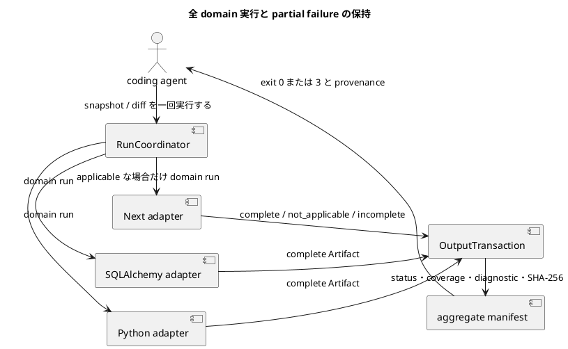

# iss-00010 Run Unified Multi-Domain Structure Comparison — 設計

詳細: [Design Guide](../../../../../../docs/authoring/design.md)

## 設計目標

- `all` domain の `snapshot-and-diff orchestration` を、CLI から source acquisition、analysis、versioned JSON、PlantUML、manifest、diagnostic まで一つの vertical pipeline として設計する。
- accepted ADR の独立 product ownership、named endpoint、dual snapshot、adapter boundary、agent-first Artifact、安全な static analysis、product HTML exclusion、vertical slicing を破らない。
- common abstraction は lifecycle、diagnostic、Artifact descriptor、graph primitive に限定し、domain-specific identity/member/relation/matching を adapter が所有する。

| Design ID | Requirement trace | 判断 |
| --- | --- | --- |
| I07-DES-001 | I07-REQ-001 | RunCoordinatorとFirstPartyDomainRegistryがthree domain outcomesをdeterministic orderで調整する。 |
| I07-DES-002 | I07-REQ-002 | one runのpreflight、start-HEAD endpoint/freeze、metadata-only FileChangeSet、changed-path admissionを全domainへ共有する。 |
| I07-DES-003 | I07-REQ-003 | domain semanticsを統合せず、run/domain lifecycleとsafe summaryだけをcommon contractにする。 |
| I07-DES-004 | I07-REQ-004 | per-domain semantic JSON/PlantUMLと`code-structure-viz.run-manifest/v1`だけをOutputTransactionで公開する。 |
| I07-DES-005 | I07-REQ-005 | domain presence truth table、run/domain budget、partial success、exit/publication matrixをtyped RunOutcomeへ写像する。 |
| I07-DES-006 | I07-REQ-006 | static/read-only/redaction/determinism/platform/package/offline invariantsをfull regressionで検証する。 |
| I07-DES-007 | I07-REQ-007 | staging descriptor setをfingerprint/collision/integrity gate後にatomic publishし、run fatalとdomain incompleteを別rollback pathにする。 |

## Current / Target

### Current（verified baseline）

- exact verified current commit `867ee6929283dfc84711bce245b784d2b8e3e9e6` は本Issueのcanonical Requirement/Design/Plan、accepted ADR、interviewを含む。
- production package、CLI、domain adapter、schema implementation、acceptance fixturesは未実装であり、以下のpath/symbolはすべてplannedである。
- 本Designは親の横断contractをslice固有の構造へ具体化し、依存Issueのpublic contractを変更せずに後続sliceへ渡す。

### Target

- coding agent が domain を省略した一回の command で Python、SQLAlchemy、Next の適用可否・成功・不完全を区別し、成功 Artifact を保持した集約 manifest と正しい exit code を得られる。
- source/body/secret を漏らさず、failure と coverage を manifest で agent が機械判定できる。
- downstream Issue はこの Design の stable interface だけへ依存し、内部 class layout を fork しない。

## 責務・Interface

### planned component responsibilities

| planned path / symbol | 状態 | 責務 |
| --- | --- | --- |
| src/code_structure_viz/application/run.py::RunCoordinator（planned） | planned | この Issue の implementation target。baseline commit には未実装。 |
| src/code_structure_viz/application/domain_registry.py::FirstPartyDomainRegistry（planned） | planned | この Issue の implementation target。baseline commit には未実装。 |
| src/code_structure_viz/core/outcome.py::RunOutcome（planned） | planned | この Issue の implementation target。baseline commit には未実装。 |
| src/code_structure_viz/artifacts/manifest.py::AggregateManifestBuilder（planned） | planned | この Issue の implementation target。baseline commit には未実装。 |
| src/code_structure_viz/artifacts/transaction.py::OutputTransaction（planned） | planned | この Issue の implementation target。baseline commit には未実装。 |
| src/code_structure_viz/cli/exit_codes.py（planned） | planned | この Issue の implementation target。baseline commit には未実装。 |
| .github/workflows/ci.yml の minimum/latest matrix（planned） | planned | この Issue の implementation target。baseline commit には未実装。 |

### common command interface

```text
code-structure-viz snapshot --repo PATH --output-dir PATH [--domain DOMAIN] [--target SELECTOR] [--format FORMAT] [--config PATH]
code-structure-viz diff --repo PATH --output-dir PATH [--domain DOMAIN] [--from ENDPOINT] [--to ENDPOINT] [--format FORMAT] [--config PATH]
```

- `--output-dir` は必須。writer は existing file を置換せず、全 payload を staging 後に公開する。
- `--format` 未指定は semantic JSON と PlantUML。`--stdout` は output directory requirement を解除しない。
- analysis behavior を environment variable で変更しない。環境は executable discovery と locale-independent process setup にだけ使う。

### source interface

```json
{
  "contract": "code-structure-viz.source-view/v1",
  "endpoint": {"kind": "commit-or-frozen-working-tree", "digest": "sha256"},
  "files": [{"path": "repository/relative", "sha256": "digest", "media_type": "text/plain"}],
  "fingerprint": "safe-run-fingerprint",
  "diagnostics": []
}
```

SourceView は immutable value object であり、absolute temporary path を serializer へ渡さない。

### domain adapter interface

```text
analyze_snapshot(SourceView, ResolvedConfig, TargetSelection) -> DomainSnapshotResult
compare_snapshots(DomainSnapshot, DomainSnapshot, DiffPolicy) -> DomainDiffResult
render_semantic_json(DomainResult) -> bytes
render_plantuml(DomainResult, VisualVocabulary) -> bytes
```

この Issue が未使用の method は実装を強制しない。後続 slice が stable contract を additive に拡張する。

## data / failure

### per-domain results and aggregate run manifest

`RunCoordinator`は`DomainResult<python|sqlalchemy|next>`を保持するがdomain-owned entity/member/relation/matchingをcopyまたは共通型へ変換しない。`code-structure-viz.semantic/v1`の`domain: all`は生成しない。

`code-structure-viz.run-manifest/v1`（planned）は次だけを持つ。

```json
{
  "schema": "code-structure-viz.run-manifest/v1",
  "run_status": "complete|incomplete",
  "endpoints": {"requested": {}, "resolved": {}, "provenance": {}},
  "budgets": {"changed_paths": {}, "entities_by_domain": {}},
  "domains": [{
    "domain": "python|sqlalchemy|next",
    "status": "complete|not_applicable|incomplete",
    "artifacts": [{"path": "domains/python/diff.semantic.json", "media_type": "application/vnd.code-structure-viz.semantic+json;version=1", "sha256": "9f86d081884c7d659a2feaa0c55ad015a3bf4f1b2b0b822cd15d6c15b0f00a08"}],
    "coverage": {},
    "diagnostics": [],
    "provenance": {},
    "graph_summary": {"entity_count": 0, "member_count": 0, "relation_count": 0, "changed_seed_count": 0}
  }]
}
```

rootまたはdomain summaryにsemantic entities/members/relations/matchingを置かない。Artifact descriptorはper-domain payloadを参照するだけ。

### domain presence aggregation

各diff domainはreal/empty-side/analysis-failedのsame truth tableを使う。both-absentはnot_applicable、before-only/after-onlyはcomplete全removed/added、side failureはincompleteでaffected payloadなし。all selected domainsがcomplete/not_applicableならoverall complete。one or more incompleteならoverall incomplete/exit 3。

### two-level budget and publication

- implicit changed-path overrunはdomain fan-out前のrun fatal、exit 1、safe diagnostic only、semantic/PlantUML/final manifestなし。
- entity overrunはaffected domain incomplete、exit 3、affected payloadなし。successful sibling payloadとaggregate manifestをpublishし、requested/resolved/countを記録する。
- valid overridesはnormal processing、invalid valuesはexit 2。

### endpoint, hunk, and transaction safety

`--to working-tree` onlyではstart HEAD anchor/frozen digest/candidate/merge-base/resolution methodをone shared provenanceへ固定する。FileChangeSetはmetadata-only HunkMetadataだけ。OutputTransactionはdomain descriptorsとmanifestをstagingし、run fatalでは全破棄、domain incompleteではsafe subset+manifestをatomic publishする。

## 変更対象

| planned file | planned change | 存在確認 |
| --- | --- | --- |
| src/code_structure_viz/application/run.py::RunCoordinator（planned） | planned | この Issue の implementation target。baseline commit には未実装。 |
| src/code_structure_viz/application/domain_registry.py::FirstPartyDomainRegistry（planned） | planned | この Issue の implementation target。baseline commit には未実装。 |
| src/code_structure_viz/core/outcome.py::RunOutcome（planned） | planned | この Issue の implementation target。baseline commit には未実装。 |
| src/code_structure_viz/artifacts/manifest.py::AggregateManifestBuilder（planned） | planned | この Issue の implementation target。baseline commit には未実装。 |
| src/code_structure_viz/artifacts/transaction.py::OutputTransaction（planned） | planned | この Issue の implementation target。baseline commit には未実装。 |
| src/code_structure_viz/cli/exit_codes.py（planned） | planned | この Issue の implementation target。baseline commit には未実装。 |
| .github/workflows/ci.yml の minimum/latest matrix（planned） | planned | この Issue の implementation target。baseline commit には未実装。 |

追加で planned:

- tests/fixtures/run-unified-multi-domain-structure-comparison/ に source-only fixture を置き、fixture の application code を実行しない。
- docs/contracts/ に schema と CLI behavior を配置する。これらはplanned implementation targetであり、本Designは実装済みとは扱わない。
- lockfile と license inventory を同じ Issue の acceptance に含める。

変更しない領域:

- cross-domain semantic relation と single universal identity model
- public plugin ABI、remote execution、auto fetch
- 製品機能としての HTML report/HTML command/Tailscale publication
- native Windows、legacy CLI compatibility

## 移行・互換性・rollback

- baseline に production implementation がないため in-place data migration は N/A。
- public schema/CLI は `/v1` と preview release で開始し、同一 major 内は field の additive extension を原則とする。
- persistent data migration は N/A。rollout は intermediate release→Next opt-in preview→default all-domain の順。partial outcome/exit bug は default all-domain を無効化して明示 domain へ戻し、schema compatibility を保った forward fix を行う。
- legacy CLI compatibility layer は作らない。legacy evidence の algorithm/test idea を採用するときは provenance note、license decision、CodeStructureViz-owned regression test を同じ change に含める。

## testability

| Test ID | 分類 | planned test file | command |
| --- | --- | --- | --- |
| I07-AT-001 | per-domain output | tests/acceptance/test_multi_domain_cli.py | uv run pytest tests/acceptance/test_multi_domain_cli.py -q |
| I07-AT-002 | partial failure | tests/acceptance/test_partial_domain_failure.py | uv run pytest tests/acceptance/test_partial_domain_failure.py -q |
| I07-AT-003 | applicability | tests/acceptance/test_multi_domain_applicability.py | uv run pytest tests/acceptance/test_multi_domain_applicability.py -q |
| I07-AT-004 | run fatal atomicity | tests/acceptance/test_run_atomicity.py | uv run pytest tests/acceptance/test_run_atomicity.py -q |
| I07-AT-005 | exit contract | tests/acceptance/test_exit_codes.py | uv run pytest tests/acceptance/test_exit_codes.py -q |
| I07-AT-006 | platform | .github/workflows/ci.yml | uv run pytest && npm --prefix adapters/next test |
| I07-AT-007 | packaging | tests/packaging/test_offline_install.py | uv run pytest tests/packaging/test_offline_install.py -q |
| I07-AT-008 | presence matrix | tests/acceptance/test_multi_domain_presence_matrix.py | uv run pytest tests/acceptance/test_multi_domain_presence_matrix.py -q |
| I07-AT-009 | budget matrix | tests/acceptance/test_multi_domain_budget_matrix.py | uv run pytest tests/acceptance/test_multi_domain_budget_matrix.py -q |
| I07-AT-010 | working-tree anchor | tests/acceptance/test_multi_domain_working_tree_anchor.py | uv run pytest tests/acceptance/test_multi_domain_working_tree_anchor.py -q |
| I07-AT-011 | hunk/output redaction | tests/security/test_multi_domain_hunk_redaction.py | uv run pytest tests/security/test_multi_domain_hunk_redaction.py -q |

- unit testはdomain parser/matcher/serializerとcanonicalizationのpure functionを対象にする。
- integration testはtemporary Git repositoryまたはimmutable source fixtureを使い、Git stateとsource bytesのbefore/afterを比較する。
- acceptance testは実CLI process、output directory、manifest/checksum、exit code、stdout/stderr、published file setを観測する。
- security testはimport/build/plugin/DB execution trap、source/secret/literal/absolute path/raw patch linesのnegative scan、unsafe symlink、Git mutation allowlistを検査する。
- table-driven casesはstatusだけでなくpublication、manifest presence/absence、digest、requested/resolved budget values、actual countsまでassertする。

## risk

- orchestrator が domain semantics を吸収すると adapter boundary が崩れる。registry は lifecycle/status/artifact descriptor だけを扱う。
- partial failure で成功 Artifact を消す、または exit 0 にする誤り。table-driven outcome tests と atomic transaction を必須にする。
- CI の latest stable が無制御に漂流する。repository-managed matrix を定期更新し、lockfile と minimum lanes を独立させる。

- Re-evaluation trigger: security/privacy incident、target repository の不可逆変更、secret leak、rollback に incident response が必要な設計へ変わる場合は Planning Level を `critical` に上げる。
- Stop condition: 三 domain の applicability、partial success retention、aggregate manifest、exit code、atomicity、minimum/latest CI が acceptance で成立するまで Initiative を完了扱いにしない。



domain ごとの意味を混ぜず、一部失敗でも成功 Artifact と provenance を一つの transaction で保持します。
